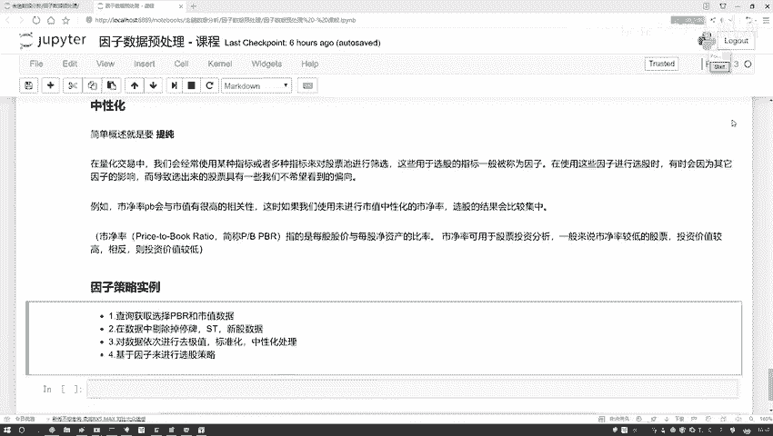
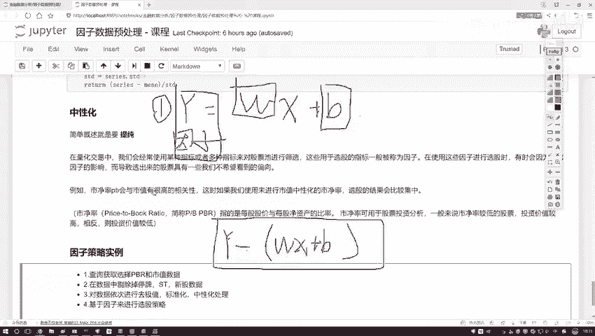
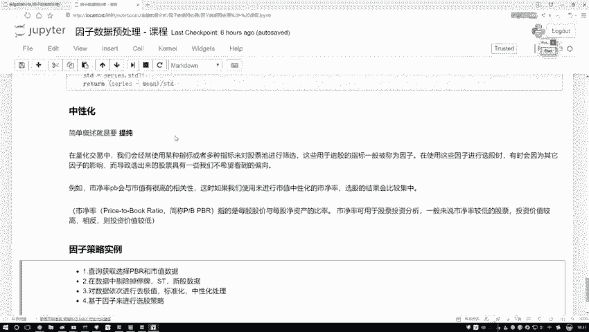
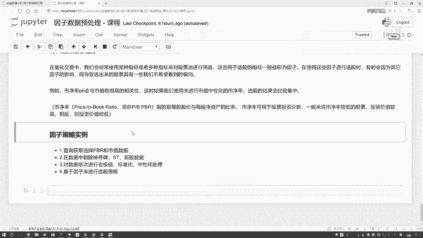
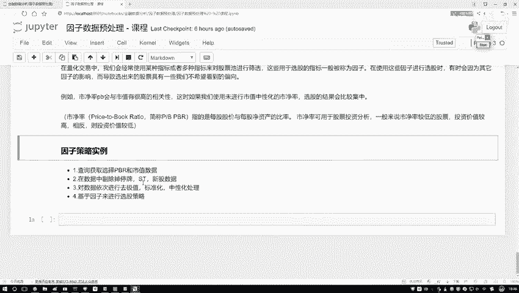
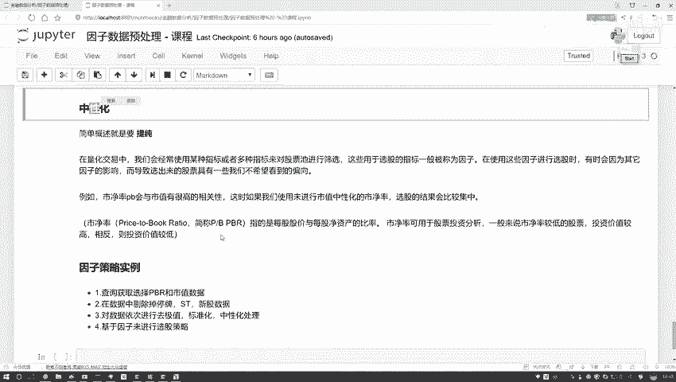
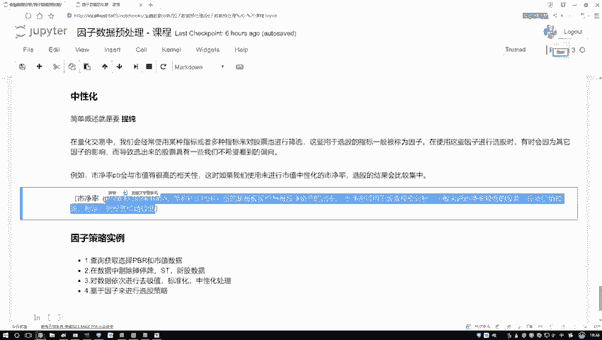
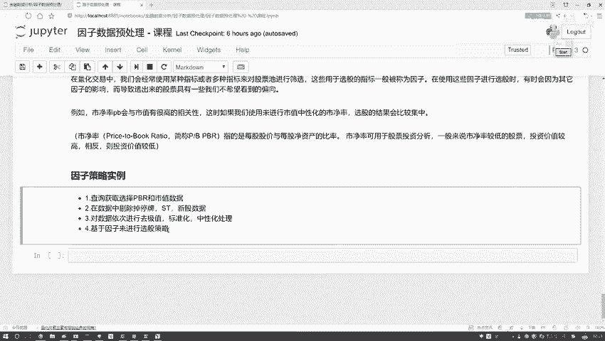
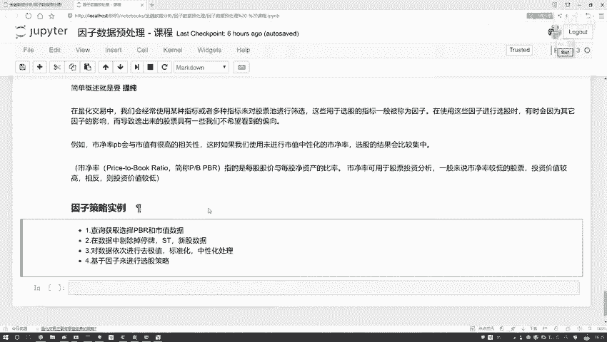
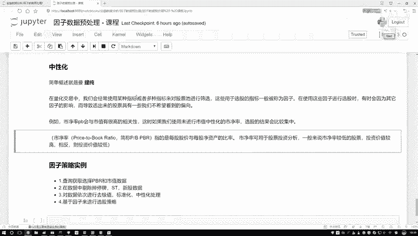

# Python金融分析与量化交易实战：P31：策略任务概述与因子中性化 🎯

在本节课中，我们将学习量化策略中的一个核心概念——**因子中性化**。我们将通过一个具体的例子，即从市净率（PB）因子中剔除市值（Market Cap）的影响，来详细解释其原理和实现步骤。理解这个过程对于构建更纯粹、更有效的选股因子至关重要。

## 因子中性化的核心思想 🧠

上一节我们介绍了因子处理的一般流程，本节中我们来看看如何通过“中性化”来提纯因子。

假设我们有一个市净率（PB）因子，但我们发现它与市值存在较强的相关性。这意味着PB因子中“混入”了市值的信息。为了得到更纯粹的、仅反映公司账面价值与市场价值关系的PB因子，我们需要从中剔除市值的影响。

这个过程可以形象地理解为：将原始的PB因子（看作一个整体）分解为两部分——一部分能被市值解释（即与市值相关的部分），另一部分是市值无法解释的“纯净”部分。我们的目标就是提取出这第二部分。

## 如何实现中性化：回归分析法 📈

那么，如何从因子中剔除另一个因素的影响呢？答案是使用**线性回归**。

我们可以建立以下回归方程：
`因子 = W * 控制变量 + B + 误差项`
或者更具体地：
`PB = W * 市值 + B + ε`

在这个方程中：
*   `PB` 是因变量（Y），即我们想要提纯的目标。
*   `市值` 是自变量（X），即我们想要剔除的影响源。
*   `W` 和 `B` 是回归系数，需要通过拟合数据得到。
*   `ε` 是误差项。

**回归方程的意义在于**：当我们用市值去“预测”PB时，得到的预测值 `PB_pred = W * 市值 + B` 就代表了PB因子中**能被市值所解释的那一部分**。而**真实PB值**与**预测PB值**之间的差异，即残差 `ε = PB - PB_pred`，则代表了市值**无法解释**的剩余部分，这正是我们想要的、“提纯”后的中性化因子。

因此，因子中性化的两步法是：
1.  **建立并求解回归方程**：以需要提纯的因子为Y，以需要剔除的影响因素为X，进行线性回归，得到系数W和B。
2.  **计算残差**：用因子的真实值减去回归预测值（`因子 - (W * X + B)`），得到的残差序列就是中性化后的因子。

## 本节策略任务概述 🗺️

理解了中性化的原理后，我们来看本节课要完成的策略任务。我们将构建一个简单的单因子选股策略，并在此过程中实践因子处理的全流程。

以下是策略执行的主要步骤：

1.  **数据准备**：获取市净率（PB）和市值（Market Cap）两个核心指标的数据。
2.  **数据预处理**：
    *   **股票池过滤**：剔除停牌股、ST股、上市时间过短（如小于半年）的股票，确保基础股票池的质量。
    *   **因子处理**：对PB因子依次进行**去极值**、**标准化**和**中性化**（针对市值）处理，得到纯净、可比的因子值。
3.  **信号生成与选股**：基于处理后的PB因子值生成交易信号。例如，设定规则为“买入PB值小于0.2的股票”。根据此规则从股票池中筛选出目标投资组合。
4.  **策略回测**：在历史数据上模拟上述选股规则的交易，评估其表现（本节课的重点在于演示流程，回测细节可能简化）。

通过这个完整的流程，我们将把因子中性化的理论应用于一个具体的策略场景中。

## 总结 ✨

本节课中我们一起学习了：
1.  **因子中性化**的目的是剔除因子中其他因素（如市值、行业）的影响，使其更纯粹地反映目标属性。
2.  实现中性化的核心方法是**线性回归**。通过回归将因子分解为“可解释部分”和“残差部分”，后者即为中性化结果。
3.  我们概述了一个完整的单因子选股策略任务，其中**中性化**是因子处理流程中的关键一环，为后续基于纯净因子的选股决策打下基础。

接下来，我们将进入代码实践部分，一步步实现上述逻辑。