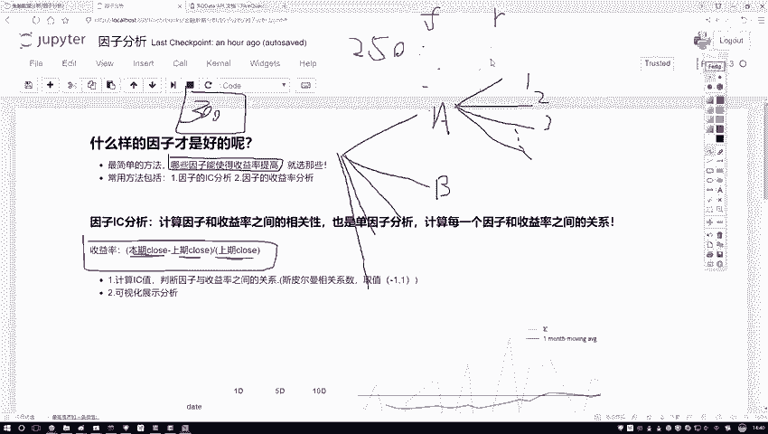
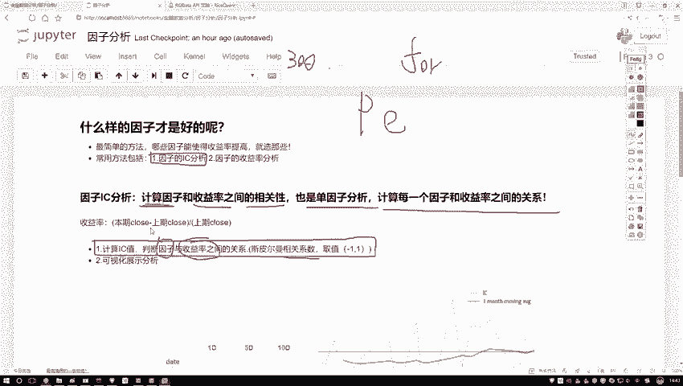
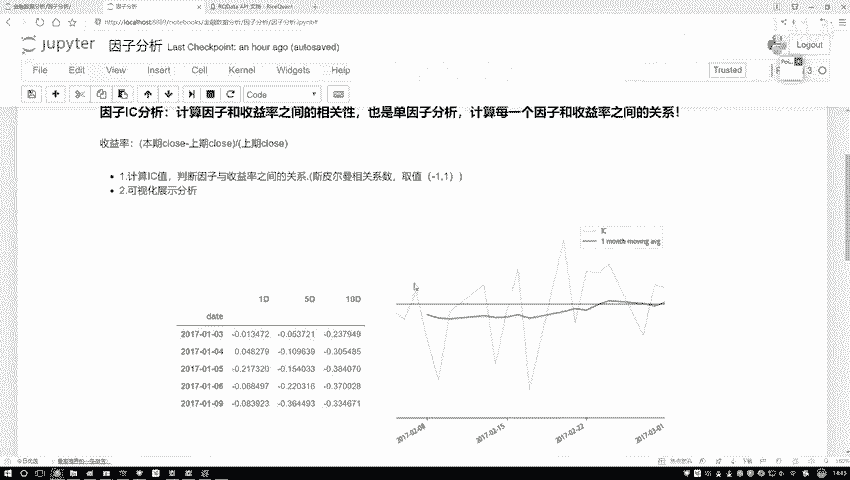
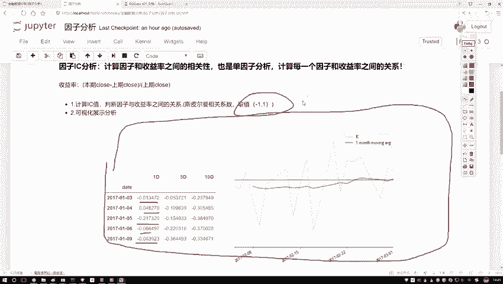

# Python金融分析与量化交易实战：P37：因子分析概述

## 概述
在本节课中，我们将要学习因子分析的基本概念。因子分析是量化交易中筛选有效指标、构建策略模型的关键步骤。我们将了解如何评估众多因子对股票收益率的影响，并学习两种核心的分析方法。

## 因子分析的目标
上一节我们介绍了量化交易的基础，本节中我们来看看如何从众多指标中筛选有效因子。假设我们拥有A股票的300个不同因子数据，这些因子可能涵盖基本面、技术面等多个大类，每个大类下又可细分为众多具体指标。

面对如此多的因子，在回测或设计策略时，我们无法全部使用。因此，我们需要对这些因子进行排序和筛选，判断哪些因子对最终收益有正面影响，哪些没有或甚至有负面影响。这个过程的核心是评估每个因子与收益率之间的关联程度。

## 收益率的概念
在深入分析前，我们需要明确“收益率”的定义。收益率衡量的是资产价格的变化比例。

以日收益率为例，其计算公式为：
**收益率 R = (当日收盘价 - 前一日收盘价) / 前一日收盘价**

我们的目标是观察因子（F）的变动与收益率（R）的变动之间存在何种关系：是线性相关、非线性相关，还是不相关？以及相关的方向是正还是负？

## 因子分析方法：IC分析
接下来，我们介绍第一种核心分析方法：IC分析。IC（Information Coefficient）即信息系数，用于衡量因子与收益率之间的相关性。

具体而言，我们计算的是因子值与同期收益率之间的**斯皮尔曼秩相关系数**。其取值范围在 **-1 到 1** 之间：
*   **接近 1**：表示强正相关。
*   **接近 -1**：表示强负相关。
*   **接近 0**：表示无显著相关关系。

由于我们有多个因子（例如300个），而收益率序列相对固定，因此分析过程通常是遍历每个因子，分别计算其与收益率的IC值。这被称为**单因子分析**。

计算出的斯皮尔曼相关系数即为该因子的**IC值**。IC值的绝对值越大，表明该因子对收益率的预测能力可能越强。

## 分析结果的可视化
计算出IC值后，我们需要通过可视化来直观地分析其表现。通常我们会绘制两种图形：

1.  **IC时间序列图**：展示IC值随时间（如每日）的变化情况。
2.  **IC均值图**：在IC时间序列的基础上，计算滚动窗口（例如10天）的均值，并绘制其移动平均线，以观察IC值的稳定性和趋势。

左边图表展示了每日IC值的序列，右边图表中，蓝色折线为原始IC序列，绿色线条为其移动平均线。通过观察图表，我们可以识别出IC值长期为正、为负或围绕零波动的因子，从而判断其有效性和稳定性。

## 总结
本节课中我们一起学习了因子分析的基础知识。我们明确了因子分析的目标是从海量指标中筛选有效因子，理解了收益率的计算方式，并重点掌握了**IC分析**这一核心方法。IC分析通过计算因子与收益率之间的斯皮尔曼相关系数（IC值）来量化因子的预测能力。最后，我们了解了如何通过可视化图表（IC序列图与移动平均线）来评估因子的有效性和稳定性。在后续课程中，我们将使用代码具体实现这些分析过程。