# Python金融分析与量化交易实战：P40：数据格式转换

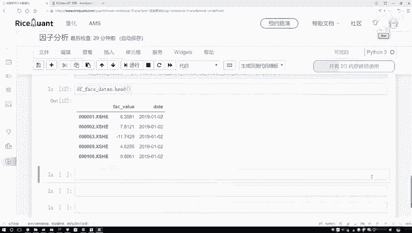

## 概述
在本节课中，我们将学习如何将数据处理成特定金融分析工具包（如`alphalens`）所要求的格式。核心任务包括设置多级索引、转换数据形状以及进行必要的数据预处理（如去除异常值和标准化）。我们将通过具体的代码示例，一步步完成这些操作。

---

## 数据格式要求分析
上一节我们介绍了如何获取和初步处理数据。本节中，我们来看看目标工具包对数据格式的具体要求。

目标工具包要求数据格式为：以日期（`date`）和股票代码（`symbol`）作为多级索引，每个组合对应一个具体的指标值。这与我们当前拥有的数据格式不同。

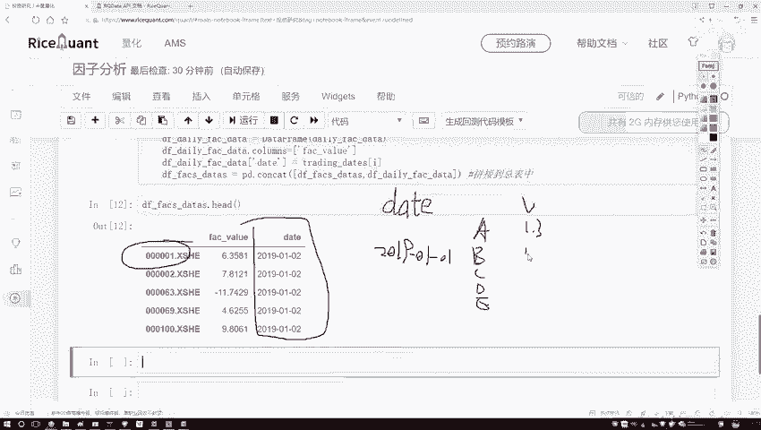

以下是目标格式的示例：
```
date         | symbol | value
-------------|--------|------
2019-01-01   | A      | 1.3
2019-01-01   | B      | 2.1
2019-01-01   | C      | 3.4
2019-01-02   | A      | 1.5
2019-01-02   | B      | 2.3
...
```
因此，我们需要对现有数据进行格式转换。

---

## 设置多级索引
为了满足工具包的要求，第一步是重新设置数据的索引。

我们需要将`date`和股票的标识（例如股票代码）设置为两级索引。具体操作如下：

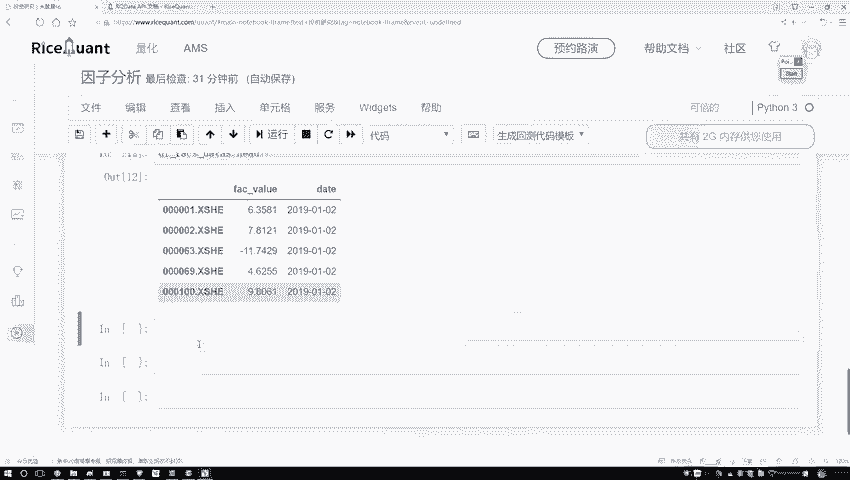

```python
# 假设 df 是当前的DataFrame，包含 ‘date’, ‘symbol’, ‘value’ 等列
df_transformed = df.set_index(['date', 'symbol'])
```

执行此操作后，数据框的索引将变为由日期和股票代码组成的元组，而数据值则是对应的指标数值。

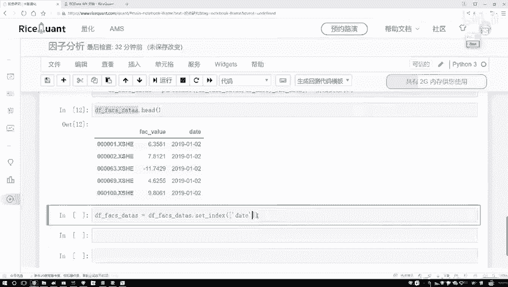

---

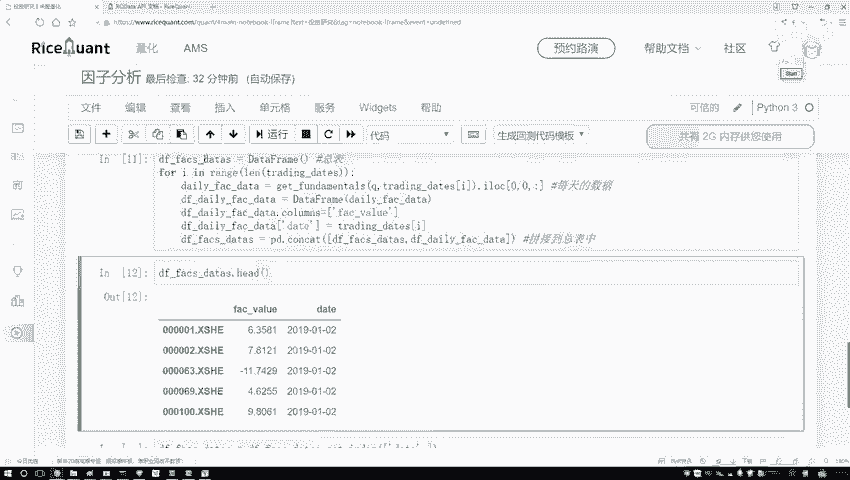

## 验证转换结果
执行索引设置后，我们可以查看数据的前几行以验证格式是否正确。

```python
print(df_transformed.head())
```

输出结果应显示为多级索引格式，第一级是日期，第二级是股票代码，数据列则是指标值。这确认了我们的数据已转换为目标格式。

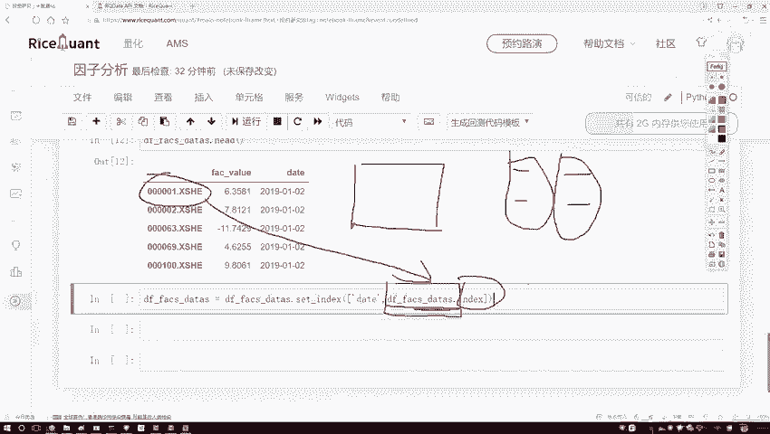

---

## 提取指标值序列
在某些后续计算中，我们可能需要单独使用指标值序列。可以轻松地从转换后的数据框中提取该列。

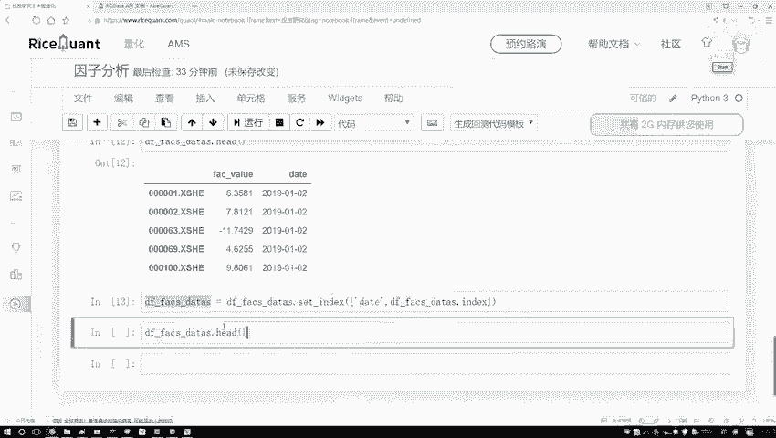

```python
# 假设指标值所在的列名为 ‘factor_value’
factor_series = df_transformed['factor_value']
print(factor_series.head())
```

这样我们就得到了一个纯净的指标值序列，方便后续分析。

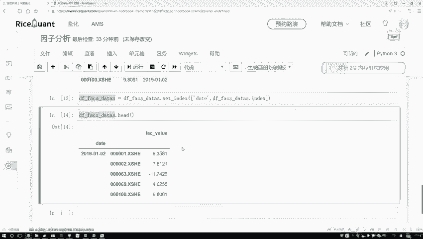

---

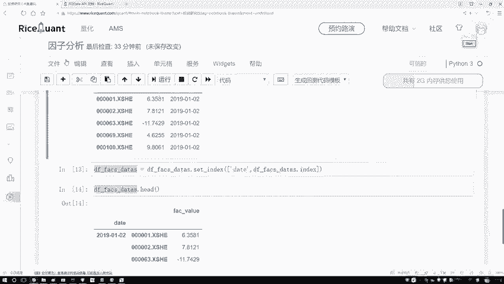

## 数据预处理：去除异常值与标准化
在将数据输入模型前，通常需要进行预处理，以保证数据质量并提升模型性能。以下是两个关键步骤：

### 1. 去除异常值
我们通过设定上下限（例如，使用分位数）来识别并处理异常值。

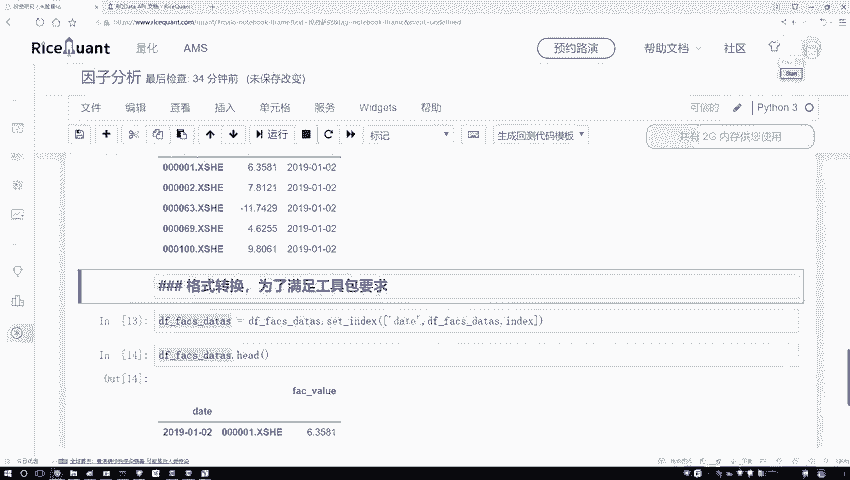

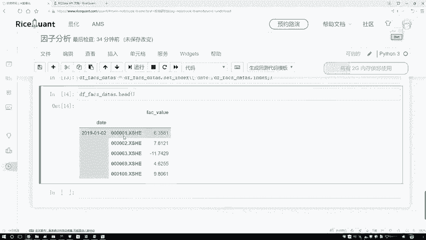

```python
def remove_outliers(series, lower_quantile=0.01, upper_quantile=0.99):
    lower_bound = series.quantile(lower_quantile)
    upper_bound = series.quantile(upper_quantile)
    # 将超出范围的值裁剪到边界
    series_clipped = series.clip(lower=lower_bound, upper=upper_bound)
    return series_clipped

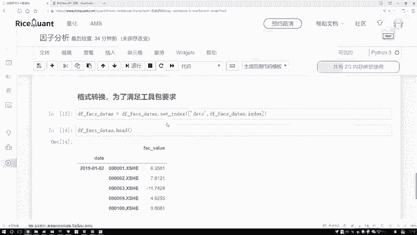

factor_series_cleaned = remove_outliers(factor_series)
```

### 2. 数据标准化
标准化将数据转换为均值为0、标准差为1的分布，这是许多机器学习算法的常见要求。

```python
def standardize(series):
    mean = series.mean()
    std = series.std()
    series_standardized = (series - mean) / std
    return series_standardized

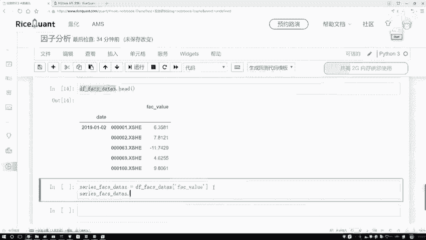

factor_series_processed = standardize(factor_series_cleaned)
```

---

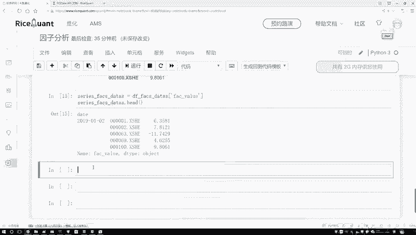

## 可视化处理结果（可选）
为了直观地观察预处理的效果，我们可以绘制处理前后数据的分布直方图。

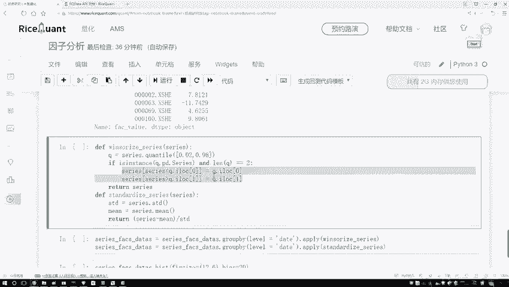

```python
import matplotlib.pyplot as plt

fig, axes = plt.subplots(1, 3, figsize=(15, 4))
factor_series.hist(ax=axes[0], bins=50)
axes[0].set_title('原始数据分布')
factor_series_cleaned.hist(ax=axes[1], bins=50)
axes[1].set_title('去除异常值后分布')
factor_series_processed.hist(ax=axes[2], bins=50)
axes[2].set_title('标准化后分布')
plt.show()
```

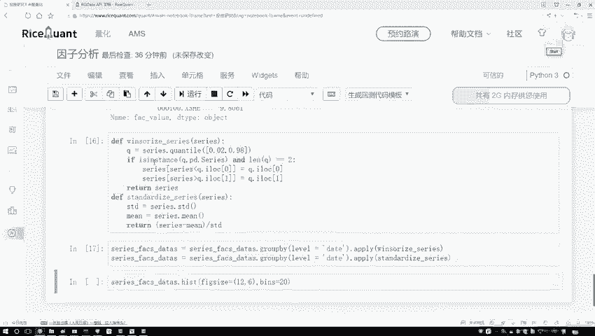

通过对比图表，可以清晰地看到数据分布变得更加集中和规范。

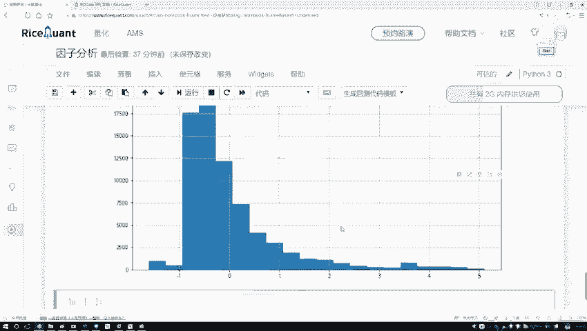

---

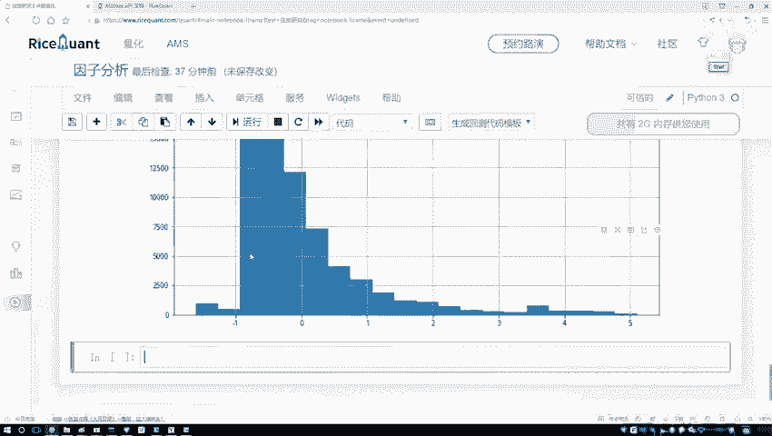

## 总结
本节课中我们一起学习了为特定金融分析工具包准备数据的关键步骤。我们首先理解了目标数据格式，然后通过**设置多级索引**将数据转换为所需结构。接着，我们提取了指标序列，并进行了**去除异常值**和**标准化**的数据预处理操作。这些步骤确保了数据的质量和兼容性，为后续的量化分析打下了坚实基础。