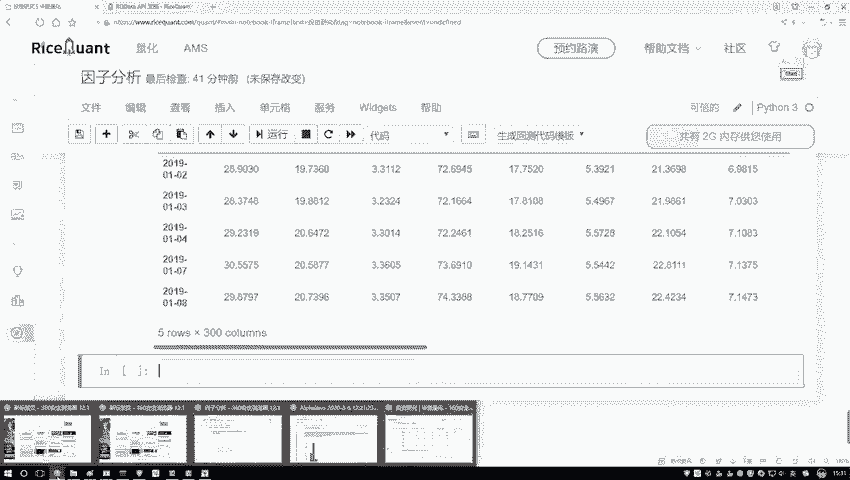
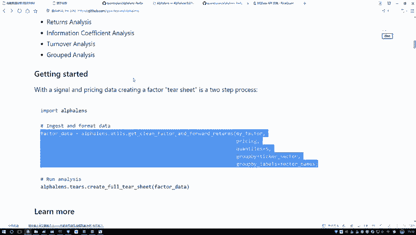
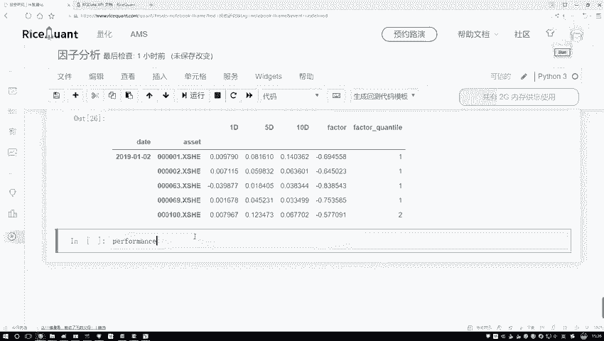
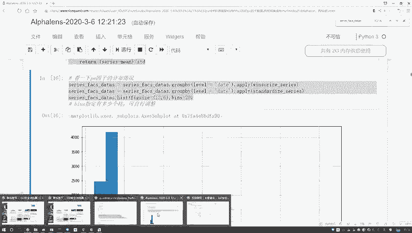
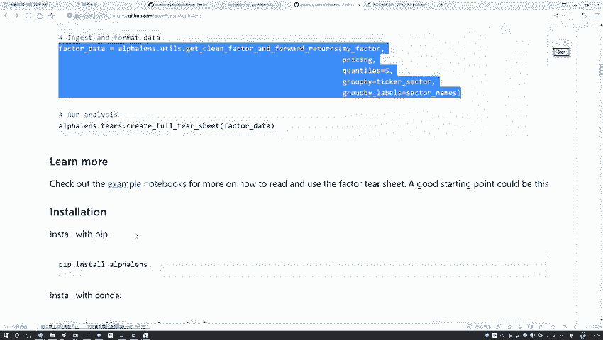
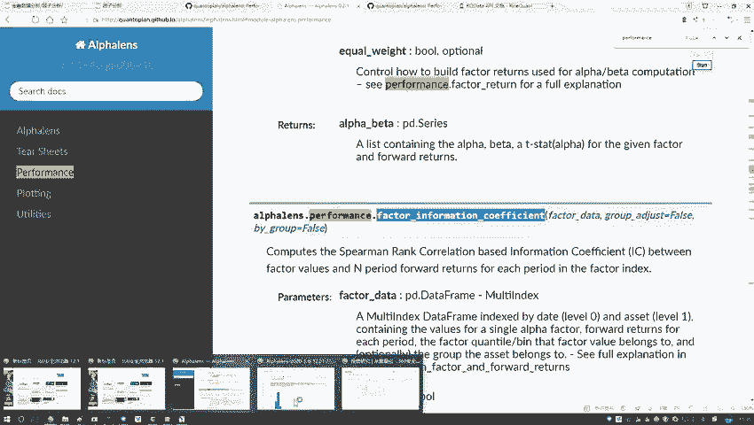
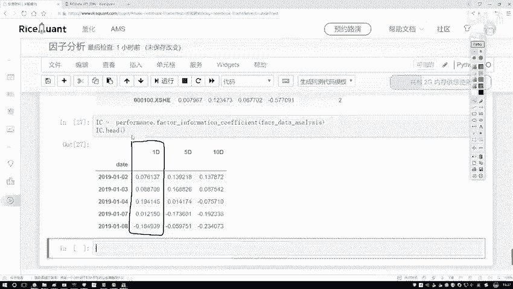

# Python金融分析与量化交易实战：P41：IC指标值计算

在本节课中，我们将学习如何计算IC指标值。IC指标，即信息系数，用于衡量因子值与未来收益率之间的相关性，是量化选股中评估因子有效性的核心指标。我们将通过获取股票价格数据、计算收益率、进行数据格式转换，最终计算出IC值。

上一节我们介绍了因子数据的处理，本节中我们来看看如何结合价格数据计算IC值。

## 获取收盘价数据

要计算IC值，首先需要获取股票的实际收盘价数据，并基于此计算收益率。以下是获取数据的步骤：



1.  使用 `get_price` 函数获取指定股票池在特定时间范围内的价格数据。
2.  从返回的多维数据中提取“收盘价”这一列，并将其转换为二维的 `DataFrame` 格式。
3.  为数据框设置清晰的索引和列名，便于后续处理。



```python
# 获取收盘价数据示例
price = get_price(security=stock_pool, start_date='2019-01-01', end_date='2020-01-01')
# 提取收盘价并转换为二维DataFrame
close_price = price['close'].unstack()
# 设置索引和列名
close_price.index.name = 'date'
close_price.columns.name = 'code'
```

## 数据格式转换

获取因子数据和价格数据后，需要将它们转换为 `alphalens` 库要求的统一格式，以便进行后续分析。这个转换过程会整合因子值和对应的未来收益率。

转换后的数据结构包含以下关键列：
*   `date`: 日期。
*   `asset`: 股票代码。
*   `factor`: 因子值。
*   `1D`/`5D`/`10D`: 未来1期、5期、10期的收益率。
*   `factor_quantile`: 因子分组（1到5），数值越大代表因子值越大。

```python
# 使用alphalens进行数据格式转换
factor_data = alphalens.utils.get_clean_factor_and_forward_returns(
    factor=processed_factor_data,
    prices=close_price,
    periods=(1, 5, 10)
)
```

## 计算IC指标值



数据准备就绪后，即可计算信息系数。IC值是因子值与未来一期收益率之间的秩相关系数，其值介于-1到1之间。正值表示因子与未来收益正相关，负值则表示负相关。





以下是计算IC值的核心代码：



```python
# 计算IC值
ic_series = alphalens.performance.factor_information_coefficient(factor_data)
# 查看前几条IC值
print(ic_series.head())
```



本节课中我们一起学习了IC指标值的完整计算流程。我们首先获取了股票的收盘价数据并计算收益率，然后将因子数据与价格数据整合转换为统一格式，最后利用 `alphalens` 库的函数计算出了核心的IC指标值。理解并掌握IC值的计算，是评估量化因子有效性的重要一步。