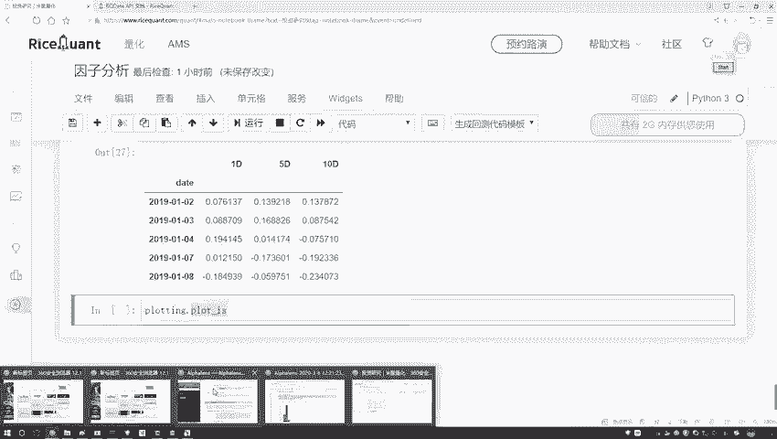
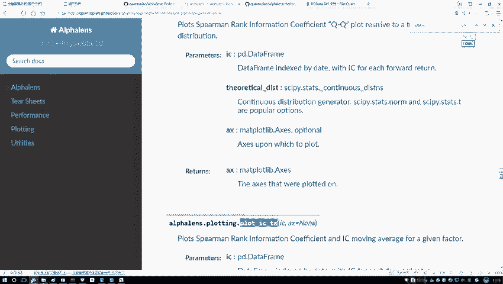
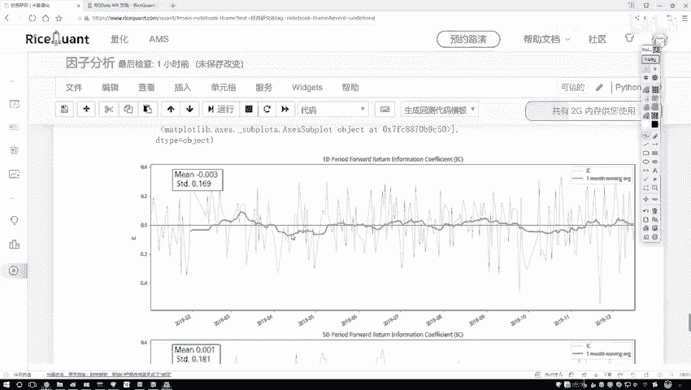
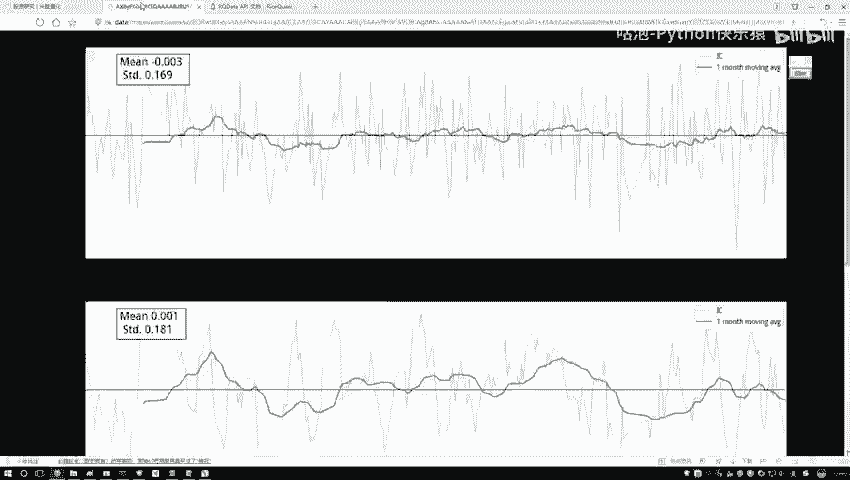
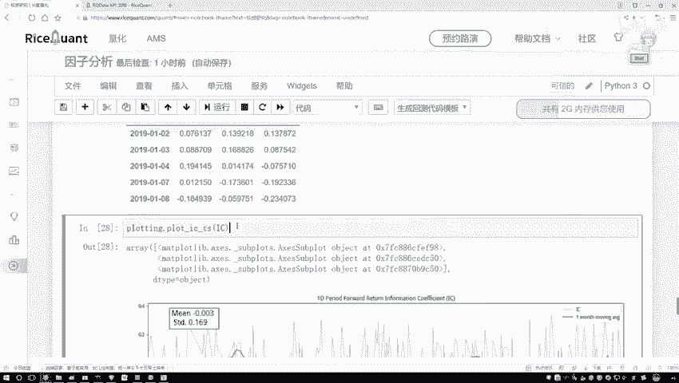
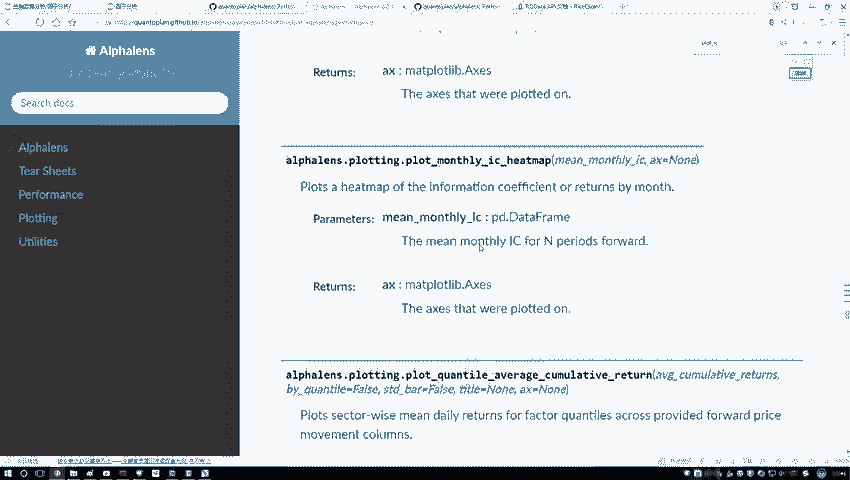
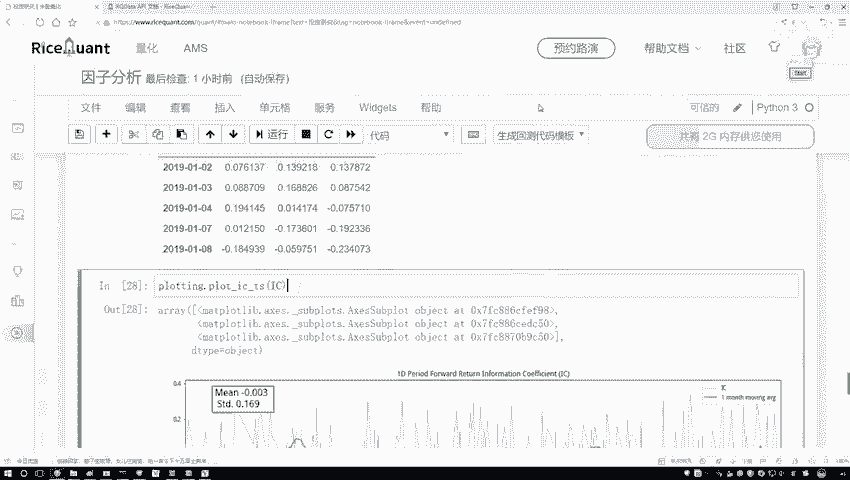

# Python金融分析与量化交易实战：P42：工具包绘图展示

在本节课中，我们将学习如何使用量化分析工具包中的绘图功能，来可视化因子的IC值（信息系数）及其时间序列，从而更直观地评估因子的有效性。

上一节我们介绍了如何计算因子的IC值，本节中我们来看看如何将这些计算结果通过图表清晰地展示出来。

## 绘制IC值时间序列图

计算得到的IC值每日都在变化。为了更清晰地观察其趋势，我们可以将其绘制成时间序列图。这需要使用工具包中的绘图功能。



以下是绘制IC值时间序列图的步骤：

1.  导入必要的绘图工具。
2.  调用 `plot_ic_ts` 函数。
3.  将计算好的IC序列传入该函数。



```python
# 假设 ic_series 是之前计算得到的IC值序列
from alphalens import plotting
plotting.plot_ic_ts(ic_series)
```

执行上述代码后，系统会自动生成图表。

## 解读IC时间序列图

生成的图表包含以下关键信息：



*   **蓝色曲线**：代表每日实际的IC值走势，波动范围通常较大。
*   **绿色曲线**：代表IC值的滚动平均值，默认窗口期为一个月。它平滑了日度波动，更能反映趋势。
*   **统计信息**：图表中会标注IC序列的均值（mean）和标准差（std）等统计量。

观察图表时，我们主要关注**绿色曲线（滚动平均线）**。理想的因子其IC值应保持稳定且为较大的正值。如果绿色曲线长期在零值附近小幅波动，则表明该因子与未来收益率的相关性较弱，预测能力可能不足。

## 理解信息比率（IR）

图表中还会计算并展示一个名为**信息比率**的指标。其计算公式为：

**IR = mean(IC) / std(IC)**

这个比率描述了IC值的稳定性。**IR值越大**，说明因子的预测能力越稳定（均值相对标准差更高）。反之，IR值小则表明因子的有效性波动较大。这是一个辅助评估因子稳健性的重要指标。



## 探索其他分析图表

除了时间序列图，工具包还提供了多种其他分析图表，用于深入评估因子。以下是部分可用的绘图函数：



*   `plot_ic_hist`：绘制IC值的直方图，检查其分布。
*   `plot_ic_qq`：绘制IC值的QQ图，检验其是否服从正态分布。
*   `plot_ic_horizon`：绘制不同预测周期（如1期、5期、10期）的IC值。



这些函数能够从不同维度全面展示因子的特性。在实际进行深入的因子策略分析时，可以灵活调用这些功能来辅助决策。



本节课中我们一起学习了如何使用绘图工具可视化因子的IC值。通过观察IC时间序列图及其滚动平均线，我们可以直观判断因子的有效性和稳定性。同时，信息比率（IR）为我们提供了量化评估因子稳健性的指标。掌握这些可视化方法，是进行科学量化分析的重要一环。