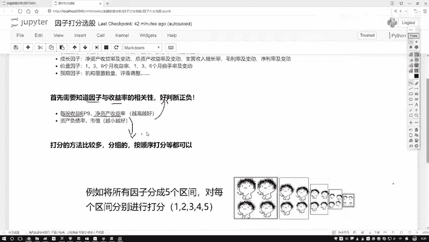
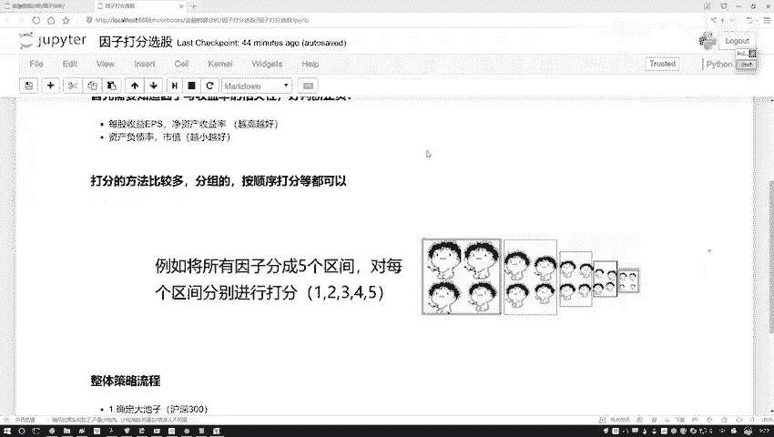
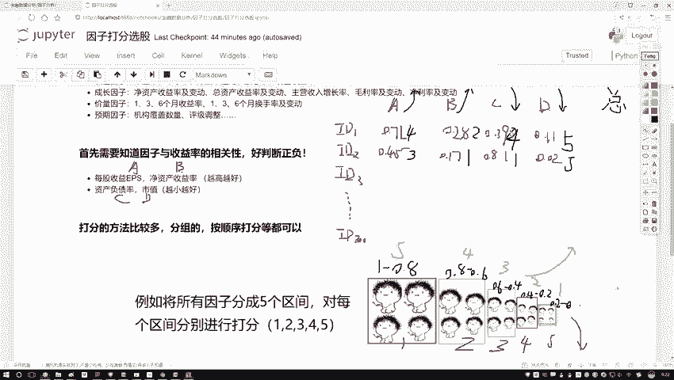
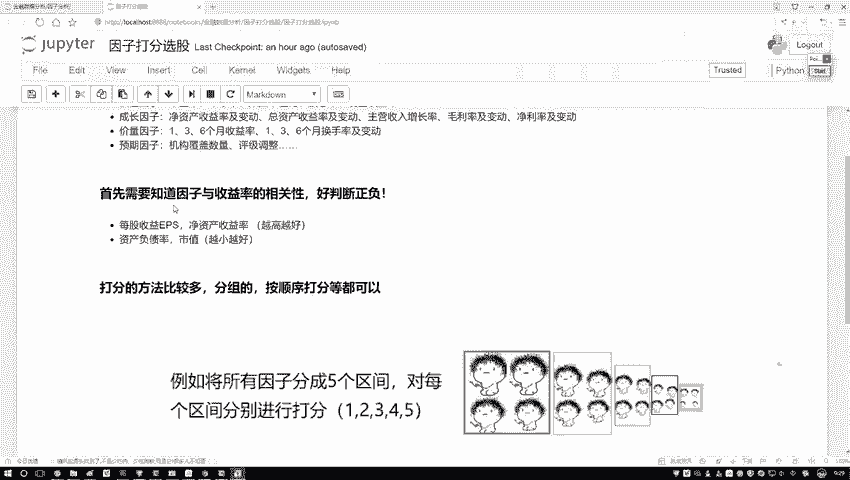
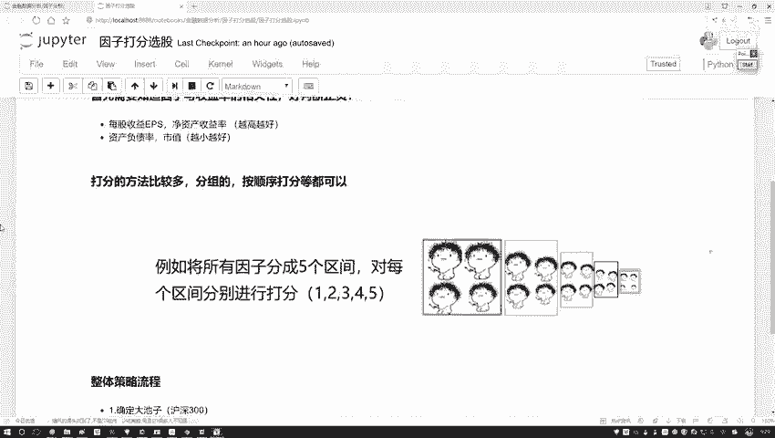
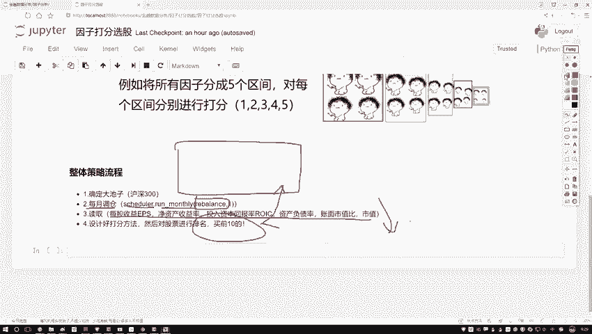
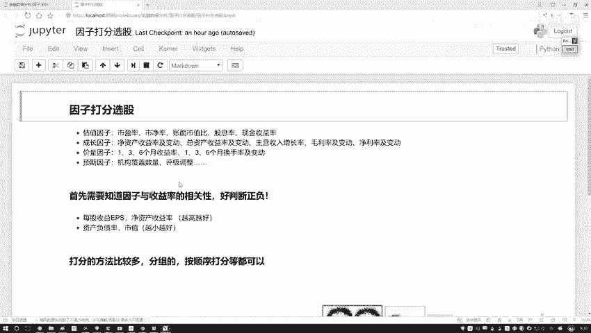

# Python金融分析与量化交易实战：P43：46.45.2-整体任务流程梳理



## 概述
在本节课程中，我们将学习量化交易策略中的一个核心环节——**因子打分法**。我们将详细拆解如何根据多个财务或技术指标对股票进行综合评分，并基于评分结果进行选股和调仓。本节内容将涵盖打分法的基本原理、具体计算步骤以及整个策略的实现流程。



---

## 因子打分法详解

上一节我们介绍了如何获取和预处理股票因子数据。本节中，我们来看看如何利用这些已知的因子数据对股票进行综合评估，即“打分”。

打分的目标是为每只股票计算一个总分，以便我们能够对所有股票进行排名，并选出排名靠前的股票作为投资组合的候选。

### 打分方法介绍
以下是两种常见的打分方法：

1.  **区间划分法**：将每个因子的数值范围划分为几个区间，并为每个区间赋予一个分数。
2.  **直接排序法**：直接根据因子数值对所有股票进行排序，然后按排名赋予分数（例如，排名第一得最高分）。

我们将以**区间划分法**为例进行详细说明。

### 数据示例与打分规则
假设我们有一个股票池（例如沪深300成分股），并为每只股票计算了四个因子（A, B, C, D）的值。这些值已经过归一化处理，范围在0到1之间。

*   **因子A**：净资产收益率（ROE），**越大越好**。
*   **因子B**：营收增长率，**越大越好**。
*   **因子C**：资产负债率，**越小越好**。
*   **因子D**：总市值，**越小越好**。

我们首先需要根据因子的好坏方向（越大越好或越小越好）来设计打分规则。

以下是划分区间和对应分值的示例表格：

| 数值区间 | 分值（越大越好型因子） | 分值（越小越好型因子） |
| :--- | :--- | :--- |
| [0.8, 1.0] | 5 | 1 |
| [0.6, 0.8) | 4 | 2 |
| [0.4, 0.6) | 3 | 3 |
| [0.2, 0.4) | 2 | 4 |
| [0.0, 0.2) | 1 | 5 |

**核心逻辑**：
*   对于“越大越好”的因子（如A、B），数值落入高区间（如0.8-1.0）则获得高分（5分）。
*   对于“越小越好”的因子（如C、D），数值落入低区间（如0.0-0.2）则获得高分（5分）。

### 计算示例
假设有两只股票，其因子数据如下：

*   **股票ID1**: A=0.71, B=0.28, C=0.39, D=0.01
*   **股票ID2**: A=0.45, B=0.17, C=0.81, D=0.02

根据上表的规则，我们为每只股票的每个因子打分：

**股票ID1打分**：
*   因子A (0.71): 落入[0.6, 0.8)区间，因“越大越好”，得 **4分**。
*   因子B (0.28): 落入[0.2, 0.4)区间，因“越大越好”，得 **2分**。
*   因子C (0.39): 落入[0.2, 0.4)区间，因“越小越好”，得 **4分**。
*   因子D (0.01): 落入[0.0, 0.2)区间，因“越小越好”，得 **5分**。
*   **总分** = 4 + 2 + 4 + 5 = **15分**

**股票ID2打分**：
*   因子A (0.45): 落入[0.4, 0.6)区间，得 **3分**。
*   因子B (0.17): 落入[0.0, 0.2)区间，得 **1分**。
*   因子C (0.81): 落入[0.8, 1.0)区间，因“越小越好”，得 **1分**。
*   因子D (0.02): 落入[0.0, 0.2)区间，得 **5分**。
*   **总分** = 3 + 1 + 1 + 5 = **10分**

计算完成后，我们对所有股票（如300只）的总分进行排序。假设我们每次调仓选择排名前10的股票，那么本次ID1股票（15分）的排名会高于ID2股票（10分），更有可能被选中。



---

## 整体策略流程梳理

理解了打分法的核心计算后，我们来看一个完整的量化策略是如何将这些环节串联起来的。

以下是基于月度调仓的因子打分策略的标准流程：

1.  **确定股票池**：首先，需要明确策略操作的股票范围。例如，策略可能基于`沪深300`指数成分股。
    ```python
    # 示例：设定初始股票池为沪深300成分股
    universe = ‘沪深300’
    ```



2.  **设置调仓周期**：定义策略再平衡（调仓）的频率。常见的是每月或每季度调仓一次。这需要通过一个定时器函数来实现。
    ```python
    # 示例：每月第一个交易日执行调仓函数rebalance
    def initialize(context):
        schedule_function(rebalance, date_rules.month_start())
    ```



3.  **实现调仓函数**：这是策略的核心函数`rebalance`。每次调仓日，系统会自动调用此函数。其内部逻辑如下：
    *   **数据获取与预处理**：获取当前股票池内所有股票的所需因子数据（A, B, C, D），并进行必要的清洗和归一化处理。
    *   **因子打分**：应用上述打分法，为每只股票的每个因子计算分数。
    *   **计算总分与排序**：汇总每只股票的所有因子得分，得到总分，并按总分从高到低进行排序。
    *   **生成交易清单**：选取总分排名前N（例如前10）的股票，作为本次调仓计划买入的股票清单。
    *   **执行交易**：根据新的股票清单调整持仓（卖出不在清单中的股票，买入清单中的股票）。

这个流程结构清晰，将选股逻辑（打分法）封装在定期的调仓操作中，是量化策略中一种经典且实用的框架。

---

## 总结
本节课我们一起学习了量化策略中的**因子打分法**及其在整体策略中的应用。

我们首先介绍了打分法的两种思路，并重点讲解了**区间划分法**的详细步骤，包括根据因子性质（越大越好/越小越好）设计分值表，以及如何为具体股票数据打分并计算总分。



接着，我们梳理了将一个打分选股逻辑嵌入到**自动化量化策略**中的完整流程，从确定股票池、设置调仓频率，到在`rebalance`函数中实现数据获取、打分、排序和交易执行。



在接下来的实践中，我们将运用这种打分法，尝试构建一个简单的多因子选股策略，并回测其历史表现。