# Python金融分析与量化交易实战：P45：因子打分与排序

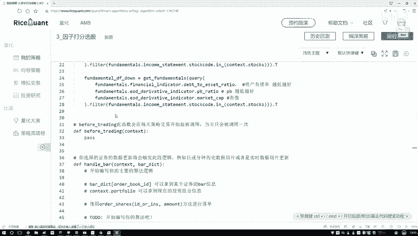

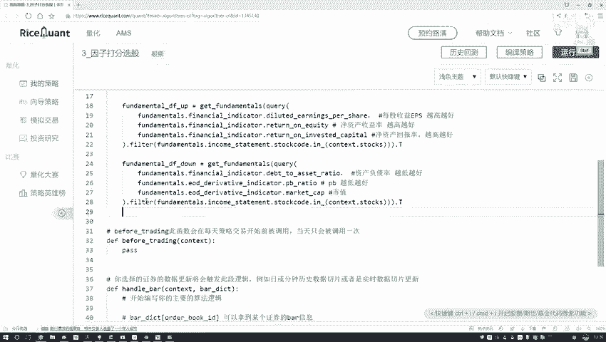

在本节课中，我们将学习如何对选出的因子进行排序和打分，这是构建多因子模型的关键步骤。我们将分别处理“越高越好”和“越低越好”两类因子，并为它们分配合理的分数，为后续的因子综合评分做准备。

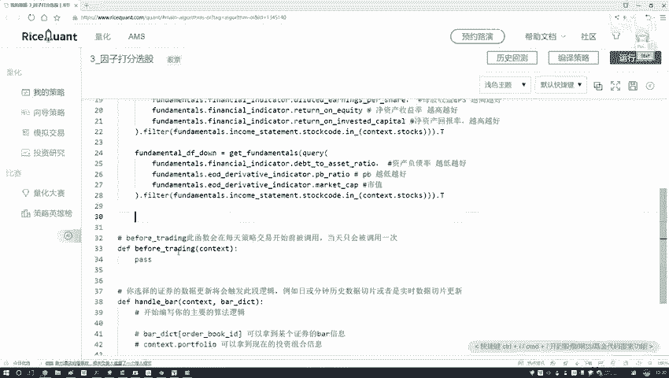

上一节我们介绍了如何筛选和分类因子，本节中我们来看看如何对这些因子进行具体的打分操作。

## 遍历因子并排序

首先，我们需要遍历包含因子的DataFrame。我们有两个DataFrame，分别对应“越高越好”和“越低越好”的因子。以下是遍历和排序的步骤：

以下是遍历“越高越好”因子DataFrame并进行排序的代码：

```python
import pandas as pd
import numpy as np

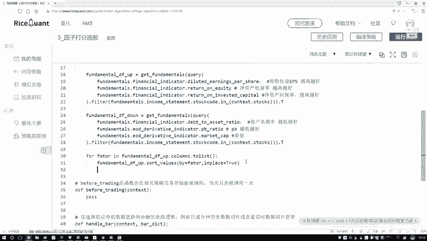

# 假设 factor_df_up 是包含“越高越好”因子的DataFrame，结构为 300行 x N列
for factor_name in factor_df_up.columns.tolist():
    # 对当前因子列进行排序，从低到高
    factor_df_up.sort_values(by=factor_name, inplace=True)
```

代码解释：
*   `factor_df_up.columns.tolist()` 获取所有因子列的名称列表。
*   `sort_values(by=factor_name, inplace=True)` 按照指定因子列的值进行排序。`inplace=True` 参数使得排序结果直接修改原DataFrame，无需重新赋值。


## 为排序后的因子打分

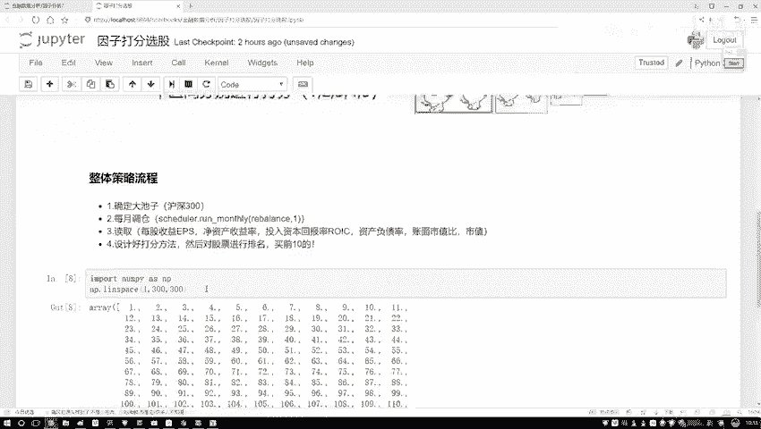

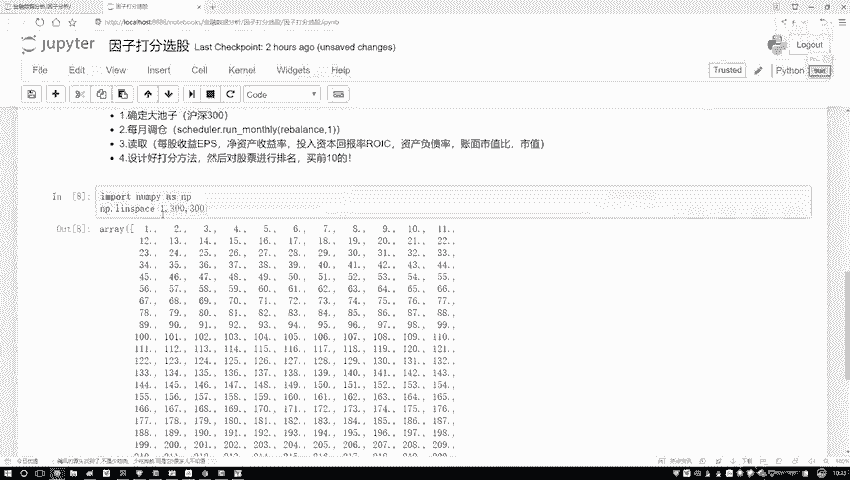

排序完成后，我们需要为每只股票在该因子上的表现打分。简单起见，我们采用线性打分法：排名第一的得最高分，排名最后的得最低分。

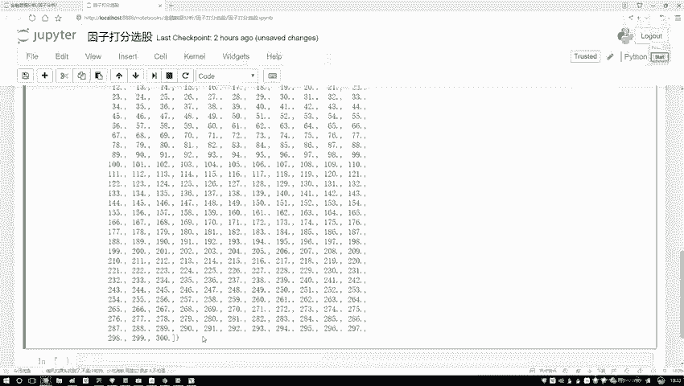

我们将使用NumPy的 `linspace` 函数来生成分数序列。该函数的公式如下：

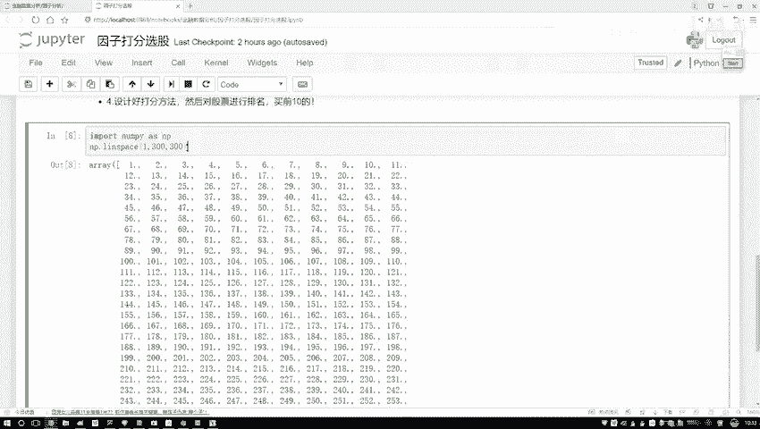

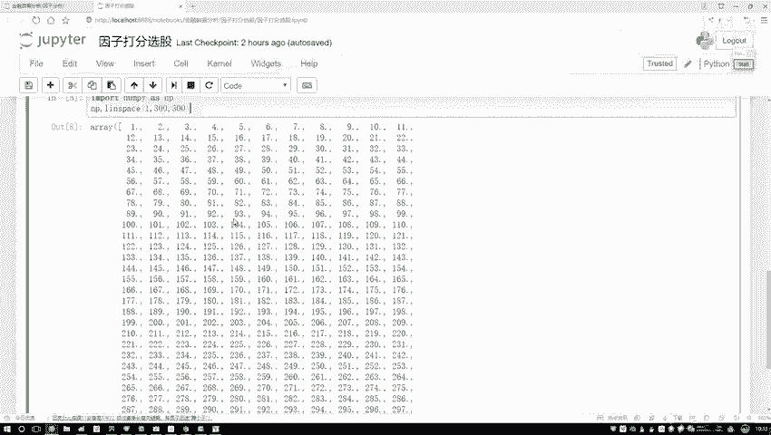

**`numpy.linspace(start, stop, num)`**
*   `start`：序列的起始值。
*   `stop`：序列的结束值。
*   `num`：要生成的样本数量。

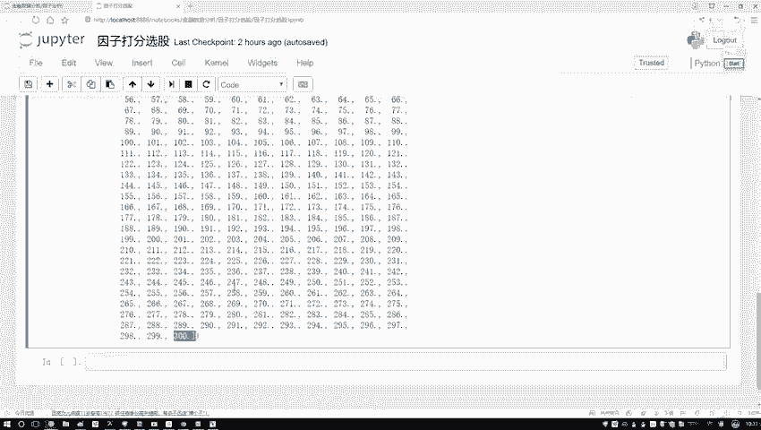

以下是具体的打分操作：

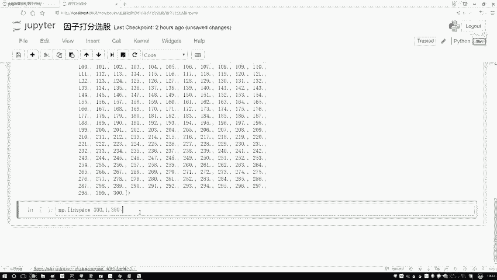

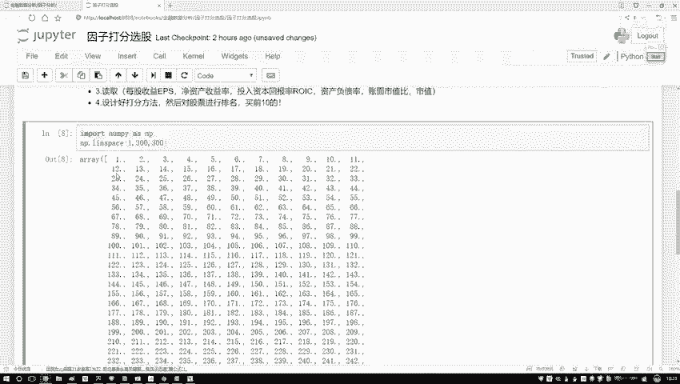

对于“越高越好”的因子，我们希望因子值最大的股票获得最高分。因此，在升序排列后，排名最后的股票应得最高分。

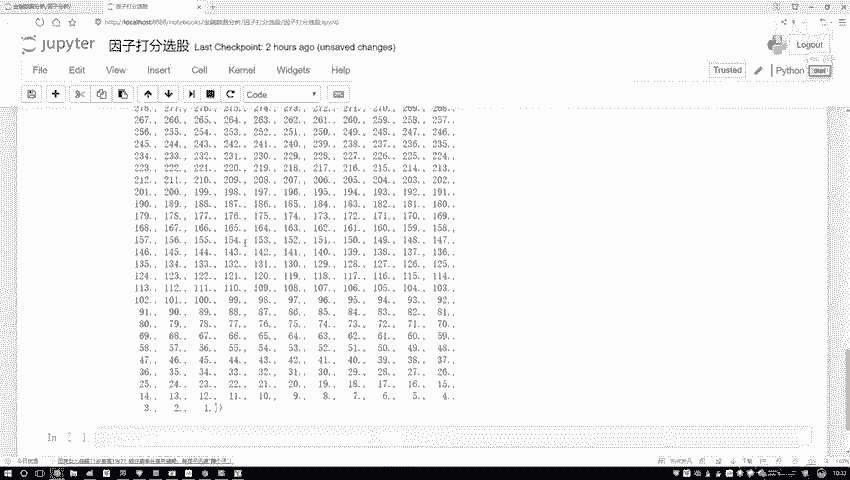

```python
# 计算股票总数
num_stocks = len(factor_df_up)

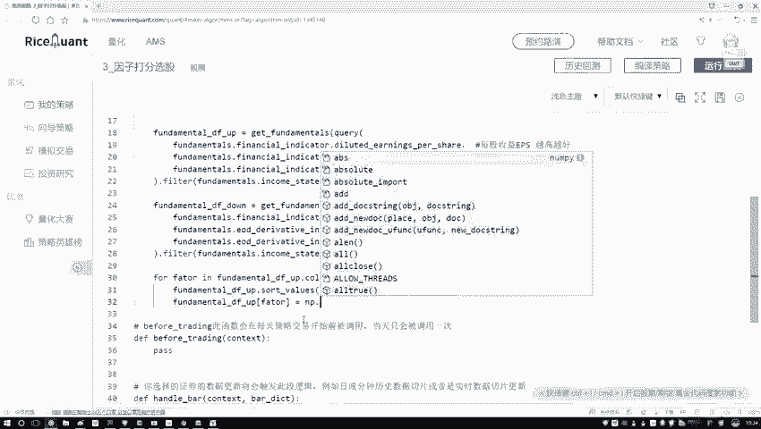

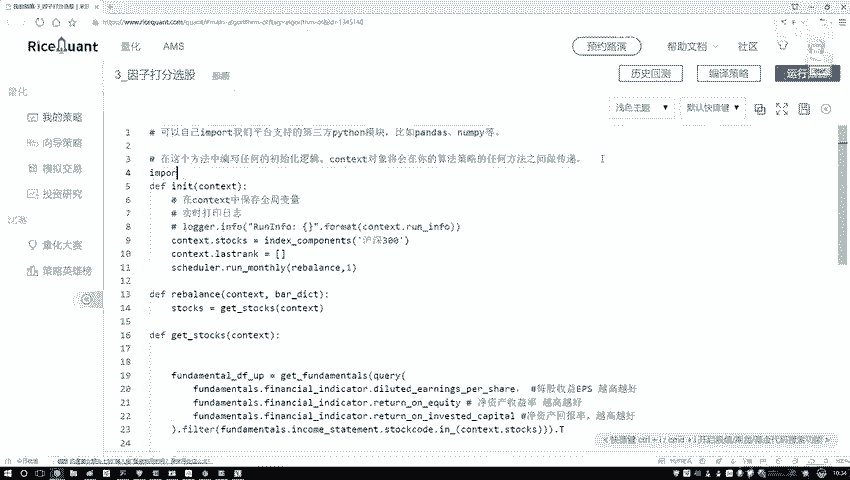

# 为“越高越好”的因子打分：排名越靠后（因子值越大），分数越高
for factor_name in factor_df_up.columns.tolist():
    factor_df_up.sort_values(by=factor_name, inplace=True)
    # 生成从1到300的分数，分配给从低到高排序的股票
    scores = np.linspace(1, num_stocks, num_stocks)
    factor_df_up[factor_name] = scores
```

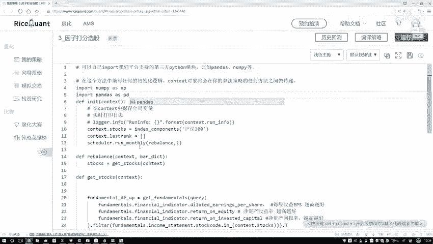

对于“越低越好”的因子，我们希望因子值最小的股票获得最高分。因此，在升序排列后，排名第一的股票应得最高分。

```python
# 为“越低越好”的因子打分：排名越靠前（因子值越小），分数越高
for factor_name in factor_df_down.columns.tolist():
    factor_df_down.sort_values(by=factor_name, inplace=True)
    # 生成从300到1的分数，分配给从低到高排序的股票
    scores = np.linspace(num_stocks, 1, num_stocks)
    factor_df_down[factor_name] = scores
```

## 合并数据准备综合评分

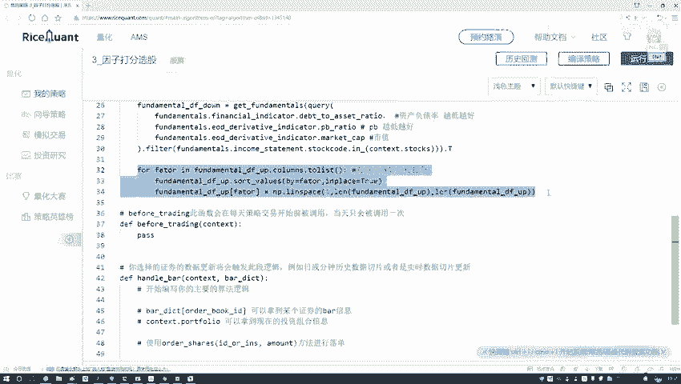

完成两个DataFrame的因子打分后，我们得到了两个独立的评分表。为了计算每只股票的综合总分，我们需要将它们合并。

以下是合并DataFrame的思路：

```python
# 后续步骤：将 factor_df_up 和 factor_df_down 合并
# 然后对每个股票的所有因子得分进行加总，得到最终的综合评分
# total_score_df = pd.concat([factor_df_up, factor_df_down], axis=1)
# total_score_df['综合得分'] = total_score_df.sum(axis=1)
```

本节课中我们一起学习了因子打分与排序的核心流程。我们首先遍历因子并排序，然后利用`np.linspace`函数根据因子类型（越高越好/越低越好）进行打分，最后为后续计算综合评分做好了数据合并的准备。这是将原始因子数据转化为可比较、可加总的分数的重要一步。