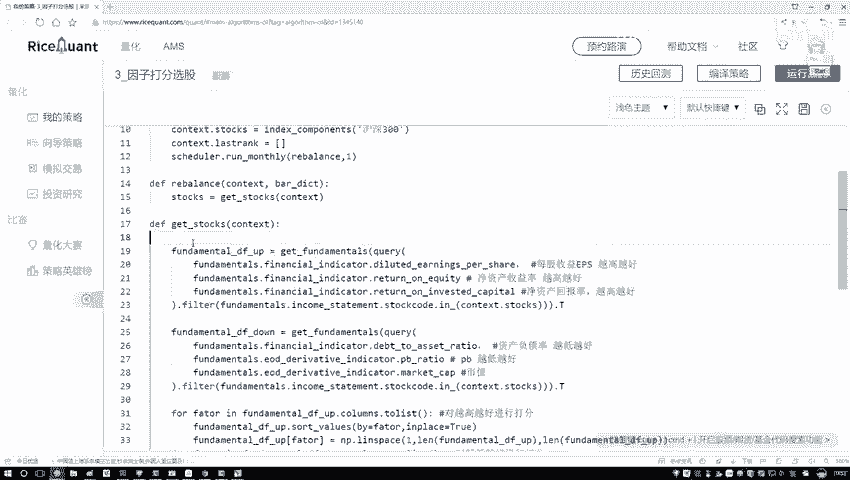
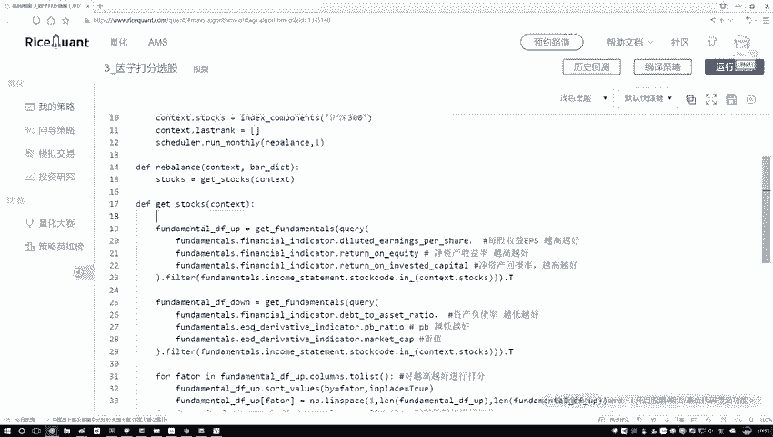
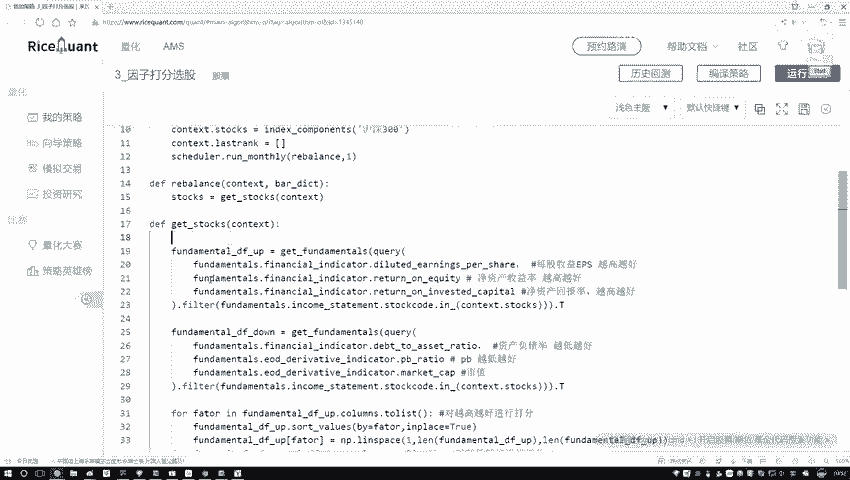
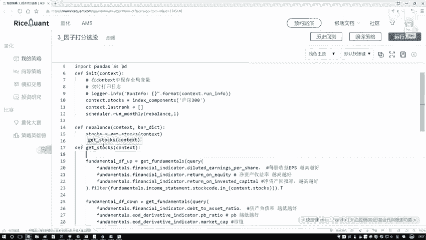

# Python金融分析与量化交易实战：P46：完成选股方法P48

## 概述
在本节课中，我们将学习如何完成一个选股方法的核心部分。具体来说，我们将把多个因子的评分数据表进行拼接，计算每只股票的综合得分，并根据得分进行排序，最终筛选出排名前十的股票。整个过程涉及Pandas DataFrame的操作、数据拼接、分数计算与排序。

---

## 数据拼接操作
上一节我们介绍了如何获取单个因子的评分数据。本节中，我们来看看如何将多个因子的数据表合并为一个总表。

以下是拼接两个DataFrame的步骤：
1.  使用一个DataFrame的`.join()`方法。
2.  将第二个DataFrame作为参数传入。

```python
# 假设 df1 和 df2 是两个需要拼接的DataFrame
combined_df = df1.join(df2)
```
现在，两个DataFrame已经拼接完成。我们可以为这个合并后的新DataFrame指定一个名称，例如 `rank_df`。

---

## 初始化得分列
目前，`rank_df`中包含了所有因子的评分，但还没有综合排名信息。

我们需要新建一个列来存放最终的综合得分。首先，初始化一个值全为零的列。
```python
import numpy as np

# 假设有300只股票样本
num_stocks = 300
rank_df[‘得分’] = np.zeros((num_stocks, 1))
```
这样，我们就创建了一个名为“得分”的新列，其中的数据目前全是零。

---

## 计算综合总分并排序
现在，每个因子的分数都已就位。接下来，我们要把这些指标的分值合并，计算出每只股票的总分。

计算总分其实就是对每一行（即每一只股票）的所有因子分数进行求和。
```python
# 计算所有因子列的总和，假设因子列名已知
factor_columns = [‘因子1’, ‘因子2’, ‘因子3’, ‘因子4’, ‘因子5’, ‘因子6’] # 请替换为实际的列名
rank_df[‘总分’] = rank_df[factor_columns].sum(axis=1)
```
总分计算完成后，我们需要根据这个总分进行排序，以找出得分最高的股票。

```python
# 按‘总分’列进行降序排序
sorted_df = rank_df.sort_values(by=‘总分’, ascending=False)
```
排序完成后，`sorted_df` 中的股票就已经按照综合得分从高到低排列好了。

---

## 提取前十名股票
我们最终的目标是选出排名前十的股票。排序之后，我们只需要获取这些股票的代码即可。

在Pandas中，DataFrame的索引（index）通常用来存放股票代码。因此，我们从排序后的DataFrame中提取索引。
```python
# 获取前十名股票的代码
top_10_stocks = sorted_df.index[:10].tolist()
```
至此，`top_10_stocks` 这个列表就包含了我们根据多因子模型选出的当前排名前十的股票。



---



## 方法流程总结
让我们回顾一下整个 `get_stocks` 方法的完整流程：
1.  **读取数据**：获取各个因子的评分数据。
2.  **数据拼接**：将所有因子的数据表合并到一张总表中。
3.  **计算得分**：对每只股票的所有因子分数求和，得到综合总分。
4.  **排序筛选**：根据总分进行降序排序，并提取排名前十的股票代码作为最终选股结果。



执行一次这个方法，就能返回基于当前所有因子数据计算出的当日推荐前十名股票。

---



## 总结
本节课中，我们一起学习了如何构建一个多因子选股方法的核心逻辑。我们掌握了使用Pandas进行数据拼接、列操作、求和计算以及排序的技巧。关键点在于将多个维度的评价指标（因子）汇总成一个综合得分，并据此做出投资决策。这个方法是量化选股中非常基础和重要的环节。