# Python金融分析与量化交易实战：P48：策略总结与分析

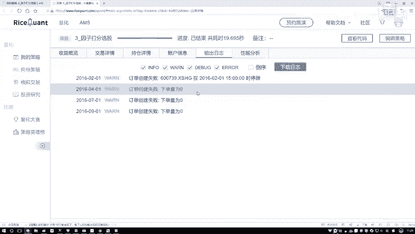

在本节课中，我们将对一个基于财务指标的打分策略进行回测总结与分析。我们将通过调整不同的回测时间段和股票选择范围，来观察策略的表现，并理解市场环境对策略效果的影响。

## 策略回测结果初览

上一节我们完成了策略代码的编写与运行。代码执行后没有报错，说明策略逻辑本身没有问题。

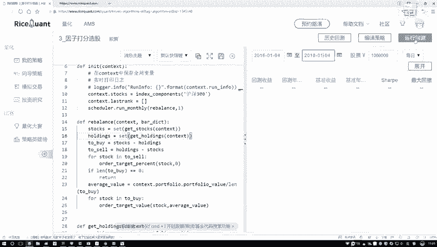

以下是初步回测（时间段较短）的关键结果：

*   **基准收益**：基准组合在该时间段内出现亏损。
*   **策略收益**：我们的策略虽然没有获得高额利润，但成功稳住了资金，没有出现亏损。
*   **最大回撤**：策略的最大回撤约为17%，处于可接受范围。
*   **超额收益**：策略相对于基准获得了约67%的超额收益，初步表现不错。

## 延长回测时间分析

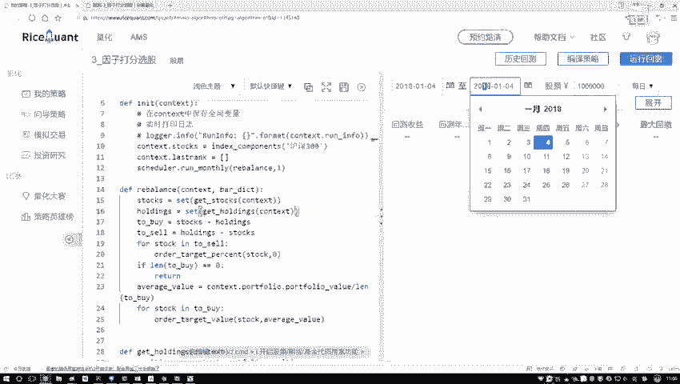

然而，仅对短期进行回测说服力不足。在量化交易中，通常需要对3到5年或更长的周期进行回测，以检验策略在不同市场环境下的稳健性。

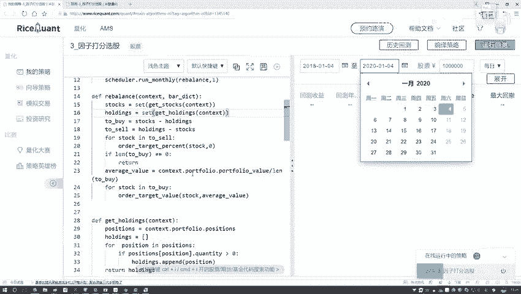

我们将回测时间调整为2016年1月4日至2018年1月4日（两年）。回测执行速度很快，结果如下：

在这一较长的时间段内，策略收益与基准收益的差异变得不明显，策略未能表现出显著优势。

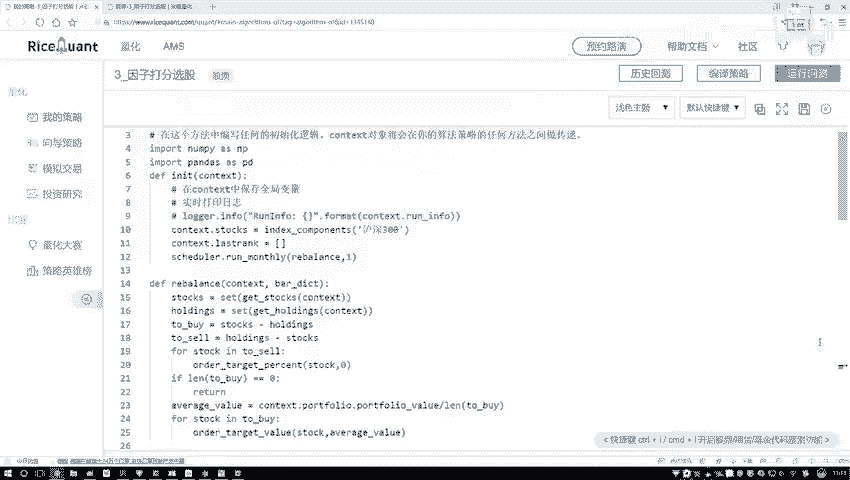

## 调整时间段以规避特殊市场

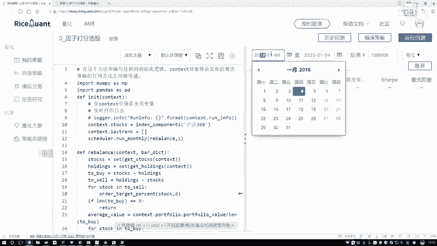

考虑到2018年股市整体表现不佳（熊市），这可能影响了策略效果。我们尝试调整到受系统性风险影响较小的时期。

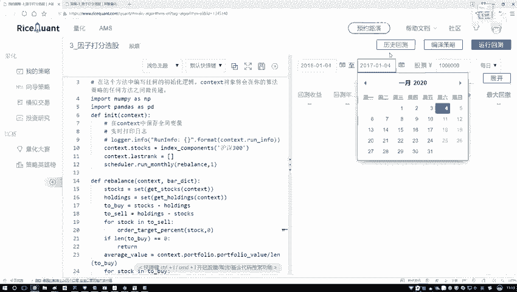

我们将回测时间改为2016年1月4日至2017年1月4日（一年）。结果如下：

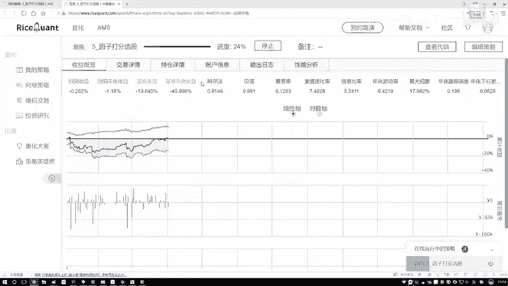

在这一年，策略表现有所改善。策略回测收益明显高于基准收益，说明在相对平稳或向好的市场环境中，该策略逻辑是有效的。

## 对比策略：选择“最差”股票

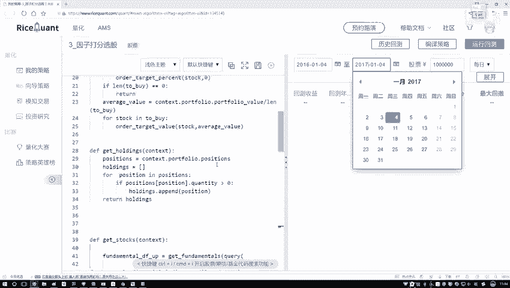

之前我们的策略是选择综合得分**排名前十**的股票。一个自然的想法是：如果选择得分**排名最后**（即最差）的股票，结果会怎样？

我们将股票选择范围从排名前10改为排名最后（即从第10名到最后）。以下是回测结果：

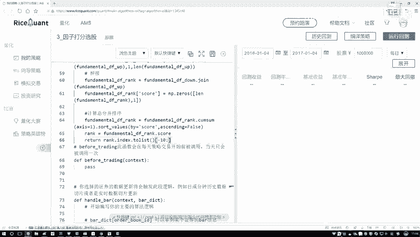

*   **基准收益**：约为-10%。
*   **策略收益**：选择“最差”股票的策略，其收益比基准收益更差。

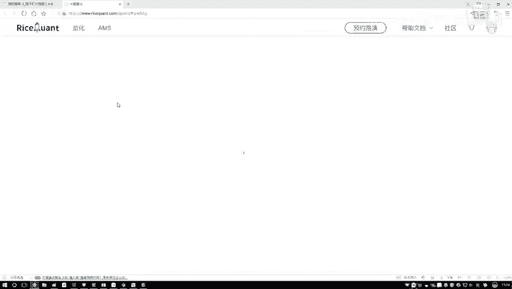

这个对比实验反向验证了我们打分标准的有效性：得分高的股票组合确实比得分低的股票组合表现更好。

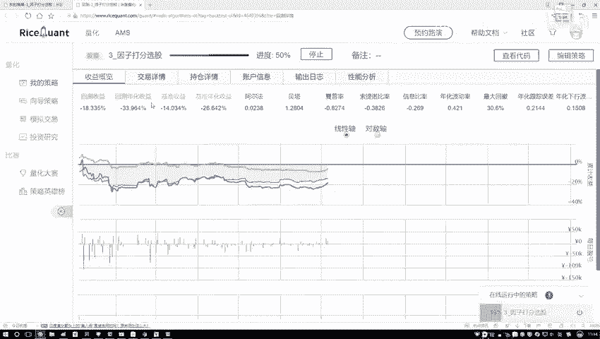

## 策略执行细节与账户信息

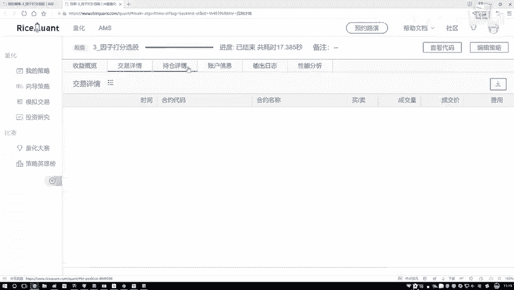

以下是关于策略执行和账户变化的详细信息：

*   **交易详情**：策略按照设计，在每年4月到11月之间进行了每月调仓。
*   **持仓详情**：记录了每次调仓后的具体持仓股票。
*   **账户信息**：初始资金为100万元，在回测期末，账户总资产变为约77万元。这直观地展示了选择“最差”股票组合带来的资金损耗。

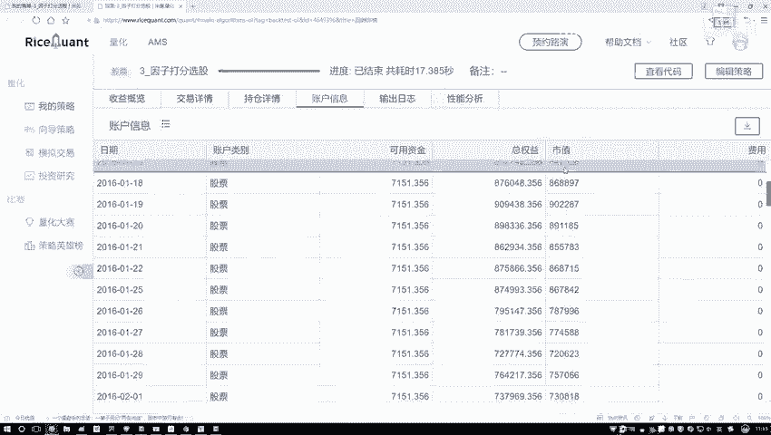

我们将股票选择范围改回默认的**排名前十**，以保证策略的有效性。相关代码会提供给大家进行实践。

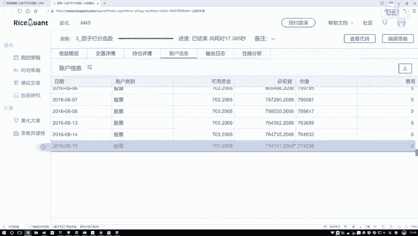

## 核心策略逻辑回顾

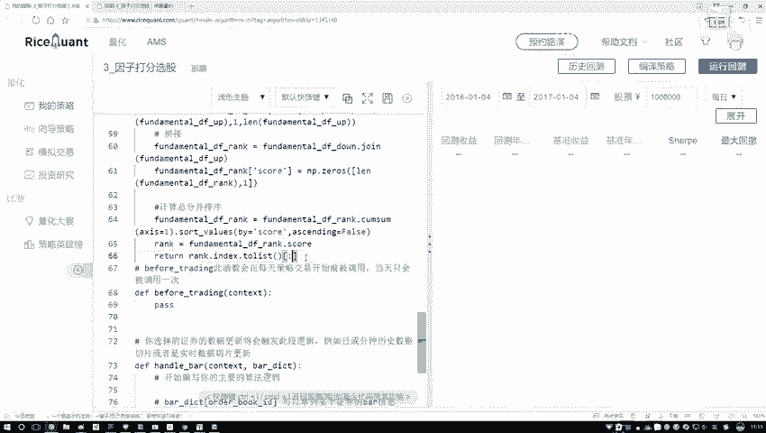

我们的策略核心是基于财务指标的打分法，其逻辑可以用以下伪代码概括：
```python
# 1. 获取股票池所有股票的财务指标数据
# 2. 对每个指标进行标准化处理（例如：指标值越高越好则正向打分，越低越好则负向打分）
# 3. 将所有指标的得分相加，得到每只股票的综合得分
# 4. 根据综合得分对股票进行排序
# 5. 定期（如每月）买入排名靠前（如Top 10）的股票
selected_stocks = sort(stocks_by_score, descending=True)[:10]
```

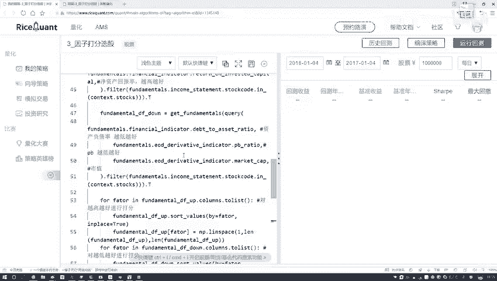

这种方法直接有效，通常能获得不错的结果。报告中会明确指出哪些指标是“越高越好”，哪些是“越低越好”，为我们构建打分体系提供了依据。

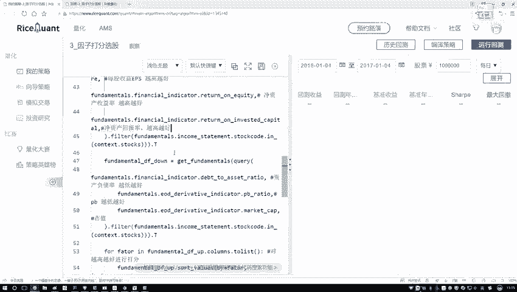

## 总结与市场影响

本节课中，我们一起学习了如何对一个量化策略进行多角度的回测分析。

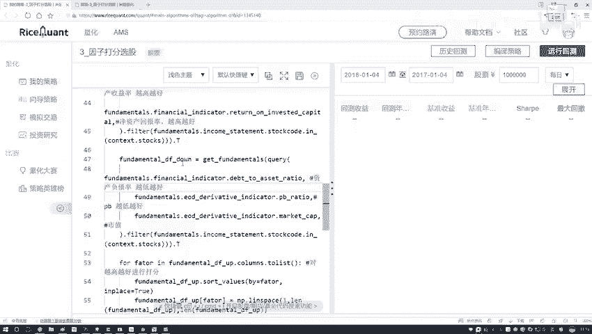

我们通过实践了解到：
1.  打分策略是一种直观且常用的量化选股方法。
2.  策略的回测效果与所选时间段密切相关，**市场整体环境（如牛市、熊市）** 会对策略收益产生重大影响。在熊市中，任何策略都可能表现不佳，这是常见的市场现象。
3.  通过对比实验（如选择“最好”与“最差”股票），可以验证策略逻辑的有效性。

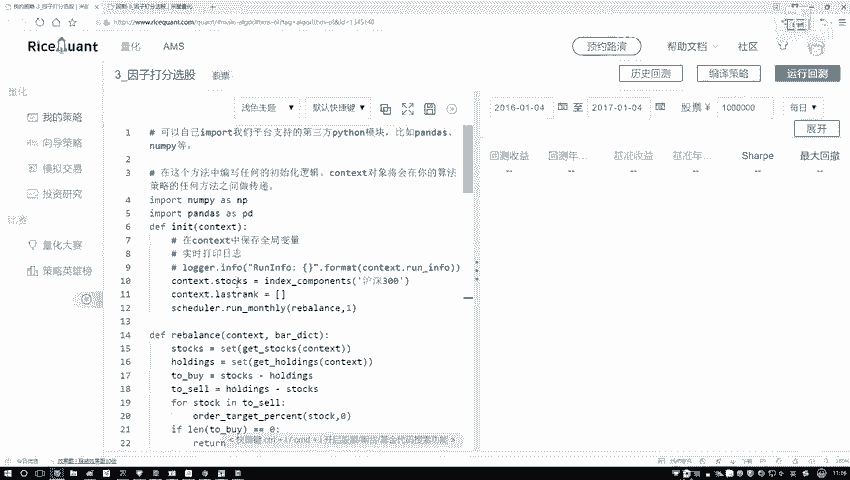

最终，一个策略的成败不仅取决于模型本身，也受到不可控的市场因素制约。本次分析为大家提供了一个完整的策略评估范例。