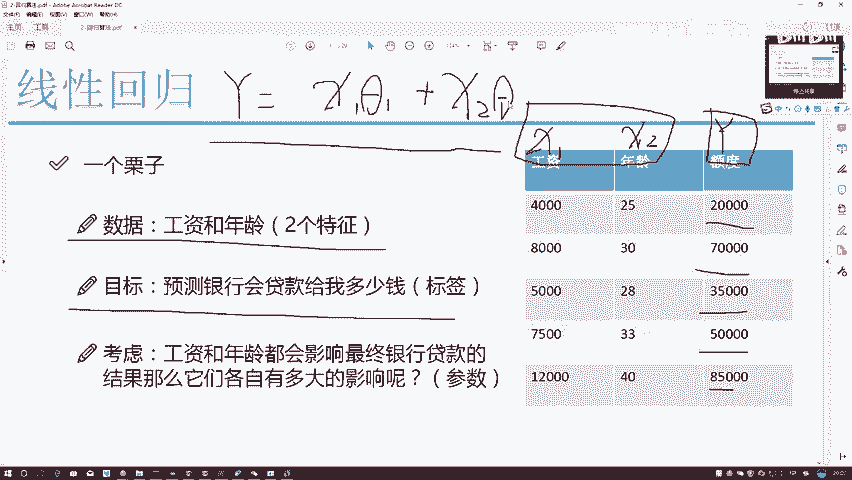
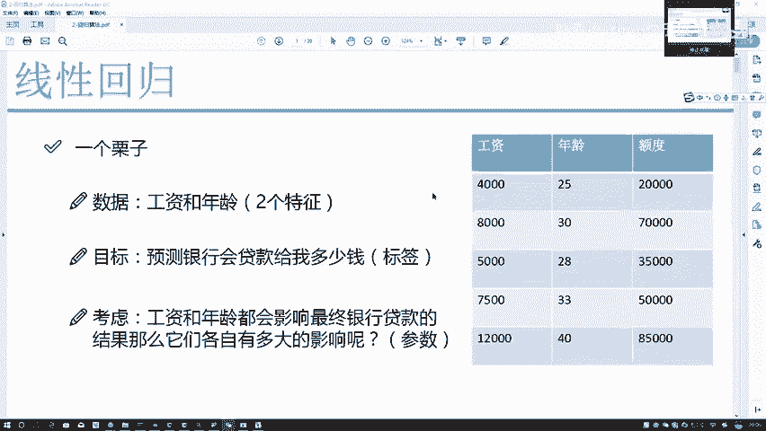
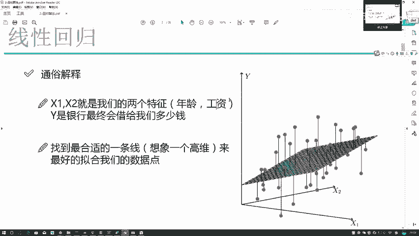

# Python金融分析与量化交易实战：P49：回归问题概述

在本节课中，我们将要学习机器学习中的回归问题。我们将从基本概念入手，解释什么是回归问题，并通过一个具体的银行贷款额度预测例子，来理解回归问题的数据形式、目标以及核心的建模思想。

## 什么是回归问题？

在机器学习的有监督学习中，主要存在两种问题类型：分类和回归。

分类问题有明确的类别。例如，向银行申请贷款，银行给出的结果是“批准”（类别1）或“拒绝”（类别0）。

回归问题预测的是一个具体的数值。例如，再次向银行申请贷款时，我们询问的是“能贷给我多少钱？”。这个答案可能是一个在一定范围内的具体数字，如36，200元、48，899元或97，600元。我们的目标就是预测这个连续范围内的可能值。本节课要讨论的就是回归问题。

## 回归问题的数据形式

接下来，我们看看回归问题中数据通常如何组织。以下是一个示例表格：

| 工资 (X1) | 年龄 (X2) | 额度 (Y) |
| :--- | :--- | :--- |
| ... | ... | ... |

在这个数据中：
*   **工资 (X1)** 和 **年龄 (X2)** 是我们用来建模的特征。
*   **额度 (Y)** 是我们想要预测的目标值，也称为标签。

作为有监督学习算法，回归模型在训练时必须参考已知的标签（Y值）。我们的目标就是利用特征 **X1** 和 **X2** 来预测最终的 **Y** 值。

## 建立回归模型

既然我们要预测 **Y** 值，而 **Y** 显然与 **X1** 和 **X2** 都相关，一个自然的想法是建立一个方程来描述这种关系。直接相加（`Y = X1 + X2`）并不合理，因为这假设了工资和年龄对结果的影响程度完全相同。

实际上，工资对贷款额度的影响可能远大于年龄。因此，我们需要为每个特征引入一个系数，来表示其影响权重。

我们可以建立如下线性方程：
`Y = θ1 * X1 + θ2 * X2`

在这个方程中：
*   **θ1** 和 **θ2** 就是我们需要求解的系数（例如，θ1=3， θ2=1 表示工资的影响是年龄的3倍）。
*   **X1**， **X2**， **Y** 在训练数据中是已知的。

所以，线性回归的核心目标就是：**找到一组最合适的系数 θ1 和 θ2**。

## 模型的拟合与目标

然而，我们面临一个现实问题：一个简单的线性方程（一个平面）几乎不可能完美穿过所有的数据点。

如上图所示，红色的点代表我们的样本数据。我们无法找到一条直线能同时穿过所有红点。既然无法满足所有点，那么一个合理的目标是：**找到一条直线，使得它尽可能接近大多数数据点**。

换句话说，我们的线性方程虽然不能精确匹配每一个数据，但应该**尽可能好地拟合**整体数据分布。这就是线性回归的优化目标：寻找最优参数，使得模型预测值与真实值之间的总体误差最小。

## 总结

本节课我们一起学习了回归问题的基本概念。我们明确了回归问题是预测连续数值的任务，并通过贷款额度预测的例子，了解了回归数据中特征（X）和标签（Y）的构成。我们引入了线性回归模型的基本形式 `Y = θ1 * X1 + θ2 * X2`，并指出模型训练的核心在于求解最优的系数 θ。最后，我们认识到线性模型的目标不是精确穿过每一个点，而是找到一条最优的直线，使其对整体数据有最好的拟合效果。