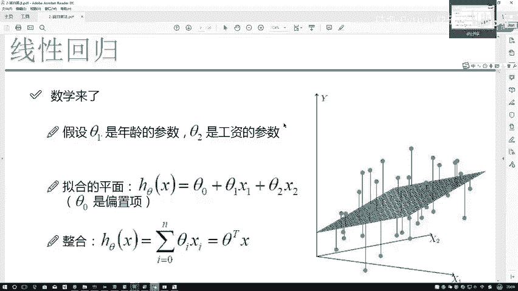
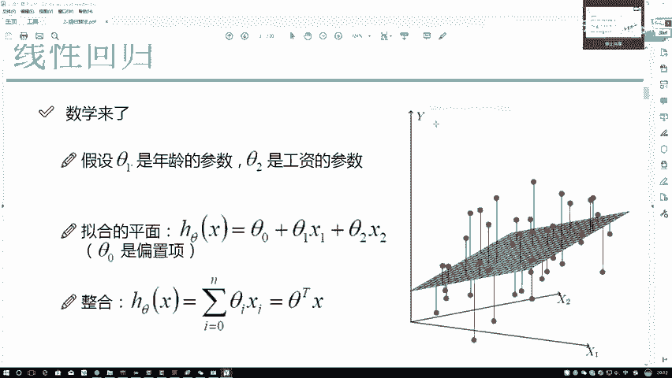
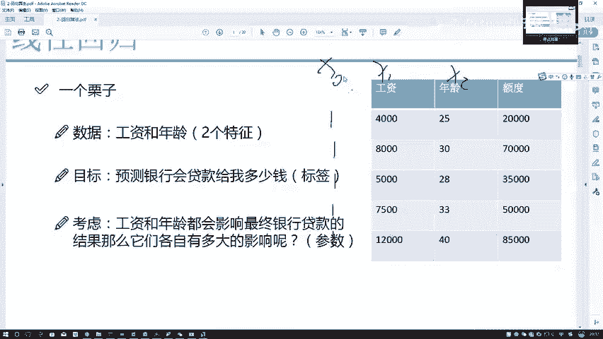
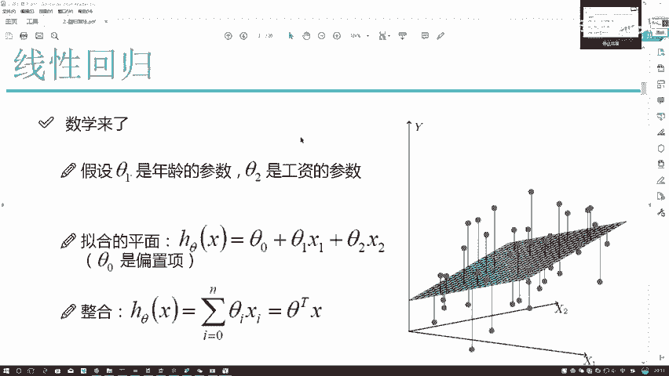
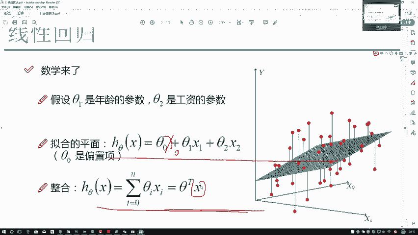
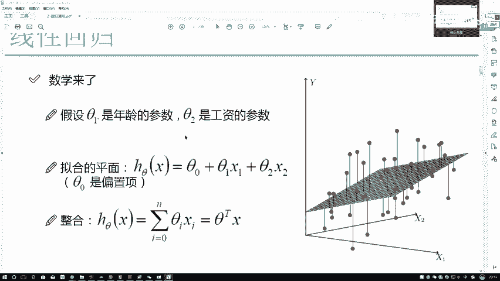
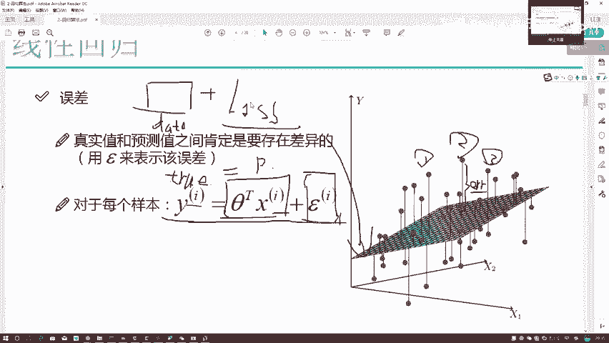
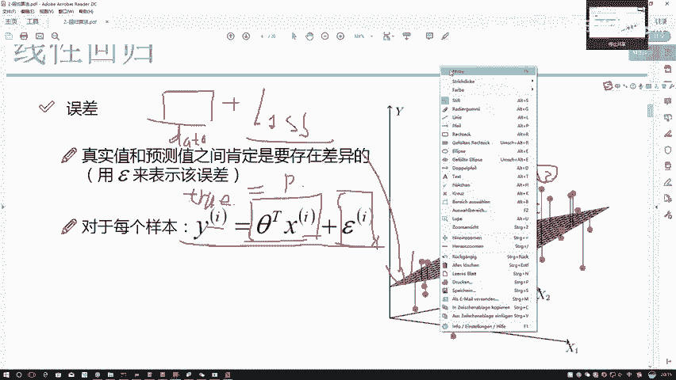
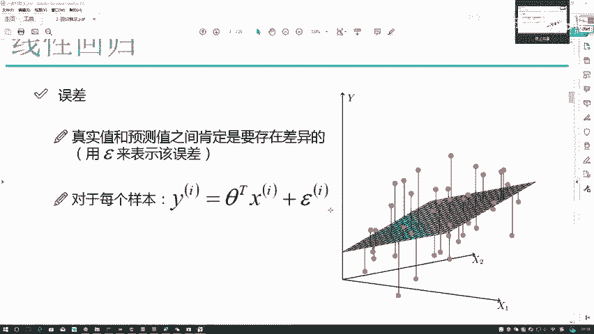

# Python金融分析与量化交易实战：P50：误差项定义

## 概述
在本节课中，我们将学习线性回归模型中的一个核心概念——误差项。我们将探讨如何将回归方程转化为矩阵形式，并理解误差项在模型训练中的意义，这是构建和理解机器学习模型的基础。

## 从回归方程到矩阵形式
上一节我们介绍了用平面拟合数据的想法。本节中我们来看看如何用数学公式描述这个平面，并将其转换为便于计算的矩阵形式。

首先，我们列出拟合平面的公式：
`hθ(x) = θ₀ + θ₁x₁ + θ₂x₂`
其中：
*   `x₁` 和 `x₂` 是特征，例如工资和年龄。
*   `θ₁` 和 `θ₂` 是**权重项**，决定了每个特征对结果的影响程度。
*   `θ₀` 是**偏置项**，它对整个预测结果进行微调，使平面整体上移或下移，以更精准地拟合数据。偏置项的作用是微调，而非大范围移动。

我们的数据 `X` 通常是一个矩阵，行代表样本，列代表特征。为了将上述公式转换为矩阵乘法形式，我们需要处理多出来的常数项 `θ₀`。

观察公式 `θ₀ + θ₁x₁ + θ₂x₂`，我们发现，如果存在一个 `x₀` 与 `θ₀` 相乘，就能统一写成矩阵形式 `θᵀX`。这里的 `x₀` 是我们为了计算方便而构造的，它没有实际物理含义。

因此，我们在原始数据中手动添加一列，记为 `x₀`。

以下是处理数据的关键步骤：
*   在特征矩阵 `X` 中新增一列 `x₀`。
*   将这一列的所有值设为 **1**。因为任何数乘以1都等于其本身，这确保了 `θ₀ * 1 = θ₀`，公式意义不变。
*   这样，拟合方程就转换为：`hθ(x) = θ₀x₀ + θ₁x₁ + θ₂x₂ = θᵀX`，其中 `θ` 和 `X` 都是向量/矩阵。

这个操作只是为了将模型转换为**矩阵形式**以便计算，没有其他特殊含义。

## 误差项的定义与意义
现在我们已经有了用矩阵表示的预测方程 `hθ(x) = θᵀX`。接下来，我们通过一个样本来理解模型的预测值与真实值之间的差异。

对于任意一个样本 `i`：
*   我们将其特征 `(x₁⁽ⁱ⁾, x₂⁽ⁱ⁾)` 代入方程，计算得到一个**预测值**。
*   数据本身有一个已知的**真实值**（例如，银行历史数据中实际批准的贷款额度）。
*   预测值与真实值之间通常存在差距，这个差距我们称之为**误差项**，记为 `ε⁽ⁱ⁾` 或 `error⁽ⁱ⁾`。

用公式表示这个关系为：
`y⁽ⁱ⁾ = hθ(x⁽ⁱ⁾) + ε⁽ⁱ⁾`
其中 `y⁽ⁱ⁾` 是真实值，`hθ(x⁽ⁱ⁾)` 是预测值。

每个样本都有自己的误差项，且通常各不相同。

## 损失函数：机器学习的目标
理解误差项后，我们进入机器学习的核心：如何让机器“学习”。

机器学习的通俗解释是：
1.  你给机器提供**数据**。
2.  你为机器定义一个**目标**（即损失函数）。
3.  机器通过调整参数（如 `θ`），尝试**最小化这个损失函数**，从而学习到数据中的规律。

我们的目标很直观：希望模型的预测尽可能准确，即误差项**越小越好**。最理想的情况是误差为零，表示预测完全正确。

因此，我们通常将**损失函数**构建为与误差项相关的函数（例如，所有样本误差的平方和）。损失函数的值越小，代表模型拟合得越好；损失函数为零，代表完美拟合。

几乎所有机器学习模型的损失函数都遵循“值越小越好，零为最优”的设计原则。

## 总结
本节课中我们一起学习了：
1.  **模型公式化**：将线性回归的平面方程 `hθ(x) = θ₀ + θ₁x₁ + θ₂x₂` 通过添加值为1的 `x₀` 列，转换为矩阵形式 `θᵀX`，这纯粹是为了计算便利。
2.  **核心概念**：理解了**权重项** (`θ₁, θ₂`)、**偏置项** (`θ₀`) 和**误差项** (`ε⁽ⁱ⁾`) 的定义和作用。
3.  **机器学习机制**：引入了**损失函数**的概念，它是指导模型学习的“目标”。我们的核心目标是**最小化损失函数**，即让模型预测的误差尽可能小。

下一节，我们将基于误差项，具体探讨如何构建并最小化这个损失函数，从而求解出最优的模型参数 `θ`。