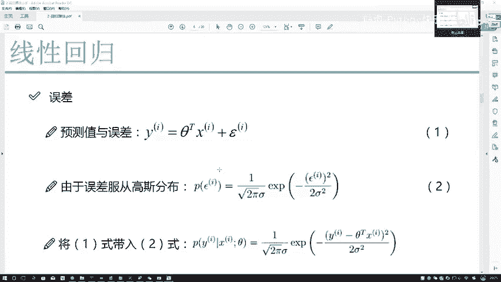
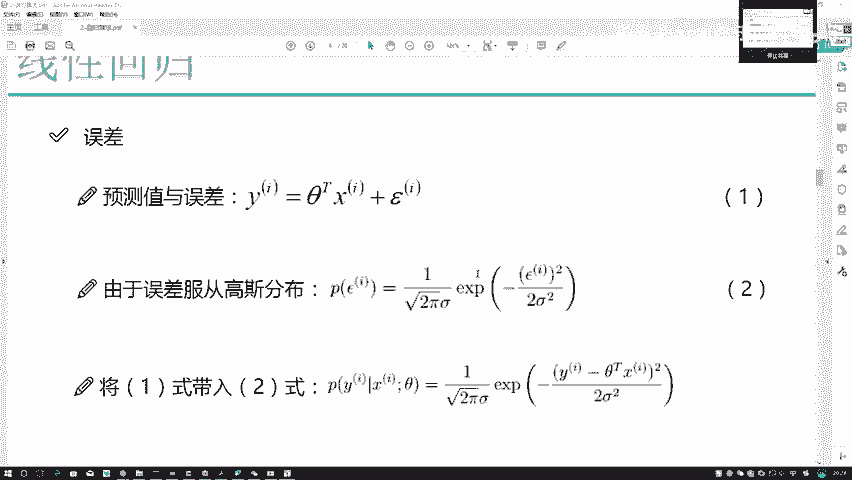
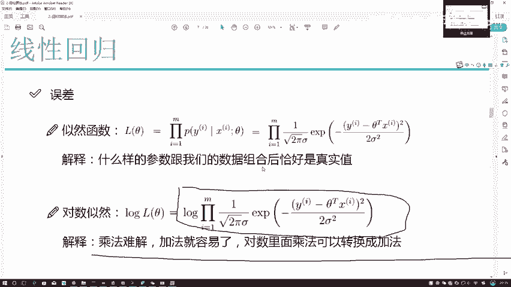
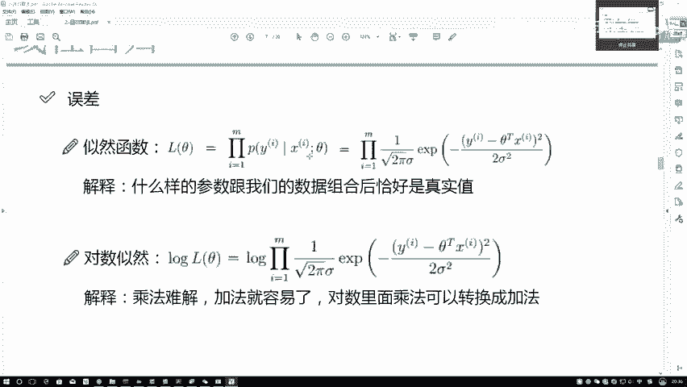
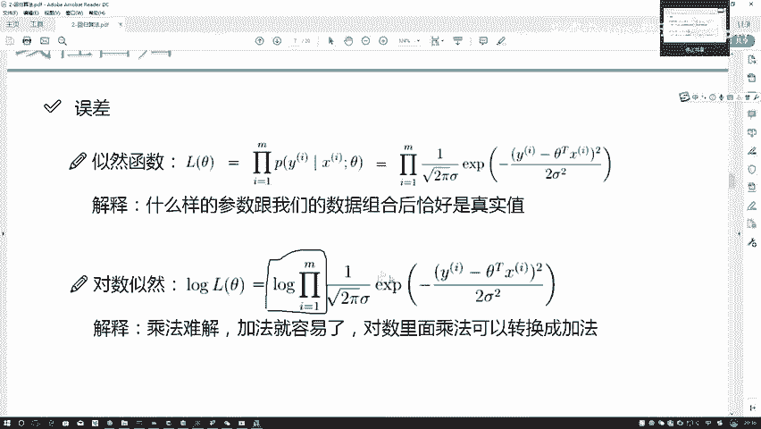
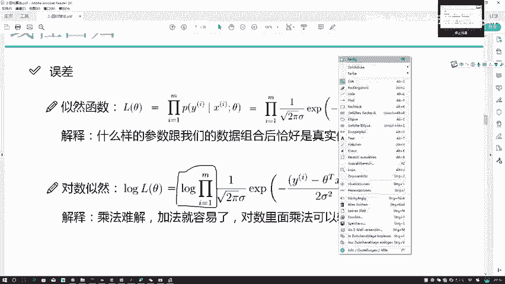

# Python金融分析与量化交易实战：P52：55.54.4-似然函数的作用



## 概述
在本节课程中，我们将学习线性回归中一个核心的数学概念——**似然函数**。我们将探讨如何利用似然函数来估计模型参数，并理解其背后的逻辑。具体来说，我们会看到如何将误差的高斯分布假设转化为一个关于参数的优化问题，以及如何通过数学变换简化求解过程。

---

## 误差项与参数求解目标
上一节我们介绍了误差项服从高斯分布的假设。现在，我们的目标是求解模型参数 `C`（或 `θ`）。我们拥有数据 `X` 和标签 `Y`，当前缺少的是参数 `C` 的具体值。

高斯分布的表达式如下：
```
P(ε) = (1 / √(2πσ²)) * exp(-ε² / (2σ²))
```
其中，`ε` 代表误差项。由于我们假设误差的均值为零，因此表达式进行了简化。

然而，这个分布是关于误差项 `ε` 的。我们最终关心的是参数 `C`，而不是具体的误差值。因此，我们需要建立 `ε` 与 `C` 之间的联系。

根据线性模型定义：`Y = CᵀX + ε`。我们可以将其改写为：`ε = Y - CᵀX`。

将这个关系代入高斯分布公式，我们就得到了一个关于参数 `C` 和数据 `(X, Y)` 的概率表达式。这意味着，对于给定的参数 `C`，我们可以计算观察到当前数据 `Y` 的可能性。



通俗地解释：我们希望找到一组参数 `C`，使得模型预测值 `CᵀX` 与真实值 `Y` 尽可能接近。换句话说，**在参数 `C` 下，模型预测结果恰好等于真实观测值 `Y` 的可能性应该越大越好**。

---

## 似然函数的概念与解释
为了理解参数估计的过程，我们引入**似然函数**。它描述了在给定参数下，观察到当前样本数据的概率。

以下是一个类比帮助理解：
假设你观察赌场里五位玩家都赢了。你会倾向于认为，控制赌场输赢的“参数”使得赢的概率很高，因此你预测自己接下来去玩也会赢。你的判断基于观察到的数据（五位玩家都赢）来反推最可能的“参数”设置。

似然函数 `L(C)` 正是做这样的事：它衡量**什么样的参数 `C` 与我们的数据 `(X, Y)` 组合后，最有可能得到我们观测到的结果**。参数 `C` 是固定的（待求），数据 `(X, Y)` 也是固定的（已知）。

似然函数的公式通常写作所有样本概率的乘积：
```
L(C) = ∏ᵢ P(Yᵢ | Xᵢ; C)
```
其中 `i` 从 1 到 `M`（样本总数）。

这里有两个关键点需要解释：
1.  **为什么是累乘（∏）？** 因为我们假设数据样本是**独立同分布**的。在独立同分布前提下，所有样本同时出现的联合概率等于每个样本边缘概率的乘积。
2.  **为什么需要大量数据（M很大）？** 使用更多数据（增大 `M`）进行估计，结果会更可靠、更准确。就像只看到一个人赢你可能觉得是运气，但看到一万个人都赢，你就会坚信规则有利于玩家。

---

## 从乘法问题到加法问题的转换
虽然似然函数的概念很清晰，但直接求解 `L(C)` 的最大值非常困难。因为它是一个大量概率值的乘积（例如1000项相乘），这种乘法问题在数学上很难直接优化。

一个常见的技巧是将乘法问题转化为加法问题，因为加法问题更容易处理。我们利用**对数函数**的性质来实现这一转换。

对数的基本性质：`log(A * B) = log(A) + log(B)`。对数运算可以将乘法转换为加法。

因此，我们定义**对数似然函数** `log L(C)`：
```
log L(C) = log( ∏ᵢ P(Yᵢ | Xᵢ; C) ) = ∑ᵢ log( P(Yᵢ | Xᵢ; C) )
```

现在，我们面临一个重要问题：对似然函数取对数后，我们求解的目标改变了吗？我们关心的是似然函数 `L(C)` 的具体数值吗？

并不关心。我们真正关心的是**使似然函数取得最大值的那个参数 `C` 的值**，即**极值点**。取对数操作虽然会改变函数的极值（最大值的大小），但不会改变极值点的位置。因此，最大化 `L(C)` 与最大化 `log L(C)` 是等价的，它们会给出相同的参数估计 `C`。

通过这一转换，我们将一个复杂的连乘优化问题，简化为了一个相对容易处理的连加优化问题。

---



## 总结
本节课我们一起学习了似然函数在线性回归参数估计中的作用。





1.  我们首先明确了目标：求解使模型预测最准确的参数 `C`。
2.  接着，我们利用误差项服从高斯分布的假设，将问题转化为寻找**最可能产生观测数据 `Y` 的参数 `C`**，即最大化似然函数 `L(C)`。
3.  然后，我们解释了似然函数为何是样本概率的乘积（基于独立同分布假设），以及为何需要大量数据。
4.  最后，为了解决连乘难以优化的问题，我们引入了**对数似然函数** `log L(C)`。取对数将乘法转换为加法，且不改变极值点的位置，从而大大简化了后续的求解过程。




下一节，我们将基于对数似然函数，推导出具体的参数求解公式。