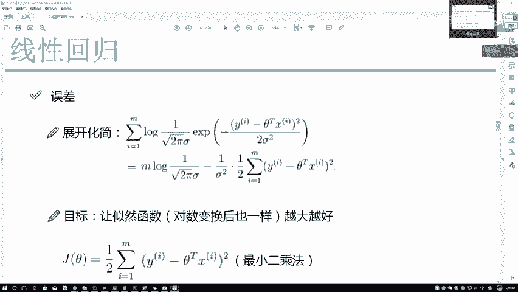
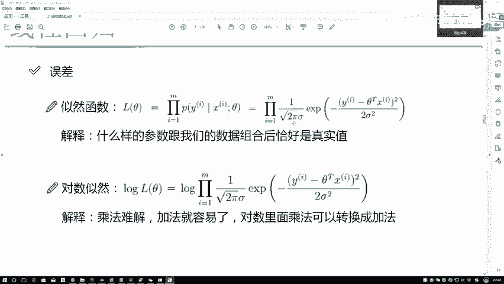
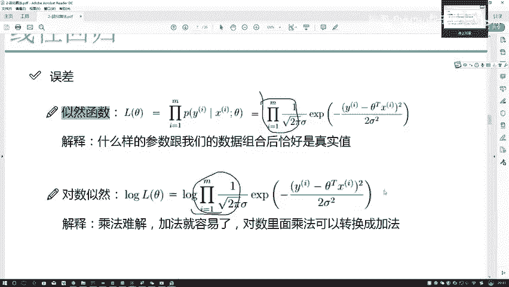
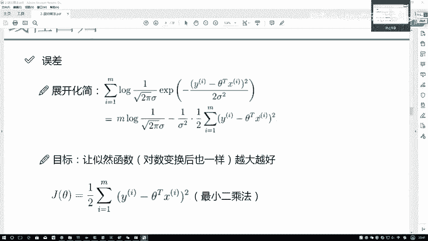
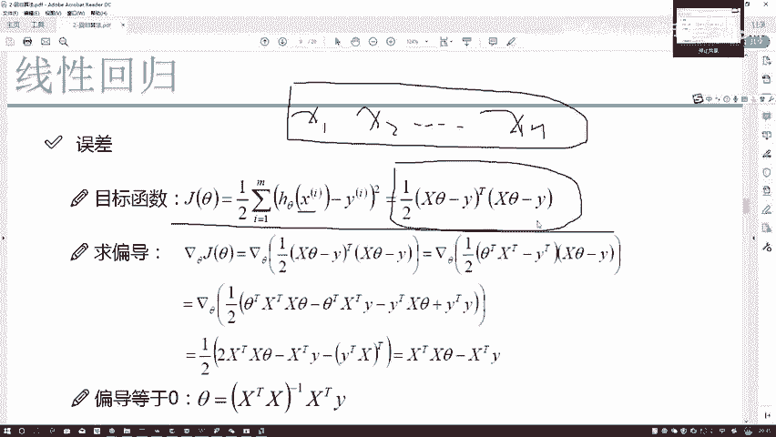
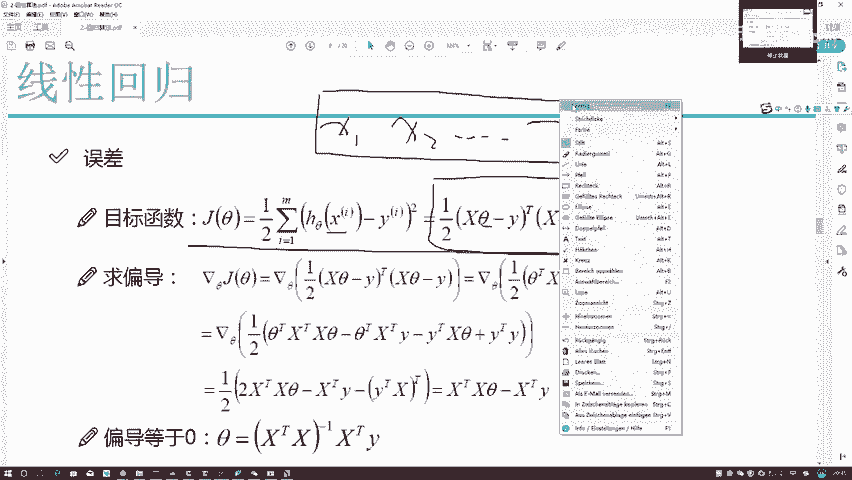
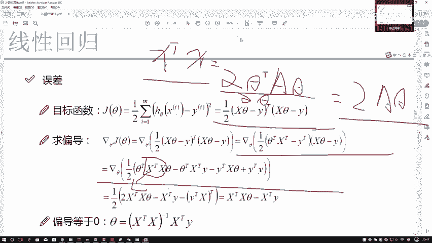
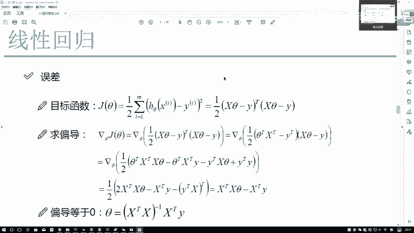
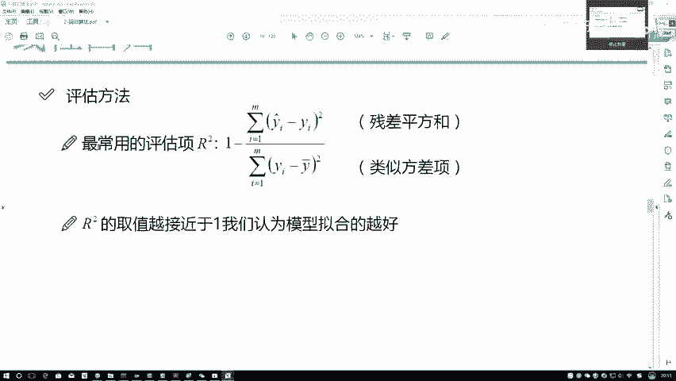

# Python金融分析与量化交易实战：P53：56.55.5-参数求解P55

在本节课程中，我们将学习如何求解线性回归模型中的参数。我们将从最大似然估计出发，推导出最小二乘法，并最终得到参数的解析解公式。理解这个过程对于掌握线性回归模型的原理至关重要。

## 从似然函数到目标函数

上一节我们介绍了如何构建线性回归的似然函数。本节中，我们来看看如何通过对似然函数进行处理，将其转化为一个易于求解的目标函数。

首先，我们回顾一下似然函数。它是一个累乘的形式，表示所有样本的联合概率。为了便于计算，我们通常对其取对数，将累乘转化为累加。

对数似然函数可以写成以下形式：

`L(θ) = Σ[log(P(y_i | x_i, θ))]`

其中，`θ` 是我们要求解的模型参数。

接下来，我们将线性回归的假设（即误差项服从正态分布）代入上式。经过一系列数学变换（包括提取常数项、利用对数运算法则等），我们的目标从最大化似然函数，转变为最小化一个特定的表达式。

这个表达式就是**最小二乘法的目标函数**，通常被称为损失函数或代价函数（Cost Function），记作 `J(θ)`：

`J(θ) = 1/2 * Σ[(y_i - θ^T * x_i)^2]`

以下是推导过程中的关键点：
*   **常数项处理**：在对数似然函数中，与参数 `θ` 无关的项被视为常数，在求极值点时可以忽略。
*   **目标转换**：最大化对数似然函数等价于最小化残差平方和。
*   **核心思想**：我们希望模型的预测值 `θ^T * x_i` 与真实值 `y_i` 之间的差距越小越好。

需要强调的是，最小二乘法并非凭空出现。它源于我们对误差分布（正态分布）的假设和最大似然估计的原理。理解这个推导链条，有助于我们理解许多机器学习算法的共通思想。

## 目标函数的矩阵形式与求解

上一节我们得到了最小二乘的目标函数。本节中，我们来看看如何用矩阵形式表示它，并求解出使目标函数最小的参数 `θ`。

首先，我们需要将目标函数写成矩阵形式。注意，这里的 `x_i` 和 `θ` 都不是单个数字，而是向量（或视为列矩阵）。`X` 是整个数据特征矩阵，`y` 是目标值向量。

矩阵形式的目标函数为：

`J(θ) = 1/2 * (y - Xθ)^T (y - Xθ)`

我们的目标是找到参数 `θ`，使得 `J(θ)` 最小。这是一个优化问题，标准的求解方法是令 `J(θ)` 对 `θ` 的偏导数为零。

以下是求解步骤：
1.  **展开目标函数**：将 `J(θ)` 展开。
2.  **对参数求偏导**：计算 `∂J(θ)/∂θ`。
3.  **令偏导为零**：`∂J(θ)/∂θ = 0`。
4.  **求解方程**：解出 `θ`。

在求导过程中，会用到矩阵求导的公式。当 `A` 是对称矩阵时，有公式：`∂(θ^T A θ)/∂θ = 2Aθ`。最终，我们得到著名的**正规方程（Normal Equation）**：

`X^T X θ = X^T y`

为了解出 `θ`，我们在等式两边同时左乘 `(X^T X)` 的逆矩阵（如果可逆），得到参数的解析解：

`θ = (X^T X)^{-1} X^T y`

这个公式就是线性回归参数的**解析解**或**闭式解**。它意味着，只要我们有了数据 `X` 和 `y`，就可以通过一次矩阵运算直接计算出最优参数 `θ`。

## 对解析解的思考与后续方向

上一节我们推导出了线性回归参数的解析解公式。本节中，我们来思考这个公式的局限性，并引出后续的学习方向。

虽然解析解 `θ = (X^T X)^{-1} X^T y` 非常简洁，但它也引出了两个重要问题：

以下是两个关键问题：
1.  **“学习”过程缺失**：这个公式是一个直接的数学求解，没有模型逐步调整、迭代优化的“学习”过程。它更像是一个一步到位的计算，而非我们通常理解的机器学习中的渐进式学习。
2.  **矩阵可逆性要求**：公式要求 `X^T X` 矩阵必须是可逆的。然而，在实际数据中，当特征之间存在高度相关性（共线性）或样本数量少于特征数量时，`X^T X` 可能是奇异（不可逆）矩阵，导致解不存在或不唯一。

正因为解析解存在这些限制，在实际的机器学习应用中，我们更常使用另一种求解方法——**梯度下降法**。梯度下降法通过迭代的方式逐步调整参数，最小化损失函数，它不要求 `X^T X` 可逆，并且更符合“学习”的直观概念。

此外，在得到模型参数后，我们还需要一套方法来评估模型的好坏。这就是我们接下来要学习的**模型评估方法**。

## 总结

本节课中我们一起学习了线性回归模型的参数求解全过程。
*   我们从**最大似然估计**出发，通过对数变换和化简，推导出了**最小二乘法**的目标函数。
*   然后，我们将目标函数表示为矩阵形式，并通过求导得到了参数的**解析解（正规方程）**。
*   最后，我们分析了解析解的优缺点，指出了其缺乏迭代学习过程和依赖矩阵可逆性的问题，从而引出了**梯度下降法**和**模型评估**这两个重要的后续主题。

理解从概率假设到最终求解的完整逻辑，比单纯记忆最小二乘公式更为重要。这为我们理解更复杂的机器学习模型奠定了坚实的基础。