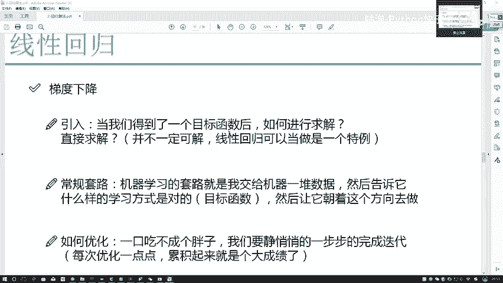
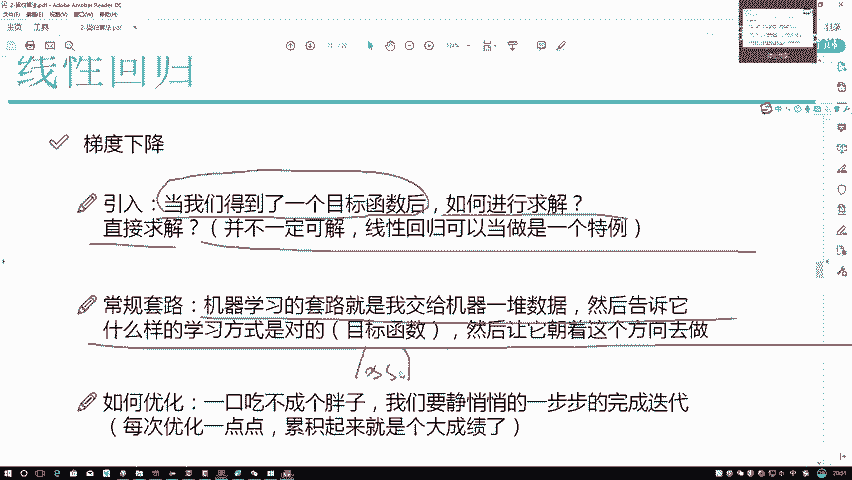
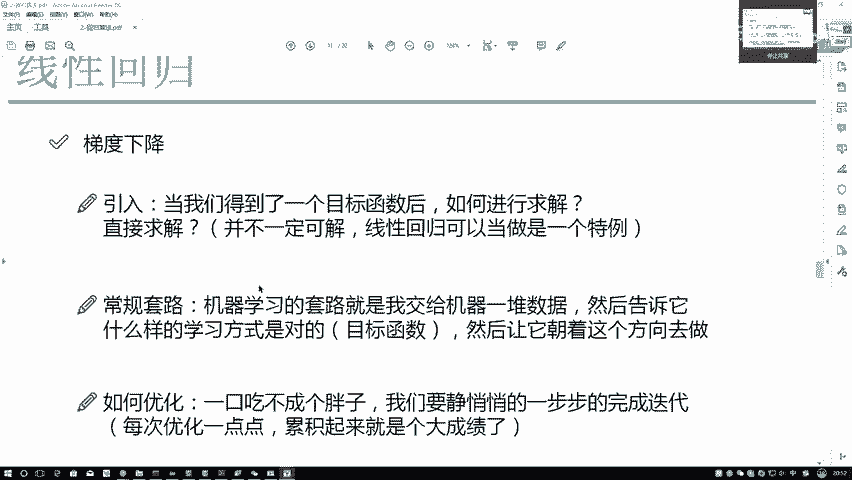
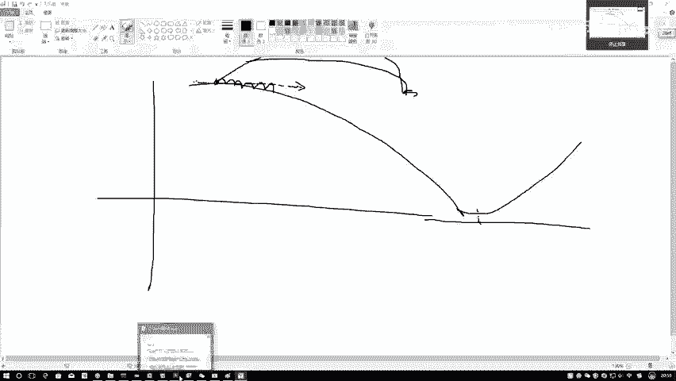
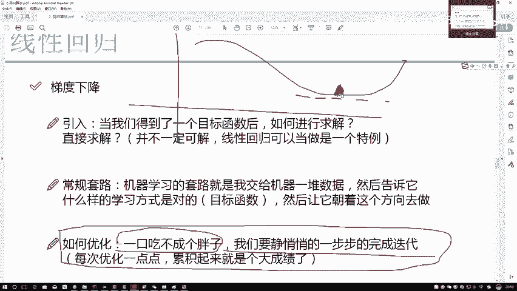

# Python金融分析与量化交易实战：P54：梯度下降通俗解释

在本节课中，我们将要学习机器学习中一个核心的优化算法——梯度下降。我们将通过一个通俗易懂的“下山”比喻，来理解这个算法是如何工作的，以及为什么它在机器学习中如此重要。

## 概述：什么是优化算法

当我们得到一个目标函数（或损失函数）后，我们的目标就是找到使这个函数值最小（或最大）的参数。这个过程就叫做优化。在机器学习中，我们通常希望最小化损失函数。

上一节我们介绍了损失函数的概念，本节中我们来看看如何通过梯度下降算法来找到损失函数的最小值。

## 梯度下降的直观理解

梯度下降是一种迭代优化算法。它的核心思想是：我们无法直接一步到位找到最优解，但可以一步步地向最优解靠近。

虽然在线性回归问题中，我们可以通过数学公式直接计算出精确解，但这只是一个特例。在绝大多数机器学习问题中，我们无法直接求解，因此必须依赖像梯度下降这样的迭代方法。

以下是机器学习的常规优化套路：
1.  给模型一组初始参数（通常是随机值）。
2.  计算当前参数下的损失函数值。
3.  找到能使损失函数值**减少**最快的方向。
4.  沿着这个方向前进一小步，更新参数。
5.  重复步骤2-4，直到损失函数值不再显著下降。

## “下山”比喻

我们可以把寻找损失函数最小值的过程，想象成在一个复杂地形中寻找最低点（山谷）的过程。

*   **山**：代表我们的损失函数。山的高度代表损失值，我们的目标就是找到最低的谷底。
*   **当前位置**：代表模型当前的参数值。一开始，我们随机初始化参数，相当于被随机放在了山上的某个位置。
*   **最低点**：代表损失函数的最优解，即我们想要找到的参数组合。

一开始，我们随机站在山上的某个位置，这个位置几乎不可能是最低点。那么，我们该如何下山呢？

## 如何选择下山方向

从当前位置出发，下山的路有很多条。我们不仅希望下山，还希望**尽快**下山，以节省计算时间。

对于当前位置来说，**沿着山坡最陡的方向下降是最快的**。在数学上，这个“最陡的方向”就是函数在该点的**梯度**（Gradient）。

梯度指向的是函数值**增长最快**的方向。由于我们的目标是**最小化**损失函数（即下山），因此我们应该沿着梯度的**反方向**前进。这就是“梯度下降”名称的由来。

用公式表示参数更新过程为：
`新参数 = 旧参数 - 学习率 * 梯度`

其中，**学习率**（Learning Rate）控制了每一步迈出的“步长”。

## 迭代优化过程

理解了方向，我们还需要决定走多远。这个过程是迭代进行的：

1.  **计算梯度**：在当前位置，计算损失函数的梯度，找到最陡的下山方向（梯度的反方向）。
2.  **迈出一步**：沿着这个方向，以一个较小的“步长”（学习率）移动一小段距离，到达一个新的位置。
3.  **重新评估**：在新的位置上，由于地形（函数形状）可能已经改变，我们需要**重新计算**当前位置的梯度。
4.  **重复循环**：不断重复“计算梯度 -> 沿反方向移动 -> 重新计算”这个过程。

以下是这个过程的几个关键点：
*   **为什么步长要小？** 如果步长太大，一步跨得太远，可能会从山的这边直接“飞”到山的那边，甚至错过最低点，导致算法不稳定或无法收敛。小步前进虽然慢，但更稳妥。
*   **何时停止？** 当算法经过多次迭代，参数更新变得非常小，损失函数值在一个很小的范围内波动，不再显著下降时，我们就认为算法已经“收敛”，找到了一个近似的最优解（可能是局部最优）。

## 总结

本节课中我们一起学习了梯度下降算法的核心思想。我们通过“下山”的比喻，理解了它作为一个迭代优化算法是如何工作的：通过不断计算当前位置的梯度（最陡上升方向），并沿着其反方向以一个小步长更新参数，从而逐步逼近损失函数的最小值。记住公式 **`新参数 = 旧参数 - 学习率 * 梯度`**，这是实现梯度下降的代码核心。在接下来的学习中，我们将看到如何将这个理论应用于具体的机器学习模型。