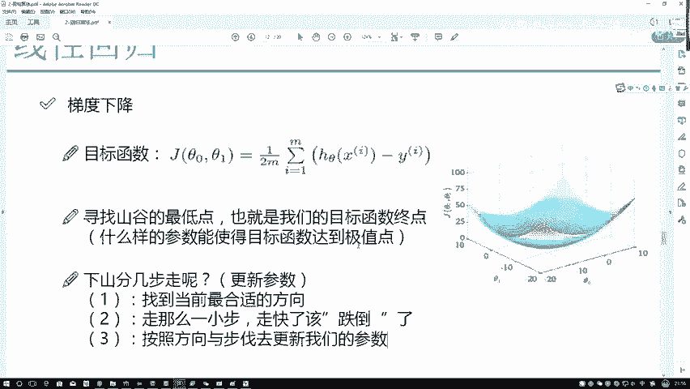
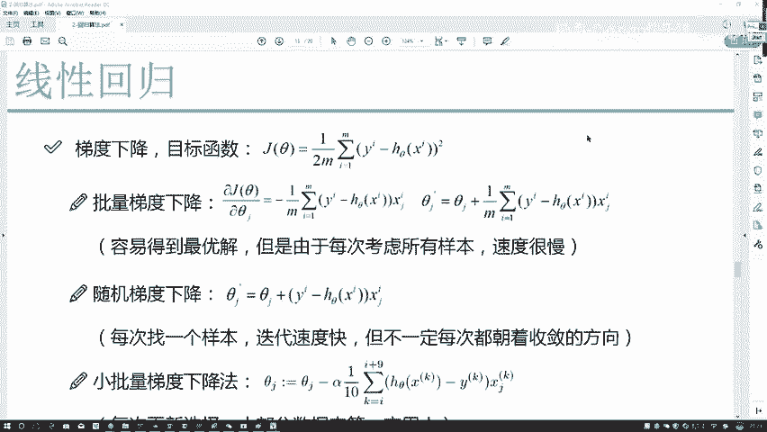

# Python金融分析与量化交易实战：P55：参数更新方法

在本节课中，我们将要学习梯度下降算法中一个核心且容易被误解的概念：**参数更新**。我们将深入探讨如何同时优化多个参数，并详细拆解其背后的数学原理和计算步骤。

上一节我们介绍了梯度下降的基本思想，即沿着损失函数的梯度反方向“下山”以寻找最小值。本节中我们来看看，当我们的模型有多个参数（例如线性回归中的截距和斜率）时，这个“下山”过程具体是如何进行的。

## 参数是分别优化还是一起优化？

首先需要明确一个关键问题：对于模型中的多个参数（例如线性回归中的 `θ₀` 和 `θ₁`），我们是分别对它们进行优化，还是将它们作为一个整体一起优化？

答案是：**分别优化**。

这可能会让人感到困惑。既然 `θ₀` 和 `θ₁` 共同影响模型的最终输出，为什么不是一起优化呢？原因在于数据样本的独立性。在模型中，`θ₀` 对应的是常数项 `x₀`（通常为1），`θ₁` 对应的是特征 `x₁`。由于不同的特征 `x₀` 和 `x₁` 在样本间是相互独立的，因此它们对应的参数 `θ₀` 和 `θ₁` 在优化过程中也互不影响。

我们可以将优化过程想象成在一个三维空间中寻找山谷的最低点。`θ₀` 和 `θ₁` 分别代表两个坐标轴。我们前进时，需要为 `θ₀` 找到一个合适的下降方向，同时也为 `θ₁` 找到另一个合适的下降方向。这两个参数沿着各自的方向独立前进，最终共同抵达使整体损失函数最小的位置。

具体来说，优化过程是：
1.  对损失函数 `J` 关于 `θ₀` 求偏导，得到 `θ₀` 的更新方向。
2.  对损失函数 `J` 关于 `θ₁` 求偏导，得到 `θ₁` 的更新方向。
3.  两个参数根据各自的方向独立更新。

## 📈 梯度下降的核心步骤

寻找山谷最低点（即最小化损失函数）的过程可以概括为以下三个核心步骤，并且这是一个不断迭代的循环过程：

1.  **计算梯度（求偏导）**：计算损失函数关于每个参数的偏导数，以确定每个参数的“下山”方向。
2.  **沿反方向移动一小步**：沿着梯度（偏导数）的反方向更新参数。**“一小步”至关重要**，步长过大可能导致“跌倒”，即算法不收敛或收敛效果很差。
3.  **更新参数**：用新的参数值替换旧的参数值，完成一次迭代。然后回到步骤1，用新的参数重新计算，开始下一次迭代。

## 🔢 数学描述与公式推导

现在，我们来看看如何在数学上精确描述这个“下山”任务。首先，我们定义用于评估模型好坏的损失函数。

对于一个样本 `i`，其损失函数（平方误差）为：
`loss_i = 1/2 * (y_i - h_θ(x_i))^2`

其中 `h_θ(x_i)` 是模型的预测值。为了评估模型在整个数据集上的表现，我们使用所有样本损失的平均值，即均方误差（MSE）作为损失函数 `J(θ)`：

`J(θ) = 1/(2m) * Σ_{i=1}^{m} (y_i - h_θ(x_i))^2`

这里：
*   `m` 是样本总数。
*   乘以 `1/2` 是为了后续求导时消去系数 `2`，简化计算。
*   使用平方项是为了放大预测值与真实值之间的较大误差，让模型更关注这些错误。

假设我们的模型是线性模型 `h_θ(x) = θ₀ + θ₁x₁ + θ₂x₂ + ... + θⱼxⱼ`。现在，我们要对其中一个参数 `θⱼ` 求偏导以更新它。

以下是求偏导的过程：

`∂J(θ)/∂θⱼ = ∂/∂θⱼ [ 1/(2m) * Σ_{i=1}^{m} (y_i - (θ₀ + θ₁x₁ + ... + θⱼxⱼ + ...))^2 ]`

由于是对 `θⱼ` 求偏导，求和符号内其他与 `θⱼ` 无关的项（如 `θ₀`, `θ₁x₁` 等）都视为常数，导数为0。只有包含 `θⱼxⱼ` 的项有贡献。

根据链式法则和平方项的求导规则 `∂(x^2)/∂x = 2x`，我们可以得到：

`∂J(θ)/∂θⱼ = 1/(2m) * Σ_{i=1}^{m} [ 2 * (y_i - h_θ(x_i)) * ∂(y_i - h_θ(x_i))/∂θⱼ ]`

其中，`∂(y_i - h_θ(x_i))/∂θⱼ = -x_{ij}`（因为 `h_θ(x_i)` 对 `θⱼ` 的偏导就是 `x_{ij}`，且前面有负号）。

代入并化简：

`∂J(θ)/∂θⱼ = 1/m * Σ_{i=1}^{m} [ (h_θ(x_i) - y_i) * x_{ij} ]`

这个结果 `∂J(θ)/∂θⱼ` 就是参数 `θⱼ` 的**梯度**。梯度方向是函数值增加最快的方向。为了最小化损失函数，我们需要沿着梯度的**反方向**移动。

因此，参数 `θⱼ` 的更新公式为：

`θⱼ := θⱼ - α * ∂J(θ)/∂θⱼ`

将梯度表达式代入：

`θⱼ := θⱼ - α * [ 1/m * Σ_{i=1}^{m} ( (h_θ(x_i) - y_i) * x_{ij} ) ]`

这里：
*   `:=` 表示赋值（更新）。
*   `α` 是**学习率**，即我们之前强调的“一小步”的步长。
*   公式中的负号 `-` 代表沿着梯度反方向（下降方向）移动。
*   `x_{ij}` 表示第 `i` 个样本的第 `j` 个特征值。

这个公式就是梯度下降算法中**参数更新的核心**。对于每一个参数 `θⱼ`，我们都按照这个规则独立地进行更新。

---

本节课中我们一起学习了梯度下降算法的参数更新机制。我们明确了多个参数需要**分别独立优化**，并详细推导了参数更新的核心公式。理解这个公式的每一个组成部分——学习率 `α`、梯度计算以及更新方向——对于后续实现和调试机器学习模型至关重要。记住，参数更新是一个迭代过程，通过不断重复“计算梯度-更新参数”的步骤，模型参数会逐渐逼近最优解。