# Python金融分析与量化交易实战：P56：优化参数设置P58 - 梯度下降算法详解 🎯

在本节课中，我们将要学习机器学习中一个核心的优化算法——梯度下降。我们将从线性回归的求解问题出发，探讨为什么需要优化算法，并详细介绍三种梯度下降变体：批量梯度下降、随机梯度下降和小批量梯度下降。同时，我们会解释学习率这一关键参数的作用。

## 批量梯度下降的问题

上一节我们介绍了线性回归的求解思路。本节中我们来看看直接求解可能遇到的问题，并引出梯度下降算法。

如果样本数量M非常大，例如M等于100万，那么每次更新参数都需要计算100万次。更新一次参数需要计算100万次，得到一次更新结果。再次更新，又需要计算100万次。这个过程会非常缓慢。

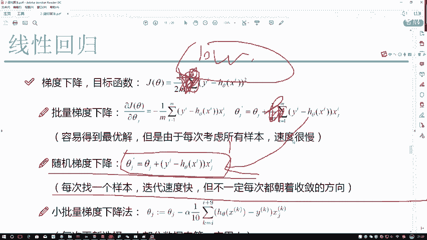

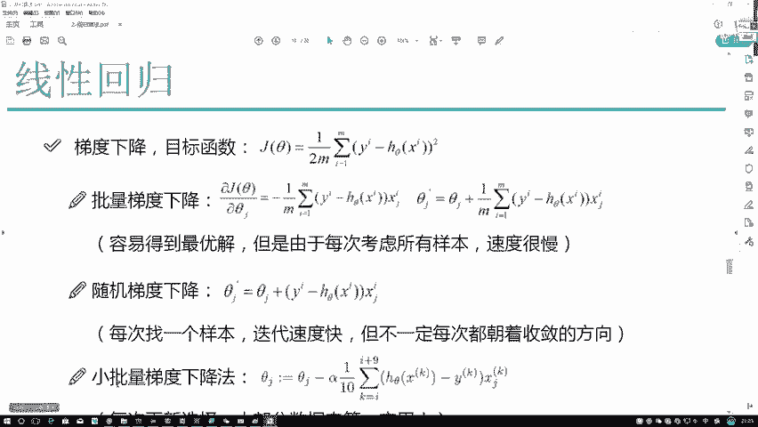

所以，我们把这个方法叫做**批量梯度下降**。它的优点是：求了所有样本平均的最优方向，很容易得到最优解。但是它的缺点是：一旦样本数量很多，计算速度会非常慢。

## 随机梯度下降

既然使用所有样本计算比较慢，那么可以考虑每次只使用一个样本。

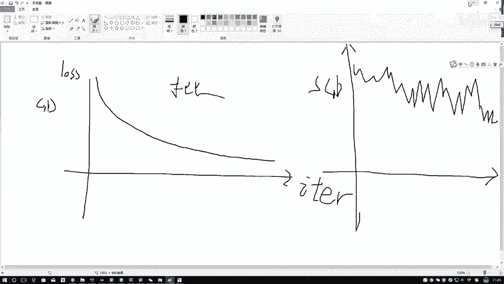

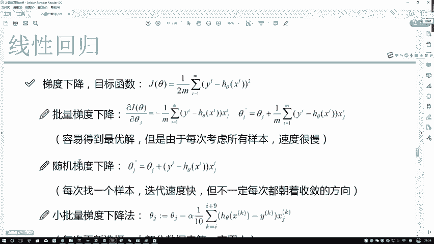

我们可以将求平均的步骤去掉，每次随机找一个样本来计算梯度并更新参数。这被称为**随机梯度下降**。

**公式**：
`θ_new = θ_old - α * ∇J(θ; x_i, y_i)`
其中 `(x_i, y_i)` 是随机选取的单个样本。

之前可能需要用10万个样本跑一次，现在一个样本跑一次，速度提升了约10万倍。但是，随机梯度下降问题也很大：每次只找一个样本，这个样本可能不合适，可能存在离群点或噪音点。数据每次朝着一个方向，但不一定是正确的收敛方向。

如果用图像表示损失函数随迭代次数的变化：
*   **批量梯度下降**的曲线可能比较平滑地下降。
*   **随机梯度下降**的曲线则可能波动很大，呈现浮动、震荡的感觉。

因为每一次优化时，梯度方向不一定都朝着收敛的方向，不太可控，所以结果可能不是特别好。

## 小批量梯度下降

批量梯度下降和随机梯度下降各有缺点。本节我们来看看如何综合两者的优点。

解决方案是**小批量梯度下降**。我们既不使用一个样本，也不使用全部样本，而是每次取一部分样本来计算。

**公式**：
`θ_new = θ_old - α * (1/B) * Σ_{i=1 to B} ∇J(θ; x_i, y_i)`
其中 `B` 是小批量中的样本数量。

以下是关于小批量样本数量 `B`（常称为 `batch_size`）的说明：
*   程序员通常喜欢使用2的幂次，例如64、128、256。
*   `batch_size` 设置得大，意味着希望结果更精确，因为样本数量多，平均更精确，但计算速度慢，占用内存/显存多。
*   `batch_size` 设置得小，计算速度快，但不够精确。
*   需要在时间和性能之间权衡。在设备允许的前提下，`batch_size` 通常越大越好，64、128、256是较常见的值。

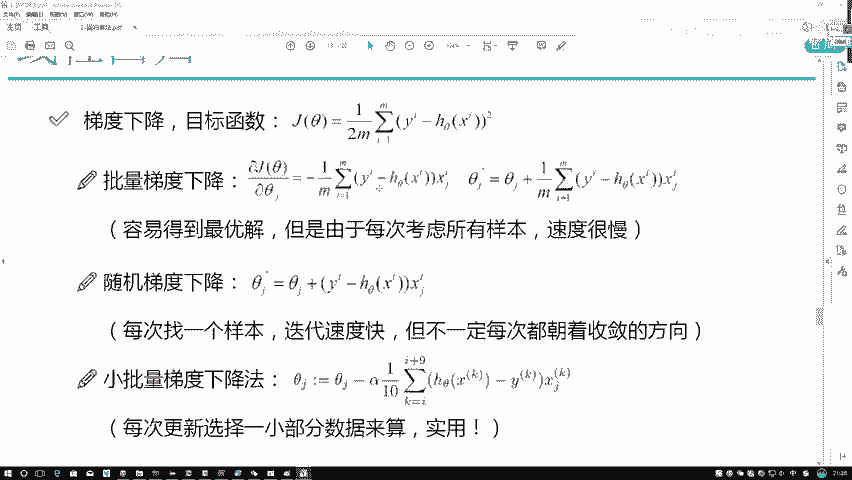

实际应用中，我们最常使用的就是这种小批量梯度下降。

## 学习率

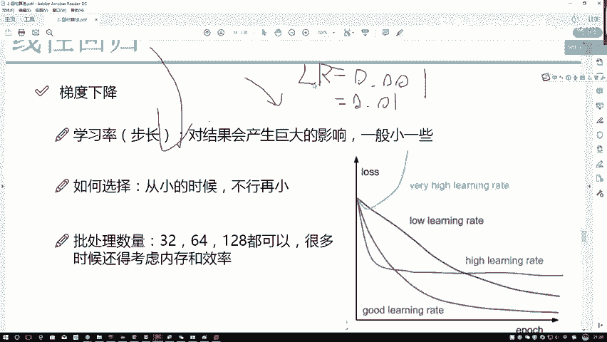

在梯度下降中，还有一个关键参数叫做**学习率**，它决定了参数更新的步长。

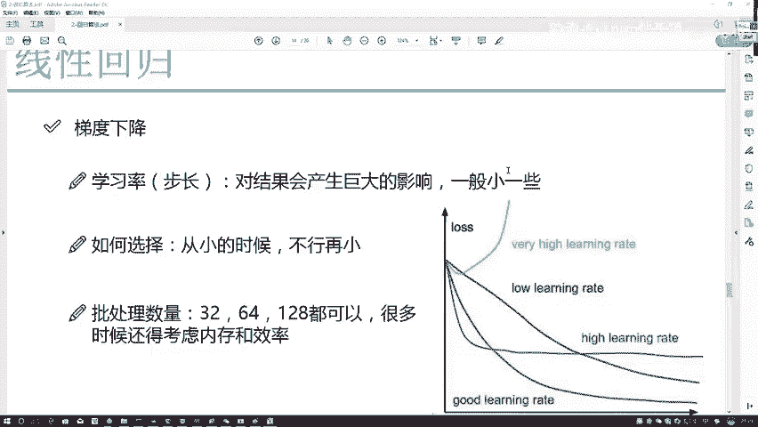

在更新公式 `θ_new = θ_old - α * ∇J(θ)` 中，`α` 就是学习率。
*   `∇J(θ)` 算出来的是当前更新的**方向**。
*   学习率 `α` 决定了沿着这个方向走**多大距离**。

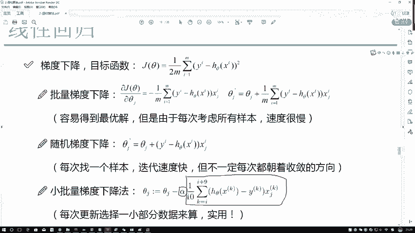

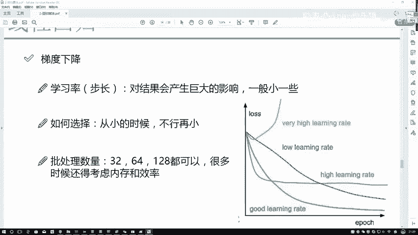

以下是关于学习率的要点：
*   学习率通常设置得比较小，常见值如0.01或0.001。
*   很少将学习率设置得比较大。
*   学习率越大，一次更新的幅度越大；学习率越小，一次更新的幅度越小。
*   调参时，可以先将学习率设为0.01，如果模型学习效果不好，再尝试调小。

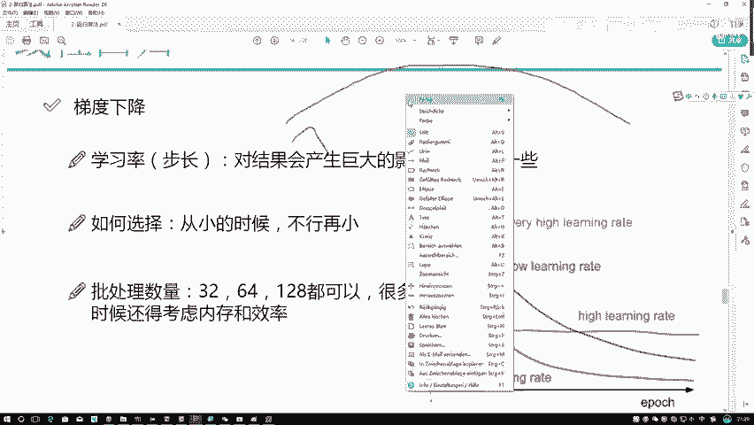

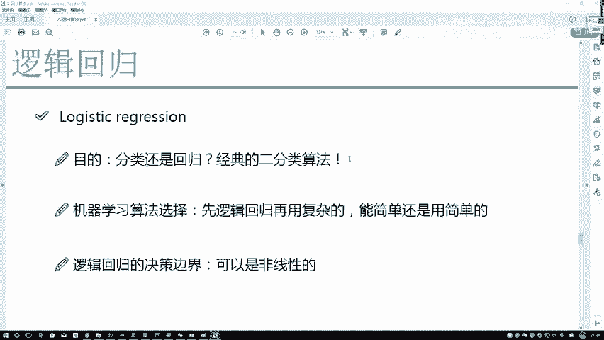

## 总结

本节课中我们一起学习了梯度下降算法。我们从线性回归的优化求解需求，过渡到了梯度下降这一通用优化方法。我们详细解释了三种梯度下降变体：
1.  **批量梯度下降**：使用全部样本，精度高但速度慢。
2.  **随机梯度下降**：使用单个样本，速度快但震荡大。
3.  **小批量梯度下降**：折中方案，使用一部分样本，是实践中最常用的方法。

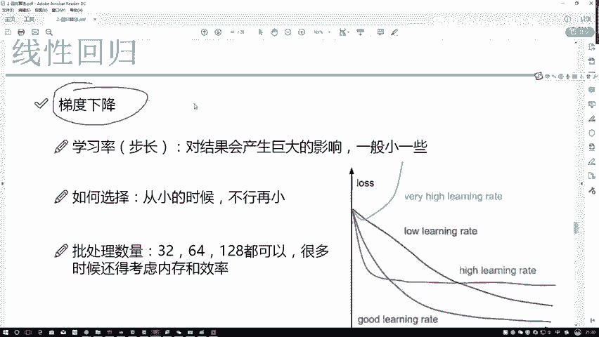

我们还学习了**学习率**这一关键超参数，它控制了参数更新的步长。需要记住的是，在机器学习中，我们通常使用优化算法（如梯度下降）来求解模型参数，而不是直接求解。梯度下降是最经典、最常用的优化算法之一。