# Python金融分析与量化交易实战：P57：回归任务概述

在本节课中，我们将学习如何构建一个回归策略，用于预测金融时间序列（如汇率）的未来走势。我们将从数据预处理开始，逐步构建特征和目标变量，并最终建立预测模型。

---

## 数据准备与预处理

上一节我们介绍了回归策略的基本概念，本节中我们来看看如何准备数据。首先，我们需要导入必要的工具包并加载数据。

```python
import pandas as pd
import numpy as np
import matplotlib.pyplot as plt
```

数据来源于一个CSV文件，我们本次选择欧元兑美元（EUR/USD）的汇率数据进行分析。

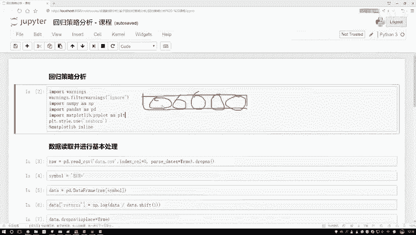

```python
data = pd.read_csv('data.csv')
```

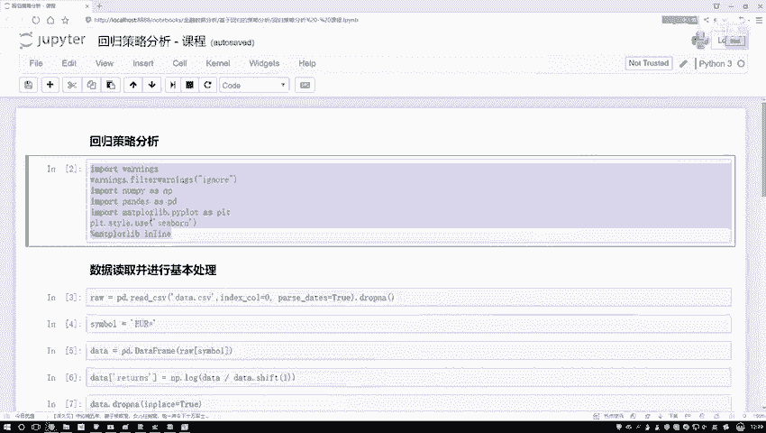

接下来，我们对数据进行预处理。为了获得平稳的回报率序列，我们计算对数回报率。同时，我们创建一个新的列来表示价格的“方向”，即上涨（+1）或下跌（-1）。

```python
# 计算对数回报率
data['returns'] = np.log(data['Close'] / data['Close'].shift(1))
# 删除缺失值
data.dropna(inplace=True)

# 创建方向标签：上涨为1，下跌为-1
data['direction'] = np.sign(data['returns']).astype(int)
```

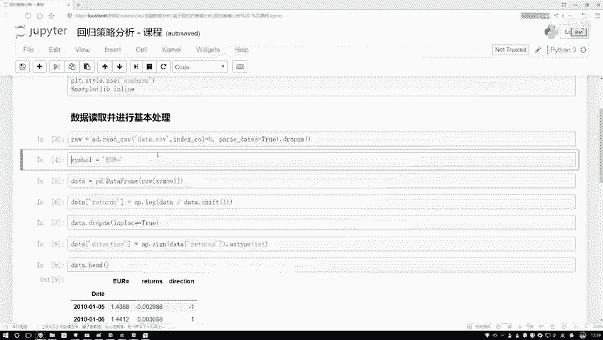

我们可以绘制回报率的直方图来观察其分布。

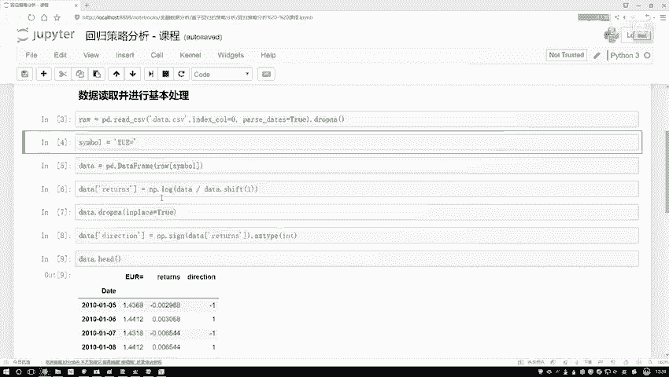

```python
data['returns'].hist(bins=50)
plt.show()
```

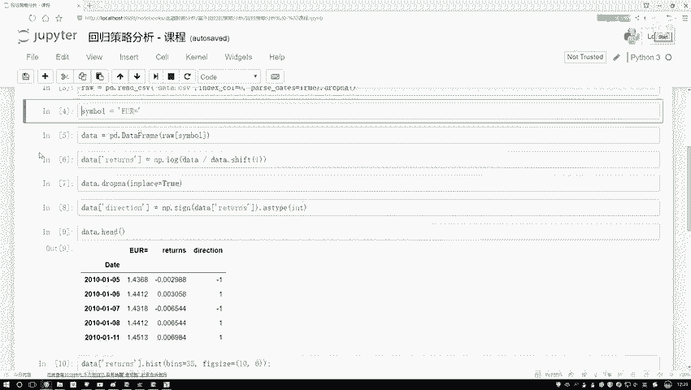

观察直方图可以发现，回报率大致以0为均值，呈近似正态分布。

---

## 构建回归任务

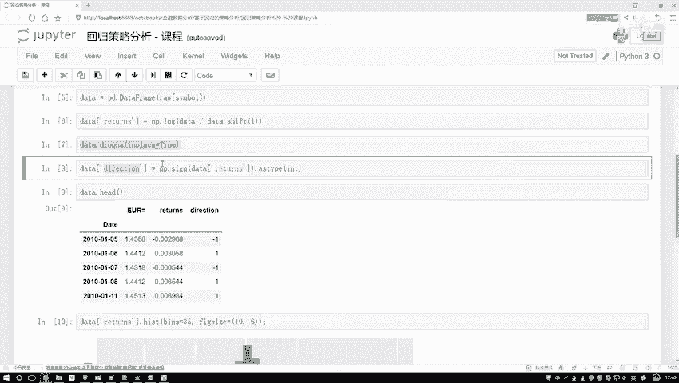

在准备好基础数据后，我们需要为机器学习模型构建特征（X）和目标变量（Y）。回归任务的核心是利用历史数据预测未来值。

我们的目标可以有两种设定方式：
1.  预测具体的回报率数值（连续值回归）。
2.  预测明日的价格方向是上涨还是下跌（分类任务，但此处我们仍用回归模型来预测其趋势强度）。

以下是构建特征和目标变量的方法：

```python
# 定义特征创建的窗口期（例如，使用过去5天的数据）
lags = 5

# 创建滞后特征：用过去几天的回报率作为预测特征
for lag in range(1, lags + 1):
    data[f'lag_{lag}'] = data['returns'].shift(lag)

# 再次删除因创建滞后特征而产生的缺失值
data.dropna(inplace=True)

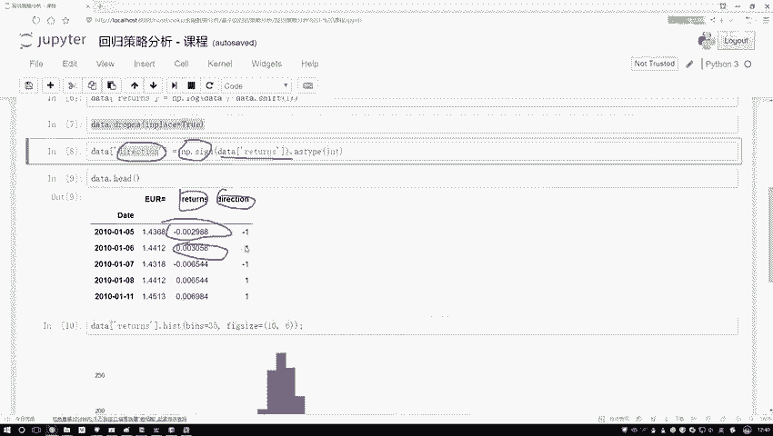

# 定义特征X和目标变量Y
# 方案一：预测具体的回报率数值
X = data[[f'lag_{i}' for i in range(1, lags+1)]]
y1 = data['returns']

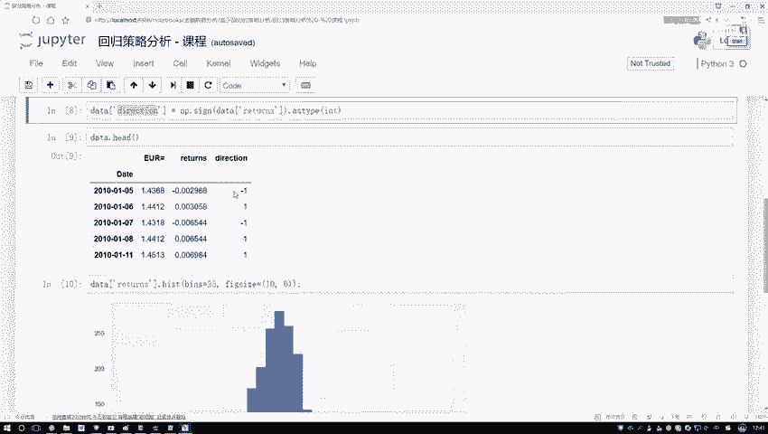

# 方案二：预测价格方向
y2 = data['direction']
```

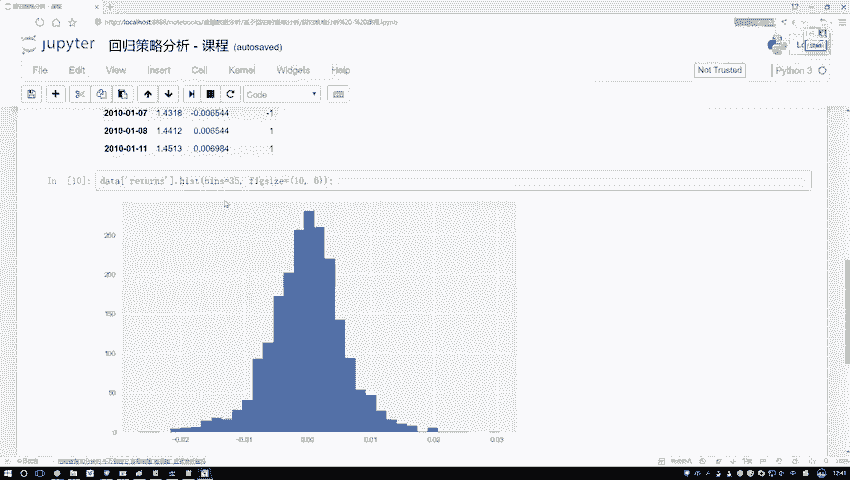

---

## 模型训练与评估

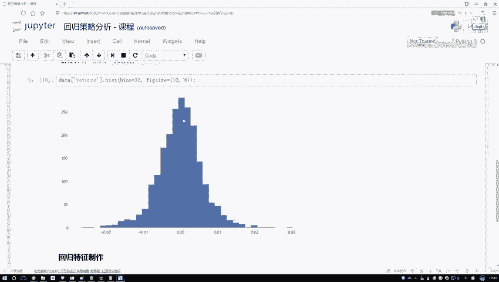

构建好数据集后，我们可以将其分割为训练集和测试集，并选择一个回归模型进行训练。这里以线性回归为例。

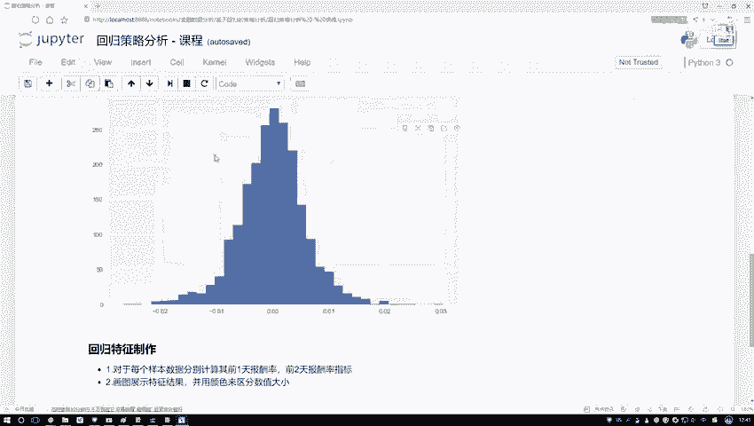

```python
from sklearn.model_selection import train_test_split
from sklearn.linear_model import LinearRegression
from sklearn.metrics import mean_squared_error, accuracy_score

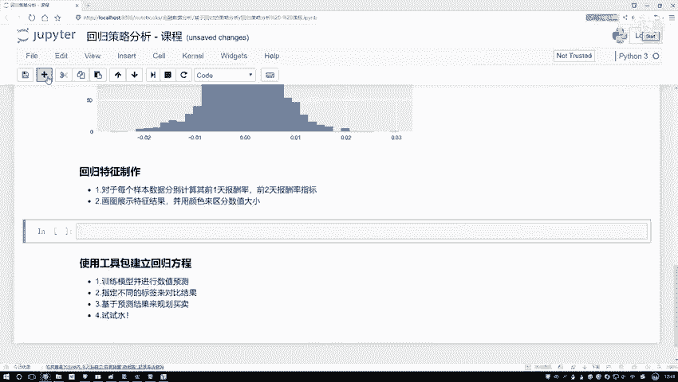

# 方案一：预测回报率数值
X_train, X_test, y1_train, y1_test = train_test_split(X, y1, test_size=0.3, shuffle=False)
model1 = LinearRegression()
model1.fit(X_train, y1_train)
y1_pred = model1.predict(X_test)
mse = mean_squared_error(y1_test, y1_pred)
print(f"预测回报率的均方误差（MSE）为：{mse}")

# 方案二：预测价格方向（将回归预测值转换为方向）
# 注意：这里使用回归模型预测连续值，然后通过符号函数转换为方向
X_train, X_test, y2_train, y2_test = train_test_split(X, y2, test_size=0.3, shuffle=False)
model2 = LinearRegression()
model2.fit(X_train, y2_train)
y2_pred_cont = model2.predict(X_test)
y2_pred = np.sign(y2_pred_cont).astype(int) # 将预测值转换为+1/-1
acc = accuracy_score(y2_test, y2_pred)
print(f"预测价格方向的准确率为：{acc}")
```

---

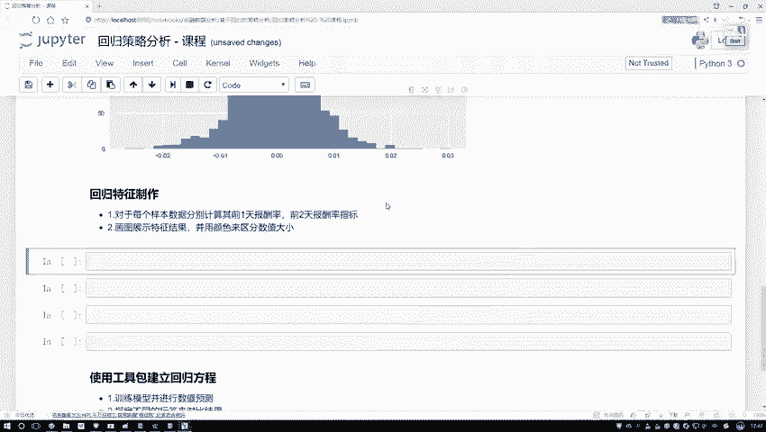

## 策略回测思路

得到预测结果后，可以基于预测值构建简单的交易策略进行回测。例如：
*   当模型预测明日回报率为正（或方向为+1）时，执行买入操作。
*   当模型预测明日回报率为负（或方向为-1）时，执行卖出或空仓操作。

通过对比策略收益与基准收益（如始终持有），可以评估回归策略的有效性。

---

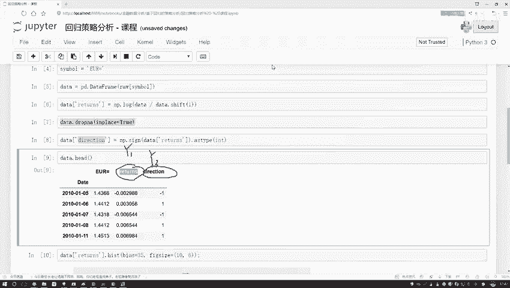

本节课中我们一起学习了如何构建一个用于金融时间序列预测的回归策略。我们从数据预处理开始，创建了滞后特征作为模型输入，并定义了两种不同的预测目标。随后，我们使用线性回归模型进行训练和初步评估，并简要介绍了基于预测结果构建交易策略的回测思路。回归分析为量化交易提供了预测未来价格走势的一种基础而强大的工具。