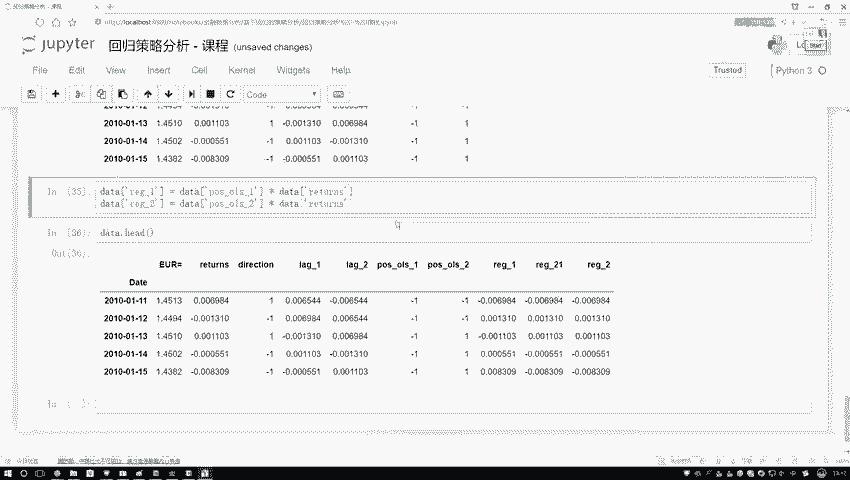
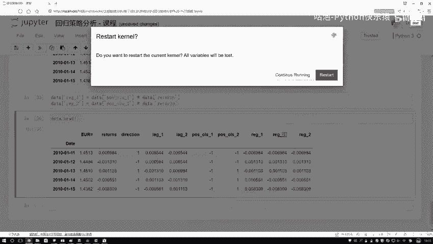
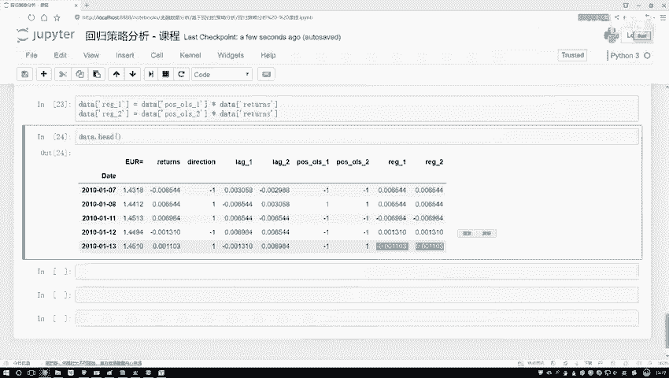

# Python金融分析与量化交易实战：P59：构建回归方程

## 概述
在本节课程中，我们将学习如何利用Python的机器学习库构建一个线性回归方程，用于预测金融时间序列数据（如股票日收益率）的走势。我们将从导入工具包开始，逐步完成模型的训练、预测，并将预测结果转化为具体的交易信号。

---

## 导入必要的工具包
首先，我们需要借助一个强大的Python机器学习库。这里我们选择`scikit-learn`，它是Python中非常常用的机器学习库，包含了你能想到的大部分常规机器学习算法。

我们将使用其中的线性回归模型。

```python
from sklearn.linear_model import LinearRegression
```

---

## 实例化与训练模型
在`scikit-learn`中，使用任何模型的第一步都是对其进行实例化。上一节我们介绍了如何导入工具包，本节中我们来看看如何创建并训练一个线性回归模型。

以下是构建和训练模型的具体步骤：

1.  **实例化模型**：创建一个线性回归模型的实例。
2.  **准备数据**：定义特征变量`X`和目标变量`y`。特征变量是我们用于预测的指标，目标变量是我们希望预测的结果。
3.  **训练模型**：使用模型的`.fit()`方法，传入`X`和`y`来训练模型。

```python
# 1. 实例化线性回归模型
model = LinearRegression()

# 2. 准备数据（假设`data`是我们的DataFrame，`feature_columns`是特征列名列表，`target_column`是目标列名）
X = data[feature_columns]
y = data[target_column]

# 3. 训练模型
model.fit(X, y)
```

为了进行对比实验，我们可以尝试使用不同的目标变量`y`。例如，一个实验使用实际的日收益率`returns`作为目标，另一个实验使用涨跌方向`direction`（如1代表上涨，-1代表下跌）作为目标。通过对比实验结果，我们可以判断哪种预测目标对于我们的策略更有效。

---

## 进行预测并解释结果
模型训练完成后，我们就可以用它来对数据进行预测了。这一步的目的是利用模型，根据我们提供的特征数据，得到对应的预测值。

我们使用模型的`.predict()`方法进行预测。

```python
# 使用训练好的模型进行预测
predictions = model.predict(X)
```

预测完成后，我们将结果添加回原始数据中，以便后续分析。

```python
# 将预测结果添加到DataFrame中
data[‘predicted_returns’] = predictions
```

查看预测结果，我们可能会发现模型无法100%准确地预测真实走势，这是正常现象，尤其是我们使用的是相对简单的线性回归模型。预测值的具体数值大小可能不是我们最关心的，我们更关注它的正负号，因为这直接对应“买入”或“卖出”的信号。

---

## 将预测值转化为交易信号
既然我们更关心涨跌方向，那么接下来就需要将连续的预测值转化为离散的交易信号。上一节我们得到了模型的预测值，本节中我们来看看如何将这些数值转化为具体的操作指令。

以下是处理预测结果的步骤：

1.  **判断正负**：我们根据预测值是否大于0，将其转化为1（代表看涨/买入）或-1（代表看跌/卖出）。
2.  **生成信号列**：在数据中创建新的列来存储这些交易信号。

```python
# 将预测的收益率转化为交易信号：大于0为1（买入），小于等于0为-1（卖出）
data[‘trading_signal’] = data[‘predicted_returns’].apply(lambda x: 1 if x > 0 else -1)
```

执行完这一步后，数据中就会新增一列`trading_signal`，它清晰地指明了每一天根据模型预测所应采取的操作。

---

## 基于策略计算模拟收益
最后，我们需要评估这个基于回归方程的交易策略效果如何。我们通过计算模拟收益来实现这一点，即假设我们完全按照模型产生的信号进行交易，最终的收益情况会怎样。

具体方法是：用交易信号乘以当日的实际收益率。如果信号是1（买入），则获得当日正收益；如果信号是-1（卖出），则获得当日负收益（或理解为做空收益）。

```python
# 计算策略收益：交易信号 * 当日实际收益率
data[‘strategy_returns’] = data[‘trading_signal’] * data[‘actual_returns’]
```





我们可以对使用不同目标变量（如`returns` vs `direction`）训练出的两个模型，分别计算它们的`strategy_returns`。通过对比这两列策略收益的累计表现，或与其他基准（如单纯持有）进行比较，就能判断哪个回归方程构建的策略更优。

---



## 总结
本节课中我们一起学习了构建回归方程进行量化交易策略开发的完整流程。我们从导入`scikit-learn`库开始，实例化并训练了线性回归模型，利用模型进行预测，接着将预测值转化为明确的买卖信号，最后基于这些信号计算了模拟交易收益。这个过程展示了如何将机器学习模型应用于金融预测，并将预测结果落地为一个可评估的交易策略。记住，在实际应用中，需要多次尝试不同的特征和目标变量，并通过回测来验证和优化策略效果。