# Python金融分析与量化交易实战：P60：回归分析结果评估与可视化

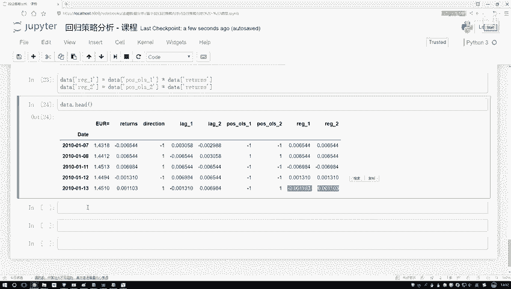

在本节课中，我们将学习如何评估之前构建的回归模型在量化交易策略中的实际表现。我们将通过计算策略的累计收益、对比预测准确率以及可视化策略走势图，来直观地判断不同策略的优劣。

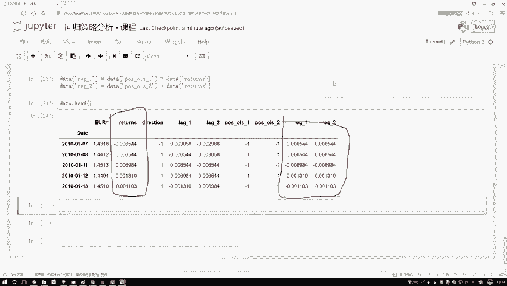

上一节我们介绍了如何使用回归模型预测股票涨跌，本节中我们来看看如何将这些预测结果转化为具体的交易策略，并进行全面的效果评估。

## 累计收益计算

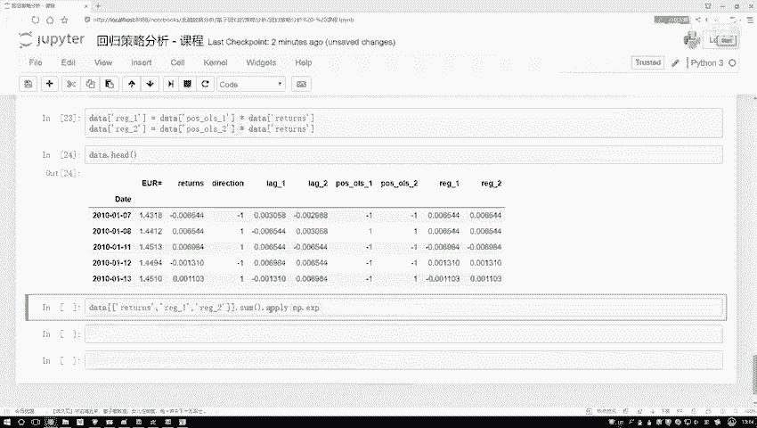

首先，我们需要计算不同策略的最终累计收益。我们已经有了每日的收益率数据（经过对数处理），以及基于两个不同回归方程得到的预测信号。为了得到从起始日到结束日的总收益，我们需要对每日的对数收益率进行累加，然后通过指数函数还原为实际收益率。

以下是计算累计收益的步骤：

1.  **提取关键指标**：从数据中提取原始收益率序列和两个回归模型的预测收益率序列。
2.  **累加操作**：由于对数收益率具有可加性，使用 `np.cumsum()` 函数对序列进行累加，得到累计对数收益。
3.  **结果还原**：通过 `np.exp()` 函数将累计对数收益还原为实际资产倍数（例如，1.3 表示1元变成了1.3元）。

核心操作代码如下：
```python
# 假设 returns 是原始对数收益率序列，pred_1 和 pred_2 是两个模型的预测对数收益率序列
cumulative_return_original = np.exp(np.cumsum(returns))
cumulative_return_strategy1 = np.exp(np.cumsum(pred_1))
cumulative_return_strategy2 = np.exp(np.cumsum(pred_2))

# 查看最终收益（序列的最后一个值）
final_value_original = cumulative_return_original[-1]
final_value_strategy1 = cumulative_return_strategy1[-1]
final_value_strategy2 = cumulative_return_strategy2[-1]
```
执行上述代码后，我们得到了三个最终值：
*   **原始走势**：最终值小于1（例如0.8），表示初始的1元钱亏损至0.8元。
*   **策略一**：最终值约为0.94，虽然也亏损，但比什么都不做（原始走势）亏损得少。
*   **策略二**：最终值大于1（例如1.3），表示初始的1元钱盈利至1.3元。该策略通过回归模型预测买卖点，取得了正向收益。

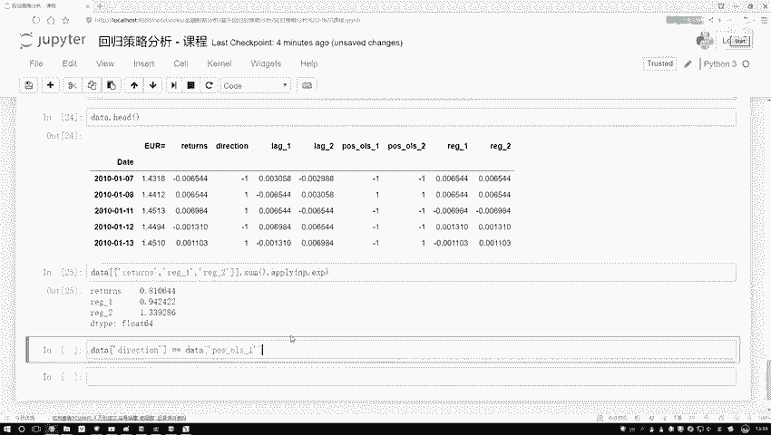

## 预测准确率分析

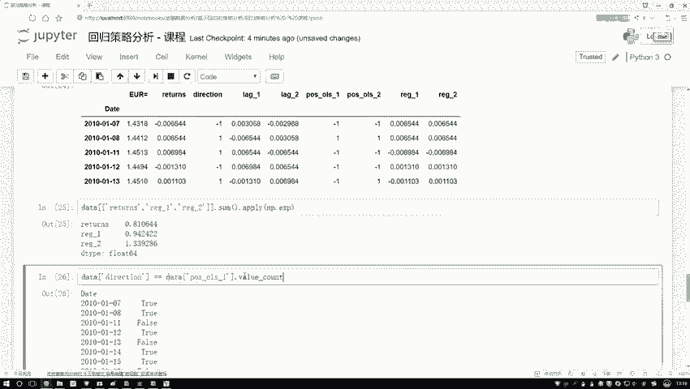

为了更深入地理解策略表现差异的原因，我们可以对比模型的预测方向与实际涨跌方向的一致性。

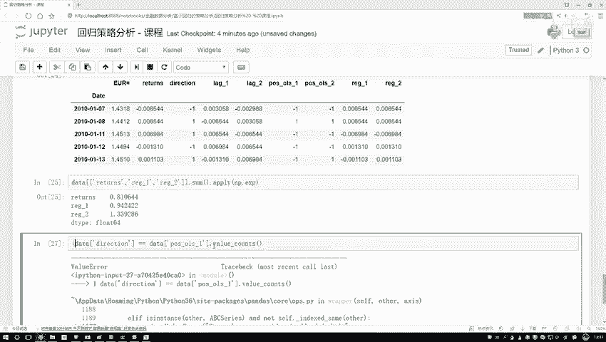

以下是计算预测准确率的步骤：

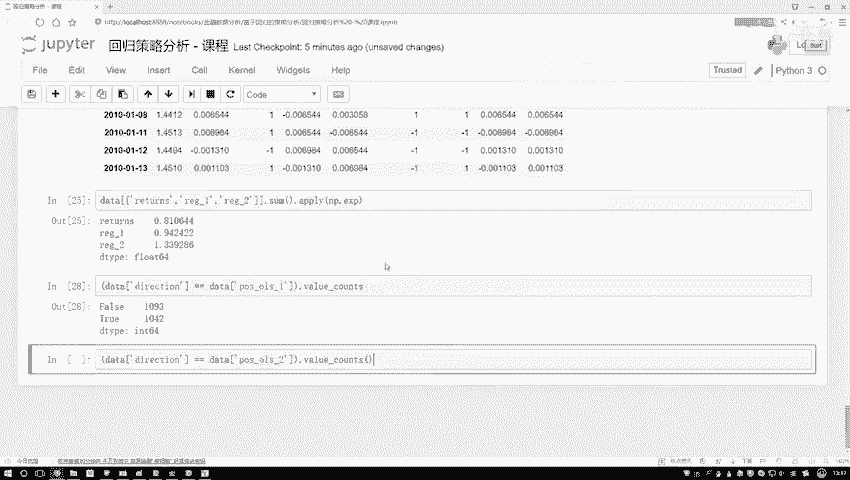

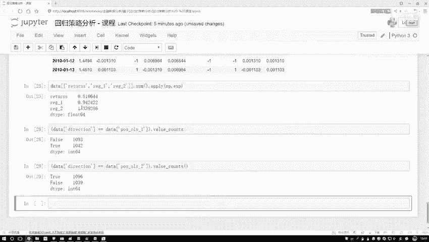

1.  **获取实际方向**：数据中的 `direction` 列代表实际的涨跌情况（例如，True代表涨）。
2.  **获取预测方向**：根据回归模型的预测值（`pred_1`， `pred_2`）判断预测的涨跌方向（大于0为涨，反之亦然）。
3.  **对比结果**：将预测方向与实际方向进行比较，生成一个布尔序列（True表示预测正确）。
4.  **统计计数**：使用 `value_counts()` 函数统计预测正确和错误的次数。

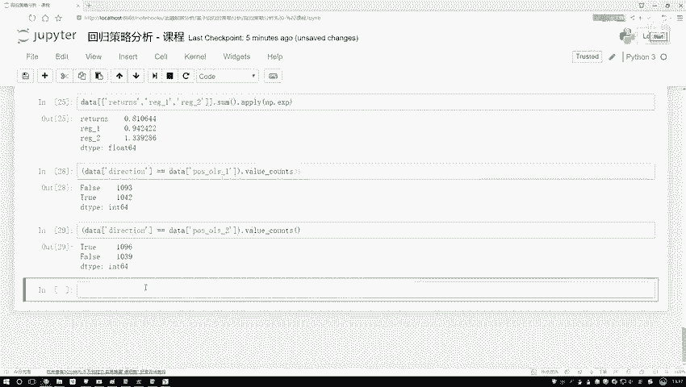

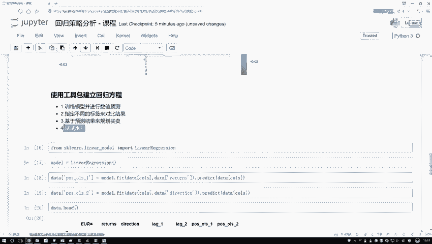

核心操作代码如下：
```python
# 计算策略一的预测准确情况
correct_predictions_1 = (pred_1_direction == actual_direction)
accuracy_counts_1 = correct_predictions_1.value_counts()
# 输出类似：False: 1093, True: 1042

# 计算策略二的预测准确情况
correct_predictions_2 = (pred_2_direction == actual_direction)
accuracy_counts_2 = correct_predictions_2.value_counts()
# 输出类似：False: 1039, True: 1096
```
分析结果：
*   **策略一**：预测错误1093次，正确1042次，正确率略低于50%，导致最终亏损。
*   **策略二**：预测错误1039次，正确1096次，正确率略高于50%。正是这微弱的优势积累，使得策略二最终获得了盈利。

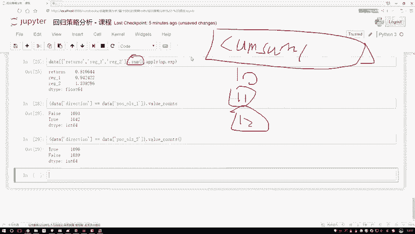

## 策略走势可视化

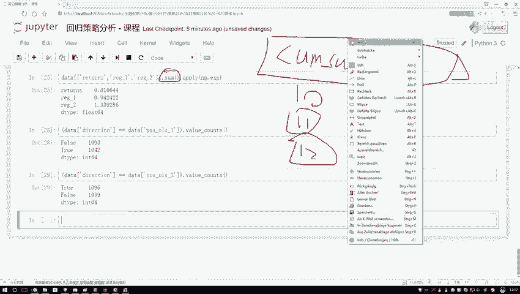

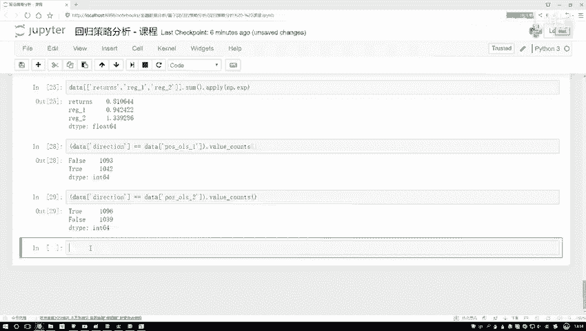

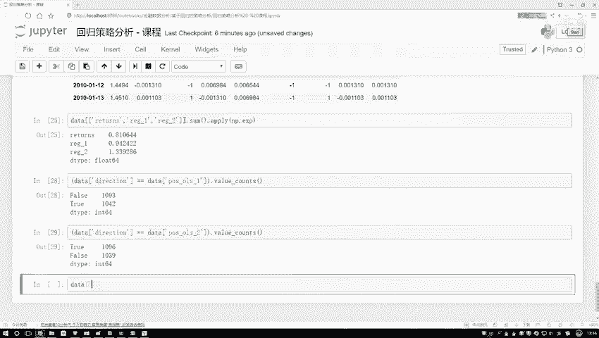

最后，我们可以将三种策略随时间变化的累计收益走势绘制出来，以便更直观地进行对比。

以下是绘制走势图的步骤：

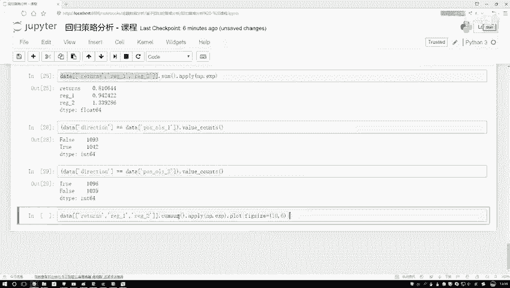

1.  **计算累计序列**：与计算最终收益类似，我们需要得到完整的、随时间变化的累计收益序列，同样使用 `np.cumsum()` 和 `np.exp()`。
2.  **绘制图表**：使用 Matplotlib 库将三条序列绘制在同一张图上。

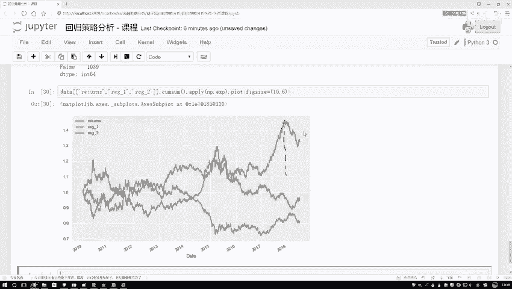

核心操作代码如下：
```python
import matplotlib.pyplot as plt

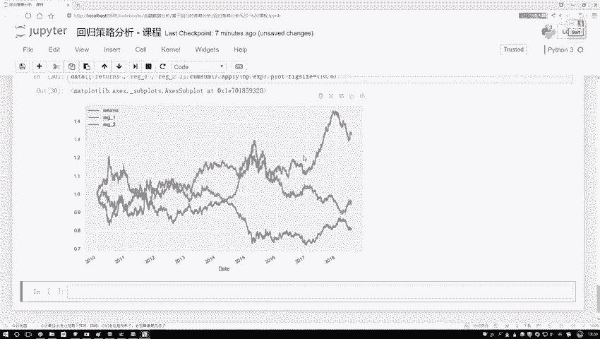

# 计算三条累计收益曲线
cum_returns = np.exp(np.cumsum(returns))
cum_strategy1 = np.exp(np.cumsum(pred_1))
cum_strategy2 = np.exp(np.cumsum(pred_2))

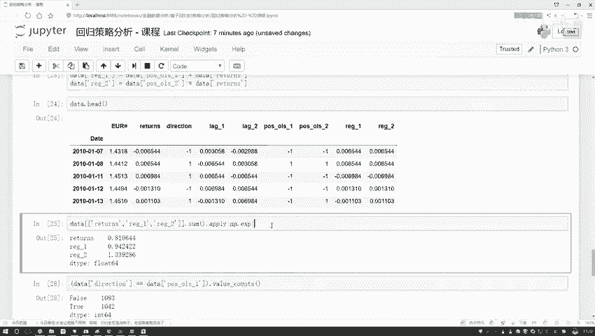

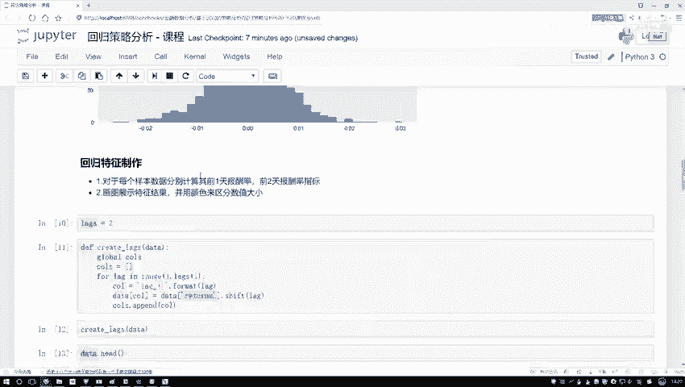

# 绘图
plt.figure(figsize=(16, 8))
plt.plot(cum_returns, label='原始走势', color='blue')
plt.plot(cum_strategy1, label='回归策略一', color='green')
plt.plot(cum_strategy2, label='回归策略二', color='red')
plt.title('不同策略累计收益走势对比')
plt.xlabel('时间')
plt.ylabel('资产倍数 (初始为1)')
plt.legend()
plt.grid(True)
plt.show()
```
从生成的图中可以清晰看到：
*   **蓝色线（原始走势）**：持续下跌，最终低于1。
*   **绿色线（策略一）**：虽然也呈下跌趋势，但波动与蓝色线不同，最终净值高于原始走势。
*   **红色线（策略二）**：大部分时间在1之上运行，期间有显著盈利阶段，最终净值高于1，成功实现了盈利。

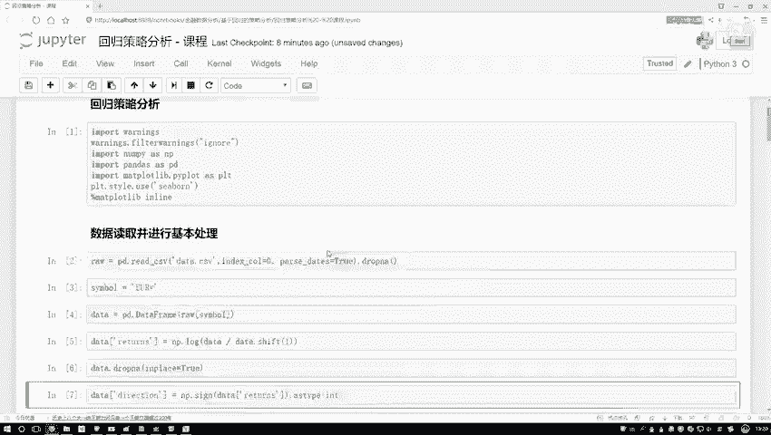

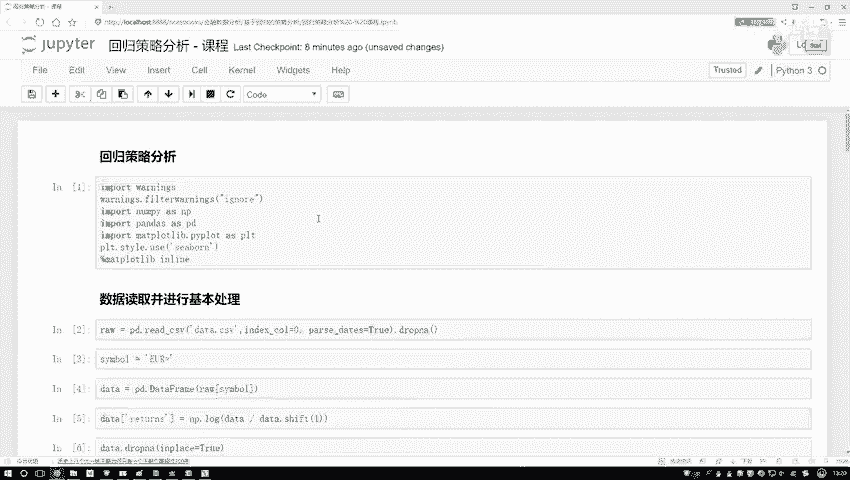

本节课中我们一起学习了如何评估回归模型在量化策略中的应用效果。我们通过计算累计收益、分析预测准确率和可视化走势图，完整地对比了“买入持有”、“回归策略一”和“回归策略二”的表现。结果表明，即使是一个简单的线性回归模型，只要其预测方向准确性略高于50%，就有可能构建出盈利的交易策略。这本质上是一个预测问题，核心在于如何利用历史数据（特征）尽可能准确地预测未来走势（标签）。