# Python金融分析与量化交易实战：P61：KMEANS算法概述

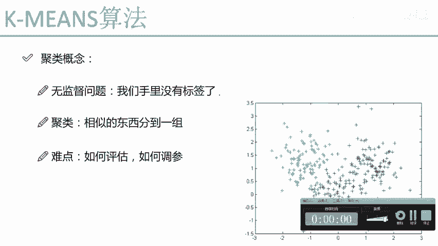

## 概述
在本节课中，我们将学习机器学习中一个重要的分支——聚类。我们将重点介绍一种经典且应用广泛的聚类算法：K-Means算法。我们将了解聚类与之前学习的监督学习有何不同，并掌握K-Means算法的核心概念、工作原理及关键步骤。

## 聚类与监督学习的区别
上一节我们介绍了监督学习，其特点是拥有带标签的数据。我们通过优化目标函数来训练模型。现在，我们的问题难度增加了，变成了无监督学习问题。

在无监督学习中，我们手中没有每个数据点所属类别的标签。聚类是无监督学习中最典型的代表。

聚类的目标与分类类似，都是将杂乱的数据分成若干组。其核心思想是将相似的数据点归为一组。例如，观察右侧的图表，原始数据并没有颜色标记。我们需要根据某种相似度度量方式，将相似的点聚集在一起。根据数据分布的不同，最终可能得到三个簇（类别），分别用绿色、红色和蓝色表示。

聚类算法从原理上看相对简单，但仍面临一些挑战。主要难点在于评估和调参。在监督学习中，我们可以通过预测值与真实标签的对比，使用交叉验证、准确率、召回率、F1值等多种指标进行评估。但在无监督学习中，由于没有真实标签，评估聚类结果的好坏变得非常困难。同样，调整参数时，我们难以比较不同参数下得到的聚类结果哪个更优，因为缺乏一个标准的“正确答案”。这是聚类算法中一个较大的难点。

接下来，我们将介绍两种经典的聚类算法。首先来看最常用、最广泛的K-Means算法。

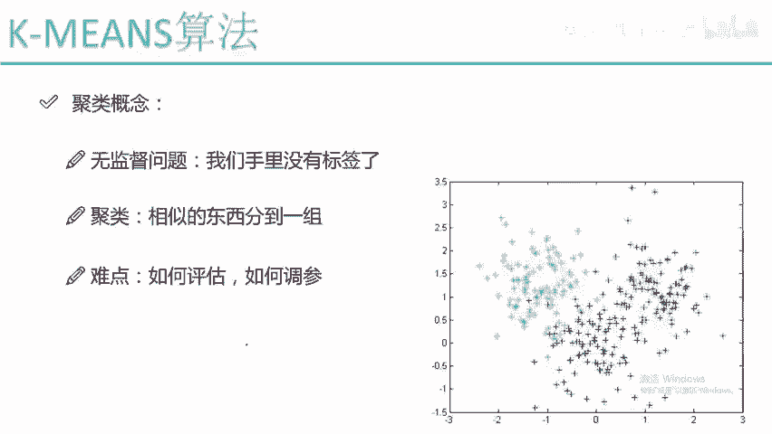

## K-Means算法核心概念
K-Means算法是聚类算法中最简单且最实用的算法之一。

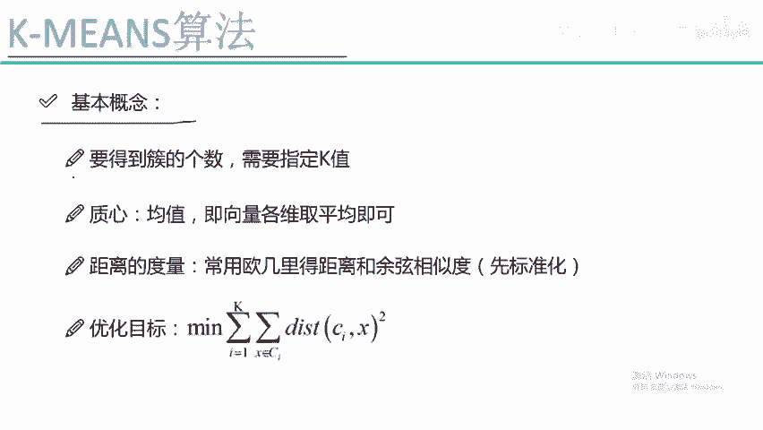

### 指定K值
K-Means算法需要我们预先指定一个关键参数：**K值**。K值代表我们希望将数据聚合成多少个簇。

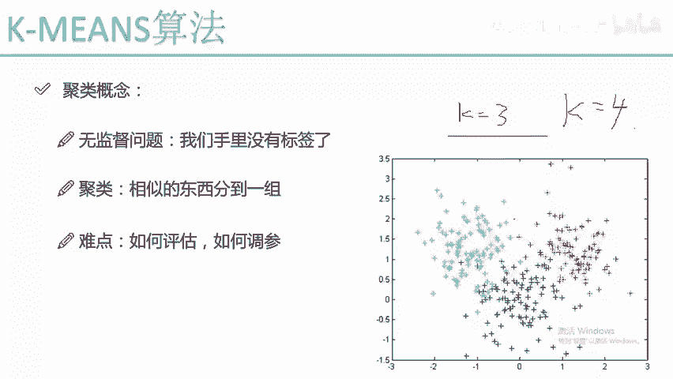

例如，如果设定K=3，算法最终会将所有数据聚成三个堆（如绿色、红色和蓝色）。如果设定K=4，则会聚成四堆，以此类推。因此，在运行算法前，我们必须明确告知算法期望的簇数量。

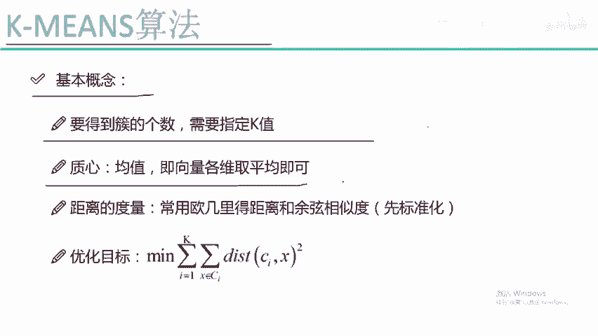

### 质心
每个簇都有一个中心点，称为**质心**。质心是通过计算该簇内所有数据点在各个维度上的平均值得到的。

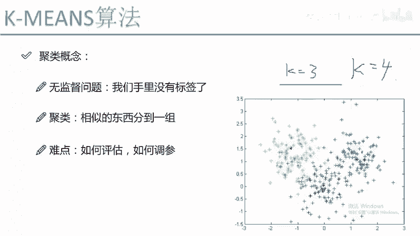

例如，在二维数据（X轴和Y轴）中，绿色簇的质心就是所有绿色点的X坐标平均值和Y坐标平均值所确定的点。红色簇和蓝色簇也有各自的质心。质心在算法的迭代过程中起着关键作用。

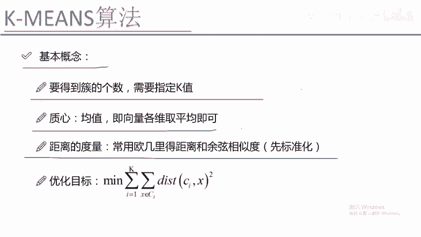

### 距离度量
聚类的核心是将相似的点分到一组。如何衡量两个点是否相似？我们通常基于**距离**来计算。

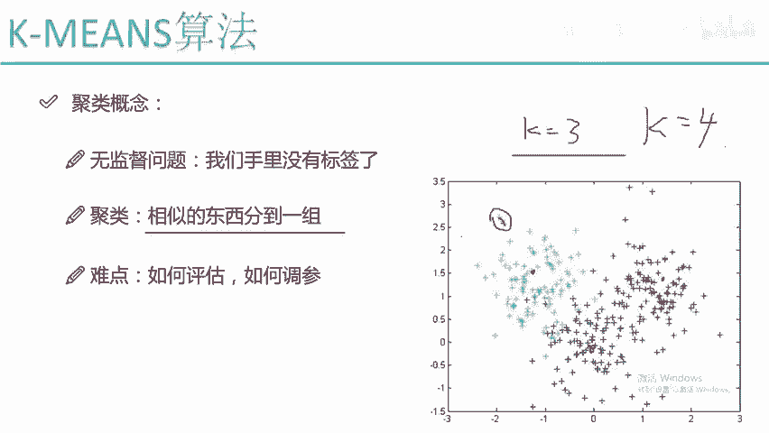

最常见的距离计算方式是**欧式距离**。对于两个样本点，计算它们在各个坐标轴上的差值平方和再开方。欧式距离是一种非常经典的距离度量方式。

在K-Means算法中，普遍使用欧式距离作为评估标准。但这里有一个重要注意事项：在使用欧式距离前，通常需要对数据进行**标准化**处理。

为什么要标准化？假设数据有两个维度X和Y。X维度的数值都很小（例如0.01, 0.04），而Y维度的数值很大（例如105, 161）。在计算距离时，Y维度的差异会主导计算结果，导致X维度的贡献被忽略。这并非我们期望的。

标准化（如归一化）可以将每个维度的数据缩放至相近的范围（例如0到1之间或-1到1之间）。这样，每个维度在距离计算中都能贡献相对均衡的信息。因此，数据标准化是使用距离度量前几乎必做的步骤。

### 优化目标
与机器学习的通用思路一致，K-Means算法也需要一个优化目标。我们通过不断迭代优化目标函数来求解问题。

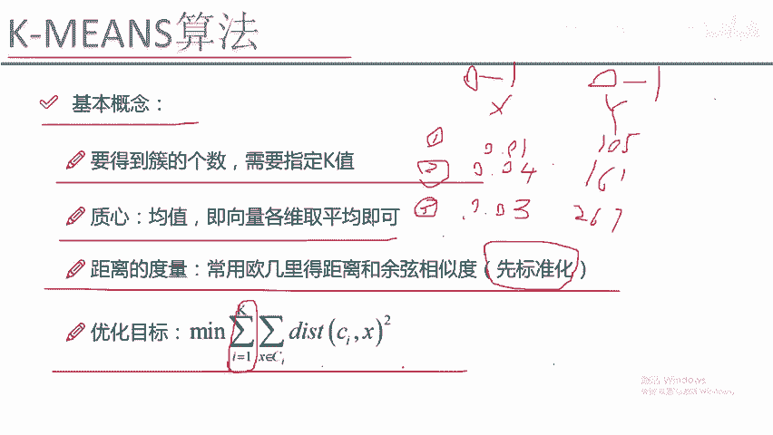

K-Means的优化目标是：**最小化每个簇内所有样本点到其质心的距离之和**。

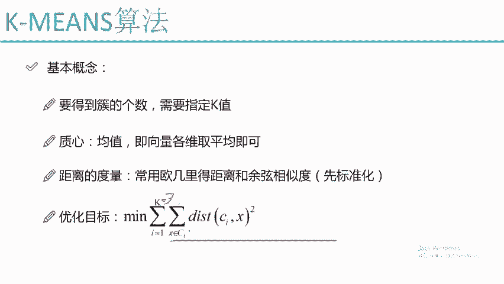

用公式可以表示为：
`最小化 Σ（从 i=1 到 K） Σ（x 属于簇 Ci） || x - μi ||²`
其中：
*   `K` 是簇的数量。
*   `Ci` 代表第 `i` 个簇。
*   `x` 是簇 `Ci` 中的一个样本点。
*   `μi` 是簇 `Ci` 的质心。
*   `|| x - μi ||²` 是点 `x` 到质心 `μi` 的欧式距离平方。

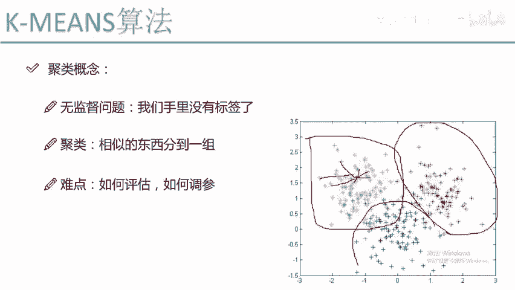

这个目标的意义是：我们希望每个簇内部的点都尽可能紧密，即它们到中心质心的距离越小越好。如果一个点离当前所属簇的质心很远，但离另一个簇的质心很近，那么在算法迭代过程中，它就更可能被重新划分到那个更近的簇中。通过这样的优化，最终使得每个点都被归入“合适”的簇。

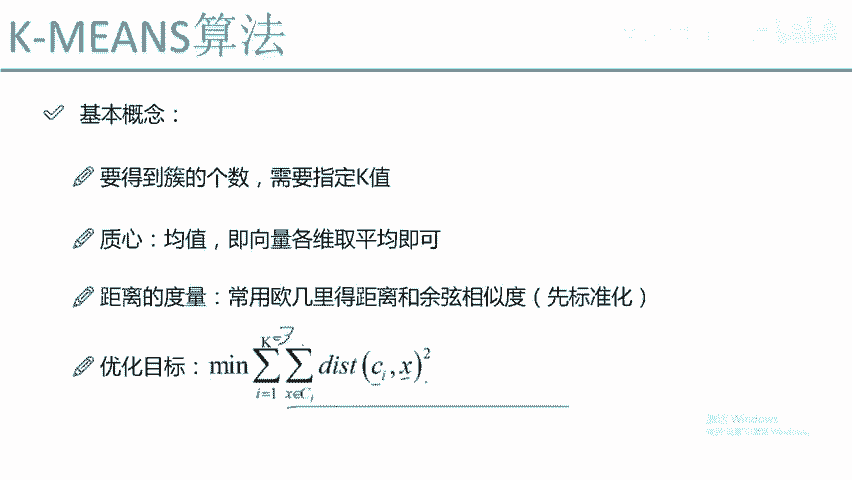

## 总结
本节课我们一起学习了聚类的基本概念以及K-Means算法的核心原理。

我们首先明确了聚类属于无监督学习，其特点是没有数据标签，这使得结果评估和参数调整更具挑战性。

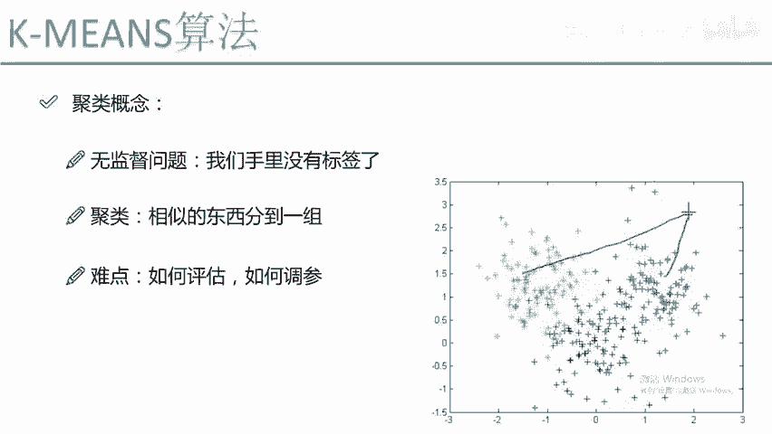

接着，我们深入探讨了K-Means算法：
1.  **K值**：需要预先指定希望形成的簇的数量。
2.  **质心**：每个簇的中心点，由簇内所有点的均值计算得出。
3.  **距离度量**：通常使用欧式距离来衡量样本点之间的相似性，使用前需对数据进行标准化处理。
4.  **优化目标**：最小化所有样本点到其所属簇质心的距离总和，从而使簇内样本尽可能相似。

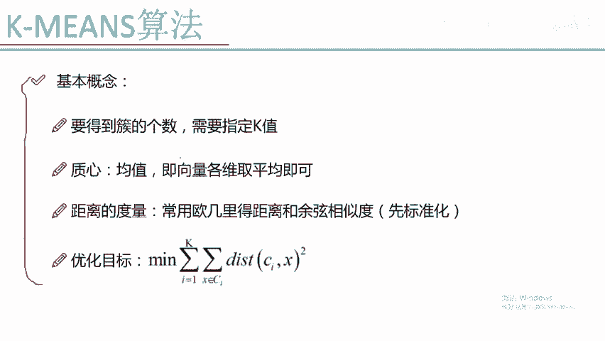

K-Means算法思想直观，通过不断迭代更新质心和样本点归属，最终达到稳定的聚类状态。在下一节中，我们将具体学习K-Means算法的详细步骤和迭代过程。