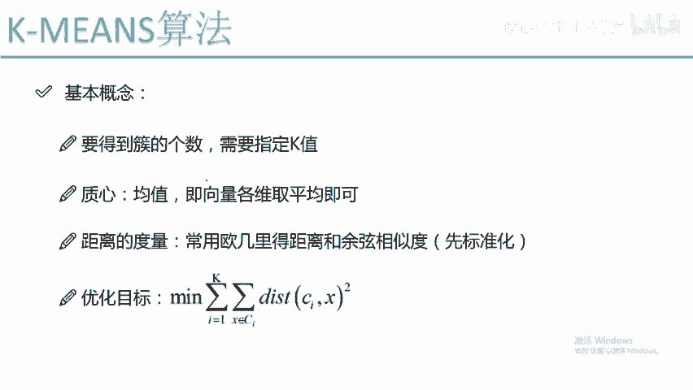
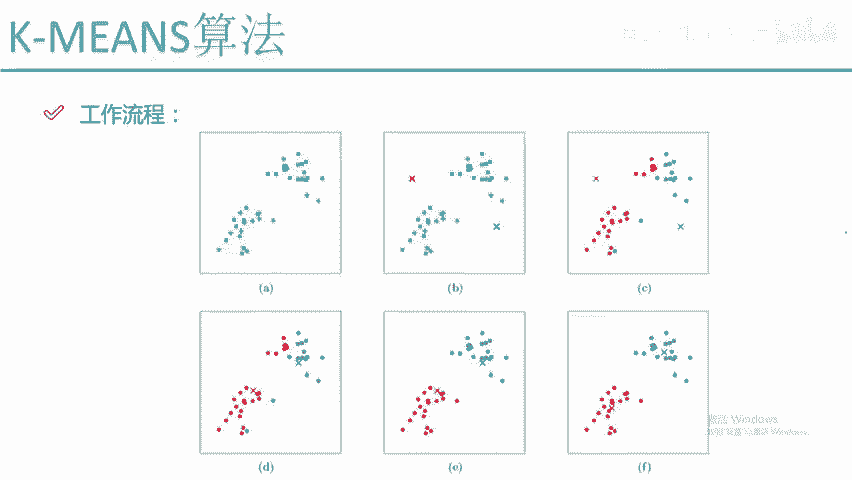
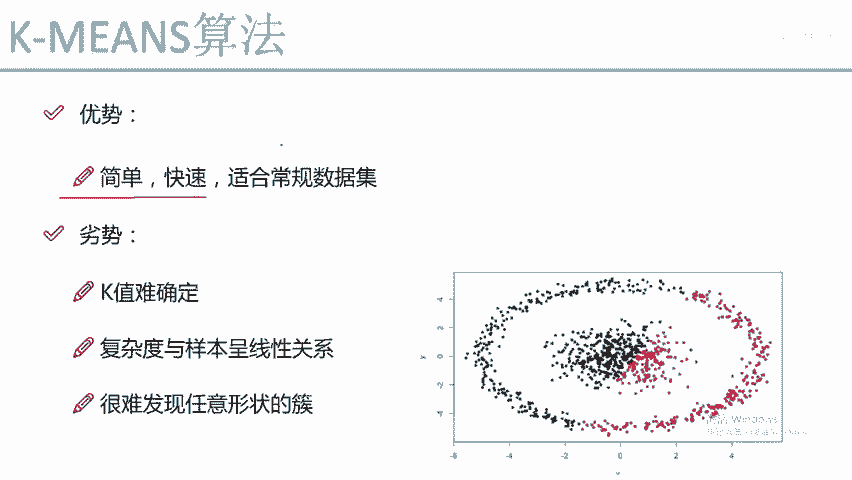
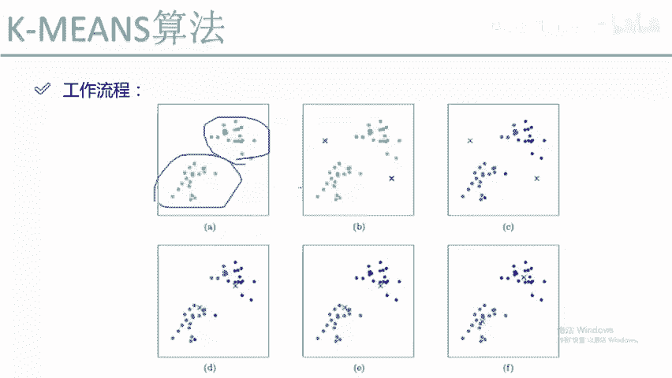
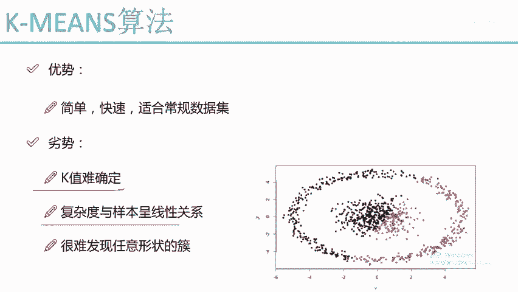
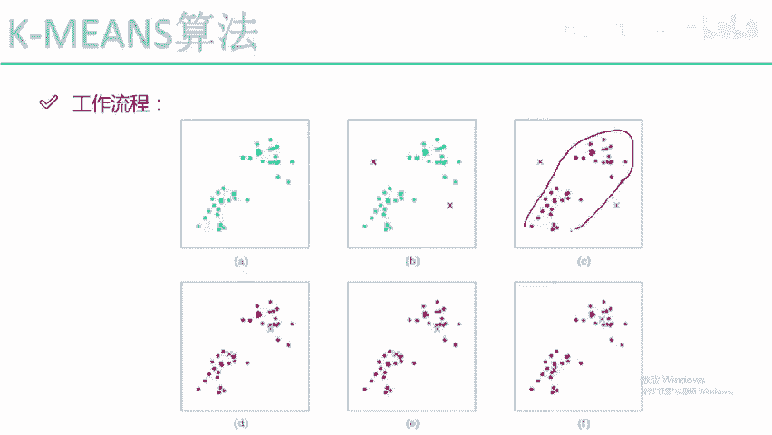
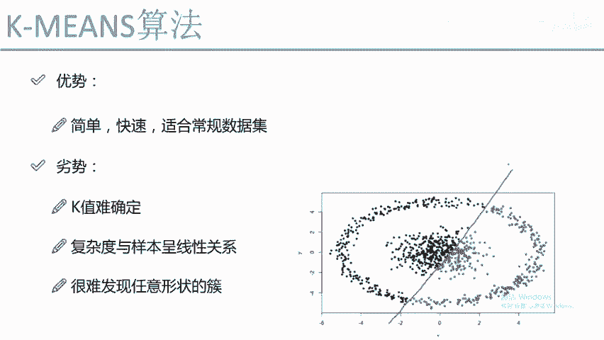
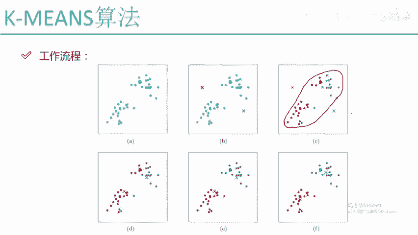
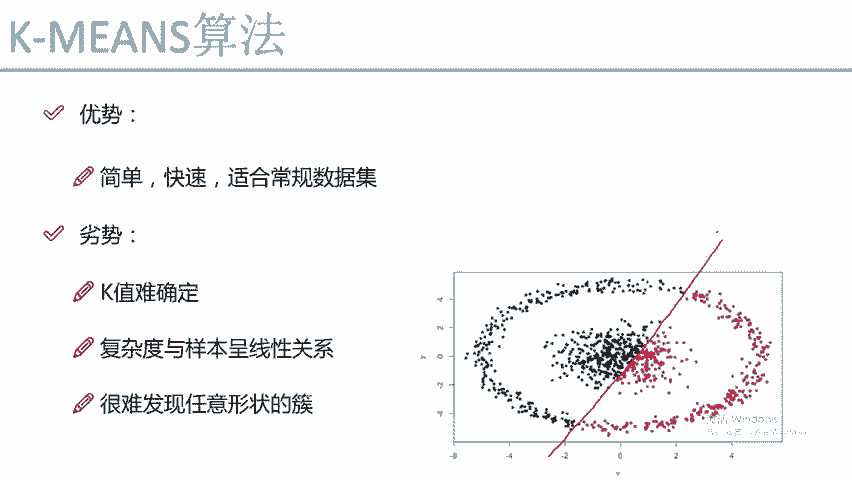

# Python金融分析与量化交易实战：P62：K-Means工作流程

## 概述
在本节课程中，我们将学习K-Means聚类算法的工作流程。我们将从算法的基本步骤开始，通过图示逐步拆解其运行机制，并分析其优点与缺点。理解K-Means的工作流程是掌握这一基础聚类算法的关键。

## K-Means算法工作流程详解

上一节我们介绍了聚类分析的基本概念，本节中我们来看看K-Means这一经典算法是如何具体运作的。

首先，K-Means是一种无监督学习算法。这意味着在开始聚类之前，我们并不知道数据点应该属于哪个类别（簇）。算法的目标是将数据点自动分组。

以下是K-Means算法的核心步骤，我们通过一个K=2（即希望分成两个簇）的例子来演示。

**第一步：初始化质心**
算法开始时，需要指定一个参数`K`，即希望将数据分成几个簇。这里我们设`K=2`。接着，算法会随机初始化`K`个点作为初始质心。在图中，我们用红色和蓝色的“X”表示这两个随机初始化的质心。

**第二步：计算距离并分配簇**
对于数据集中的每一个点，我们需要计算它到每个质心的距离。距离通常使用欧氏距离公式计算：
`distance = sqrt((x2 - x1)^2 + (y2 - y1)^2)`
对于一个绿色的样本点，我们计算它到红色质心的距离`d1`和到蓝色质心的距离`d2`。如果`d1 < d2`，则认为该点与红色质心更相似，因此将其划归为红色簇。算法会遍历所有样本点，根据“距离哪个质心近就属于哪个簇”的原则，为每个点分配一个初始的簇标签。

**第三步：重新计算质心**
完成所有点的初次分配后，我们得到了两个簇（一堆红点，一堆蓝点）。但此时随机初始化的质心位置很可能不准确。因此，我们需要更新质心。更新方法是：计算同一个簇内所有点的平均值，将这个平均值点作为该簇新的质心。例如，将所有红色点的X坐标和Y坐标分别求平均，得到的新坐标点就是红色簇的新质心。蓝色簇同理。

**第四步：迭代优化**
更新质心后，我们回到第二步。重新计算每个点到新质心的距离，并根据新的距离重新分配每个点的簇归属。由于质心位置变了，一些点的归属可能会发生变化（例如，原先的红点可能因为离新蓝质心更近而变成蓝点）。然后，再次基于新的簇分配结果更新质心。如此反复迭代（第二步 -> 第三步 -> 第二步 …）。

**第五步：终止条件**
当某次迭代后，所有数据点的簇归属不再发生变化，或者质心的移动变化非常微小（低于某个阈值）时，算法停止。此时我们认为聚类结果已经稳定。

如果`K=3`，流程完全一样，只是会初始化三个质心，最终将数据分成三个簇。

从工作流程来看，K-Means的原理是直观且简单的：**随机初始化 -> 分配簇 -> 更新质心 -> 迭代至稳定**。

## K-Means算法的优点与缺点

了解了工作流程后，我们来分析一下K-Means算法的优缺点。

以下是K-Means算法的主要优点：
1.  **原理简单，易于理解**：其“找中心、分队伍”的核心思想非常直观。
2.  **实现和运行效率较高**：对于常规数据集，收敛速度较快。
3.  **适用于常规形状的簇**：对于图中所示的、彼此分离的球形或凸形数据集，聚类效果通常很好。

然而，K-Means算法也存在一些明显的缺点：
1.  **需要预先指定K值**：在实际应用中，很难事先知道数据应该被分成几类（K值）。选择不当的K值会严重影响聚类效果。
2.  **对初始质心敏感**：不同的随机初始质心可能导致完全不同的最终聚类结果。有时可以通过多次运行取最优结果来缓解。
3.  **对异常值和噪声敏感**：由于使用均值计算质心，异常值会显著拉偏质心的位置。
4.  **难以处理非球形簇**：对于环形、流形或大小密度差异很大的簇，K-Means的聚类效果很差。因为它基于距离，倾向于划分出球形的簇。
5.  **计算复杂度**：虽然每次迭代是线性的，但对于海量样本（如千万级），计算所有点到所有质心的距离开销依然很大。

## 总结
本节课中我们一起学习了K-Means聚类算法。我们详细剖析了其从初始化、分配簇、更新质心到迭代收敛的完整工作流程，并用公式和步骤描述了其核心计算过程。同时，我们也讨论了该算法简单高效、适合常规数据集的优点，以及需要预设K值、对初始值和异常值敏感、难以处理复杂形状簇等缺点。理解这些是正确应用K-Means算法的基础。