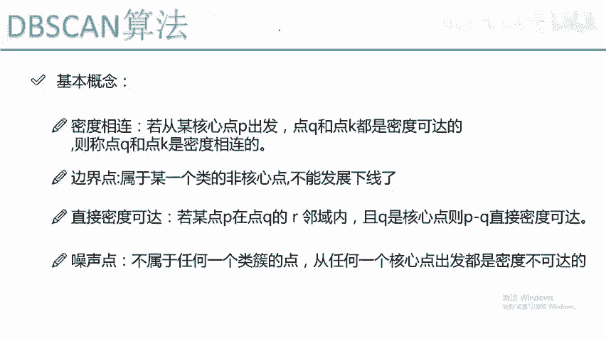
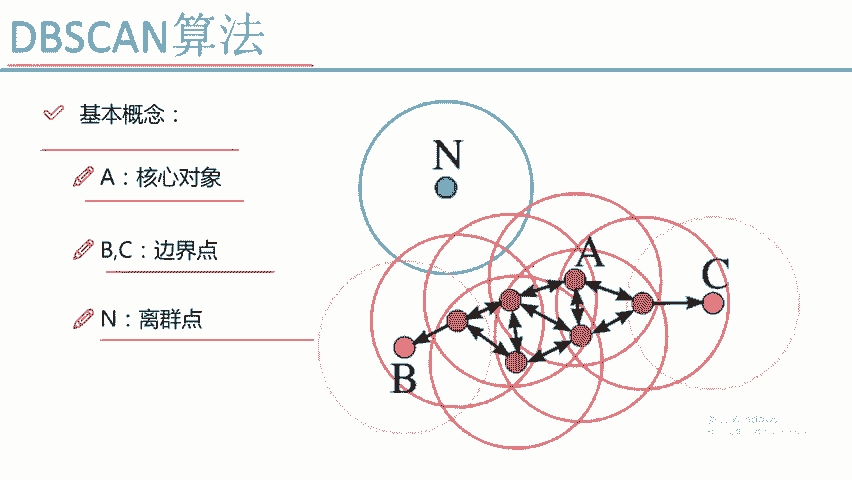

# Python金融分析与量化交易实战：P64：DBSCAN聚类算法

## 概述
在本节课中，我们将要学习一种非常强大的聚类算法——DBSCAN。与上一节介绍的K-Means算法相比，DBSCAN算法不需要预先指定簇的数量，并且能够识别出噪声点，因此在许多实际任务中表现更优。我们将从基本概念入手，逐步理解其工作原理、参数设置以及应用场景。

## DBSCAN基本概念
DBSCAN的全称是“基于密度的带有噪声的空间聚类应用”。它的核心思想是通过样本分布的紧密程度来划分簇。为了理解DBSCAN，我们需要先掌握几个关键概念。

### 核心参数
DBSCAN算法需要我们指定两个核心参数：
1.  **半径（eps）**：用于定义邻域范围的半径值。
2.  **最小样本数（min_samples）**：在一个点的eps邻域内，被视为核心点所需的最少样本数量。

### 核心概念定义
以下是DBSCAN算法中的几个核心定义：

**核心对象**
如果一个点的eps邻域内包含的样本点数量不小于`min_samples`，则该点被称为核心对象。
用公式表示即：`N_eps(p) >= min_samples`，其中`N_eps(p)`表示点p在eps半径内的邻居点集合。

**直接密度可达**
如果点p在核心点q的eps邻域内，则称点p从点q出发是直接密度可达的。

**密度可达**
如果存在一个点的序列`q0, q1, ..., qk`，其中`q0 = q`，`qk = p`，并且每个`qi`到`qi-1`都是直接密度可达的，则称点p从点q出发是密度可达的。这类似于一个传播过程。

**密度相连**
如果存在一个核心点o，使得点p和点k都是从o出发密度可达的，则称点p和点k是密度相连的。

**边界点**
如果一个点不是核心点，但它落在某个核心点的eps邻域内，则该点被称为边界点。边界点无法再发展出新的“下线”。

**噪声点**
既不是核心点，也不是边界点的样本点被称为噪声点或离群点。这些点不属于任何簇，距离任何核心点都超过eps半径。

## DBSCAN算法流程与可视化
上一节我们介绍了DBSCAN的核心概念，本节中我们通过一个可视化例子来看看算法是如何工作的。

DBSCAN的工作过程可以形象地理解为“发展下线”：
1.  算法随机选择一个未被访问的点。
2.  如果该点是核心对象，则以其为中心，eps为半径划出一个“邻域圈”。
3.  将该圈内的所有点都归入同一个簇中。
4.  对于圈内新加入的点，如果它也是核心对象，则重复步骤2和3，继续扩展这个簇的边界（即发展“下线的下线”）。
5.  这个过程一直持续到簇不能再被扩展为止（即边界点无法再找到新的核心对象邻居）。
6.  然后算法再选择另一个未被访问的点，重复上述过程。
7.  最终，所有无法被任何核心对象“传播”到的点，则被标记为噪声点。

以下是算法流程的示意图：

如图所示：
*   点A是一个核心对象，它找到了A‘， A’‘， A’‘’等直接密度可达的点。
*   这些点又作为新的核心对象（或边界点）继续扩展，找到了更多点。
*   点B和点C是边界点，以它们为圆心画圈时，无法再找到新的核心对象邻居。
*   点N是噪声点，没有任何核心对象的邻域圈能够包含它。

## DBSCAN的特点与应用
了解了DBSCAN的流程后，我们来看看它的优势和典型应用场景。

### 算法优势
与K-Means相比，DBSCAN的主要优势包括：
*   **无需指定簇数**：簇的数量由算法根据数据密度自动发现，这解决了K-Means中K值难以确定的问题。
*   **能识别任意形状的簇**：基于密度的方法可以找到非球形的簇，而K-Means通常假设簇是凸形的。
*   **能够识别噪声点**：算法可以明确区分出不属于任何簇的噪声点，这对于数据清洗和异常检测非常有用。

### 参数选择挑战
尽管DBSCAN不需要指定簇数，但`eps`和`min_samples`这两个参数的选择同样至关重要，并且会影响最终聚类效果：
*   `eps`值设置过大，会导致多个本应分开的簇合并成一个。
*   `eps`值设置过小，则可能将本属于一个簇的点拆散，并产生大量噪声点。
*   `min_samples`值主要决定了算法对噪声的容忍度。

### 核心应用：异常检测
由于DBSCAN能够有效识别出远离所有密集区域的点（噪声点），因此它非常适合用于**异常检测**或**离群点检测**任务。在金融风控、工业质检、网络安全等领域，识别出与正常模式不符的异常点往往是关键目标。

下图清晰地展示了核心点、边界点和噪声点的关系：

## 总结
本节课中我们一起学习了DBSCAN聚类算法。我们首先了解了其基于密度的核心思想，并学习了核心对象、密度可达、边界点和噪声点等关键概念。随后，我们通过生动的“发展下线”比喻理解了算法的执行流程。最后，我们探讨了DBSCAN无需预设簇数、能发现任意形状簇以及擅长识别噪声点的优势，并指出了其参数调优的挑战，特别强调了它在异常检测任务中的重要应用价值。DBSCAN是一种强大且实用的聚类工具，值得在合适的场景中深入学习和应用。