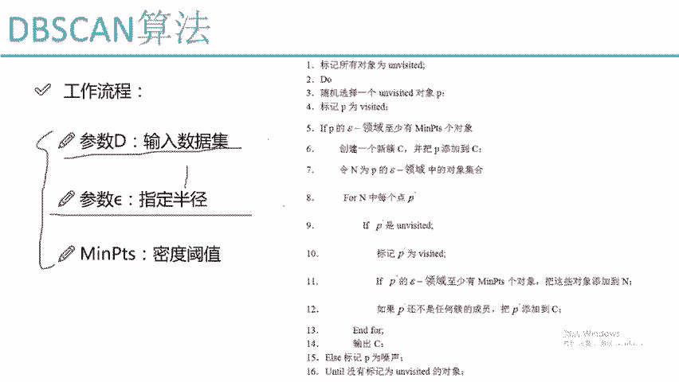
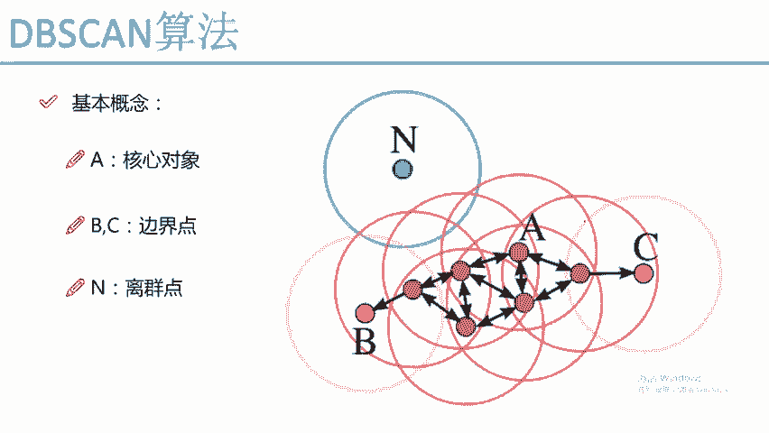
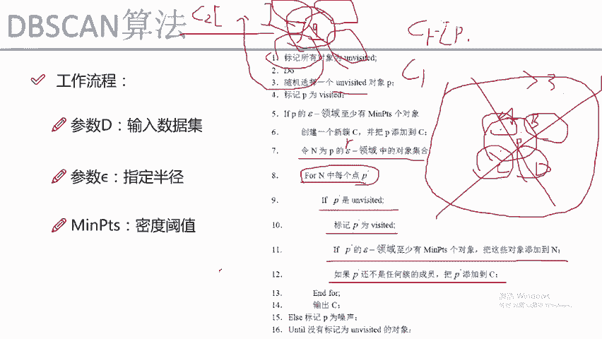
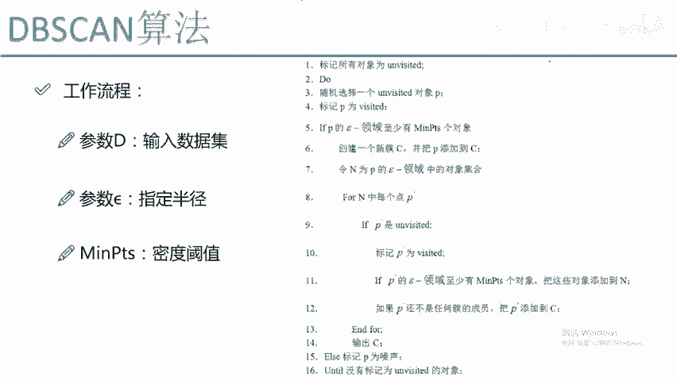
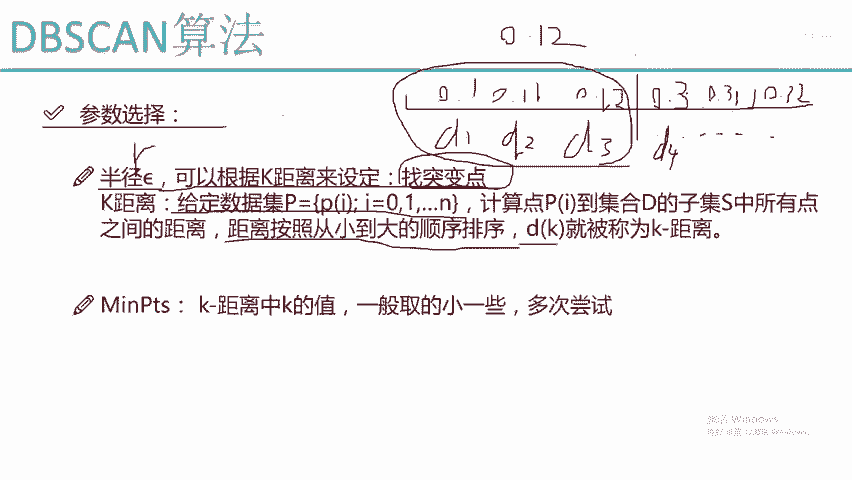
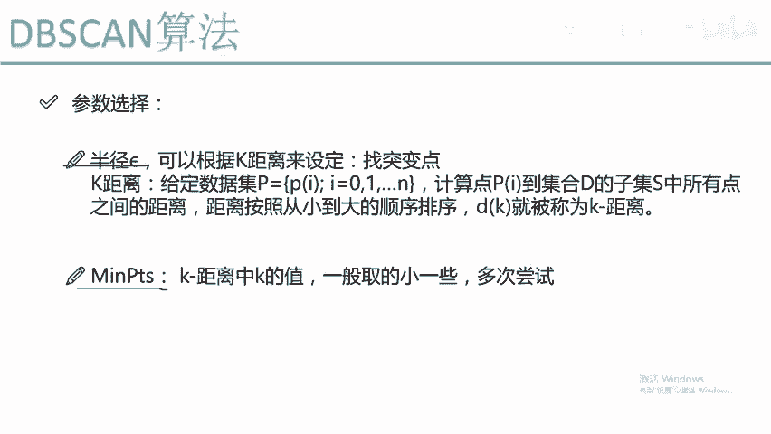

# Python金融分析与量化交易实战：P65：DBSCAN工作流程详解 🎯

在本节课中，我们将深入学习DBSCAN（基于密度的空间聚类应用）算法的工作流程。我们将从核心参数开始，逐步解析算法如何通过“画圈”和“发展下线”的方式发现任意形状的簇，并讨论其优势、劣势以及参数选择的技巧。

## 概述

DBSCAN是一种强大的聚类算法，它不需要预先指定簇的个数，并能发现任意形状的簇和离群点。本节将详细拆解其工作流程，帮助初学者理解其运作机制。

---

## 核心参数输入 🔧

首先，我们需要了解运行DBSCAN算法所需的输入参数。这些参数决定了算法如何“观察”数据。

以下是算法需要的三个核心参数：

1.  **数据集**：这是任何聚类算法的基础输入，即需要进行聚类的数据点集合。
2.  **半径（eps）**：这是算法中“画圈”的半径。DBSCAN通过以每个点为中心、以`eps`为半径画圆来探索其邻域。
3.  **最小样本数（min_samples）**：这是一个密度阈值。它定义了在一个半径为`eps`的圆内，至少需要有多少个点（包括中心点本身），该中心点才能被认定为“核心对象”。

用公式表示核心对象的判定条件为：
对于一个点 `P`，其 `eps`-邻域内的点数（包括 `P`） >= `min_samples`。

---

## 算法迭代流程 🔄

上一节我们介绍了算法的输入参数，本节中我们来看看DBSCAN是如何一步步迭代，最终形成聚类结果的。整个过程可以形象地理解为“发展下线”或“传销”模式。

1.  **初始化标记**：算法开始时，将所有数据点标记为“未访问”。
2.  **随机选择起点**：从数据集中随机选择一个未被访问的点 `P`，并将其标记为“已访问”。
3.  **判断核心对象**：检查点 `P` 的 `eps`-邻域内的点数。
    *   如果点数 >= `min_samples`，则 `P` 是**核心对象**。此时，创建一个新簇 `C`，并将 `P` 加入该簇。
    *   如果点数 < `min_samples`，则 `P` 被暂时标记为**噪声点**（后续可能被其他核心对象吸收），然后返回步骤2选择下一个点。
4.  **发展“下线”（邻域扩张）**：如果 `P` 是核心对象，则将其 `eps`-邻域内的所有点都加入一个“待考察集合” `N` 中。
    *   遍历集合 `N` 中的每一个点 `Q`：
        *   如果 `Q` 是“未访问”状态，则将其标记为“已访问”。
        *   检查 `Q` 是否是核心对象（即其 `eps`-邻域内的点数是否达标）。
            *   如果是，则将 `Q` 的 `eps`-邻域内的所有点也加入到集合 `N` 中（即“发展下线”）。
        *   如果 `Q` 尚未属于任何簇，则将 `Q` 加入到当前簇 `C` 中。
    *   这个循环会持续进行，直到集合 `N` 中的所有点都被处理完毕。此时，一个完整的簇 `C` 就形成了，它包含了所有从核心对象 `P` 出发，通过密度可达关系连接起来的点。
5.  **寻找新簇**：完成一个簇的构建后，算法会回到步骤2，从剩余的“未访问”点中随机选择新的起点，重复上述过程，开始构建下一个簇。
6.  **算法终止**：当数据集中所有点都被标记为“已访问”时，算法结束。最终，所有被识别出的核心对象及其密度可达的点会形成各个簇，而无法被任何核心对象“吸收”的点则被标记为噪声或离群点。

---

## 参数选择策略 📊

DBSCAN的参数选择，尤其是半径 `eps`，对结果影响很大。一个常用的启发式方法是基于 **k-距离图**。

以下是利用k-距离图选择 `eps` 的步骤：

1.  对于数据集中的每个点 `P_i`，计算它到所有其他点的距离。
2.  将这些距离按升序排序。
3.  对于每个点 `P_i`，我们关注其第 `k` 个最近邻的距离（通常 `k` 取 `min_samples - 1`）。
4.  将所有点的这个“第k距离”值进行排序并绘制成折线图（纵轴是距离，横轴是点按距离排序后的索引）。
5.  在图中寻找一个“拐点”或“肘部”，即距离值发生突然增大的位置。这个拐点对应的距离值通常可以作为 `eps` 的一个较好估计。

**核心思想**：拐点之前的点距离很近，变化平缓，属于密集区域；拐点之后距离骤增，意味着进入了稀疏区域或另一个簇。因此，拐点处的距离适合作为划分簇边界的半径 `eps`。

对于 `min_samples`，一个经验法则是从较小的值开始尝试（如 4， 5），它通常对结果不如 `eps` 敏感。

---

## 算法效果与特点 ⚖️

通过前面的学习，我们了解了DBSCAN的工作原理。现在，我们来看看它的实际效果和优缺点。

### 优势

*   **无需指定簇数**：算法能自动发现数据中自然存在的簇的个数。
*   **能发现任意形状的簇**：不同于K-Means只能发现球状簇，DBSCAN可以识别出环形、月牙形等复杂形状的簇。
*   **能识别噪声点**：算法天然地将不属于任何密集区域的点标记为噪声（离群点），适用于异常检测任务。
*   **参数相对较少**：主要需要调节 `eps` 和 `min_samples` 两个参数。

### 劣势

*   **对高维数据效果不佳**：“维度灾难”使得在高维空间中定义有意义的“密度”和“距离”变得困难，可能导致性能下降和内存消耗激增。
*   **参数选择敏感**：`eps` 和 `min_samples` 的选择需要经验和技巧，不同的参数组合可能产生截然不同的结果。
*   **对密度差异大的数据集效果差**：如果数据集中不同簇的密度差异悬殊，很难找到一个全局的 `eps` 参数同时适用于所有簇。
*   **处理大规模数据可能较慢**：在最坏情况下，算法复杂度较高，且Scikit-learn实现对于超大样本量可能遇到内存问题。对此，可以考虑先进行降维或数据采样。

---

## 总结

本节课中，我们一起学习了DBSCAN聚类算法。我们从其核心参数（`eps`， `min_samples`）出发，详细剖析了它通过“画圈”和递归“发展下线”来构建簇的迭代流程。我们探讨了利用k-距离图选择参数的策略，并总结了DBSCAN能够发现任意形状簇、识别噪声点的强大优势，同时也指出了其对参数敏感、处理高维数据存在挑战等劣势。总体而言，在面对不规则数据分布时，DBSCAN通常是比K-Means更优的选择。