# Python金融分析与量化交易实战：P66：DBSCAN算法可视化展示

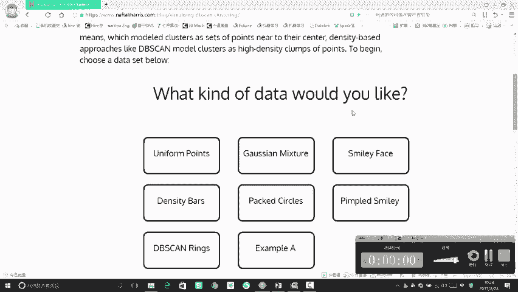

在本节课中，我们将通过可视化演示，直观地理解DBSCAN聚类算法的工作流程和参数影响。我们将看到算法如何“发展下线”形成簇，以及如何识别离群点。

## 概述与算法回顾

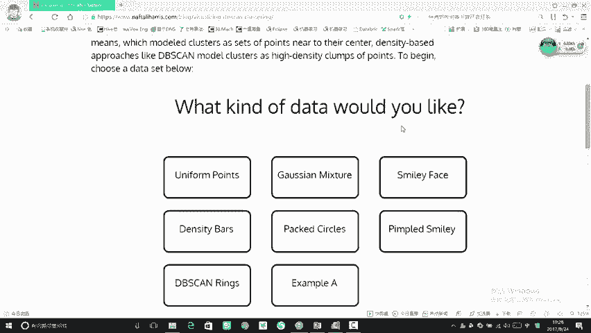

上一节我们介绍了DBSCAN算法的核心概念。本节中，我们来看看它的动态工作过程。DBSCAN是一种基于密度的聚类算法，它不需要预先指定簇的数量，并能有效识别噪声点。其核心思想是：如果一个点的**半径Eps**邻域内包含至少**MinPts**个点，则该点被视为核心点，并以此为核心扩展形成簇。

## DBSCAN工作流程可视化

以下是DBSCAN算法在一个简单数据集上的逐步执行过程。

首先，我们生成一个随机数据集，并设置算法的两个关键参数：邻域半径 **`eps`** 和最小点数 **`min_samples`**。

```python
# 参数示例
eps = 1.0
min_samples = 4
```


算法开始运行。它首先随机选择一个未访问的点。

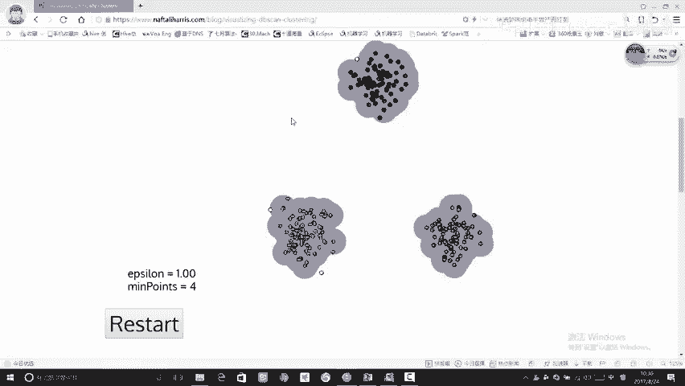


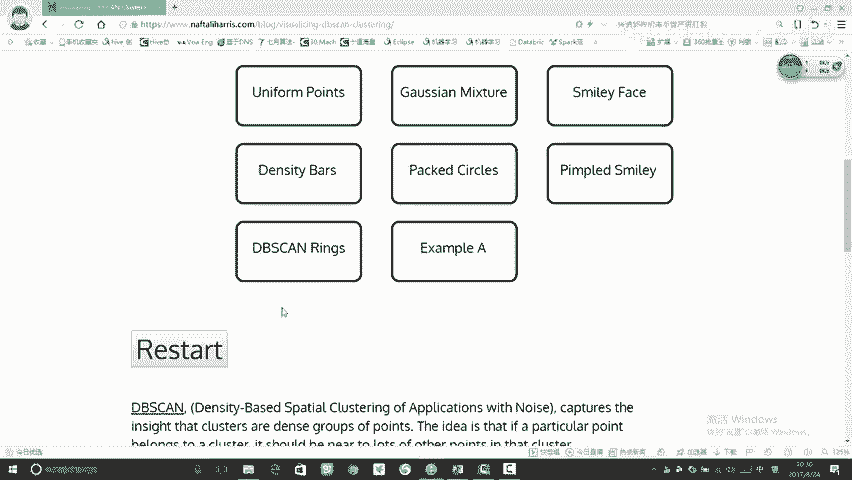

如果该点在 `eps` 半径内的邻居数量达到 `min_samples`，它被标记为核心点。算法会以该点为核心，将其所有密度可达的邻居点（包括邻居的邻居）都归入同一个簇中。这个过程类似于“发展下线”。

当当前簇无法再扩展时，算法会选择一个未被访问的新点，开始构建新的簇。

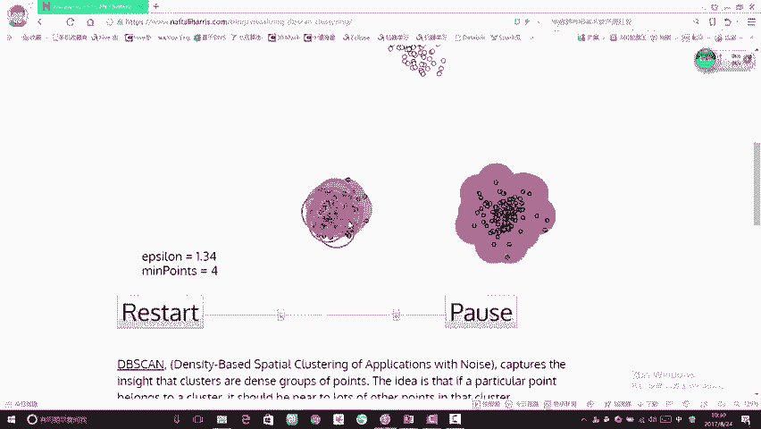


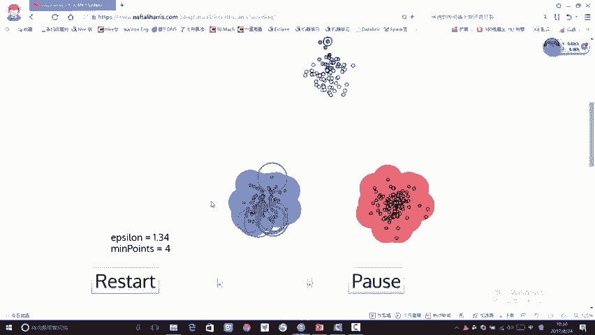

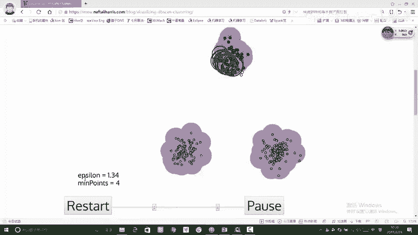

最终，所有不属于任何簇的点被标记为噪声点或离群点。通过这个流程，我们得到了三个清晰的簇和三个离群点。

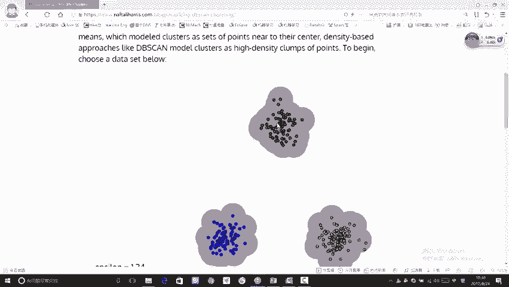

## 参数对聚类结果的影响

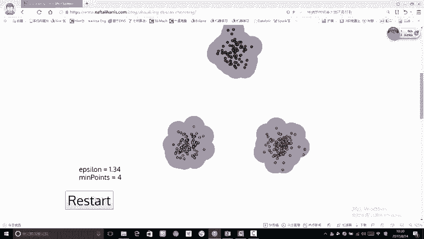

DBSCAN的结果高度依赖于 `eps` 和 `min_samples` 这两个参数的设置。下面我们通过调整参数来观察结果的变化。

当我们将 `eps` 参数调大时，每个点的搜索范围变广。


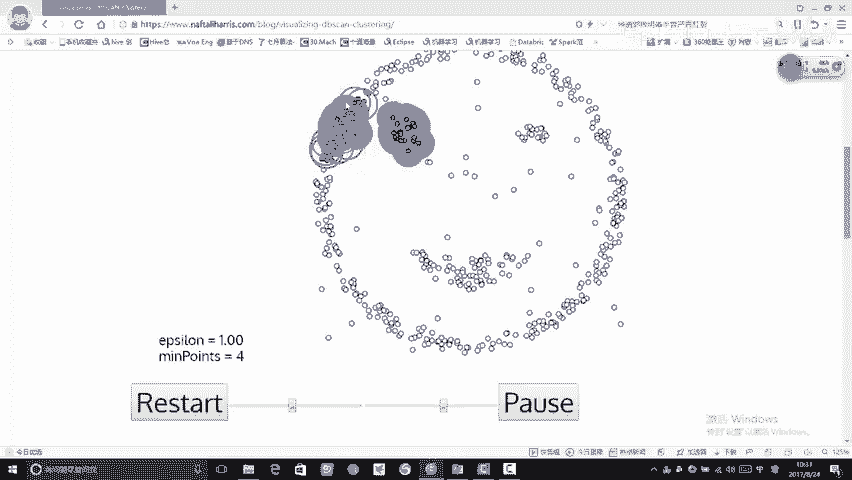

结果，更多的点被纳入簇中，之前的离群点可能消失。这说明较大的 `eps` 会使算法倾向于生成更大、更少的簇。

反之，如果我们希望找出更多的离群点或更精细的簇结构，可以将 `eps` 和 `min_samples` 设置得小一些。


参数调整后，算法可能会识别出更多的簇，并且离群点也变得明显。

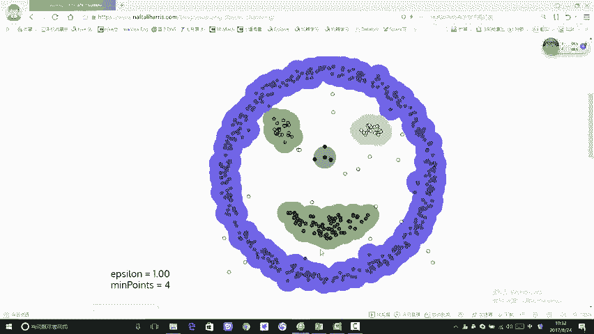

## DBSCAN vs. K-Means：复杂形状聚类

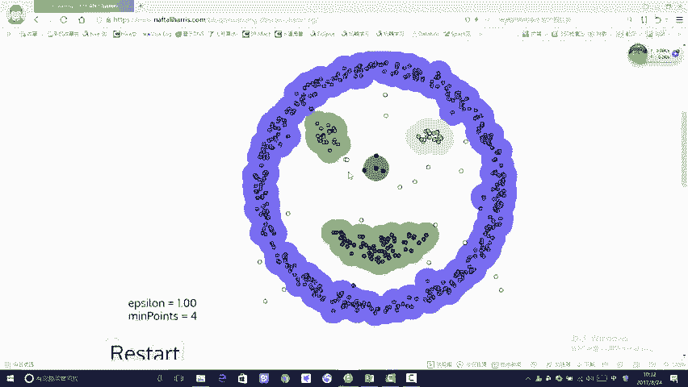

上一节我们提到K-Means在处理非球形簇时效果不佳。现在，我们使用DBSCAN算法在一个人脸形状的复杂数据集上进行聚类。


DBSCAN基于密度的特性使其能够发现任意形状的簇，只要簇内点密度相连。如图所示，它成功地识别出了人脸的轮廓（蓝色圈）和眼睛、嘴巴等内部结构（绿色和黄色簇），效果远优于K-Means。


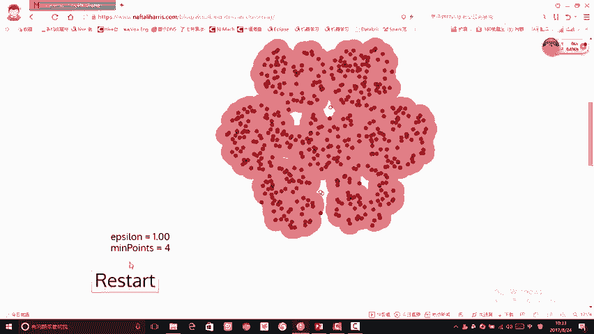


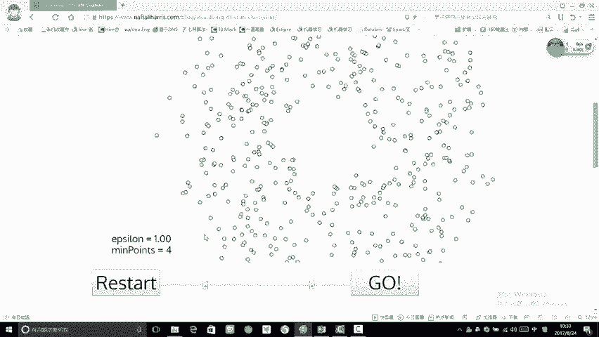

## DBSCAN的局限性

尽管DBSCAN很强大，但它并非万能。当数据整体密度都较高且均匀时，DBSCAN可能会将整个数据集判为一个簇。


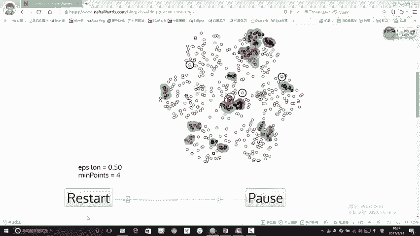

如图所示，在密集数据集上，即使调整 `eps` 参数，也可能得到不理想的结果：要么所有点聚为一类，要么产生过多无意义的小簇。


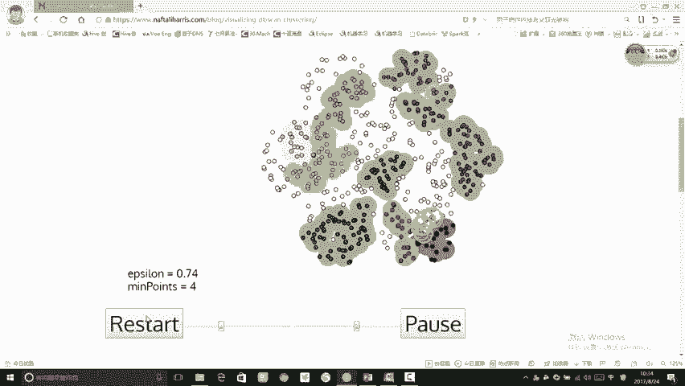

这揭示了聚类算法的一个共同挑战：**参数选择没有标准答案**，需要根据数据分布和分析目标反复调试。

## 另一个示例：参数调试实践

让我们在另一个数据集上实践参数调试。初始参数下，聚类结果可能比较混乱。


通过不断调整 `eps` 参数，我们可以观察聚类结果的变化，寻找一个能产生清晰、有意义的簇结构的参数值。

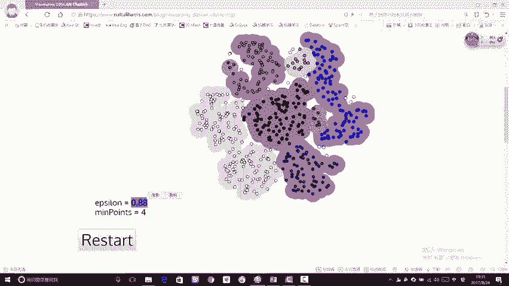


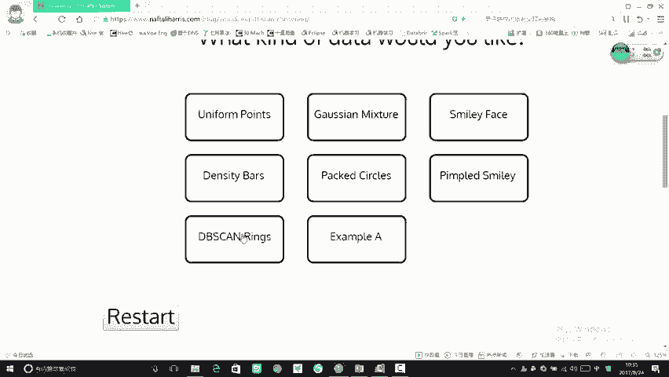


最终，我们可能找到一个合适的参数，将数据清晰地分成几个大模块。


这个调试过程也展示了 `min_samples` 参数的作用：增大该值会使算法对核心点的要求更严格，可能导致生成的簇更少、更紧凑。


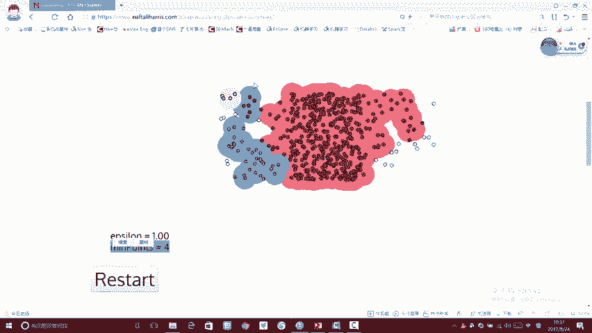

## 总结

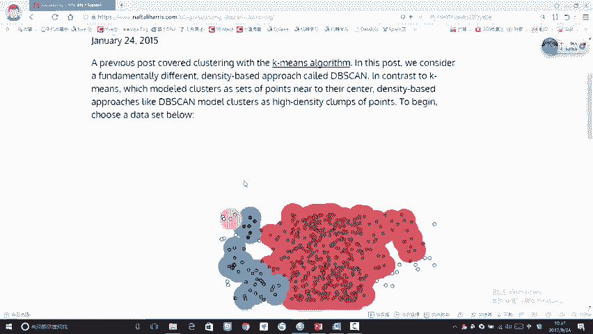

本节课中我们一起学习了DBSCAN算法的可视化工作流程。我们看到了它如何通过“密度可达”的方式扩展簇，并识别离群点。关键点总结如下：
1.  **核心参数**：**`eps`**（半径）和 **`min_samples`**（最小样本数）共同决定了聚类的粒度。
2.  **算法优势**：能够发现任意形状的簇，无需预先指定簇数量，并能有效识别噪声点。
3.  **算法局限**：对参数敏感，在密度均匀的数据集上效果可能不佳。
4.  **参数调试**：没有固定规则，需要通过可视化工具反复试验，根据实际数据分布和分析目标选择最佳参数。

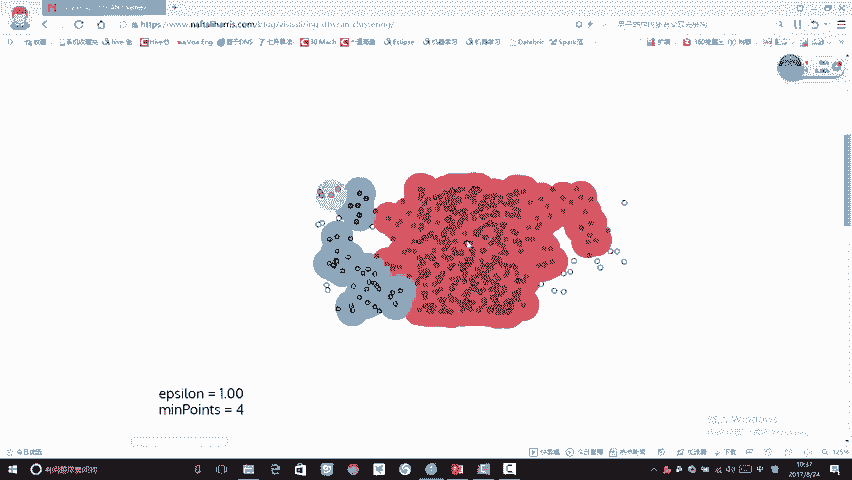

通过本节的动态演示，希望大家对DBSCAN算法的内在机制和参数影响有了更直观和深刻的理解。