# Python金融分析与量化交易实战：P71：时间序列分析

## 概述
在本节课中，我们将学习如何使用Python进行时间序列分析，并以微软股票数据为例，演示如何读取数据、可视化数据以及进行初步分析。我们将使用`yfinance`等库获取股票数据，并使用`matplotlib`进行绘图。

---

## 第一步：读取数据
首先，我们需要读取股票数据。这里我们选择微软的股票进行分析。

```python
import yfinance as yf
import pandas as pd
import matplotlib.pyplot as plt

# 读取微软股票数据
msft = yf.Ticker("MSFT")
hist = msft.history(period="max")
```

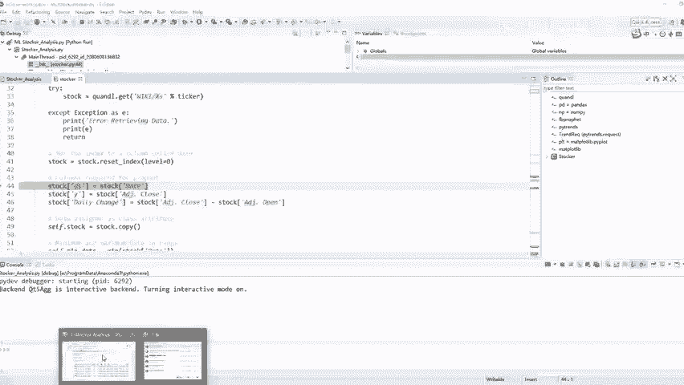

执行上述代码后，我们获得了微软股票的历史数据。数据包含日期、开盘价、最高价、最低价、收盘价、交易量等指标。我们主要关注收盘价。

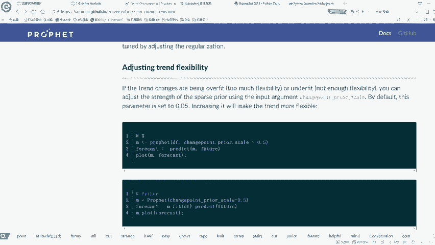

---

## 第二步：查看数据结构
在开始分析之前，我们先查看一下数据的结构。

```python
print(hist.head())
print(hist.info())
```

通过`head()`方法，我们可以查看数据的前几行。通过`info()`方法，我们可以了解数据的列名、数据类型以及是否有缺失值。

---

## 第三步：数据预处理
接下来，我们对数据进行预处理，提取出我们需要的时间序列数据。

```python
# 重置索引，将日期列变为普通列
hist.reset_index(inplace=True)

# 提取日期和收盘价
hist['Date'] = pd.to_datetime(hist['Date'])
y = hist['Close']
```

这里，我们将日期列转换为`datetime`格式，并提取收盘价作为我们要分析的时间序列数据。

---

## 第四步：可视化时间序列
在时间序列分析中，可视化是非常重要的一步。我们可以通过绘图来观察数据的趋势和波动。

```python
plt.figure(figsize=(12, 6))
plt.plot(hist['Date'], y, label='Close Price', color='red')
plt.xlabel('Date')
plt.ylabel('Close Price')
plt.title('Microsoft Stock Price Over Time')
plt.legend()
plt.grid(True)
plt.show()
```

通过上述代码，我们绘制了微软股票收盘价随时间变化的折线图。从图中可以观察到股票价格的长期趋势和短期波动。

---

## 第五步：分析特定时间段
有时，我们可能只关心特定时间段的数据。例如，我们可以分析2000年到2010年的数据。

```python
# 筛选2000年到2010年的数据
start_date = '2000-01-01'
end_date = '2010-12-31'
mask = (hist['Date'] >= start_date) & (hist['Date'] <= end_date)
filtered_data = hist.loc[mask]

# 绘制筛选后的数据
plt.figure(figsize=(12, 6))
plt.plot(filtered_data['Date'], filtered_data['Close'], label='Close Price', color='blue')
plt.xlabel('Date')
plt.ylabel('Close Price')
plt.title('Microsoft Stock Price (2000-2010)')
plt.legend()
plt.grid(True)
plt.show()
```

通过筛选特定时间段的数据，我们可以更细致地分析该时间段内的股票价格变化。

---

## 第六步：计算收益
在股票分析中，收益是一个重要的指标。我们可以计算每日收益，并绘制收益图。

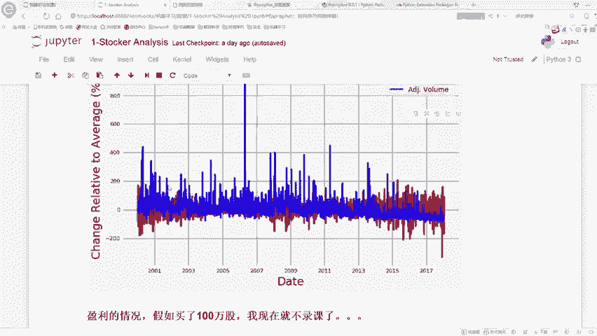

```python
# 计算每日收益
hist['Daily Return'] = hist['Close'].pct_change()

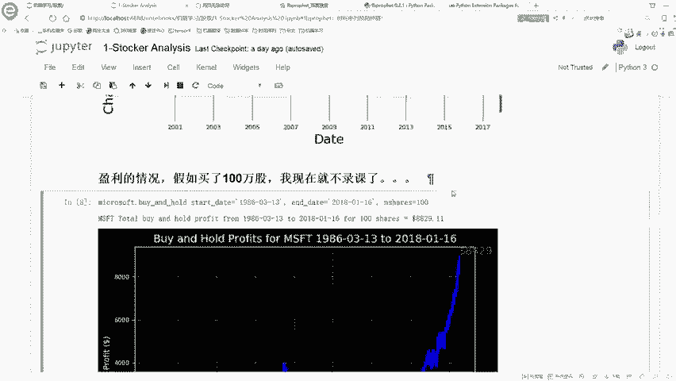

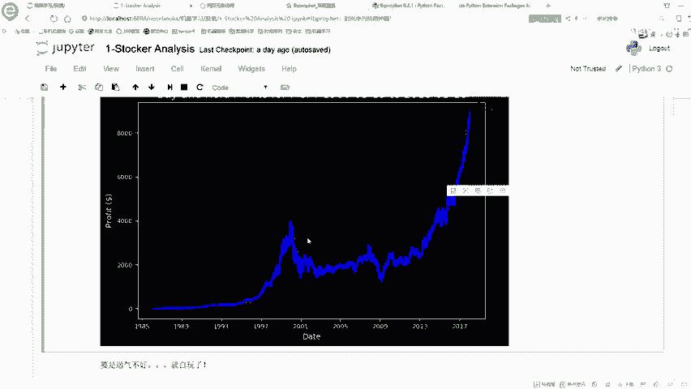

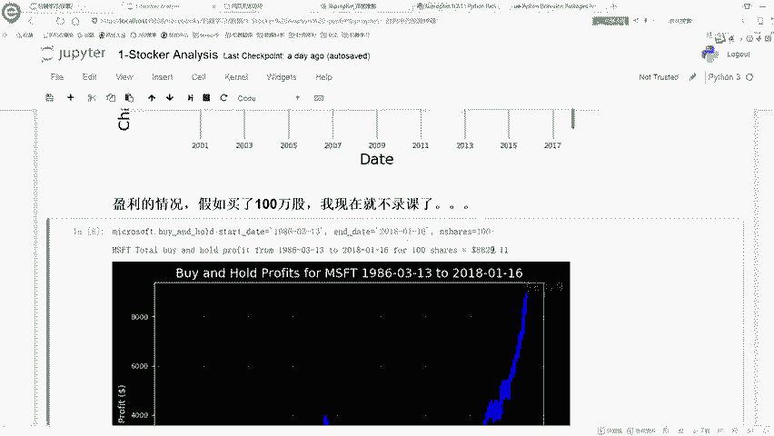

# 绘制每日收益图
plt.figure(figsize=(12, 6))
plt.plot(hist['Date'], hist['Daily Return'], label='Daily Return', color='green')
plt.xlabel('Date')
plt.ylabel('Daily Return')
plt.title('Microsoft Stock Daily Returns')
plt.legend()
plt.grid(True)
plt.show()
```

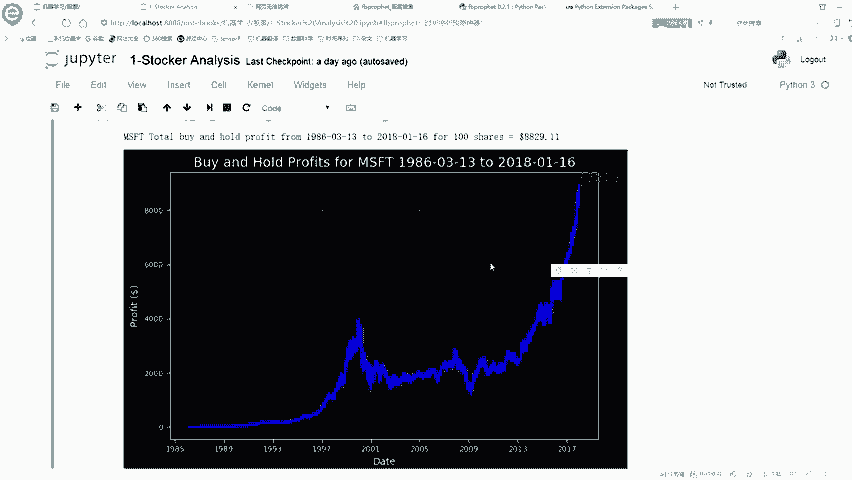

每日收益图可以帮助我们观察股票价格的波动情况。

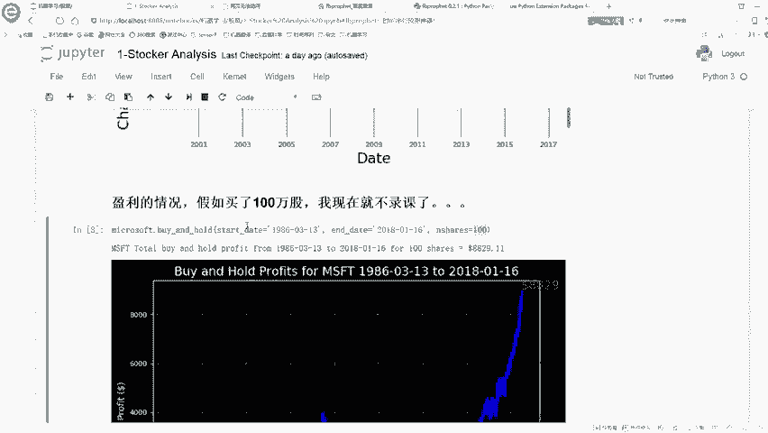

---

## 第七步：模拟投资
最后，我们可以模拟一个简单的投资策略，计算在特定时间段内买入和卖出股票的收益。

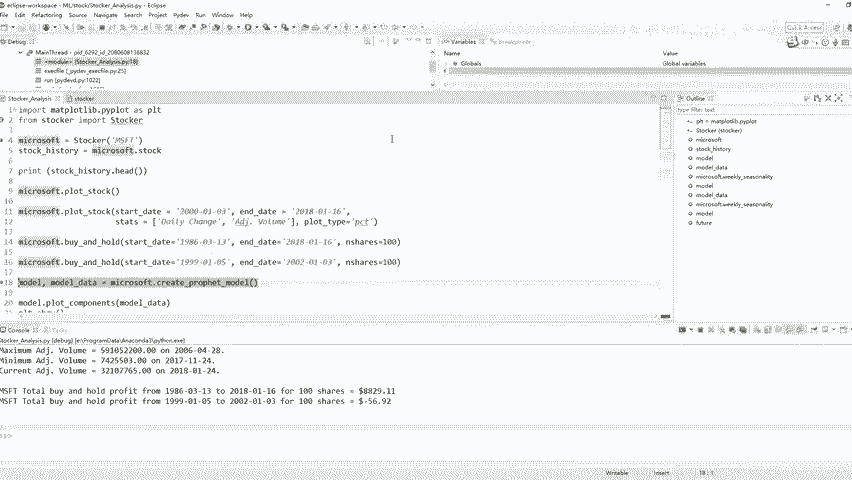

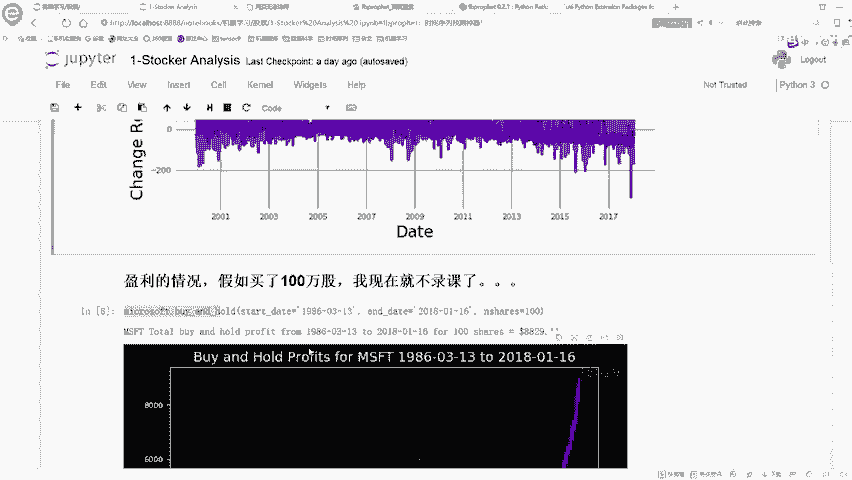

```python
# 模拟投资
def simulate_investment(data, start_date, end_date, shares):
    start_price = data.loc[data['Date'] == start_date, 'Close'].values[0]
    end_price = data.loc[data['Date'] == end_date, 'Close'].values[0]
    profit = (end_price - start_price) * shares
    return profit

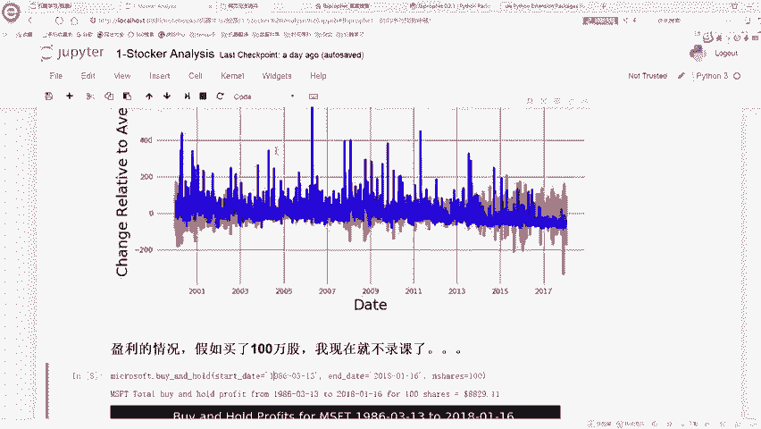

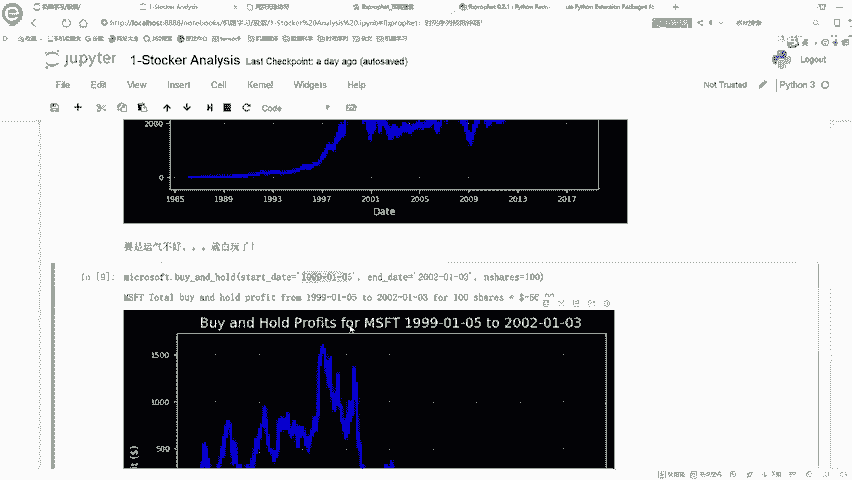

# 示例：在2000年买入100股，2010年卖出
profit = simulate_investment(hist, '2000-01-01', '2010-12-31', 100)
print(f"Profit: ${profit:.2f}")
```

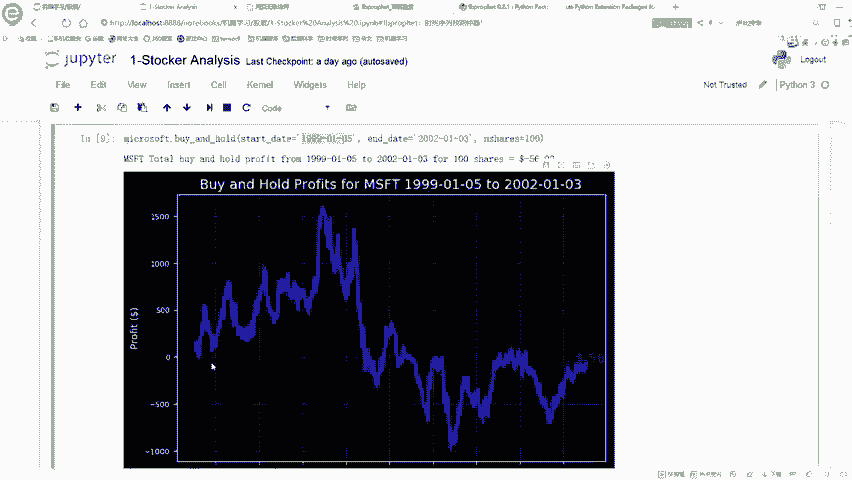

通过模拟投资，我们可以评估不同投资策略的效果。

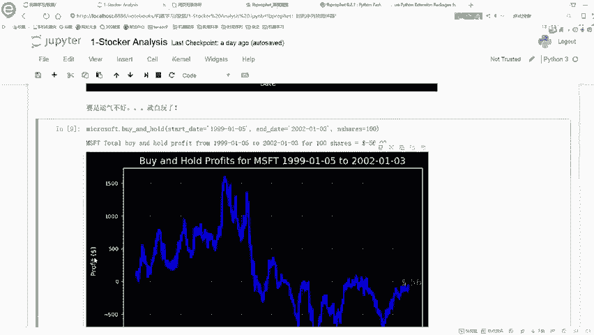

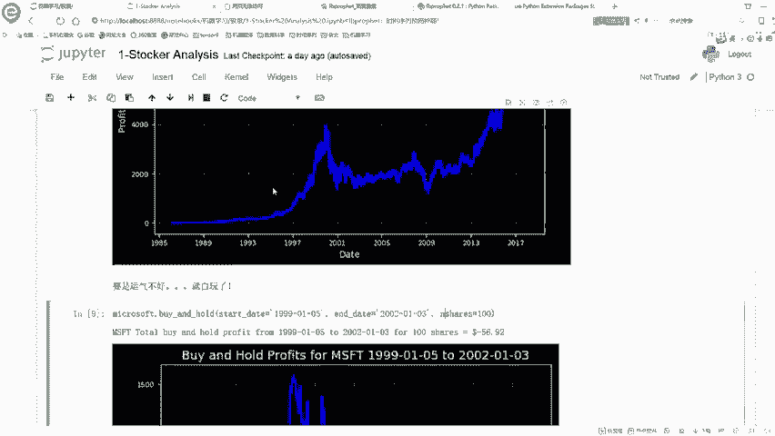

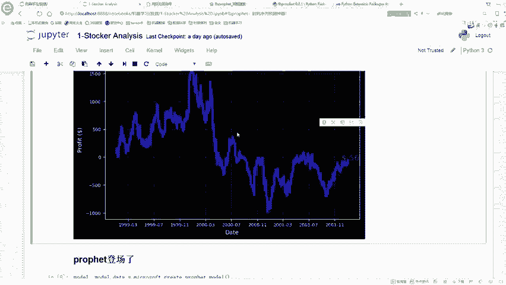

---

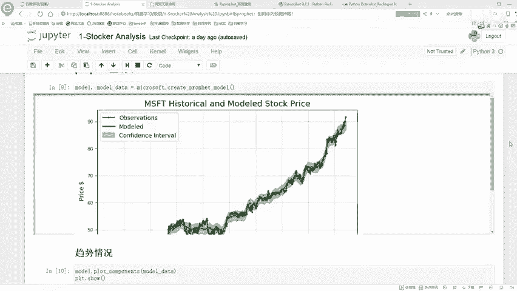

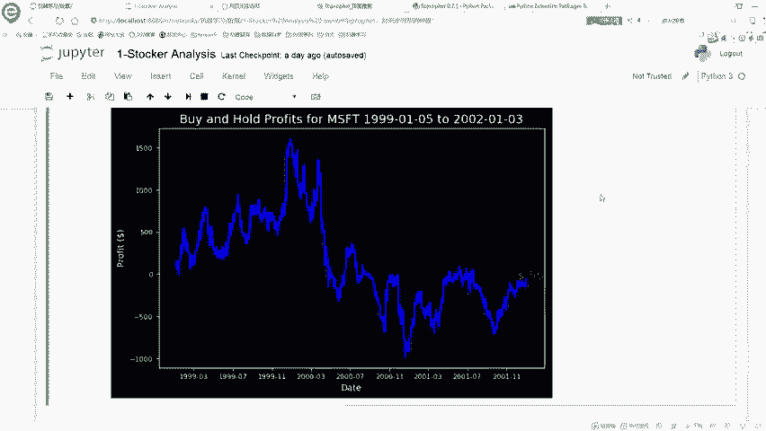

## 总结
本节课中，我们一起学习了如何使用Python进行时间序列分析。我们从读取股票数据开始，逐步进行了数据预处理、可视化、特定时间段分析、收益计算以及模拟投资。通过这些步骤，我们可以更好地理解股票数据的变化趋势，并为后续的量化交易分析打下基础。