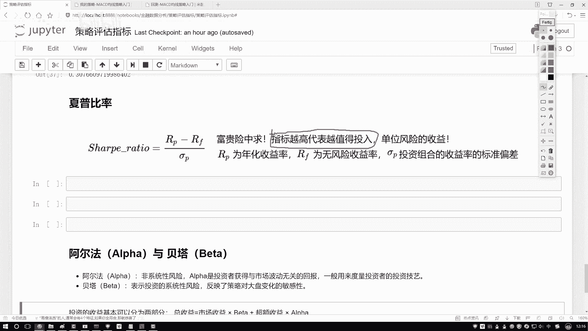
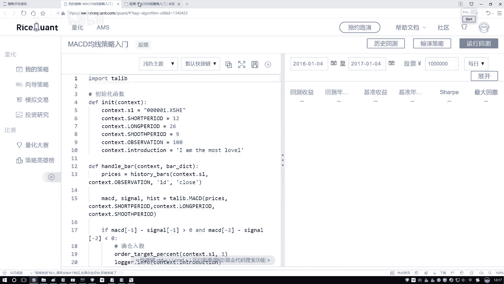
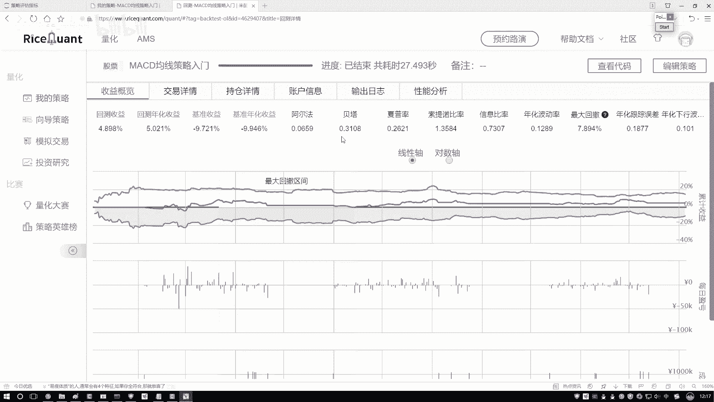
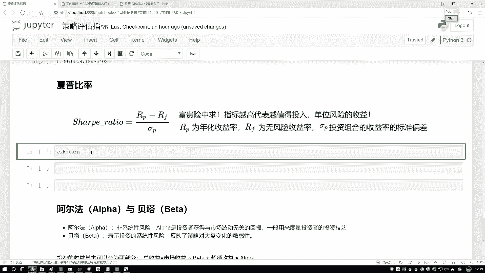
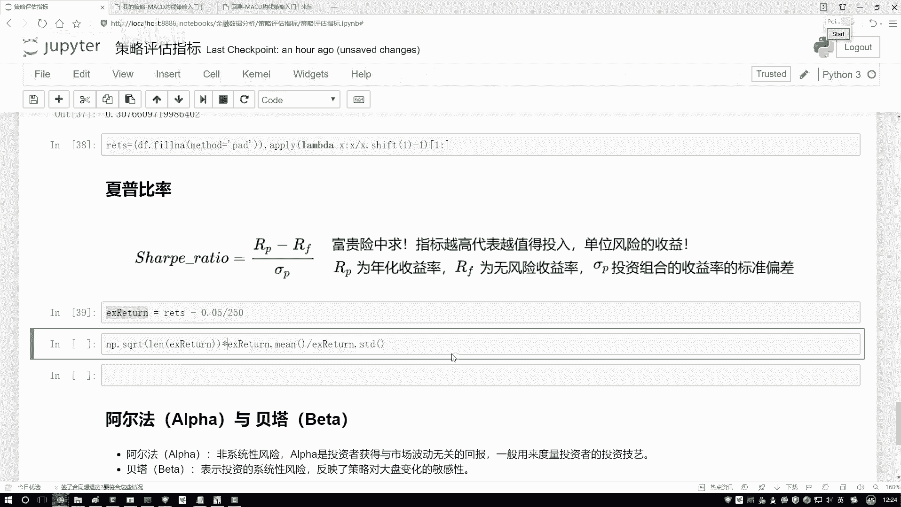
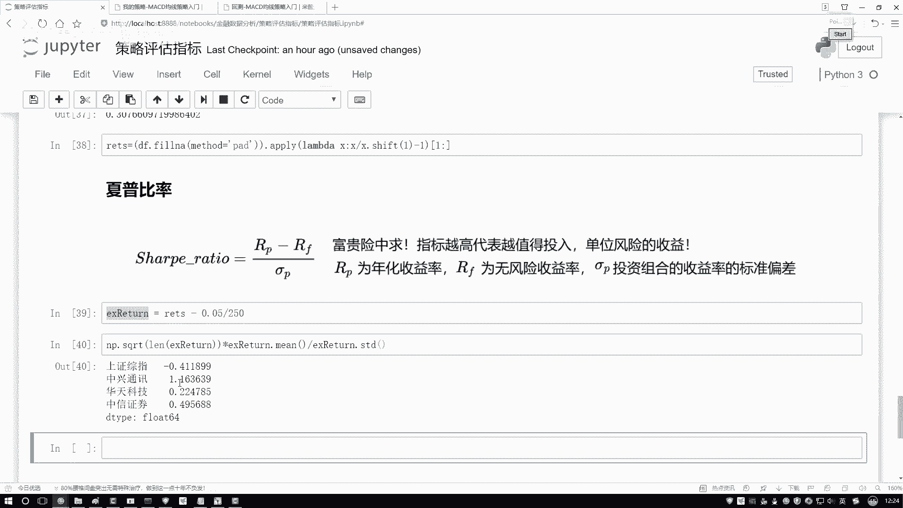
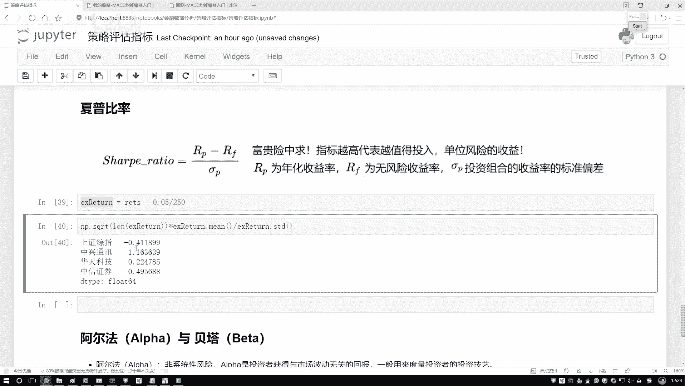
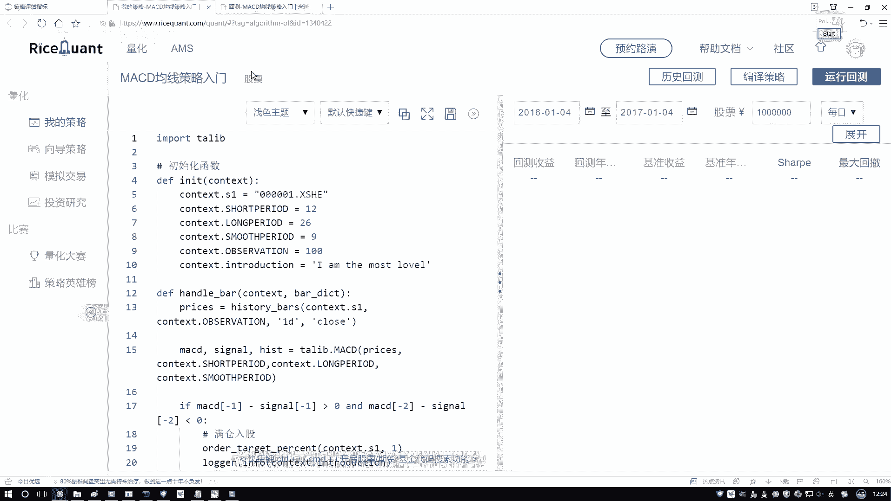
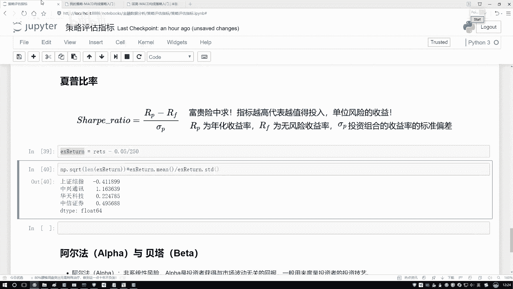

# 人工智能金融量化交易：P31：04-4-夏普比率的作用

在本节课中，我们将要学习一个在金融投资中至关重要的风险调整后收益指标——夏普比率。我们将理解它的核心概念、作用以及如何通过Python进行计算。

## 概述

上一节我们讨论了投资回报率，但仅凭收益高低无法全面评估一项投资的好坏。本节中我们来看看如何衡量“性价比”，即承担单位风险能获得多少超额收益，这正是夏普比率要解决的问题。

## 夏普比率的核心概念

夏普比率描述的是：在投资中，每承担一单位风险，所能获得的超额收益是多少。这个指标越高，意味着投资的“风险性价比”越好。



为了便于理解，可以举一个生活中的例子：一份在战乱地区日薪数万的工作，报酬虽高，但风险巨大。夏普比率就是用来量化这种“高风险是否带来了足够高的回报”。



在选股或构建投资组合时，我们通常会比较多个选项。如果单从夏普比率这个指标来看，我们应选择**夏普比率更高**的那个，因为它意味着在承担相同风险的情况下，能获得更高的收益。



## 夏普比率的计算方法

理解了夏普比率的作用后，我们来看看如何计算它。其核心思想是比较投资组合的收益与无风险收益的差异，再除以投资组合的风险（波动性）。

计算公式如下：

```
Sharpe Ratio = (Rp - Rf) / σp
```

其中：
*   **`Rp`**：投资组合的平均收益率
*   **`Rf`**：无风险收益率（例如国债利率、银行定期存款利率）
*   **`σp`**：投资组合收益率的标准差（代表风险）

这个公式可以理解为：**（投资组合的超额收益）/（投资组合的风险）**。我们期望这个值越大越好。

## Python实战：计算夏普比率

接下来，我们将在Python中实际计算几只股票的夏普比率。我们将使用之前计算好的股票回报率数据。

首先，我们需要准备数据。在计算回报率时，我们已对数据中的缺失值进行了前向填充处理（即用前一天的数值填充当天的缺失值），以确保计算的连续性。

假设无风险年化收益率设为5%，我们需要将其转换为日度数据（因为我们的回报率是日度的）。然后应用夏普比率公式进行计算。

以下是计算夏普比率的关键代码步骤：



```python
# 假设 returns 是一个包含多只股票日度回报率的DataFrame
# 设置年化无风险收益率
risk_free_rate = 0.05
# 转换为日度无风险收益率（假设一年有250个交易日）
daily_risk_free = risk_free_rate / 250

# 计算超额收益（日度）
excess_returns = returns - daily_risk_free

# 计算夏普比率（年化）
# 公式： (超额收益的均值 / 超额收益的标准差) * sqrt(年化因子)
sharpe_ratios = (excess_returns.mean() / excess_returns.std()) * np.sqrt(250)
```

计算完成后，我们可以查看结果：

```python
print(sharpe_ratios)
```

假设我们得到如下结果（示例）：
*   股票A: 0.85
*   股票B: 1.32
*   股票C: -0.15
*   股票D: 0.60

## 结果解读与应用



从计算结果中，我们可以清晰地看到每只股票的夏普比率。以下是分析要点：



*   **股票B（1.32）** 的夏普比率最高，这意味着在我们分析的标的中，投资股票B所承担的单位风险能带来的超额收益是最高的。
*   **股票C（-0.15）** 的夏普比率为负，这表明其收益甚至未能覆盖无风险收益，投资性价比很低，通常不予考虑。
*   在选择投资标的时，在其他条件相近的情况下，我们应优先选择**夏普比率更大**的选项。



通过这个简单的计算与比较，夏普比率帮助我们量化了投资的风险收益比，为决策提供了重要依据。



## 总结



本节课中我们一起学习了夏普比率。我们首先理解了它是一个衡量“风险调整后收益”的核心指标，用于评估承担单位风险所获得的超额回报。接着，我们学习了其计算公式 `(Rp - Rf) / σp` 的含义。最后，我们通过Python实战，演示了如何计算多只股票的夏普比率，并学会了如何解读结果以辅助投资决策。记住，在量化策略中，夏普比率是一个追求**越大越好**的关键评价指标。