# 金融分析与量化交易：05-5：标准化处理方法 📊

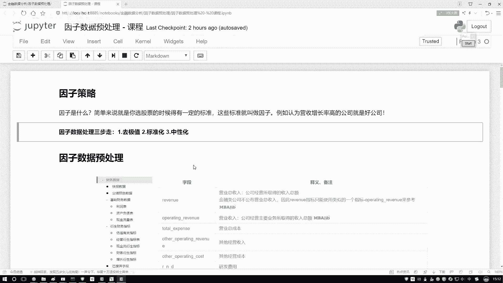

在本节课中，我们将要学习数据预处理中的一个核心步骤——标准化。标准化是机器学习、数据挖掘和金融分析中非常常用的一种技术，其目的是消除不同特征（或指标）之间由于量纲和取值范围不同所带来的影响，使数据更易于分析和建模。

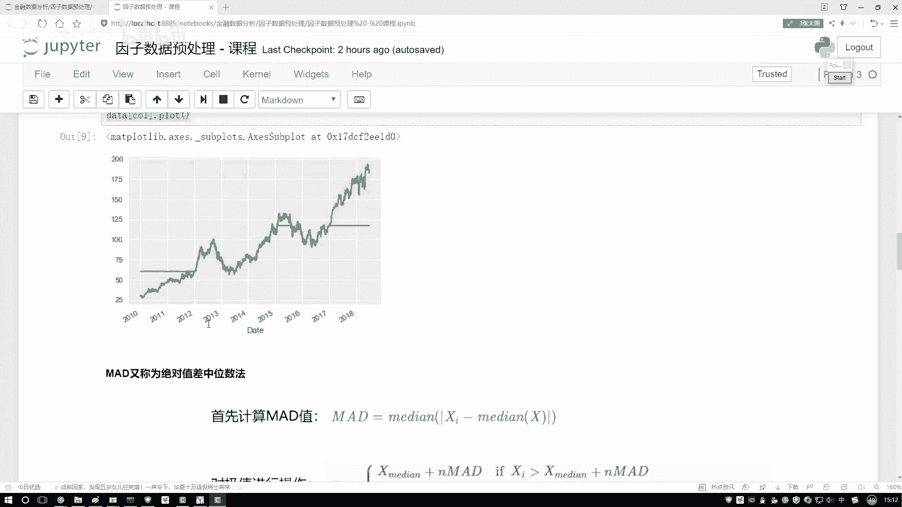

## 标准化的目的与原理

上一节我们介绍了数据预处理的重要性，本节中我们来看看标准化的具体做法。标准化的核心目标是让不同维度的数据具有可比性。

假设我们有一组数据，包含两个特征X1和X2。如下图所示，X1的取值范围较大，而X2的取值范围较小。如果直接使用原始数据进行分析，数值较大的特征可能会在模型中占据主导地位，从而影响结果的准确性。


为了公平地看待每一个特征，我们需要进行标准化处理，使得所有特征都处于相似的尺度上。

## 标准化的公式与步骤

标准化的数学公式非常简单，其核心操作分为两步。

**标准化公式**如下：
`z = (x - μ) / σ`
其中：
*   `x` 是原始数据。
*   `μ` 是该特征所有数据的**均值**。
*   `σ` 是该特征所有数据的**标准差**。

这个公式可以分解为两个清晰的步骤：

1.  **去均值**：`x - μ`
    *   **目的**：将数据集的中心移动到零点。如下图所示，经过此操作后，数据在各个维度上将以零为中心对称分布。
    

2.  **除标准差**：`(x - μ) / σ`
    *   **目的**：调整数据的尺度（取值范围）。标准差反映了数据的离散程度。对于取值范围大的数据，其标准差通常也较大；除以其自身的标准差后，其尺度会被压缩。反之，取值范围小的数据，其标准差也小，尺度变化相对不大。最终，所有特征的尺度被调整到相近的水平。
    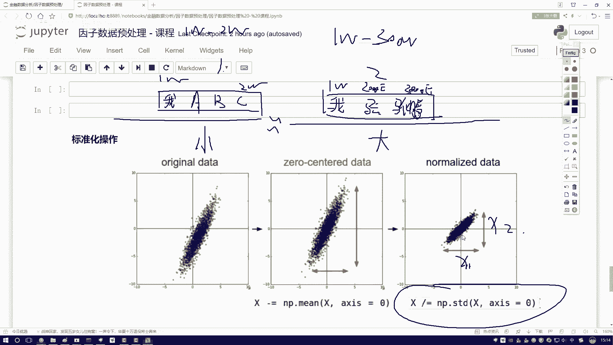

经过这两步操作，数据将同时满足“以零为中心”和“尺度统一”两个条件，如下图所示。

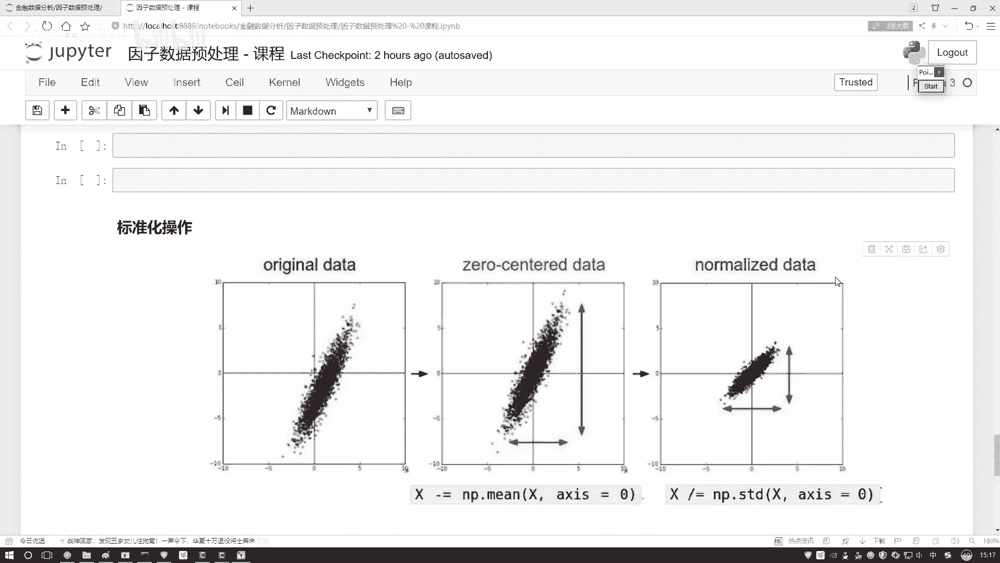

## 使用Python实现标准化

理解了原理后，我们可以用Python代码轻松实现标准化。以下是手动实现的步骤：

首先，我们需要计算数据的均值和标准差。

```python
# 假设 data 是一个Pandas Series或DataFrame的一列
mean_val = data.mean()  # 计算均值 μ
std_val = data.std()    # 计算标准差 σ
```

然后，应用标准化公式。


```python
def standardize(series):
    """
    对输入的Pandas Series进行标准化处理。
    参数:
        series: 待处理的数据序列。
    返回:
        标准化后的数据序列。
    """
    mean_val = series.mean()
    std_val = series.std()
    # 应用公式: (x - μ) / σ
    standardized_series = (series - mean_val) / std_val
    return standardized_series
```


## 使用现成工具库

在实际项目中，我们通常使用成熟的机器学习库来快速完成标准化，例如Scikit-learn。

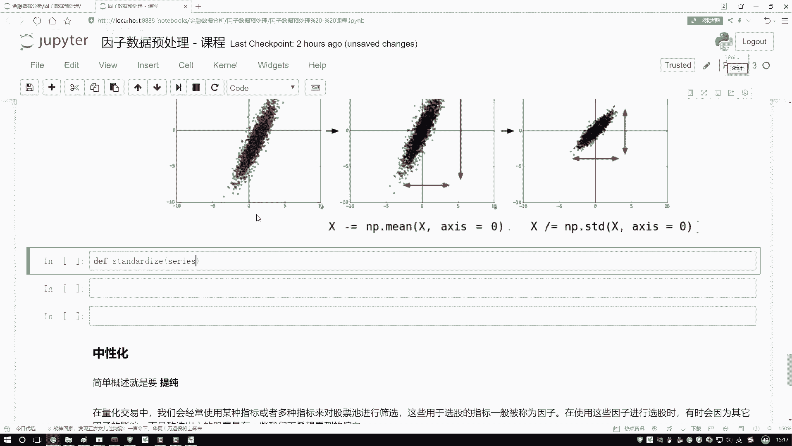

以下是使用Scikit-learn进行标准化的方法：

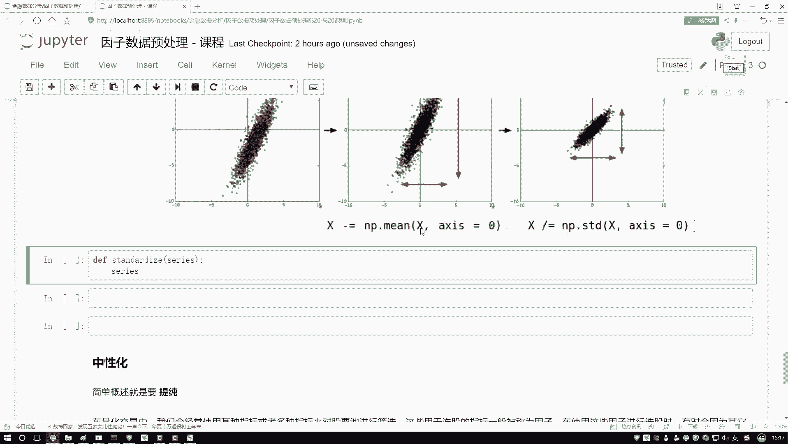

```python
from sklearn.preprocessing import StandardScaler

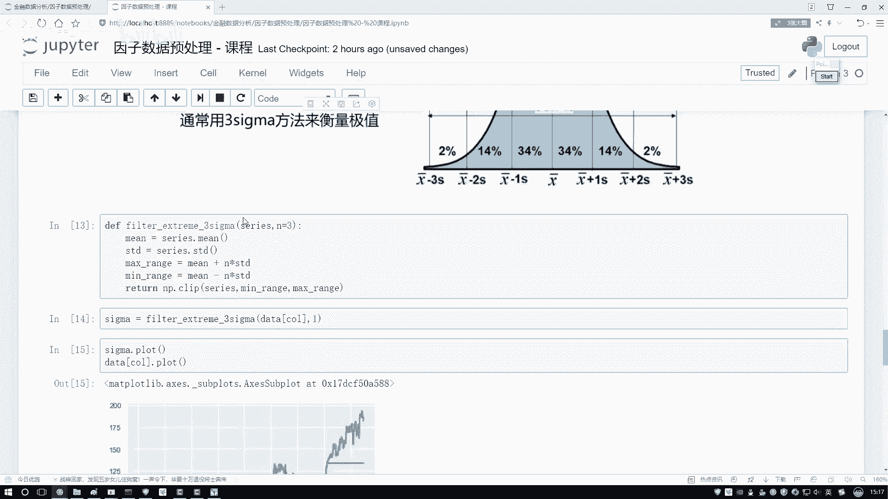

# 创建标准化器对象
scaler = StandardScaler()
# 假设 data 是一个二维数组或DataFrame
# 拟合数据并计算均值和标准差
scaler.fit(data)
# 进行转换
standardized_data = scaler.transform(data)
# 或者一步完成拟合和转换
# standardized_data = scaler.fit_transform(data)
```

使用`StandardScaler`的好处是，它能够方便地保存计算出的均值和标准差，用于后续对新数据的相同转换，保证处理的一致性。

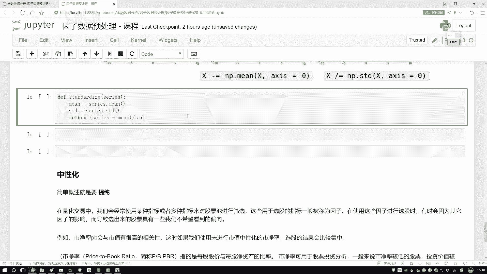

## 效果演示

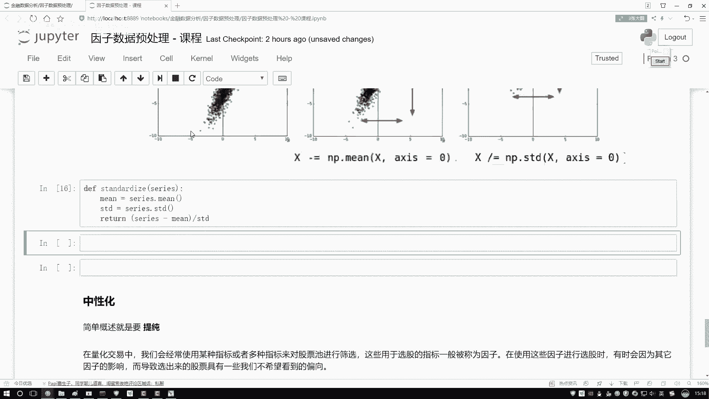

让我们通过一个简单的例子来观察标准化的效果。

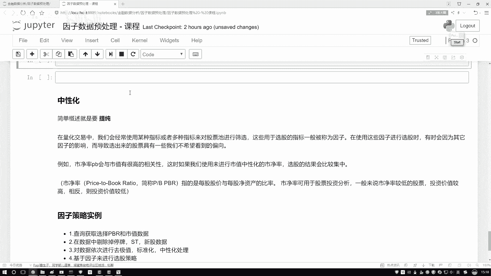

首先，查看原始数据。可以看到，不同特征的数值范围差异很大。

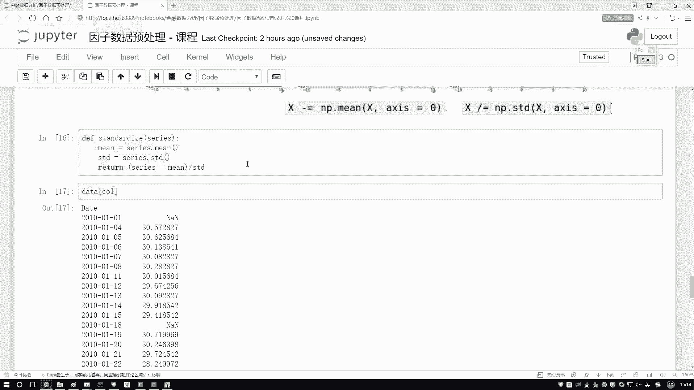

然后，应用我们编写的`standardize`函数。

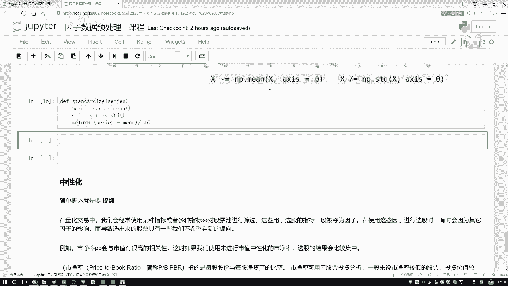

```python
standardized_result = standardize(data)
print(standardized_result)
```


查看标准化后的结果，所有特征的数值都被转换到了一个较小的、以零为中心的区间内。

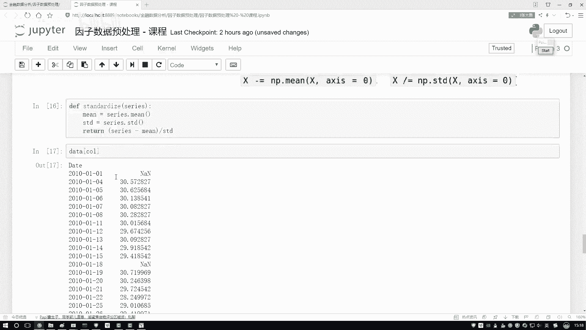

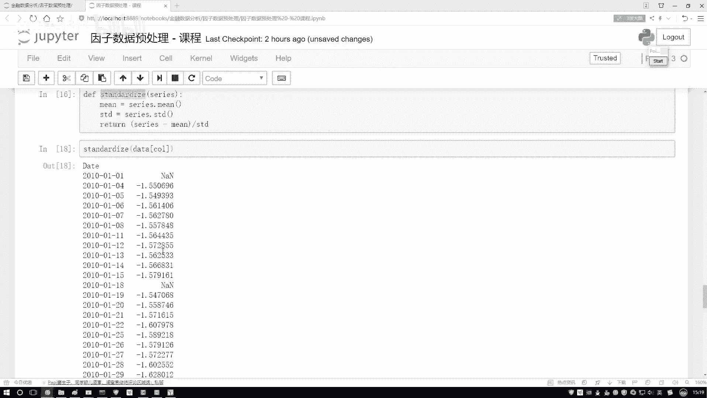

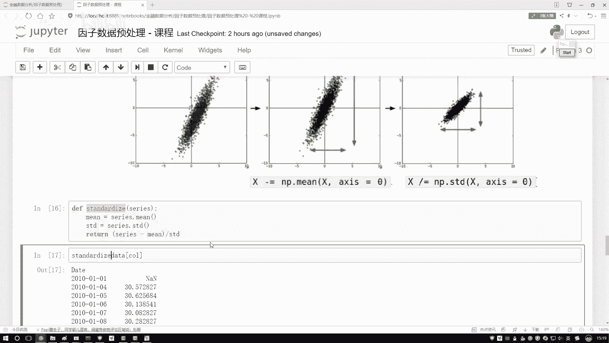

## 总结


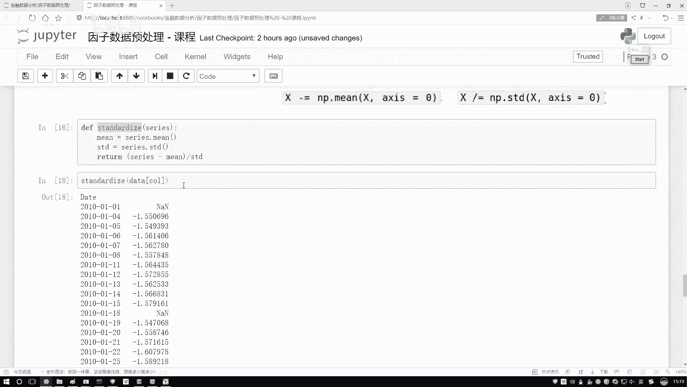

本节课中我们一起学习了数据标准化处理。我们首先明确了标准化的目的：消除不同特征间量纲和取值范围的差异，使模型能够公平地学习所有特征。

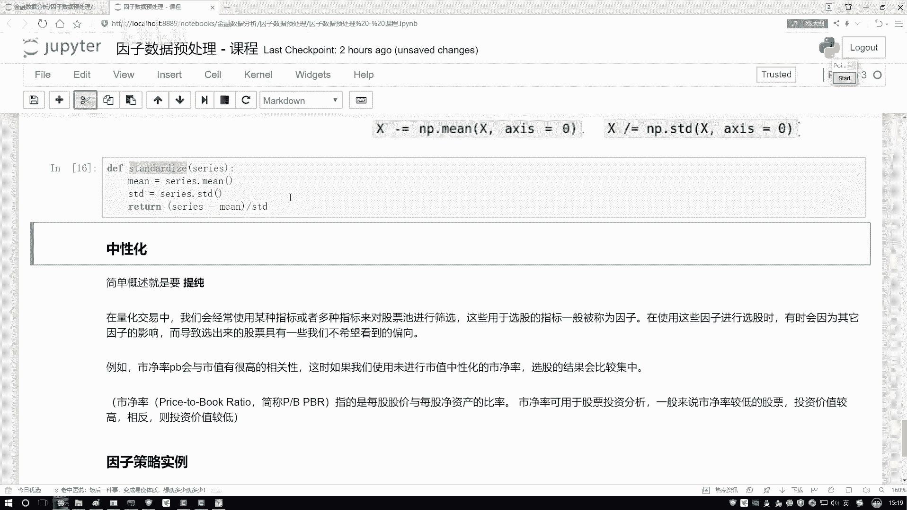

我们深入探讨了标准化的原理，其核心公式为 `z = (x - μ) / σ`，该操作分为两步：
1.  **去均值**：使数据分布以零为中心。
2.  **除标准差**：使所有特征的尺度（离散程度）统一。

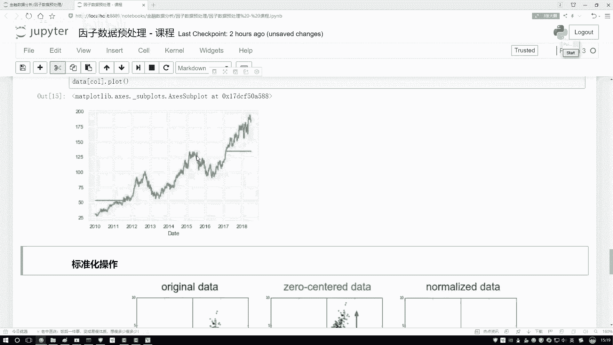

接着，我们手动实现了标准化的Python函数，并介绍了如何使用Scikit-learn库中的`StandardScaler`工具更高效地完成此任务。最后，通过对比标准化前后的数据，直观地看到了标准化的效果——数据被规范到相似的尺度范围内。

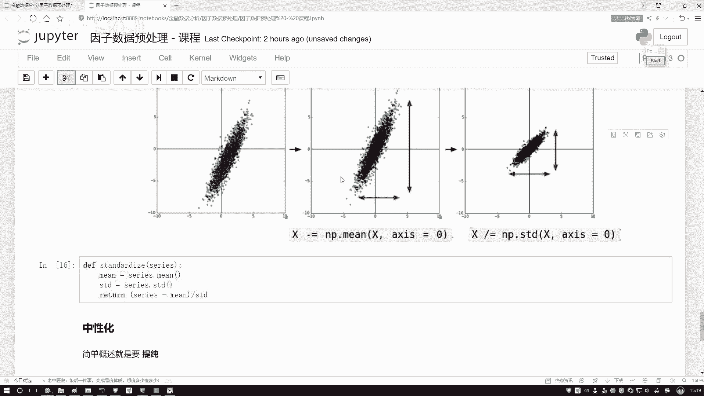

标准化是数据预处理中至关重要且常用的一步，掌握它将为后续的金融分析、量化建模和机器学习任务打下坚实的基础。