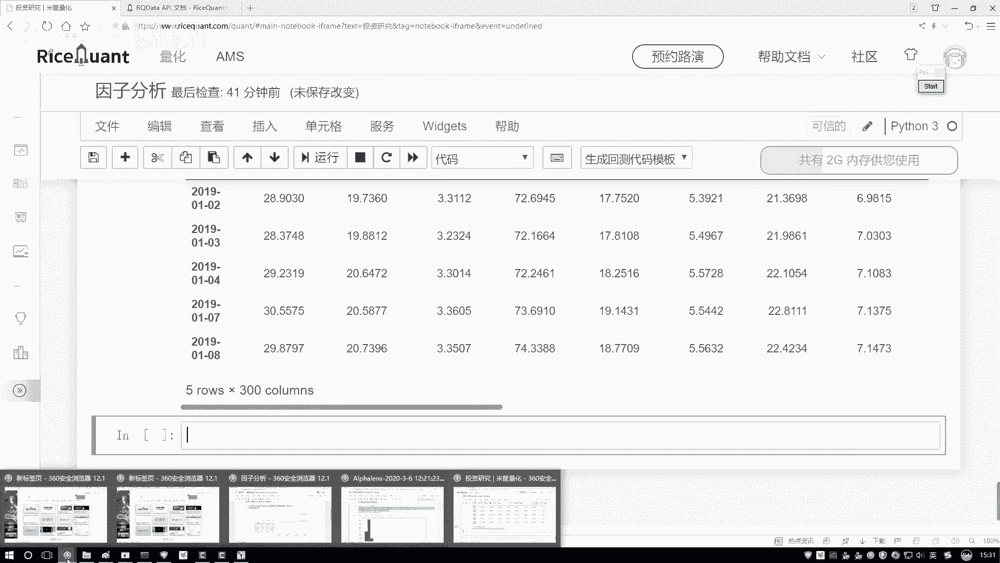
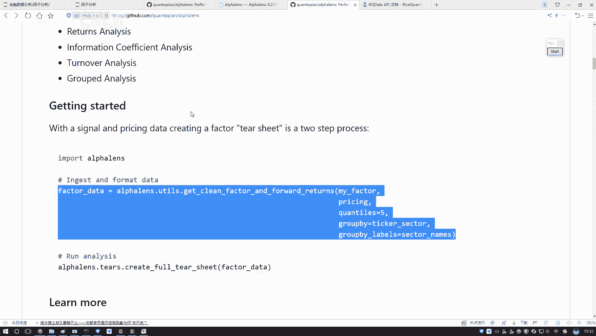
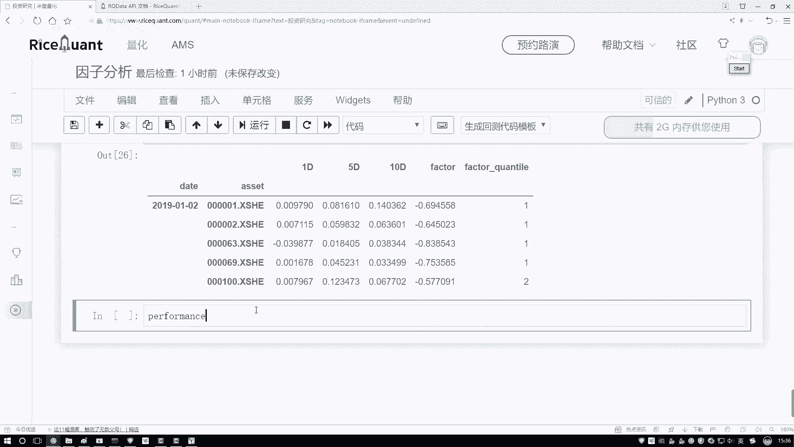
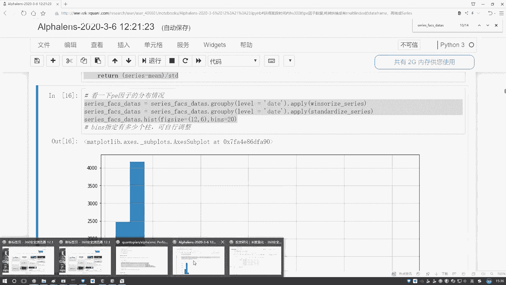
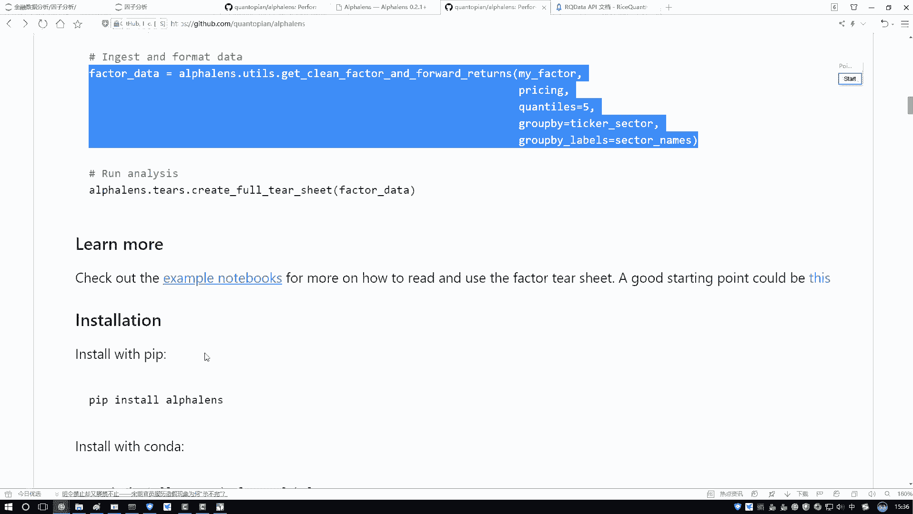
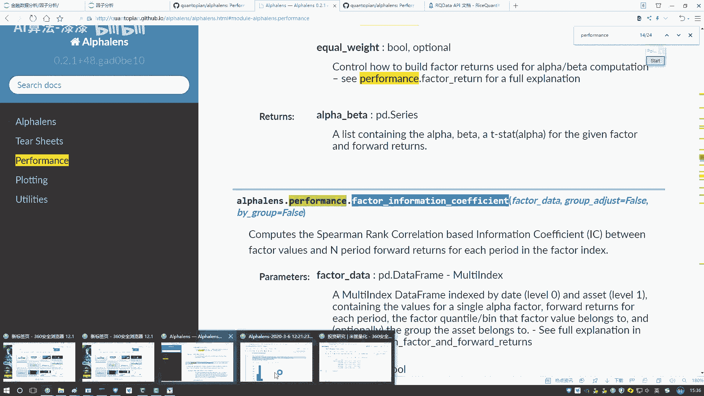
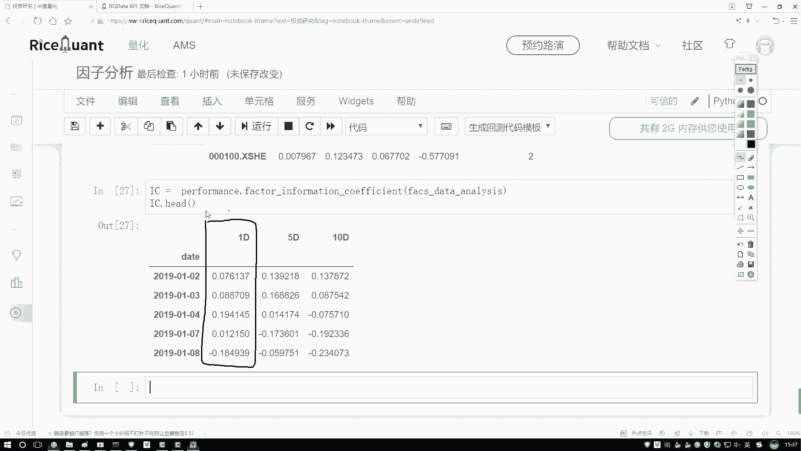

# 人工智能金融量化分析：P57：06-6-IC指标值计算

在本节课中，我们将学习如何计算IC（信息系数）指标值。IC值是衡量因子（如技术指标）预测未来收益率能力的关键指标。我们将通过获取股票价格数据、计算收益率、进行数据格式转换，最终计算出IC值。

## 获取收盘价数据

上一节我们介绍了因子的计算，本节中我们来看看如何获取计算IC值所需的实际收益率数据。首先，我们需要获取股票池中所有股票在指定时间段内的每日收盘价。

以下是获取收盘价数据的步骤：

*   使用 `get_price` 函数。
*   传入股票代码列表（股票池）。
*   指定起始日期（`start_date`）和结束日期（`end_date`）。

```python
# 示例：获取股票池的收盘价数据
price_data = get_price(stock_pool, start_date='2019-01-01', end_date='2020-01-01')
```



执行后，`price_data` 是一个包含多维度价格信息的数据结构。我们通常只关心收盘价，因此可以将其提取并转换为二维的 `DataFrame`，以便于后续处理。

```python
# 提取收盘价并整理数据格式
close_price = price_data['close']  # 假设返回数据中包含'close'字段
close_price.index.name = 'date'
close_price.columns.name = 'code'
```



现在，我们得到了一个清晰的二维表格，索引是日期，列名是股票代码，表格内的值是每日的收盘价。

## 数据格式转换

有了因子数据和价格数据后，我们需要将它们转换为特定库函数要求的统一格式，以便计算IC值。这个转换过程通常由一个工具函数完成。

以下是数据格式转换的说明：

*   需要传入两个参数：处理好的因子数据和处理好的价格数据。
*   该函数会对数据进行对齐、重采样等操作，并计算不同持有期（如1天、5天、10天）的收益率。
*   转换后的数据会包含因子值、因子分组以及对应的未来收益率。

```python
# 示例：使用工具函数转换数据格式（函数名和参数需根据实际库调整）
formatted_data = utils.convert_to_analysis_format(factor_data=processed_factor, price_data=close_price)
```

转换后的数据结构中，`factor` 列是因子值，`1D`、`5D`、`10D` 等列是对应持有期的未来收益率。此外，函数通常会自动根据因子值的大小进行分组（例如分为5组），`factor_quantile` 列就表示该因子值所属的组别（1代表最小组，5代表最小组）。

## 计算IC值

数据准备就绪后，我们就可以计算核心的IC指标了。IC值本质上是因子值与未来收益率之间的秩相关系数（Rank IC）。





以下是计算IC值的步骤：



*   调用性能分析模块中的特定函数（例如 `performance.calc_information_coefficient`）。
*   将上一步格式化好的数据传入该函数。
*   函数会返回一个包含每日IC值序列的结果。

```python
# 示例：计算IC值
ic_series = performance.calc_information_coefficient(formatted_data)
```



计算完成后，我们可以查看结果。IC值序列展示了该因子在不同日期的预测能力。通常，我们会进一步分析IC值的均值、标准差、胜率（IC>0的比例）等统计量来综合评价因子的有效性。



本节课中我们一起学习了IC指标值的完整计算流程：从获取基础价格数据，到进行必要的数据格式转换，最后计算出衡量因子预测能力的IC值。这是量化因子研究中至关重要的一步，为后续的因子评价与筛选奠定了基础。