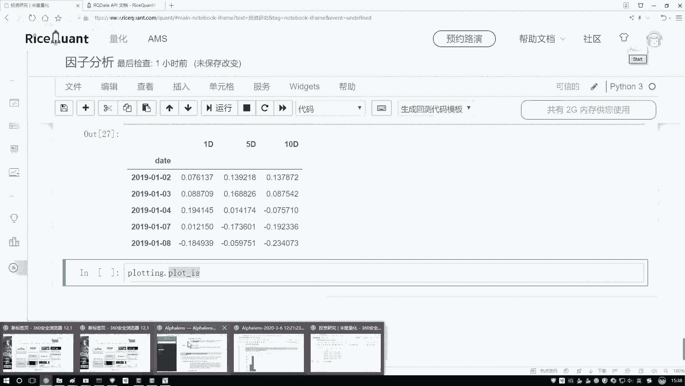
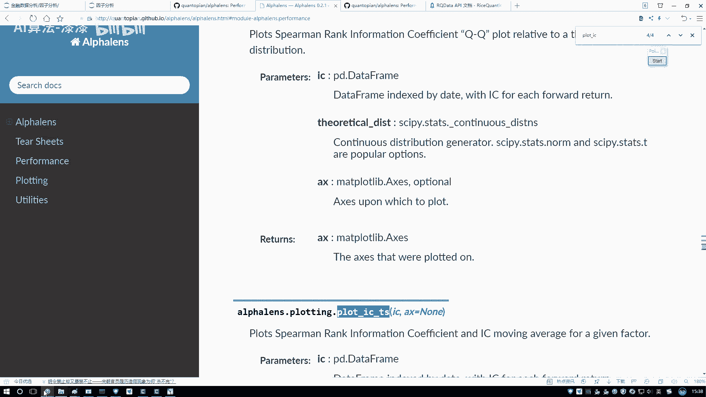
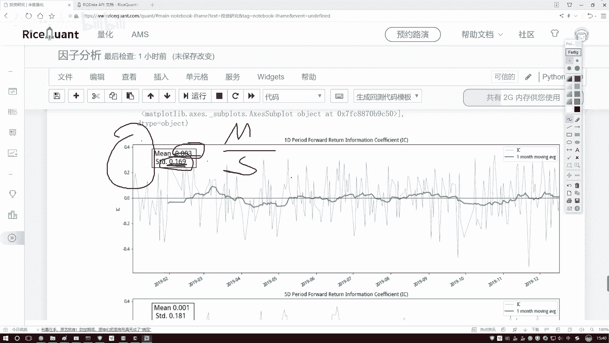
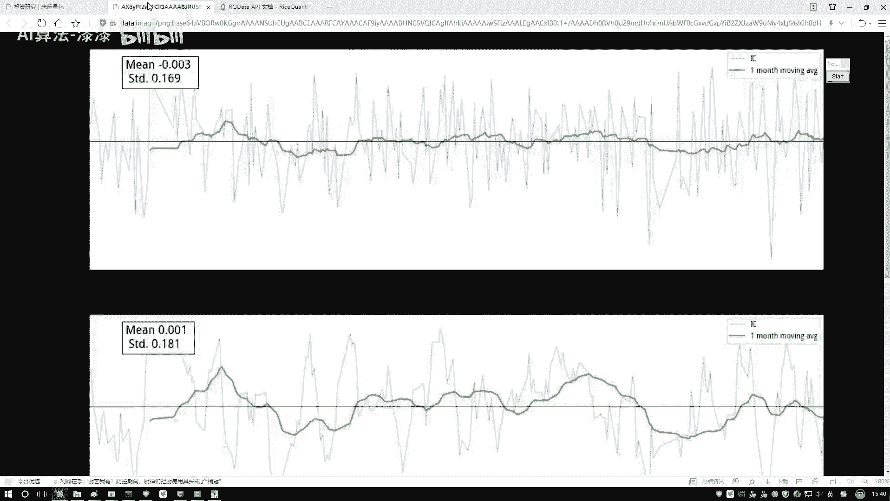
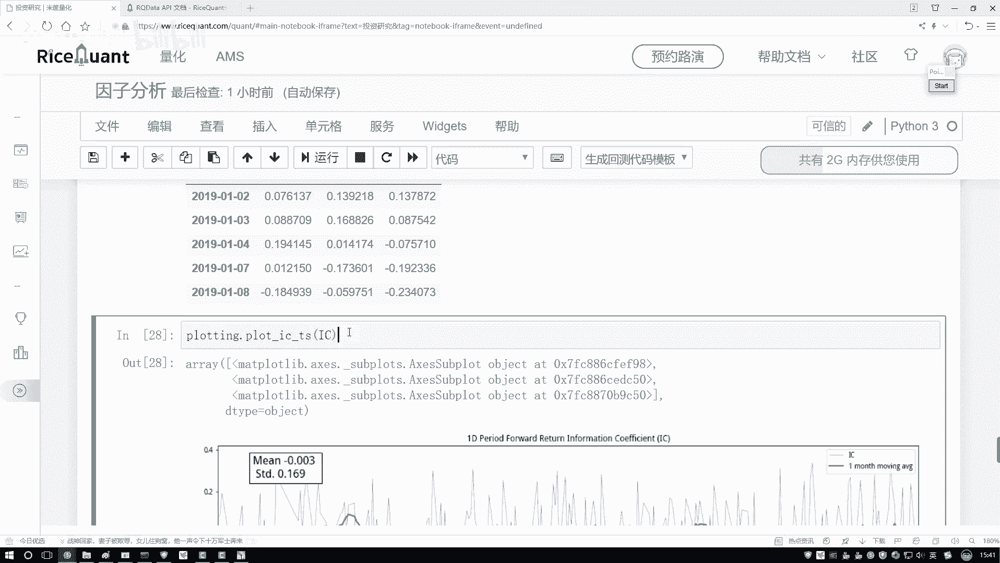
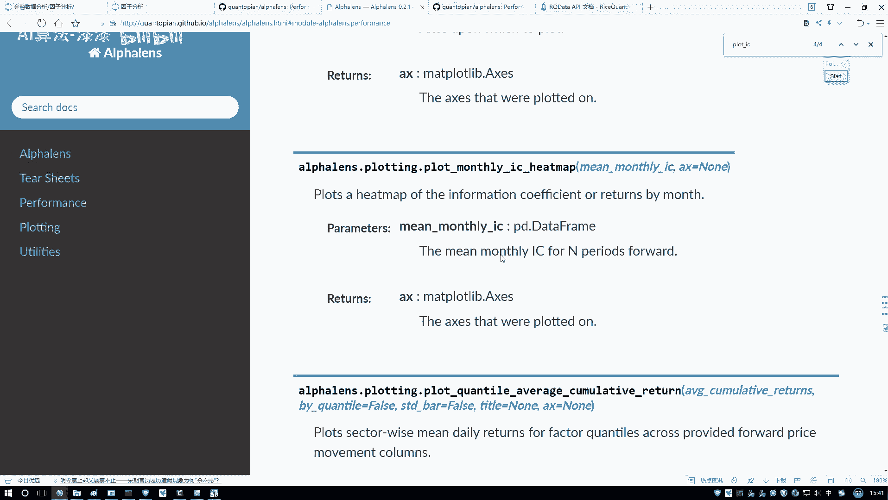
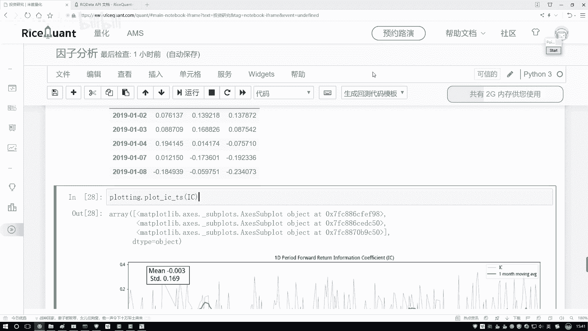

# 人工智能金融量化分析：P58：07-7-工具包绘图展示

在本节课中，我们将学习如何使用工具包对计算出的因子IC值进行可视化分析。通过绘制时间序列图，我们可以更直观地观察因子与收益率相关性的稳定性与趋势。

上一节我们介绍了如何计算因子的IC值（信息系数），本节中我们来看看如何将这些数值结果通过图表进行展示和分析。

## 绘图工具导入与使用

我们首先需要导入用于绘图的工具包。以下是导入和调用绘图函数的代码：



```python
# 导入绘图工具包
import alphalens
# 调用绘制IC时间序列图的函数
alphalens.plotting.plot_ic_ts(ic_data)
```

执行上述代码后，工具包会自动生成IC值的时间序列图。



## 图表结果解读

生成的图表包含以下关键元素：

*   **蓝色折线**：代表每日计算的实际IC值。其波动范围通常较大，直接观察趋势可能不够明显。
*   **绿色折线**：代表以一个月为窗口计算的IC值移动平均线。它平滑了日度数据的噪声，更能反映因子的长期趋势。
*   **统计信息**：图表通常会标注IC值的均值（Mean）和标准差（Std），以及由 **均值 / 标准差** 计算得出的信息比率（Information Ratio）。

在分析时，我们应主要关注绿色移动平均线的走势。理想的因子其IC值应保持稳定且为较大的正值。从当前示例图来看，绿色线走势较为平稳，且均值较小，这可能意味着该因子与收益率的相关性不强，预测能力有限。

## 信息比率（Information Ratio）简介

信息比率是评估因子稳定性的一个重要辅助指标，其计算公式为：

**信息比率 = IC均值 / IC标准差**

该比值越大，说明因子的IC值越稳定（标准差小），预测能力的一致性越高。反之，则说明因子的有效性波动较大。

## 多周期分析



除了展示单个周期的IC序列，工具包通常还支持查看不同计算周期（例如5日、10日）的IC分析结果。这有助于我们从多个时间维度评估因子的特性。



## 其他可视化功能

Alphalens工具包提供了丰富的分析图表，用于深入评估因子。以下是部分其他可绘制的图表类型：



*   **IC值直方图**：查看IC值的分布情况。
*   **QQ图**：检验IC值是否服从正态分布。
*   **热力图**：用颜色深浅展示不同分组或不同时间段的IC值表现。



这些高级功能在大家后续进行深入的因子研究和策略构建时会非常有用，本节课暂不逐一演示。



本节课中我们一起学习了如何使用Alphalens工具包对因子IC值进行可视化。我们绘制了IC时间序列图，学会了观察移动平均线以判断因子趋势，并了解了信息比率这一稳定性指标。图表化分析使我们能更直观、有效地评估因子的质量，这是量化研究中的关键一步。