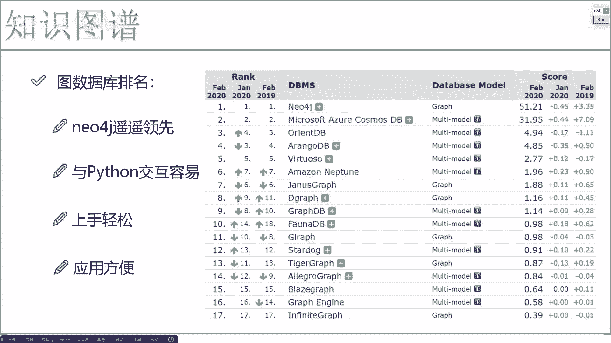
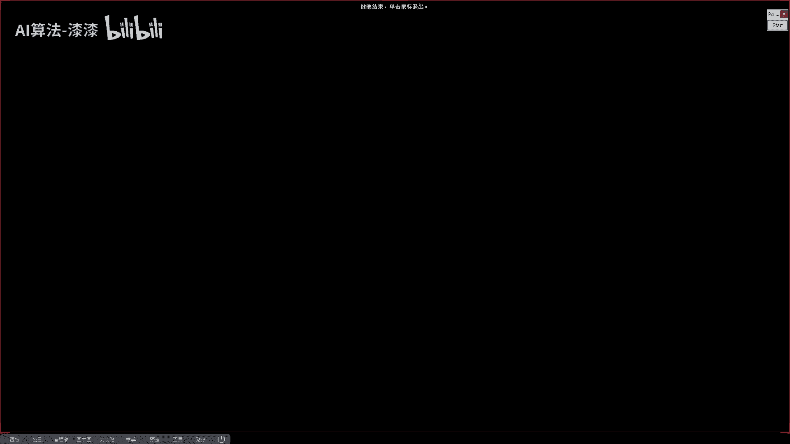
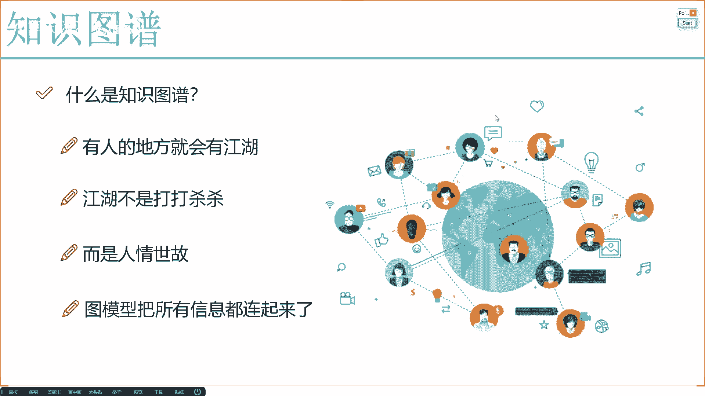

# 知识图谱实战：P9：知识融合与总结分析

在本节课中，我们将要学习知识图谱构建中的关键环节——知识融合，并探讨业务与算法在知识图谱项目中的重要性。最后，我们将对知识图谱的整体概念和应用进行总结。

## 知识融合：整合多源数据

上一节我们介绍了知识图谱的基本构成，本节中我们来看看如何将不同来源的数据整合到图谱中，即知识融合。

在图谱构建中，我们希望纳入大量数据与信息。构建这些数据的方法，需要结合实际业务场景来思考。

例如，在一个电商平台的业务场景中，我们拥有用户和商品。用户与商品本身都具有属性。用户画像和商品标签等特征数据可以轻松获取。同时，用户与商品交互过程中产生的行为数据，例如点击商品、加入购物车、购买或投诉商品，构成了一个关系网络。基于这个关系网络，我们可以构建图模型，并从中抽取特征，用于图嵌入（Graph Embedding）等任务。

此外，用户在购买商品时撰写的评论、搜索时使用的关键词，或在社交聊天中提及的推荐内容，都属于文本信息。这些文本信息同样可以通过嵌入（Embedding）技术转换为向量表示。

还有，用户浏览商品时，在某个包含视频或营销图片的页面停留较长时间。这些视频和图片数据也能被分析，例如理解视频含义或将图片转换为向量。

以上所提的要点，核心在于**知识融合**。所谓知识融合，是指将当前所有可用的特征和数据，都通过嵌入技术转化为向量，并最终融入到决策系统或推荐系统中。无论使用何种系统，都需要算法支撑，而算法通常要求输入是特征向量。因此，知识融合是知识图谱中一个非常庞大的领域。

这也解释了为什么知识图谱不应仅被视为自然语言处理（NLP）领域，它实际上是一门高度交叉的学科，涉及与图像、文本、语音等多种数据场景的交互。

## 业务与算法：孰轻孰重？

在知识融合过程中，最后需要探讨的一点是：在知识图谱领域，业务和算法哪个更重要？

业务和算法都非常重要。但在知识图谱领域，**业务理解通常比算法本身更为关键**。

之前介绍的风控、金融、医疗等不同应用场景中，所需完成的具体任务差异巨大。因此，构建知识图谱时，熟悉业务比精通算法更重要。因为大多数情况下，算法是通用的，例如命名实体识别、图嵌入、以及对图像、文本、结构化数据的编码算法，其核心思想大同小异。

最关键的一点在于如何从业务和结构角度设计知识图谱，例如确定需要包含哪些实体以及它们之间的关系。知识图谱中的算法通常比较固定，但业务需求千差万别，因此业务理解在知识图谱项目中往往更为重要。

后续讲解实际案例时，大家会发现，我们总是先介绍场景和目标，再讲解设计思路。最困难的部分正是基于业务进行设计。之后的任务流程和算法应用，则相对固定。

## 图数据库选择与实践

知识图谱的组成之前已经介绍过，不再赘述。后续案例中，我们会讲解图数据库的使用。

这里先给出一个简单的印象和推荐：在图数据库中，目前使用最广泛、最流行的是 **Neo4j**。

面对众多数据库，不建议随意选择。应该选用最简单、最方便、用户最多的。Neo4j在图数据库领域处于遥遥领先的地位。因此，在实际使用中，无需犹豫，也不必过分关注其他数据库的效果。

不要因为某些公众号或新闻宣传某个机构新开源了数据库就去尝试。因为在学习使用过程中难免遇到问题，如果使用较新或小众的开源工具，一旦报错，很难找到解决方案、代码模板或相关案例。

因此，建议直接选择 Neo4j。我们后续的案例也将基于它进行。不仅如此，Neo4j 与 Python 的交互也非常容易。一旦能够方便地与 Python 交互，实际应用起来就会特别便捷，因为 Python 是“万金油”语言，能与各种业务结合，无论是封装 Web 框架，还是与神经网络、机器学习、视觉、声音、文本处理结合。

例如，我们可以在 Python 中执行 Cypher 查询语句，来获取图中的特定指标和信息。因此，使用起来非常容易。后续我们会详细介绍图数据库如何与 Python 进行实际交互。

## 知识图谱任务与应用展望

在知识图谱中，后续我们要完成的任务主要包括：

*   **简单查询**：使用 Cypher 等查询语言进行数据检索。
*   **复杂推理**：基于图谱进行逻辑推断，辅助决策。
*   **图嵌入与上层应用**：对图谱进行编码，并应用于更上层的任务。

知识图谱的应用领域也相当广泛。从当前发展来看，知识图谱已有许多落地项目。展望未来，在物联网时代，数据量将爆炸式增长，由此构建的网络和图模型也会越来越庞大。只要有数据，凭借人类的智慧，相关技术必将快速发展，使得图谱构建得更好，在商业、互联网等领域的应用点也会更多，你会看到更多与实际生活紧密结合的项目。

## 总结

本节课中我们一起学习了：
1.  **知识融合**的核心概念，即整合多源数据（文本、图像、行为等）并将其向量化，以融入各类系统。
2.  在知识图谱项目中，**深入理解业务**往往比选择特定算法更为关键。
3.  图数据库的实践推荐是使用 **Neo4j**，因其社区活跃、与Python交互方便。
4.  知识图谱的主要任务包括查询、推理和嵌入应用，其应用前景随着数据增长将越来越广阔。

这就是我们对知识图谱的整体介绍。