# Python金融分析量化交易：P41：2-Alphalens工具包介绍 📊

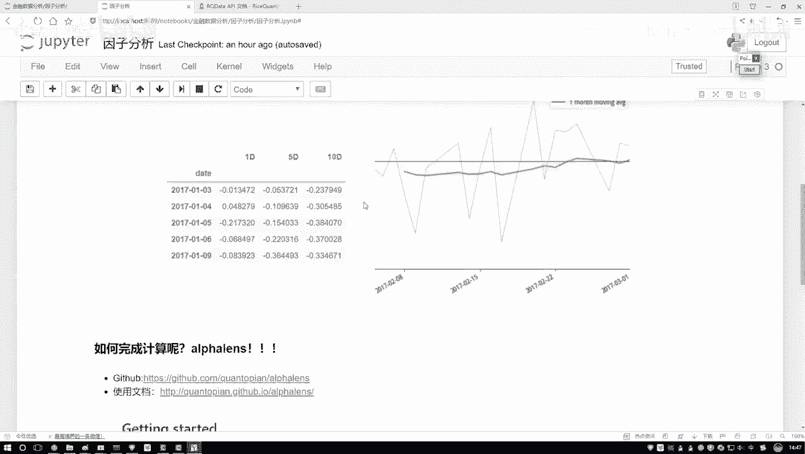

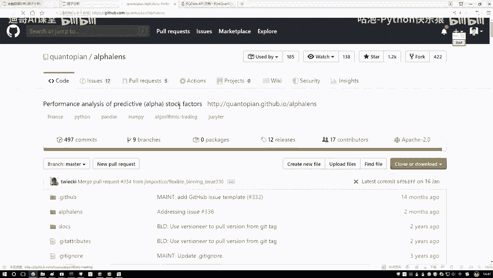

在本节课中，我们将要学习一个名为Alphalens的强大工具包。该工具包专门用于因子分析，能够帮助我们自动化地计算各类量化指标并生成可视化图表，从而极大地简化我们的分析工作流程。

## 工具包简介与获取

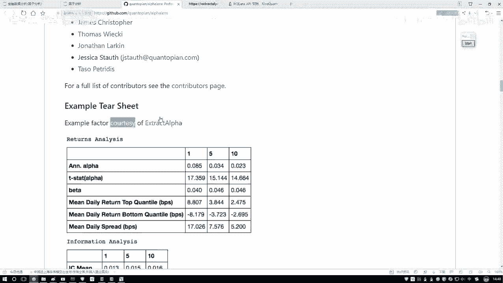

上一节我们介绍了量化分析的基本概念，本节中我们来看看如何利用现成工具提升效率。Alphalens是一个功能丰富的因子分析工具包，其核心价值在于将复杂的计算和绘图过程封装起来，使我们无需从零开始编写代码。

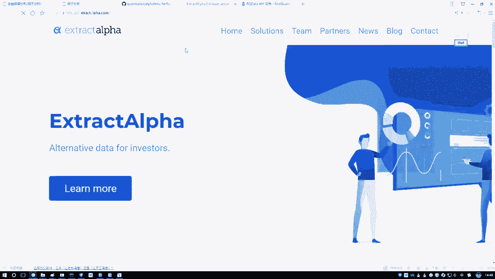

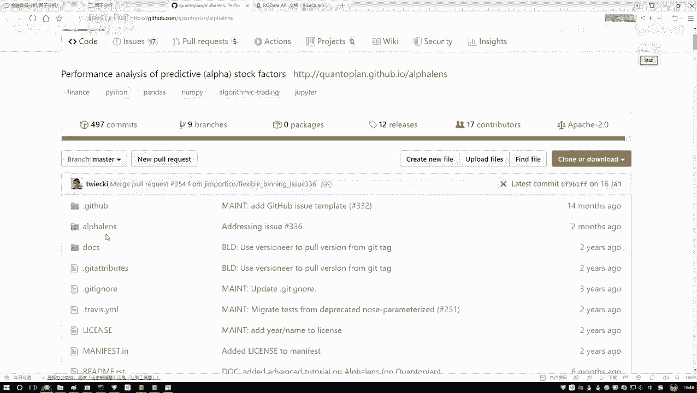

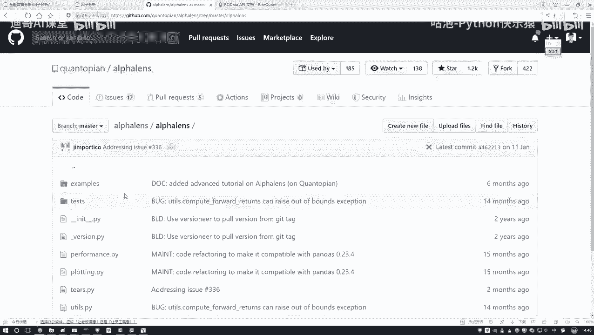

以下是关于Alphalens工具包的基本信息：
*   **官方资源**：该工具包在GitHub上开源，并提供了详细的使用文档。
*   **安装方式**：在本地环境中，可以通过简单的pip命令进行安装，即 `pip install alphalens`。
*   **平台集成**：在我们即将使用的量化分析平台中，Alphalens已经预先安装好，可以直接调用，这省去了本地配置的麻烦。

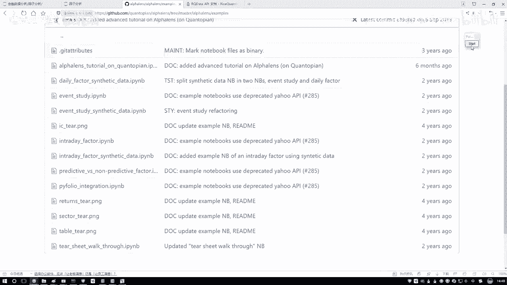

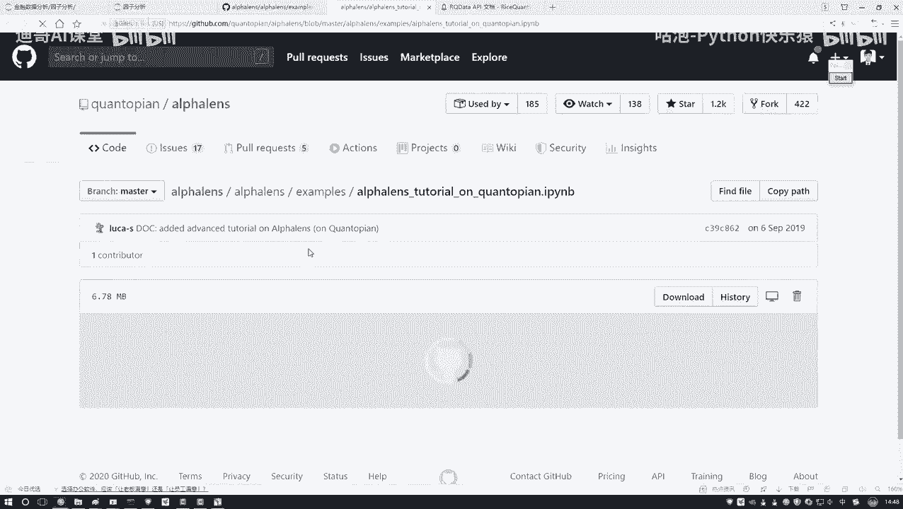

对于初学者，建议参考官方提供的示例（Sample）文档来学习基本用法。这些示例是掌握工具包功能的最佳途径。

## 分析环境搭建

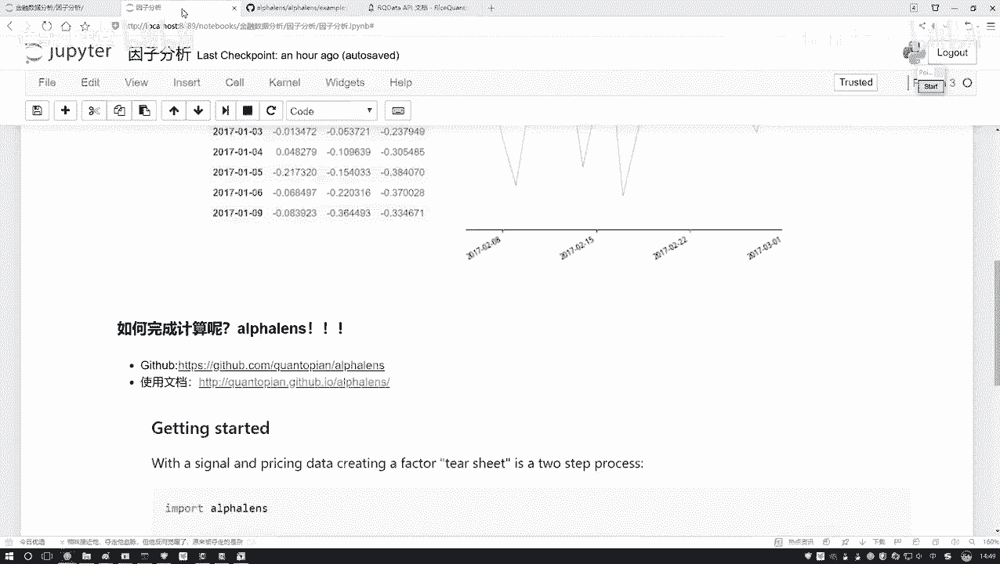

了解了工具包后，我们需要一个合适的环境来运行代码。由于直接在本地的Notebook中获取金融数据和处理指标较为繁琐，我们将使用专门的量化分析平台。

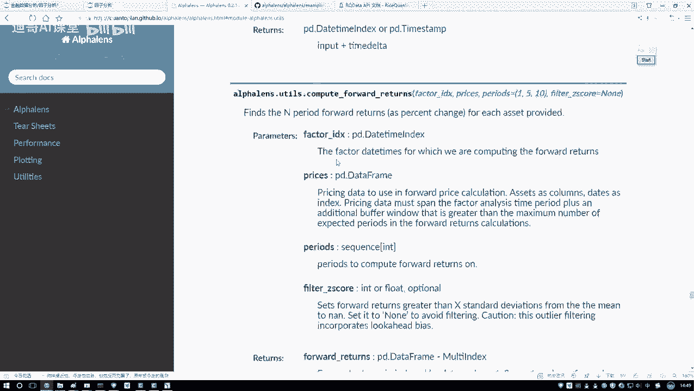

该平台提供了“投资研究”模块，其界面与Jupyter Notebook类似，但运行在平台的服务器上，便于直接获取数据和调用已集成的工具包。

以下是进入分析环境的步骤：
1.  在平台左侧导航栏中找到并点击“投资研究”。
2.  在打开的界面中，新建一个Python 3 Notebook。
3.  我们可以将此Notebook命名为“因子分析”，作为本次课程的工作文件。

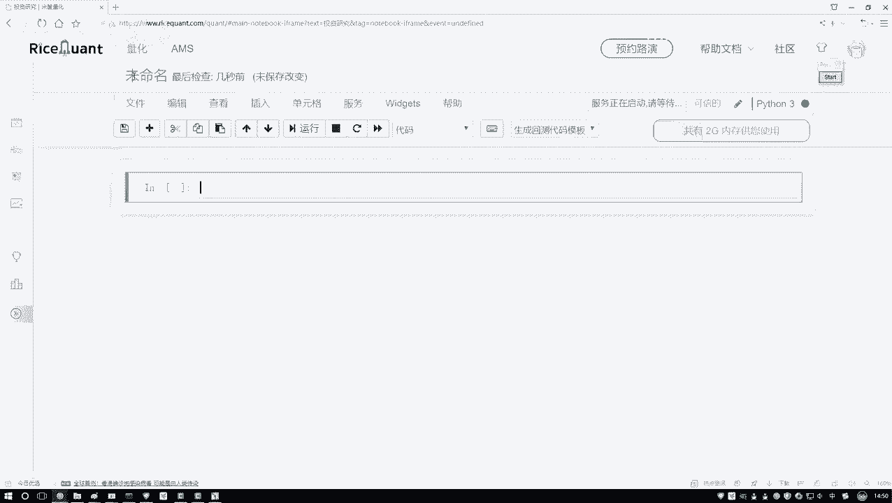

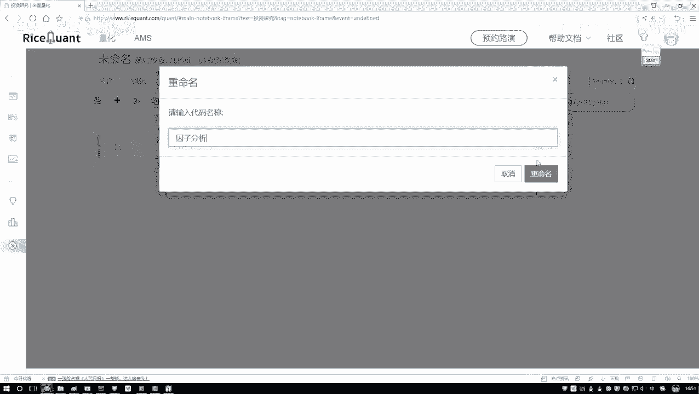

接下来，我们将在这个Notebook中编写和运行代码。课程中会提供完整的代码片段，你可以直接复制到平台中使用，或者跟随视频讲解逐步编写。

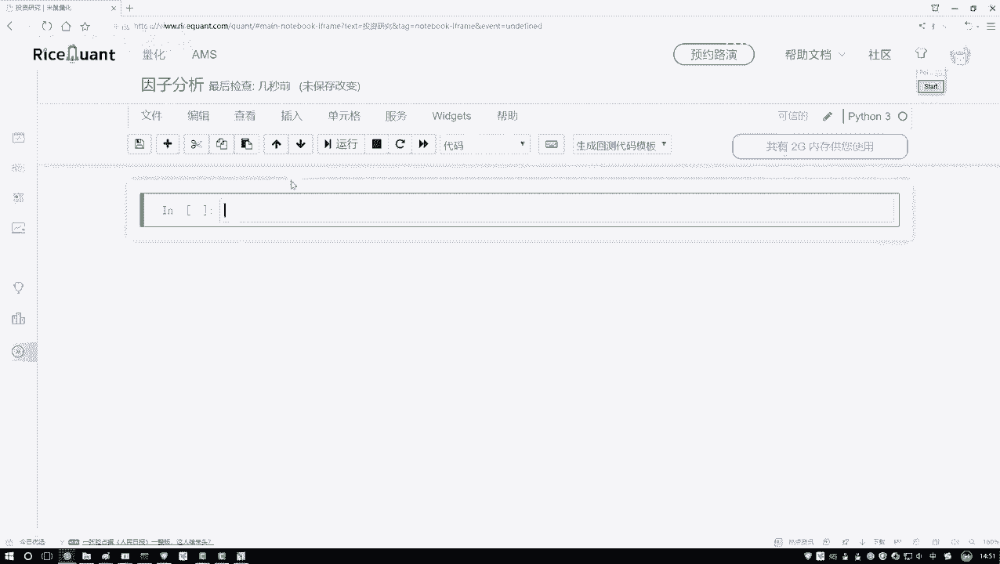

本节课中我们一起学习了Alphalens工具包的用途、获取方式以及如何在量化平台中搭建分析环境。该工具能自动化完成因子分析中的计算与绘图任务，而平台则为我们提供了便捷的数据和计算资源。在接下来的实践中，我们将直接应用这个工具进行具体的因子分析。