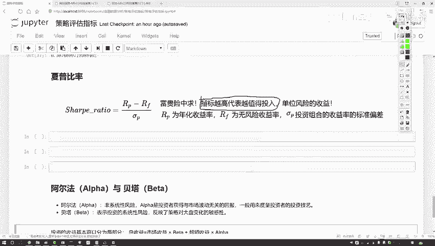
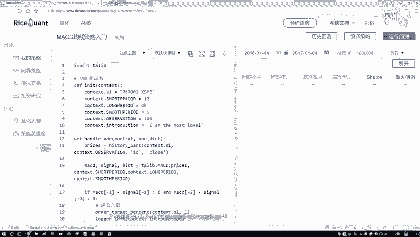
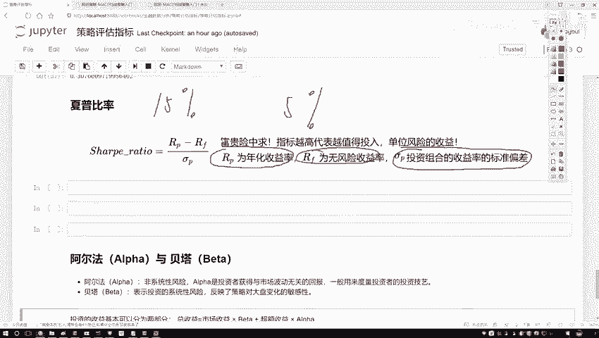
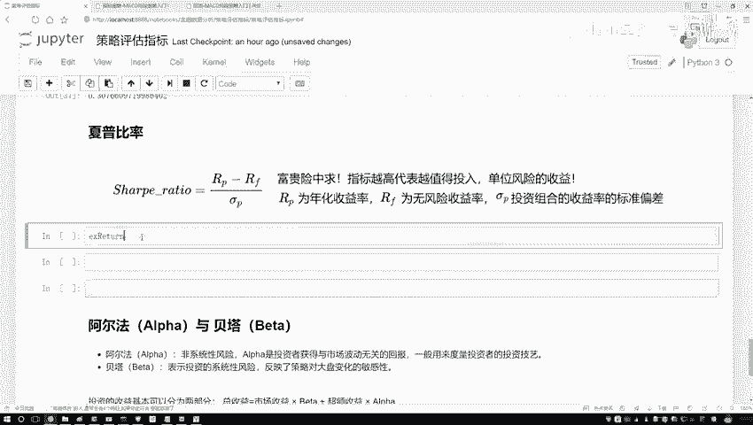
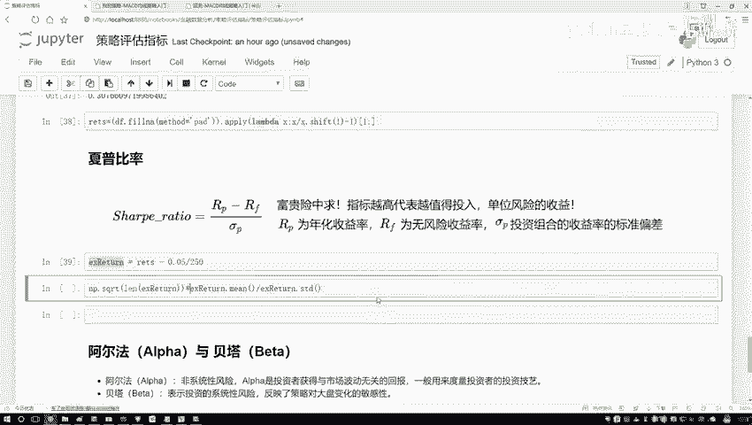
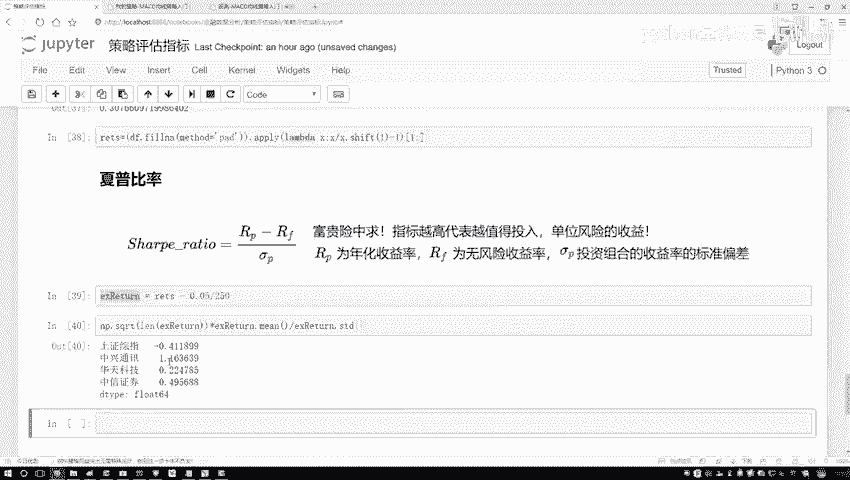
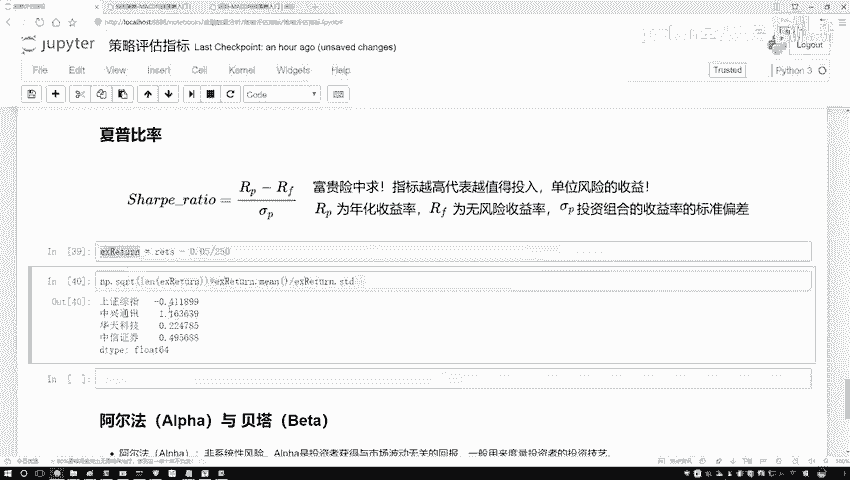
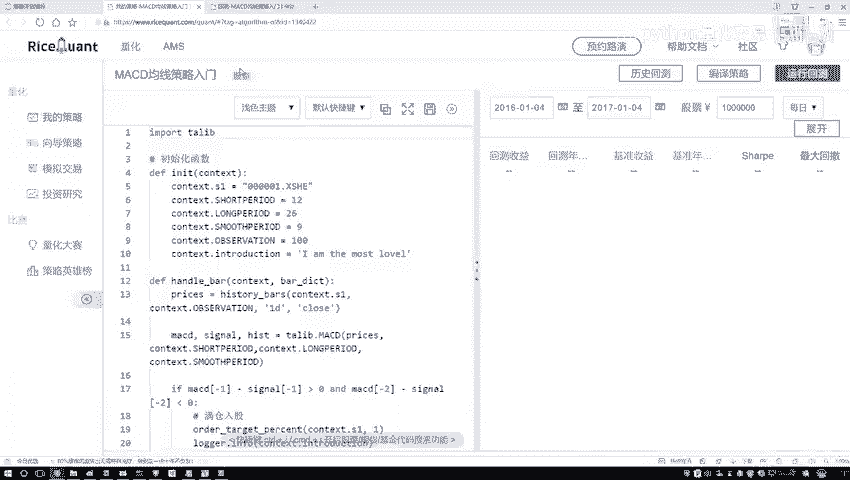
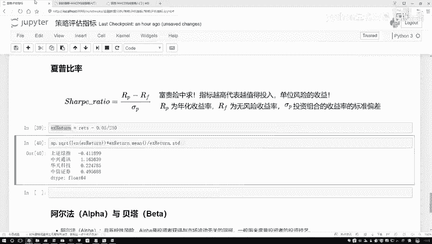

# Python金融时间序列分析与量化交易实战教程：P16：15.夏普比率的作用 📈

在本节课中，我们将要学习一个在金融投资中至关重要的评估指标——夏普比率。我们将理解它的含义、计算方法，并学习如何在Python中计算它，以帮助我们评估不同投资策略或资产的风险调整后收益。

## 夏普比率的含义

上一节我们介绍了投资回报率，本节中我们来看看如何结合风险来评估收益。夏普比率描述的是这样一个概念：任何投资行为都伴随着风险。我们需要衡量，为了获取一定的收益，所承担的风险是否“值得”。

夏普比率的核心思想是：**对于每承担一单位的风险，我们能获得多少超额收益**。这个指标越高，意味着在承担相同风险的情况下，获得的收益越高，因此该投资或策略的“性价比”就越好。





## 夏普比率的计算逻辑

为了理解夏普比率的计算，我们可以通过一个生活中的例子来类比。

以下是两种不同的“投资”选择：
*   **无风险选择**：例如银行存款或国债，收益固定且几乎无风险。假设年化收益率为5%。
*   **有风险选择**：例如一款理财产品，其预期年化收益率为15%，但存在亏损的可能。

显然，15%的收益高于5%。但多出来的这10%收益，是我们承担了额外风险所换来的。夏普比率就是要量化这个“交换”是否划算。

其计算公式如下：

**夏普比率 = (投资组合收益率 - 无风险收益率) / 投资组合收益率的标准差**

这个公式可以理解为：
1.  **分子**：代表投资获得的**超额收益**，即超出无风险收益的部分。
2.  **分母**：代表投资组合的**风险**，用收益率的标准差来衡量。标准差越大，说明收益波动越大，风险越高。
3.  **比值**：最终结果表示**每承担一单位风险（波动），能获得多少单位的超额收益**。

## 在Python中计算夏普比率

理解了概念后，我们来看看如何在代码中实现夏普比率的计算。我们将使用之前计算好的股票日收益率数据。



以下是计算夏普比率的关键步骤：
1.  准备数据：确保收益率数据没有缺失值。我们通常用前一天的收益率填充缺失值。
2.  设定参数：确定无风险收益率（例如年化5%）和一年的交易天数（例如250天）。
3.  应用公式：按照夏普比率的定义进行计算。



```python
import numpy as np
import pandas as pd

# 假设 `returns` 是一个Pandas DataFrame，包含多只股票的日收益率序列
# 填充缺失值（用前一天的收益率填充）
returns_filled = returns.fillna(method='ffill')

# 设定年化无风险收益率和年交易天数
risk_free_rate = 0.05  # 5%
trading_days_per_year = 250

# 计算日度无风险收益率
daily_risk_free_rate = risk_free_rate / trading_days_per_year

# 计算超额收益率（日度）
excess_returns = returns_filled - daily_risk_free_rate



# 计算夏普比率（年化）
# 公式：夏普比率 = (超额收益率的均值 * 年交易天数) / (收益率的标准差 * sqrt(年交易天数))
# 简化后：夏普比率 = (超额收益率的均值 / 收益率的标准差) * sqrt(年交易天数)
sharpe_ratios = (excess_returns.mean() / returns_filled.std()) * np.sqrt(trading_days_per_year)



print(sharpe_ratios)
```

运行以上代码后，我们会得到每只股票（或每个策略）对应的夏普比率。结果解读非常简单：**数值越大越好**。数值为负通常意味着该投资在统计期间内，其收益甚至未能覆盖无风险收益，表现不佳。





## 总结



本节课中我们一起学习了夏普比率。我们首先理解了它是一个衡量**风险调整后收益**的核心指标，用于评估“每承担一单位风险能获得多少超额回报”。接着，我们分析了其计算公式背后的逻辑，即用超额收益除以风险（波动率）。最后，我们掌握了在Python中计算夏普比率的具体方法，并学会了解读其结果——选择夏普比率更高的投资标的或策略，通常意味着在相同风险下能获得更优的收益。