# Python金融时间序列分析与量化交易实战教程：P29：28.标准化处理方法 📊

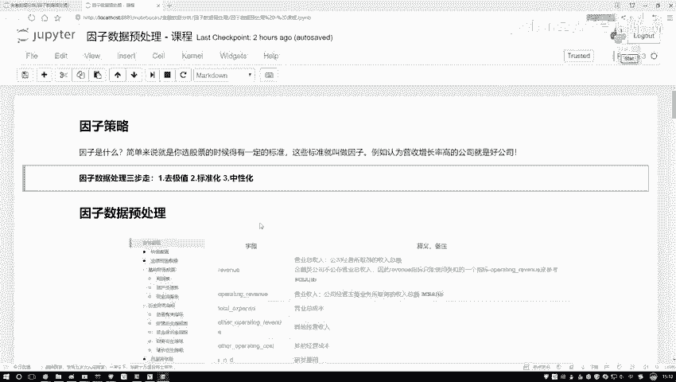

在本节课中，我们将要学习数据预处理中一个非常重要的步骤——标准化。标准化是许多数据分析和机器学习任务的基础，它能帮助我们消除不同数据特征在量纲和取值范围上的差异，使模型能够更公平地对待每一个特征。

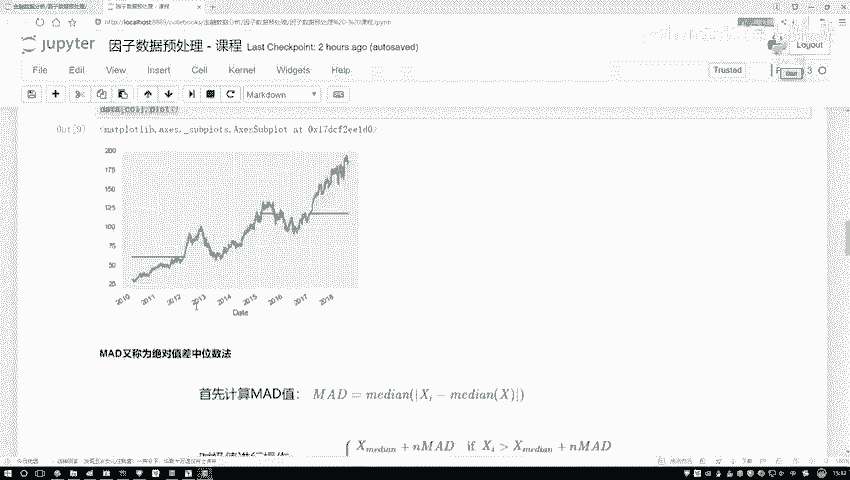

## 标准化的目的与原理

上一节我们介绍了数据预处理的重要性，本节中我们来看看标准化的具体做法。标准化的核心目标是解决不同特征（或指标）取值范围不同的问题。

例如，我们有两个特征X1和X2。X1的取值范围可能较大，而X2的取值范围可能较小。如果直接使用原始数据进行计算，取值范围大的特征可能会对模型结果产生不成比例的巨大影响，这并非我们期望的。因此，我们需要通过标准化，让所有特征站在同一起跑线上。

标准化的公式如下：

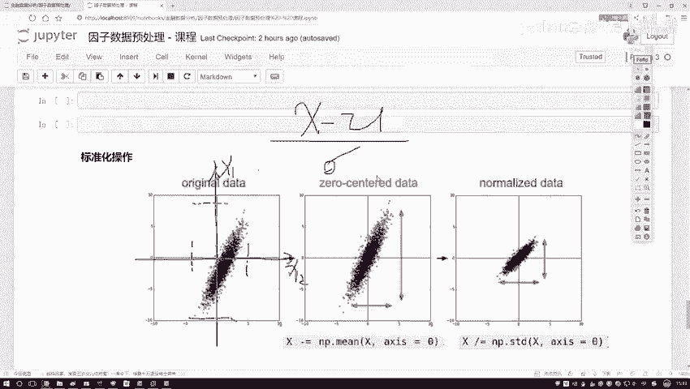

**`z = (x - μ) / σ`**

其中：
*   `x` 是原始数据。
*   `μ` 是该特征所有数据的均值。
*   `σ` 是该特征所有数据的标准差。

这个公式可以分解为两个步骤来理解其作用。

## 标准化的两个步骤

### 第一步：去均值（中心化）

公式中的 `(x - μ)` 部分被称为“去均值”或“中心化”。它的作用是**将数据的分布中心移动到零点**。

想象一下我们的数据点原本可能分布在坐标系中的某个位置。减去均值后，整个数据集的中心点就移动到了坐标原点（0点）。这使得数据在各个维度上都以零为中心对称，消除了数据整体位置带来的偏差。

### 第二步：除以标准差（缩放）

公式中的 `/ σ` 部分，即除以标准差，是为了**统一不同特征的尺度（取值范围）**。

标准差衡量了一组数据的离散程度。取值范围大、数据分散的特征，其标准差（σ）也大；反之，取值范围小、数据集中的特征，其标准差也小。

通过除以各自的标准差，我们实现了：
*   对标准差大的特征（数据分散），进行较大程度的收缩。
*   对标准差小的特征（数据集中），进行较小程度的收缩。

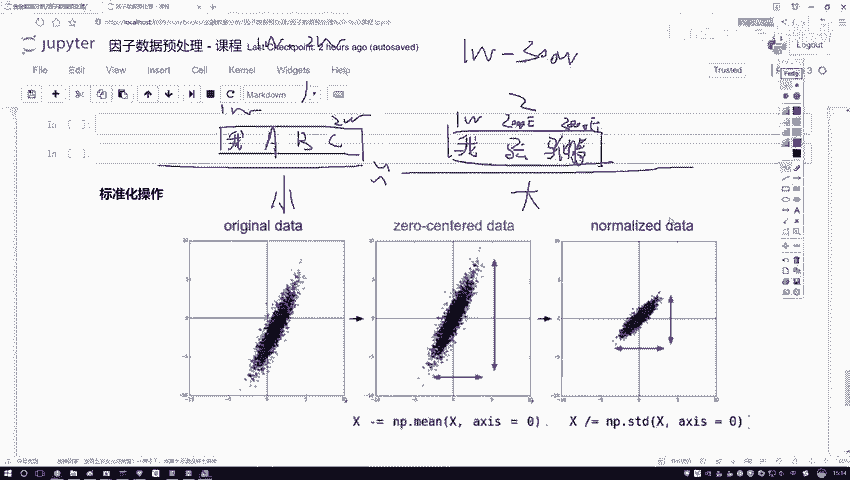

最终结果是，所有特征都被缩放至具有**近似相同的尺度**（通常数值在[-1, 1]或[-3, 3]这样的区间内），并且均值为0，标准差为1。

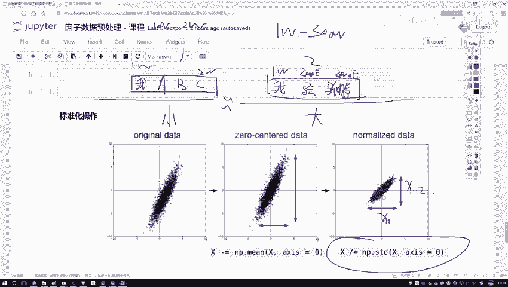

## 标准化的代码实现

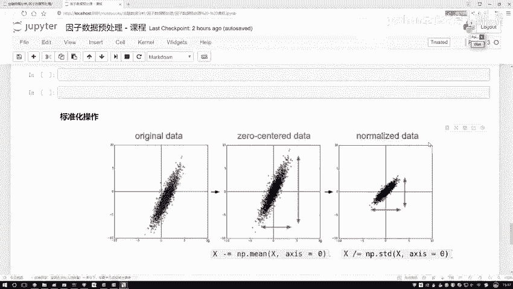

理解了原理后，我们可以自己动手实现标准化函数。以下是实现步骤：

首先，我们需要计算数据的均值和标准差。

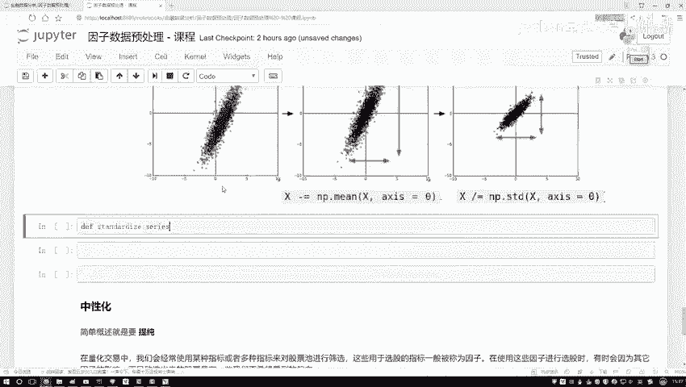

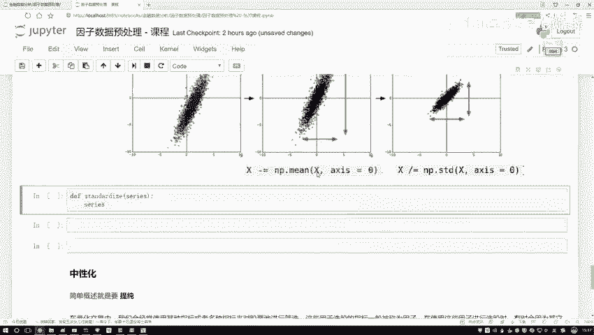

```python
def standardize(series):
    """
    对输入的序列进行标准化处理。
    参数:
        series: 一个pandas Series或类似的可迭代数值序列。
    返回:
        标准化后的序列。
    """
    # 1. 计算均值 (mu)
    mean_val = series.mean()
    # 2. 计算标准差 (sigma)
    std_val = series.std()
    # 3. 应用标准化公式: (x - mu) / sigma
    standardized_series = (series - mean_val) / std_val
    return standardized_series
```

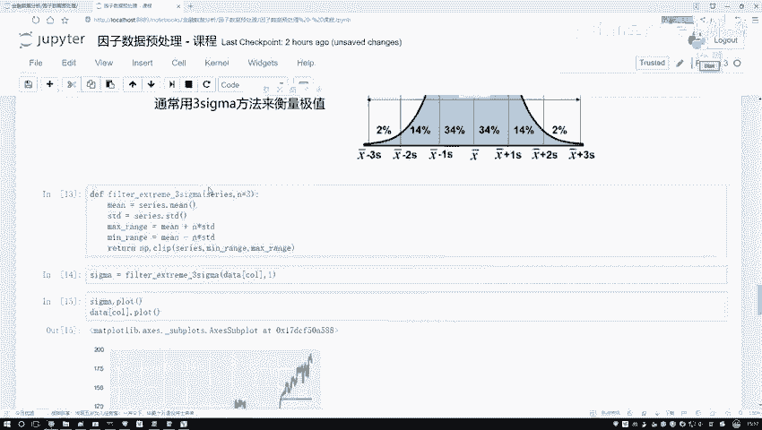

当然，在实际项目中，我们通常使用成熟的工具库来快速完成这项工作，例如Scikit-learn。

## 使用Scikit-learn进行标准化

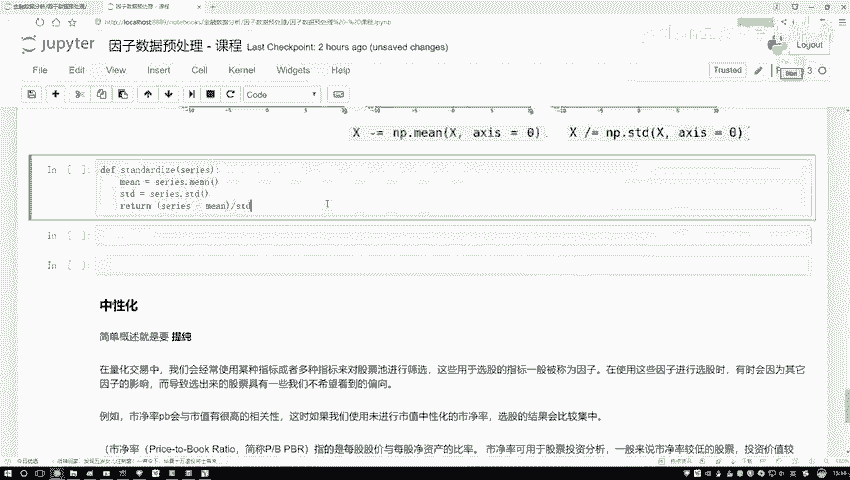

对于希望快速应用标准化的同学，可以直接使用机器学习库Scikit-learn中提供的 `StandardScaler` 工具。它更加高效且功能全面。

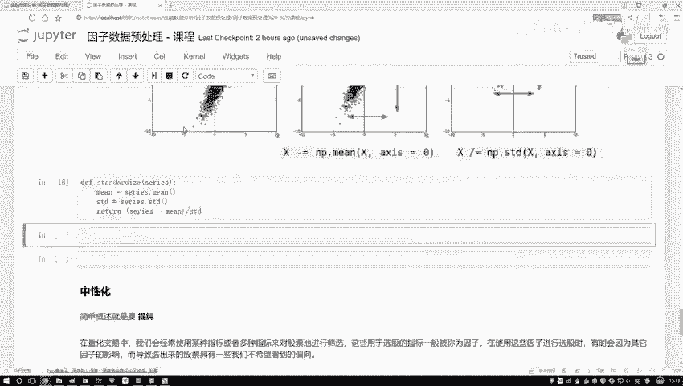

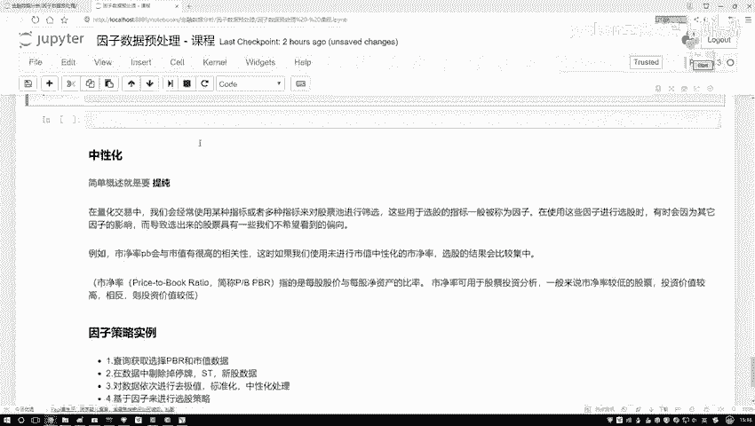

以下是使用Scikit-learn进行标准化的方法：

```python
from sklearn.preprocessing import StandardScaler
import numpy as np

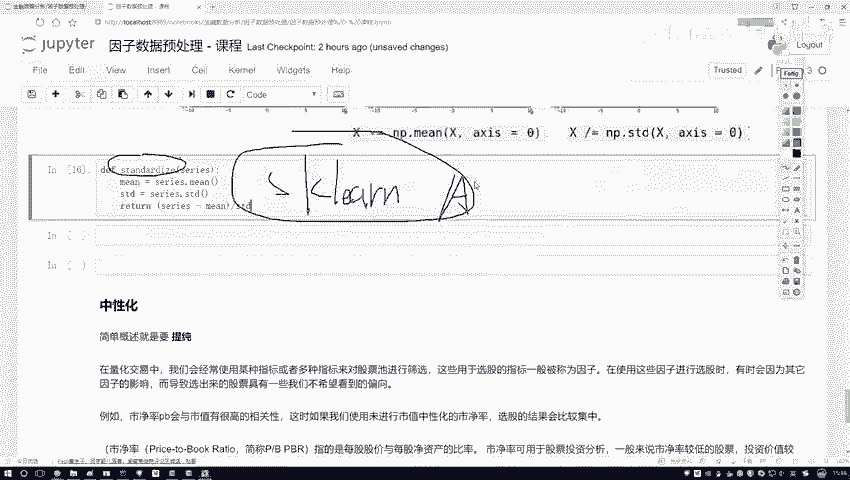

# 假设我们有一个数据矩阵 X (例如二维数组)
X = np.array([[30, 100], [20, 80], [25, 120]])
# 创建StandardScaler对象
scaler = StandardScaler()
# 拟合数据并计算均值和标准差
scaler.fit(X)
# 转换数据，进行标准化
X_standardized = scaler.transform(X)
print(X_standardized)
```

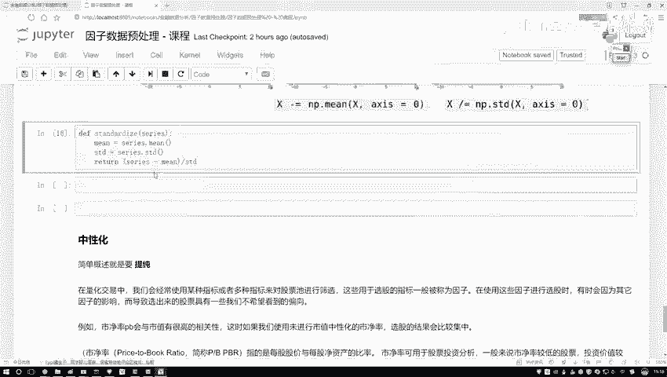

使用 `StandardScaler` 的优势在于，它能够方便地保存计算出的均值和标准差，之后可以用同样的参数去转换新的数据，这对于机器学习中的训练集/测试集分割场景至关重要。

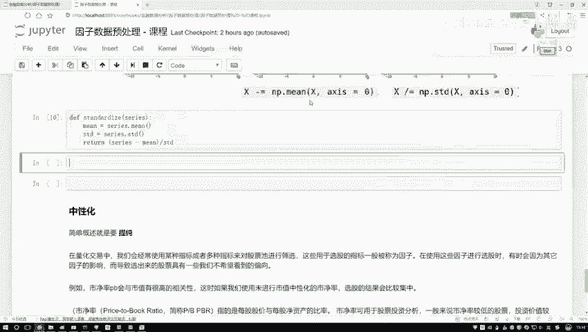

## 标准化效果演示

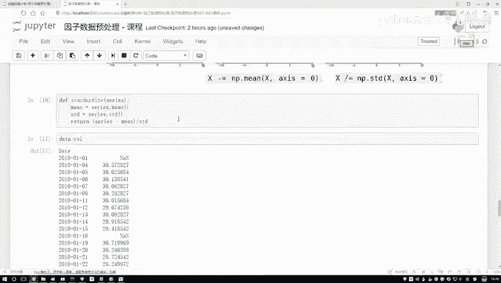

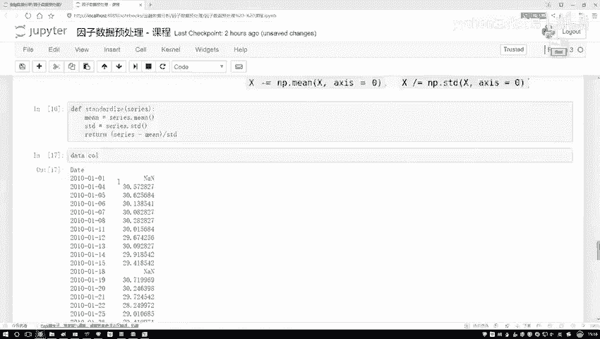

让我们通过一个简单的例子来看标准化的效果。假设我们有一组包含不同量纲的原始金融数据（如价格和交易量）。

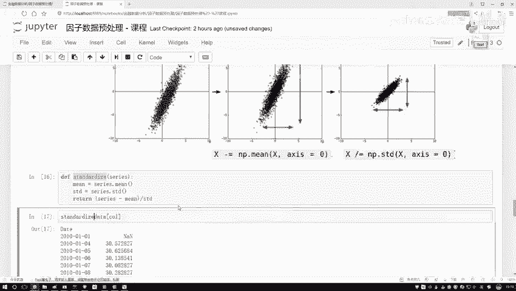

原始数据可能如下所示，不同列之间的数值范围差异巨大：
*   列A（价格）：范围在20到100之间。
*   列B（交易量）：范围在10000到50000之间。

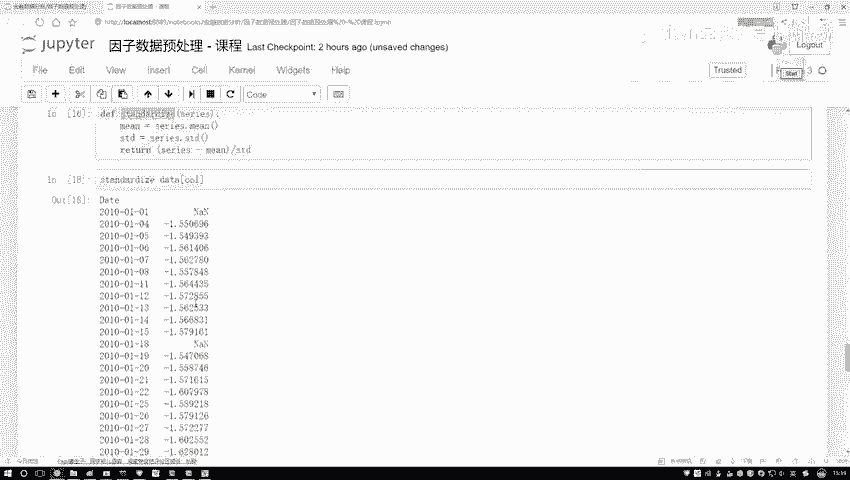

应用我们编写的 `standardize` 函数或 `StandardScaler` 之后，数据会转变为：
*   所有列的均值都接近0。
*   所有列的标准差都接近1。
*   数据点在一个相对统一且较小的数值区间内分布。

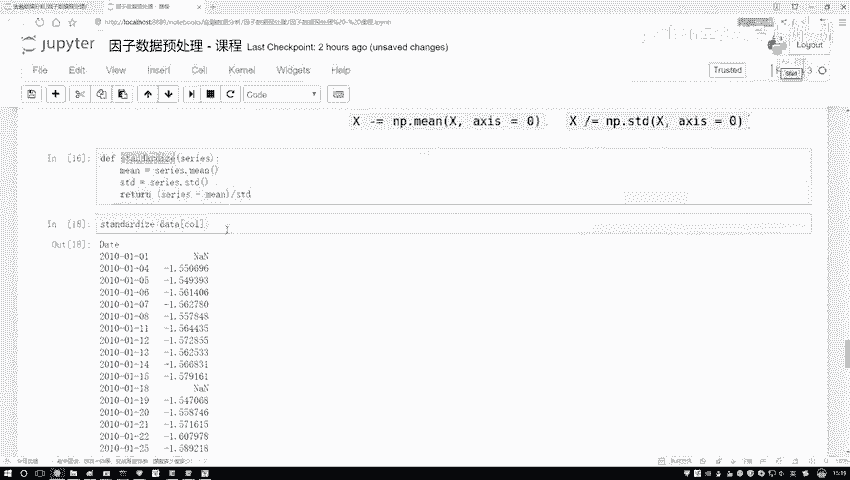

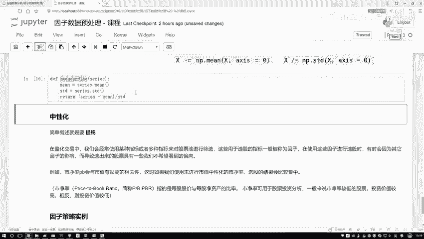

这种处理后的数据更适合输入到后续的聚类、回归或时间序列预测模型中。

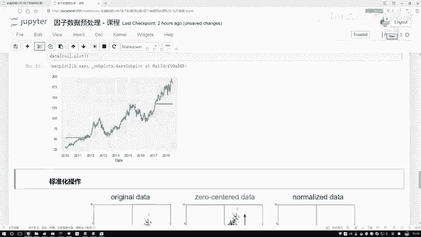

## 总结

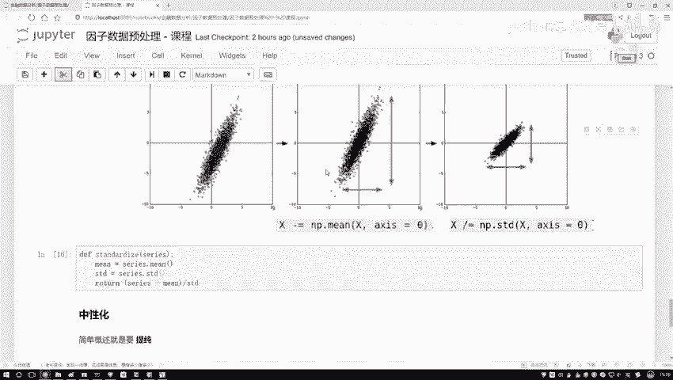

本节课中我们一起学习了数据标准化处理。我们首先明确了标准化的目的：消除不同特征因量纲和取值范围不同而导致的模型偏差。接着，我们深入剖析了标准化公式 **`z = (x - μ) / σ`** 的两个组成部分——去均值（中心化）和除以标准差（缩放）——及其作用。然后，我们动手实现了标准化的Python代码，并介绍了如何使用Scikit-learn库中的 `StandardScaler` 工具来高效完成这一任务。标准化是数据预处理中关键且常用的一步，掌握它能为后续的金融数据分析与建模打下坚实的基础。