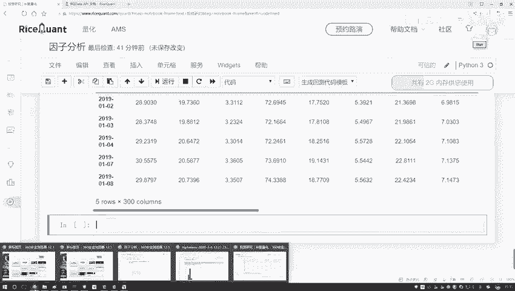
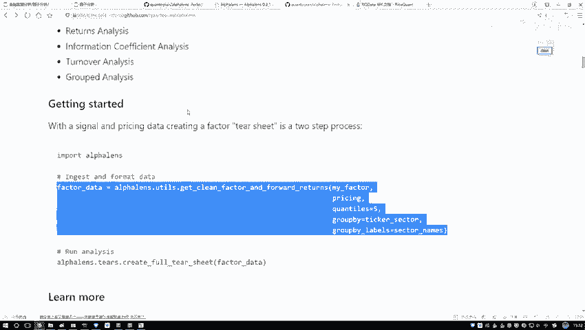
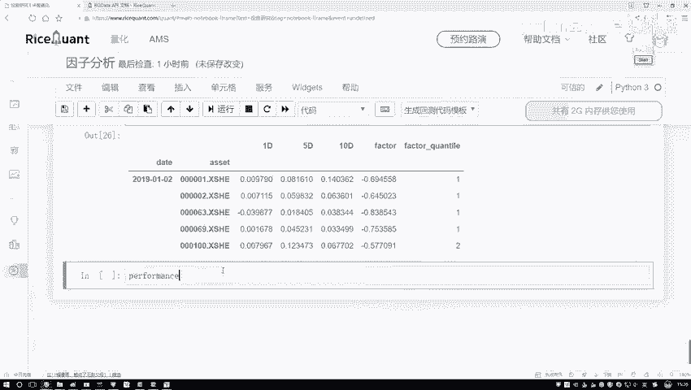
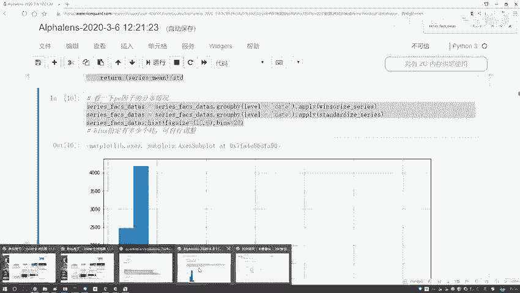
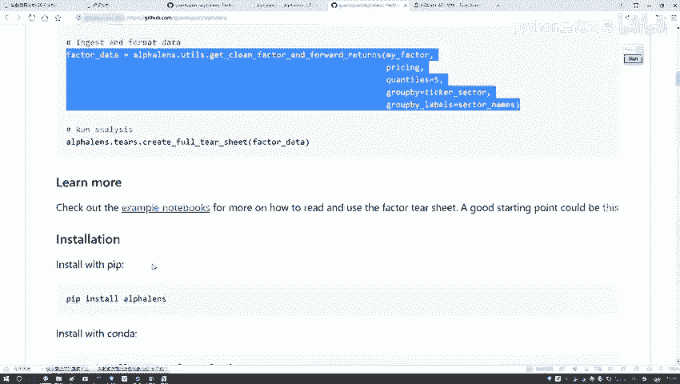
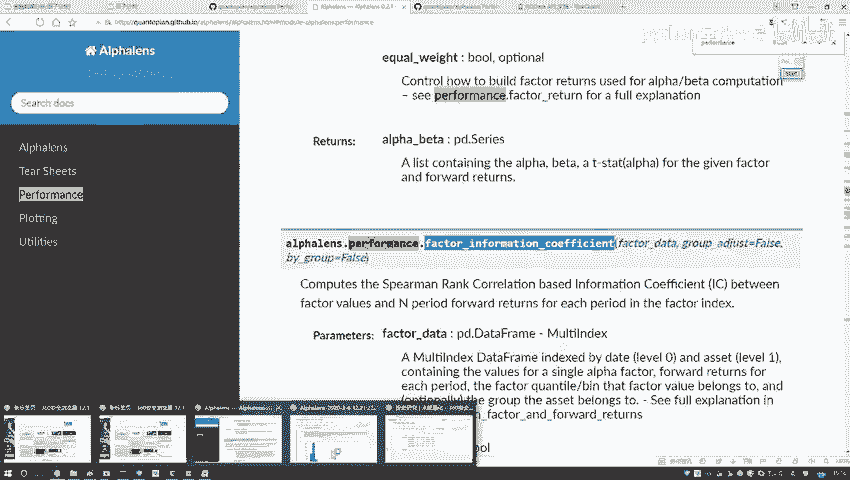
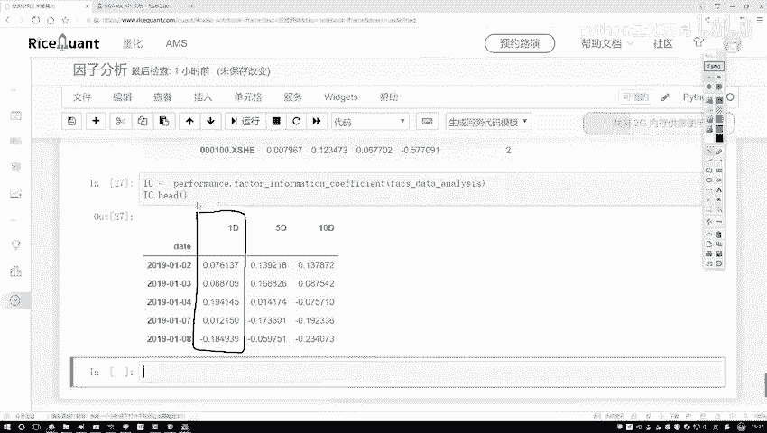

# Python金融时间序列分析与量化交易实战教程：P42：41.IC指标值计算 📊

## 概述
在本节课程中，我们将学习如何计算IC指标值。IC值是衡量选股因子有效性的核心指标，它通过计算因子值与股票未来收益率之间的相关性来评估因子的预测能力。我们将使用Python获取股票价格数据，进行数据格式转换，并最终计算出斯皮尔曼秩相关系数。

## 数据准备：获取收盘价
上一节我们介绍了因子的计算，本节中我们来看看如何获取计算IC值所需的实际收益率数据。计算IC值需要将因子值与股票的实际收益率进行相关性计算。因此，我们首先需要获取股票的收盘价数据。

以下是获取收盘价的步骤：
1.  使用 `get_price` 函数获取指定股票池在特定时间段内的价格数据。
2.  从返回的多维数据中提取出我们需要的“收盘价”数据，并将其整理成二维的DataFrame格式。
3.  为数据框指定合适的索引和列名，以便后续处理。

```python
# 获取股票池的收盘价数据
price = get_price(
    stock_pool,  # 股票代码列表
    start_date='2019-01-01',
    end_date='2020-01-01',
    fields=['close']  # 指定获取收盘价
)
# 整理数据格式
price = price['close']  # 提取收盘价序列
price.index.name = 'date'
price.columns.name = 'code'
```



执行上述代码后，我们得到一个DataFrame，其索引是日期，列名是股票代码，值为对应的每日收盘价。



## 数据格式转换
现在我们已经有了因子数据和价格数据。为了进行IC值计算，我们需要使用一个特定的工具函数将数据转换为分析所需的格式。

这个转换函数较长，其核心作用是接收处理好的因子数据和价格数据，并按照分析要求进行重组。转换后的数据将包含日期、股票代码、未来不同周期的收益率（如1D、5D、10D）、因子值以及因子值所属的分组。

```python
# 导入工具函数并进行数据格式转换
from utils import convert_to_analysis_format  # 假设函数名，实际需根据库调整

# 进行数据转换
analysis_data = convert_to_analysis_format(
    factor_data=processed_factor_data,  # 之前处理好的因子数据
    price_data=price                    # 上一步获取的收盘价数据
)
```

转换后，我们得到一份新的数据。其中，`1D`、`5D`、`10D`等列代表未来1天、5天、10天的收益率，其计算公式为：
**收益率 = (未来收盘价 - 当前收盘价) / 当前收盘价**
`factor`列是我们的因子值。`factor_quantile`列是系统根据因子值大小自动划分的等级（例如分为5组），数字越小代表因子值越小，数字越大代表因子值越大。

## 计算IC指标值
数据准备就绪后，我们就可以计算IC指标值了。IC值通常指因子值与未来一期收益率之间的**斯皮尔曼秩相关系数**。该系数用于衡量两个变量之间单调关系的强弱。

以下是计算IC值的步骤：
1.  从量化分析库的`performance`模块中调用计算因子信息系数的函数。
2.  将上一步转换好的`analysis_data`传入该函数。
3.  函数将返回一个包含IC值等信息的序列或DataFrame。





```python
# 计算IC值（斯皮尔曼秩相关系数）
from performance import calculate_information_coefficient  # 假设函数名，实际需根据库调整



ic_series = calculate_information_coefficient(analysis_data)
# 查看IC值计算结果
print(ic_series.head())
```



执行代码后，我们将得到每一天的IC值。IC值介于-1到1之间。一般来说，IC值大于0表示因子与未来收益率正相关，因子值越大，预期收益越高；IC值小于0则表示负相关。IC值的绝对值越大，说明因子的预测能力越强。



## 总结
本节课中我们一起学习了IC指标值的完整计算流程。我们首先获取了股票的收盘价数据以计算收益率，然后对因子和收益率数据进行了必要的格式转换，最后调用专用函数计算出了衡量因子预测能力的IC值。理解并计算IC值是量化因子评价和策略构建的基础步骤。