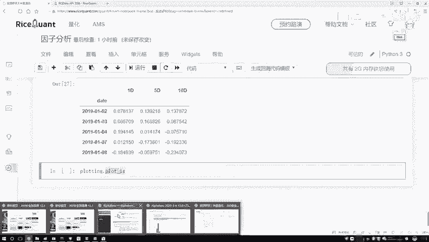
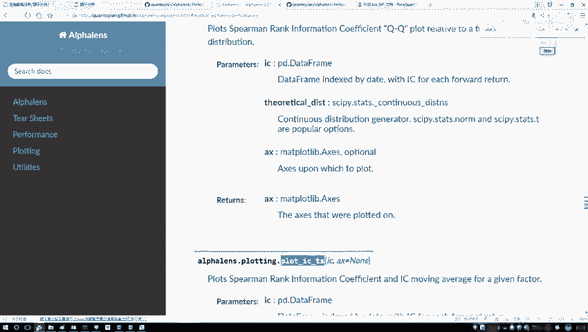
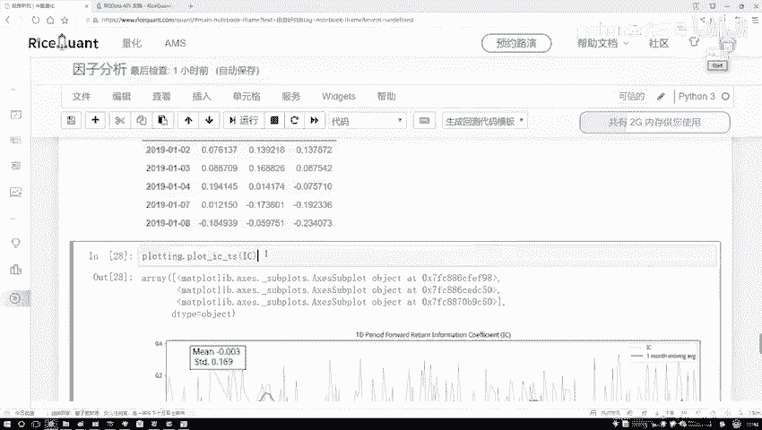
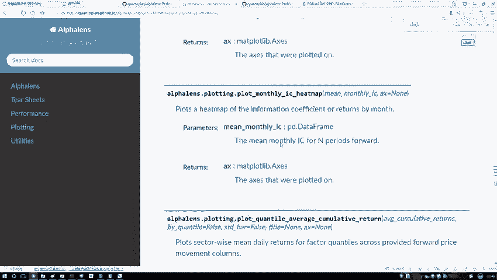
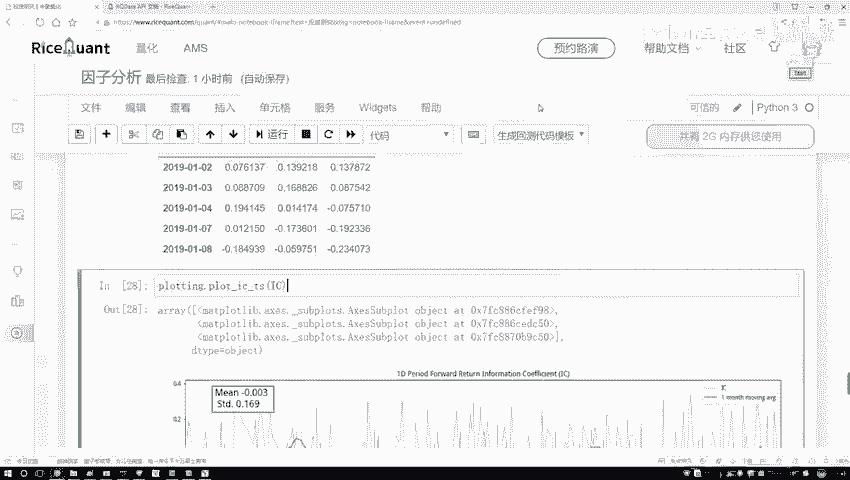

# Python金融时间序列分析与量化交易实战教程：P43：42.工具包绘图展示 📊

在本节课中，我们将学习如何使用专门的绘图工具包来可视化因子的IC值（信息系数）及其时间序列走势。通过图表，我们可以更直观地评估因子的有效性和稳定性。

上一节我们介绍了如何计算因子与收益率之间的相关系数（IC值）。本节中，我们来看看如何将这些计算结果通过图表清晰地展示出来。

## 绘图工具导入与使用



我们导入一个名为 `proloting` 的工具包来辅助进行数据可视化。该工具包提供了绘制IC值时间序列图的功能。

以下是绘制IC值时间序列图的步骤：



1.  调用绘图函数 `plot_ic_ts`。
2.  将计算好的IC值序列（通常是一个 `pd.Series`）作为参数传入。

```python
# 假设ic_series是计算好的IC值序列
proloting.plot_ic_ts(ic_series)
```

执行上述代码后，系统会自动生成图表。

## 图表解读

生成的图表主要包含以下元素：

*   **蓝色折线**：代表每日计算出的实际IC值。其波动范围通常较大，直接观察趋势可能不够明显。
*   **绿色折线**：代表IC值的滚动平均值，默认窗口期为一个月（约21个交易日）。这条线平滑了日度波动，能更清晰地展示IC值的长期趋势。
*   **统计信息**：图表通常会标注IC值的均值（Mean）和标准差（Std），并计算信息比率（IR），其公式为：
    `信息比率 (IR) = IC均值 / IC标准差`
    信息比率用于衡量因子稳定性的程度。**比值越大，说明因子的有效性越稳定**；反之，则波动性较大。

在分析时，我们应主要观察**绿色均线**的走势。理想的因子通常希望其IC均值保持较高且为正的水平。从当前示例图来看，绿色均线整体较为平稳且数值较小，这可能意味着该因子与收益率的相关性不强，需要进一步优化或筛选。

## 其他可视化功能

除了时间序列图，绘图工具包还提供了其他多种分析图表，例如：



*   **直方图 (Histogram)**：查看IC值的分布情况。
*   **QQ图 (Q-Q Plot)**：检验IC值是否服从正态分布。
*   **热力图 (Heatmap)**：用颜色深浅展示不同维度下的IC值。



这些功能在深入进行因子分析和策略构建时非常有用，大家可以根据实际需求查阅API文档进行调用。



本节课中我们一起学习了如何使用绘图工具包将因子IC值可视化。通过观察IC值的时间序列均线及其统计指标（如信息比率），我们可以更有效地评估因子的预测能力和稳定性，为后续的量化策略开发打下基础。