# Python金融时间序列分析与量化交易实战教程：P48：47.因子打分与排序 📊

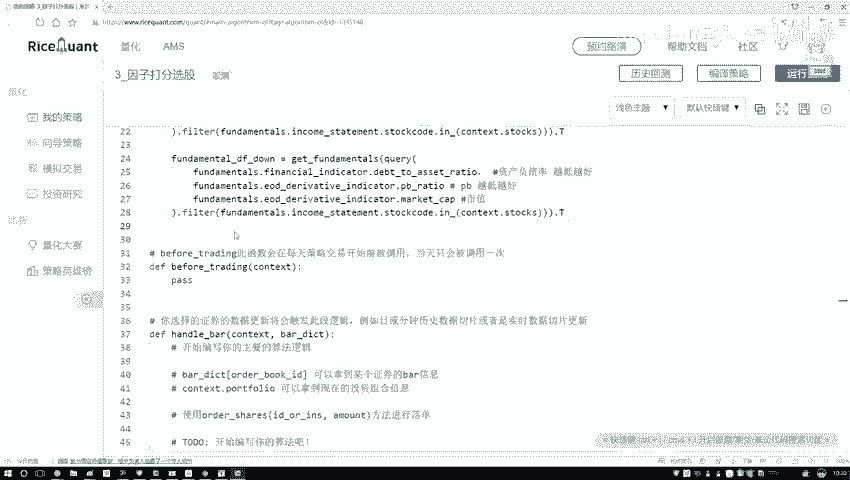


在本节中，我们将学习如何对筛选出的因子进行打分与排序。上一节我们完成了因子的初步筛选，得到了两个DataFrame，分别代表“越高越好”和“越低越好”的因子。本节中，我们将遍历这两个DataFrame，为每个因子下的股票进行排名并打分，为后续的综合评分做准备。

## 遍历因子并排序

首先，我们需要遍历DataFrame中的每一个因子。以下是具体的操作步骤。

我们将从“越高越好”的因子开始处理。需要获取DataFrame的列名，以便遍历每一个因子。

```python
# 假设我们有一个名为 ‘up_df‘ 的DataFrame，包含“越高越好”的因子
for factor in up_df.columns:
    # 对当前因子列进行排序
    up_df.sort_values(by=factor, inplace=True)
```

在上述代码中，`up_df.columns` 返回所有因子列的名称。通过 `sort_values` 方法并指定 `by` 参数为当前因子，我们可以按照该因子的数值对股票进行排序。设置 `inplace=True` 参数意味着排序操作会直接修改原始DataFrame，而无需重新赋值。

## 为排序结果打分


排序完成后，我们需要为排序结果打分。简单起见，我们采用线性打分法：排名第一的股票得分最高，排名最后的股票得分最低。

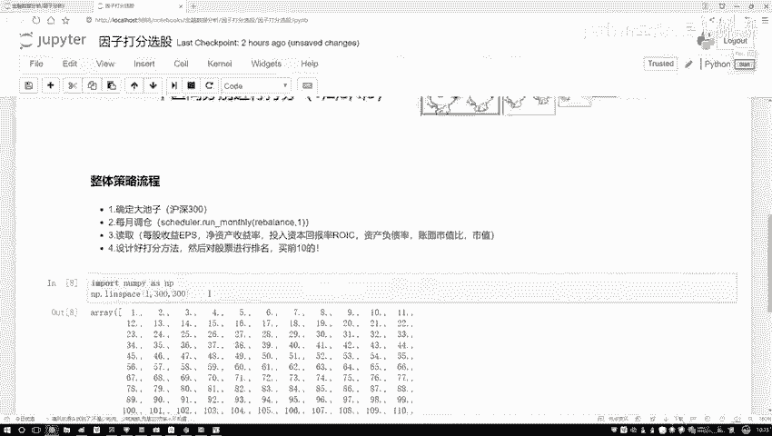

我们将使用NumPy的 `linspace` 函数来生成一个线性的分数序列。这个函数可以方便地创建指定范围内等间隔的数值。

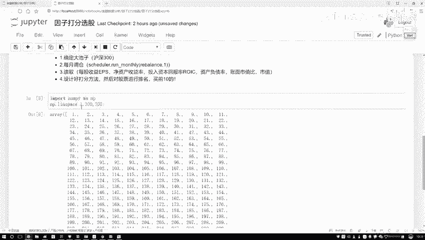

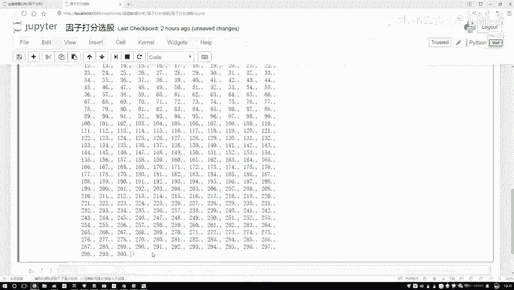

```python
import numpy as np
import pandas as pd

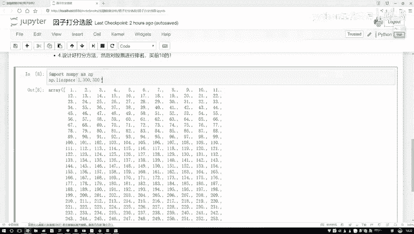

# 生成一个从1到300的数组，共300个数（假设有300支股票）
scores_asc = np.linspace(1, 300, 300)
print(scores_asc[:10])  # 输出前10个分数，例如 [1. 2. 3. ...]

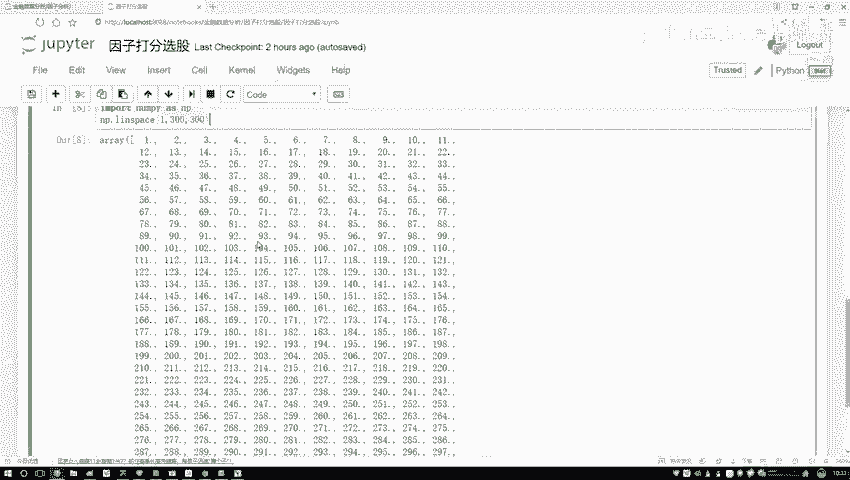

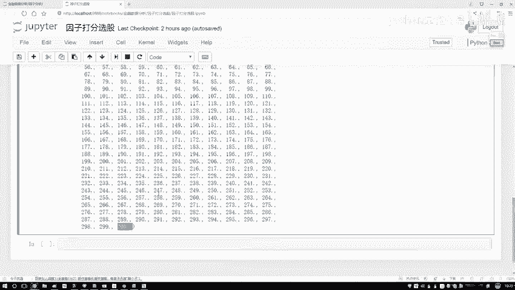

# 生成一个从300到1的数组
scores_desc = np.linspace(300, 1, 300)
print(scores_desc[:10]) # 输出前10个分数，例如 [300. 299. 298. ...]
```

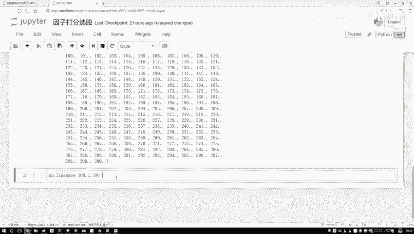

`np.linspace(start, stop, num)` 函数会生成从 `start` 到 `stop` 的等间隔数列，共 `num` 个值。通过调整起始和结束值，我们可以控制得分的分配方向。

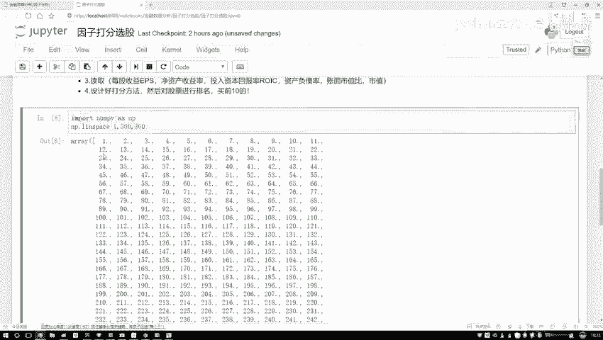

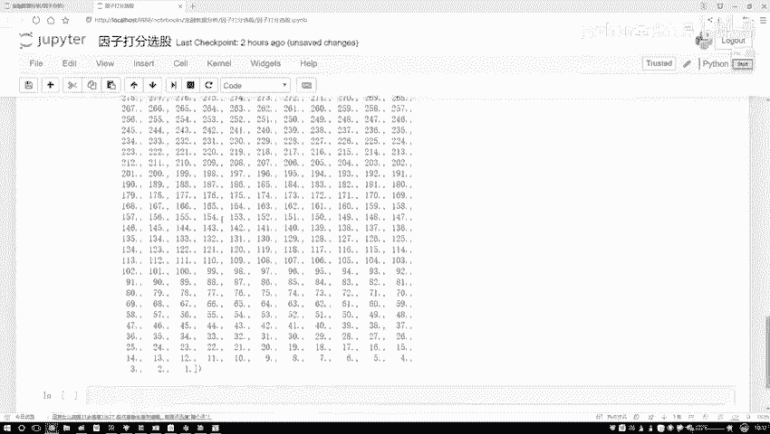

现在，我们将打分逻辑整合到循环中。

以下是针对“越高越好”因子的打分代码：

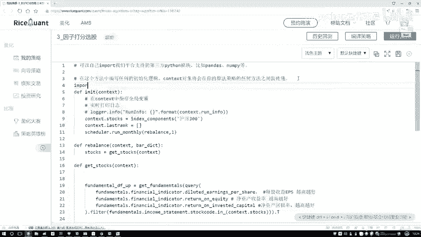

```python
# 对“越高越好”的因子进行打分
for factor in up_df.columns:
    up_df.sort_values(by=factor, inplace=True)
    # 生成从高到低的分数：排名越靠前（值越大），分数越高
    up_df[factor] = np.linspace(len(up_df), 1, len(up_df))
```

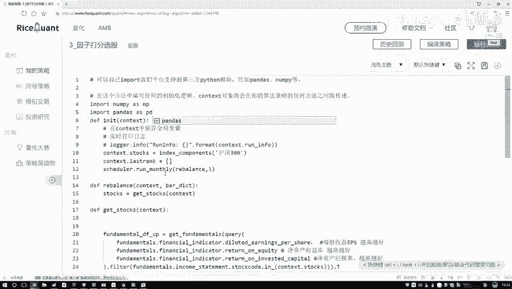

这里，`len(up_df)` 获取股票总数，确保了分数范围与股票数量动态匹配。排序后，我们将该因子列的值直接替换为对应的分数。

接下来，我们以同样的逻辑处理“越低越好”的因子，但分数分配方向相反。

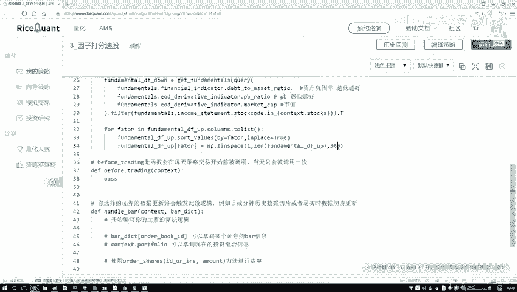

以下是针对“越低越好”因子的打分代码：

```python
# 对“越低越好”的因子进行打分
for factor in down_df.columns:
    down_df.sort_values(by=factor, inplace=True)
    # 生成从低到高的分数：排名越靠前（值越小），分数越高
    down_df[factor] = np.linspace(1, len(down_df), len(down_df))
```

在这段代码中，我们遍历 `down_df` 的每一个因子列。排序后，使用 `np.linspace(1, len(down_df), len(down_df))` 生成分数，这意味着数值最小的股票（排名第一）会得到最高分。

## 本节总结

本节课中我们一起学习了因子打分与排序的核心步骤。我们首先遍历了“越高越好”和“越低越好”两个因子DataFrame，对每个因子下的股票进行了排序。接着，我们利用NumPy的 `linspace` 函数，根据排序名次为股票分配了线性分数，为“越高越好”的因子分配了降序分数，为“越低越好”的因子分配了升序分数。至此，我们得到了两个包含因子得分的DataFrame，为下一步计算股票的综合总分做好了准备。