# Python金融时间序列分析与量化交易实战教程：P51：50.策略总结与分析 📊

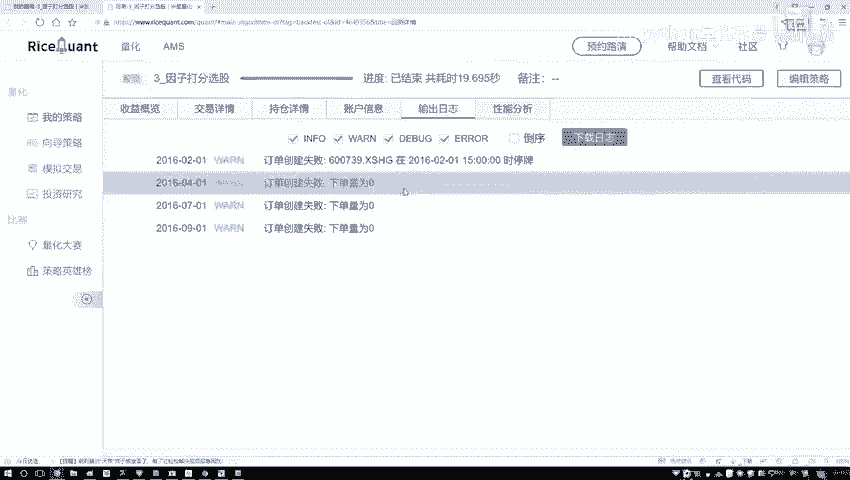

## 概述
在本节课中，我们将对之前构建的量化交易策略进行总结与分析。我们将通过调整回测参数，观察策略在不同市场周期下的表现，并探讨策略的有效性与局限性。

## 策略回测与初步分析
上一节我们完成了策略的构建与代码编写。本节中，我们来看看策略的实际运行效果。

代码运行后没有报错，说明程序逻辑基本正确。警告信息可以暂时忽略。

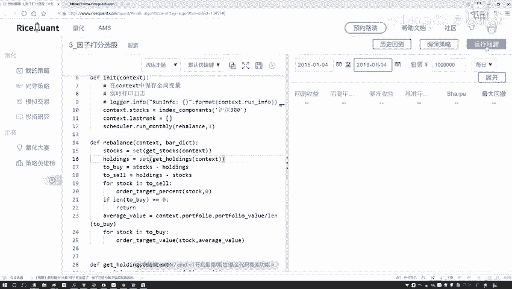


以下是初步的回测结果分析：
*   **基准收益**：基准组合在此期间是亏损的。
*   **策略收益**：我们的策略虽然没有获得高额利润，但成功稳住了资金，没有出现亏损。
*   **最大回撤**：策略的最大回撤为17%左右，处于可接受范围。
*   **超额收益**：策略相对于基准的超额收益约为67%，初步表现不错。

需要说明的是，以上结果是基于一个较短时间段的回测。

## 调整回测周期进行验证
为了更全面地评估策略，我们需要在不同的时间周期进行测试。通常，量化回测会选择3到5年的时间跨度，短期回测容易产生偶然性结果。

我们将回测开始时间调整为`2016-01-04`，结束时间调整为`2018-01-04`，进行为期两年的测试。


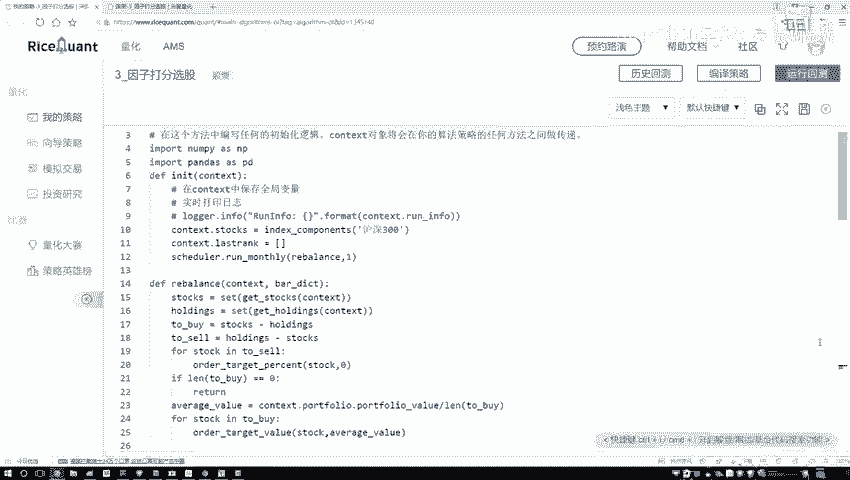

回测完成后，发现策略收益与基准收益相差无几，没有表现出明显的优势。

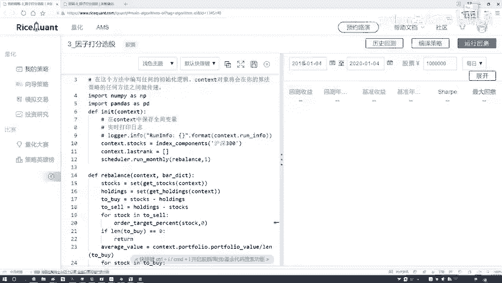

我们再次调整周期，测试`2018-01-04`到`2020-01-04`这两年的表现。


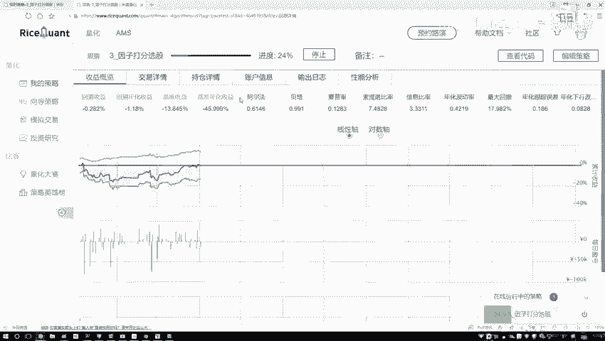

结果显示，基准收益约为0%，策略收益约为2%。效果依然不显著。这可能是因为2018年股市处于熊市，市场整体环境不佳。

## 优化测试与深入分析
为了排除特殊市场时期的影响，我们选择市场相对平稳的`2016-01-04`到`2017-01-04`进行测试。


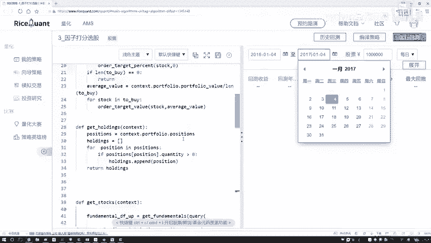

这次的结果显示，策略收益明显高于基准收益，验证了策略在正常市况下的有效性。

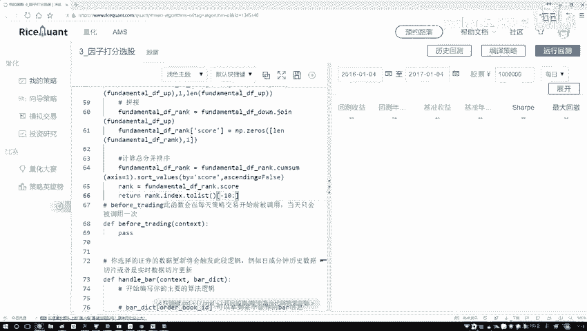

之前我们的策略是选取综合评分**排名前十**的股票。一个自然的疑问是：如果选择排名靠后的股票，结果会怎样？

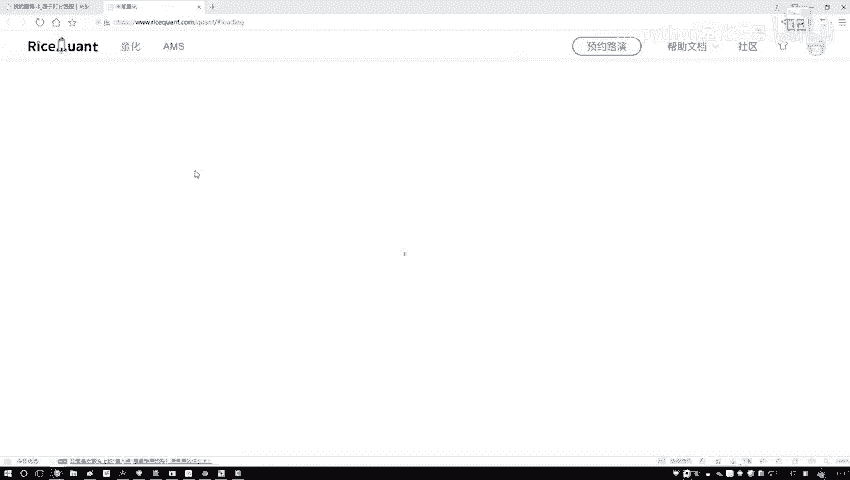

以下是测试排名靠后股票组合的步骤：
1.  修改选股逻辑，从选择前10名改为选择后10名（即评分最差的股票）。
    ```python
    # 原代码：选择排名前10的股票
    selected_stocks = ranked_stocks.head(10)

    # 修改后：选择排名后10的股票
    selected_stocks = ranked_stocks.tail(10)
    ```
2.  使用相同的周期（2016-2017年）进行回测。

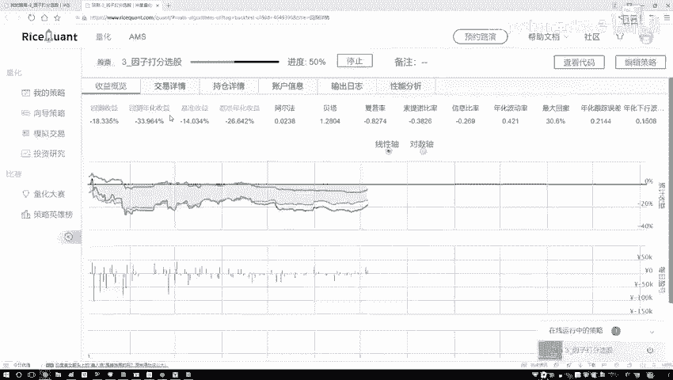


回测结果如下：
*   之前选取前十名股票的策略收益约为10%。
*   现在选取后十名（最差）股票的组合，其收益比基准收益更差。
*   基准收益约为-10%，而最差组合的亏损更大。

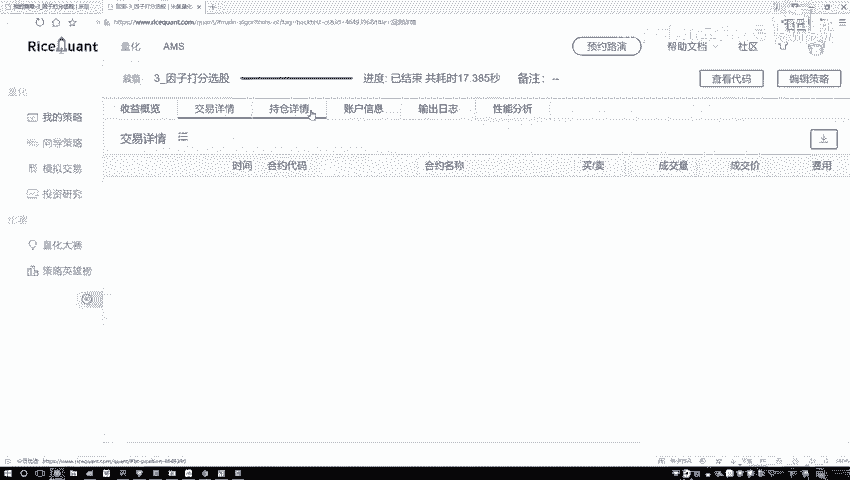

这从反面证明了我们评分指标的有效性：评分高的股票组合表现优于市场，评分低的股票组合表现弱于市场。

## 策略细节与报告解读
回测引擎会生成详细的交易报告。我们可以查看其中的关键信息。

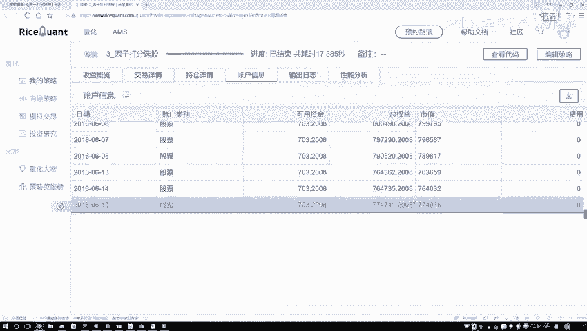


以下是报告包含的核心内容：
*   **交易详情**：列出了每次调仓的日期（如4月、5月、6月等），确认了策略按月度执行调仓。
*   **持仓详情**：展示了每个调仓日持有的具体股票及数量。
*   **账户信息**：记录了账户资金的变动情况。例如，初始本金100万，最终可能变为77万，直观反映了策略在该周期内的盈亏。

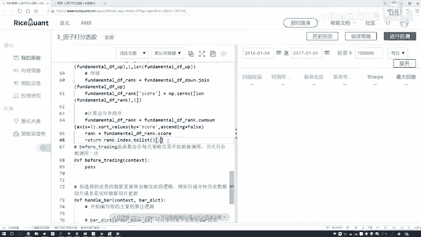


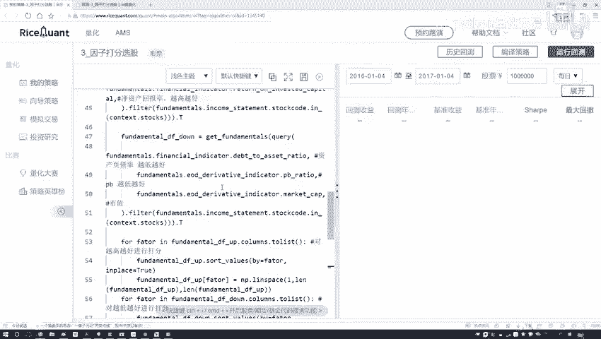

分析完成后，我们将选股逻辑改回默认的选取前10名股票。后续大家实验时，也建议使用此默认设置。

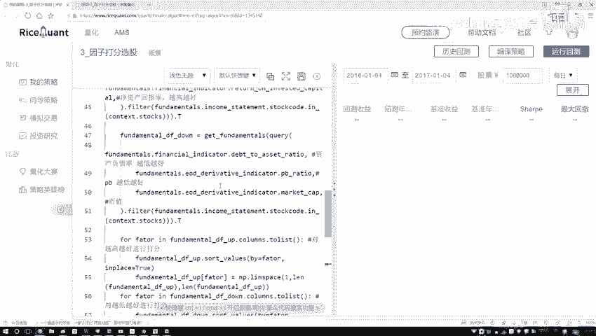


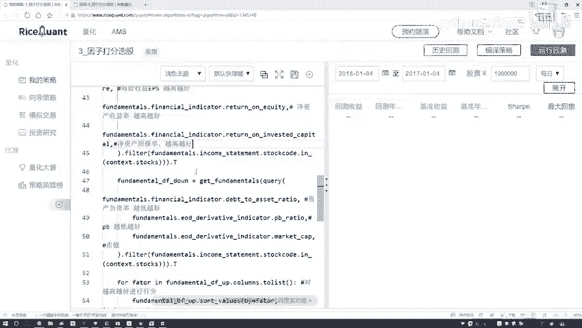

## 策略总结
本节课中我们一起学习了如何对一个量化策略进行全面的回测分析与评估。

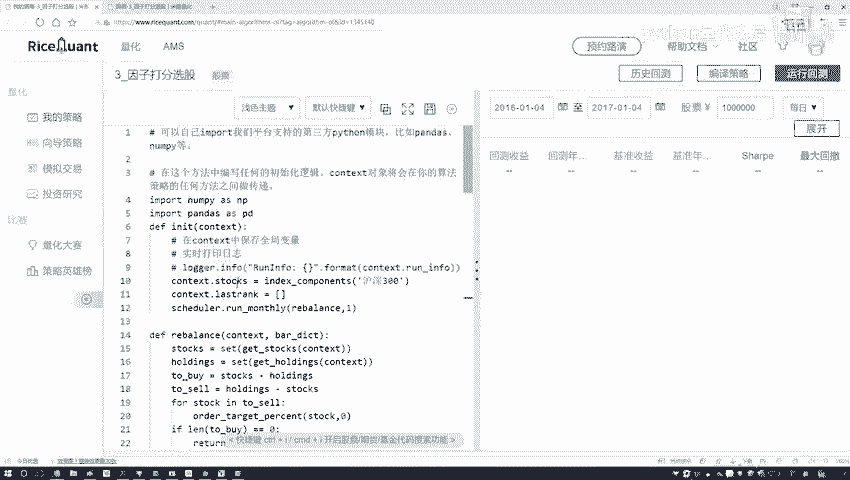

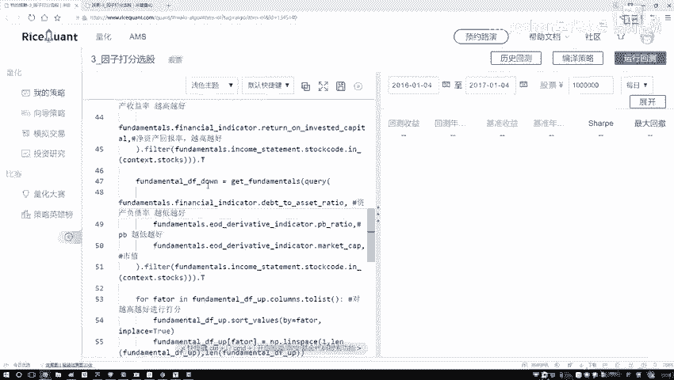

**核心要点总结如下：**
1.  **策略逻辑**：本策略采用**打分法**，通过财务指标对股票进行综合评分，并定期买入排名靠前的股票。
2.  **回测验证**：策略需要在**不同时间周期**进行多次回测，以检验其稳健性。策略表现受**市场整体环境**（牛市/熊市）影响较大。
3.  **指标有效性**：通过对比“买入高分股”和“买入低分股”的组合表现，可以验证所选评分指标是否有效。
4.  **方法特点**：打分法是一种直观、应用广泛的量化选股方法，能够较快地构建出一个具备一定逻辑基础的策略。


最后需要认识到，任何策略都无法保证在所有市场环境下盈利。策略会经历表现良好和表现一般的时期，这是金融市场交易的常态。