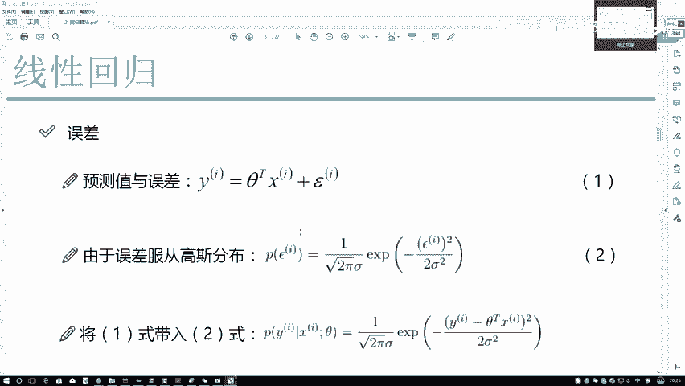
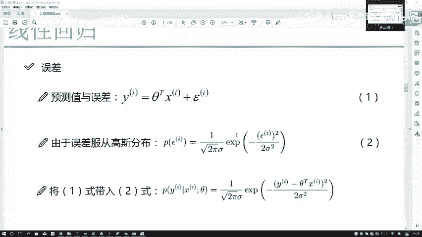
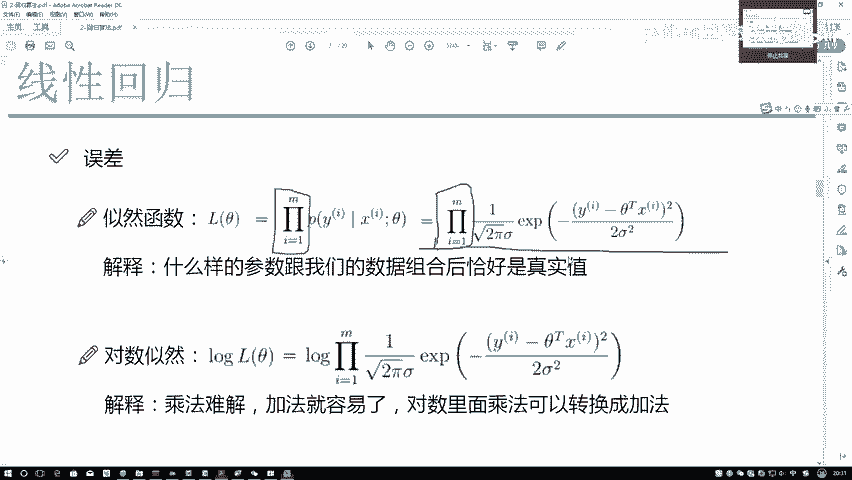
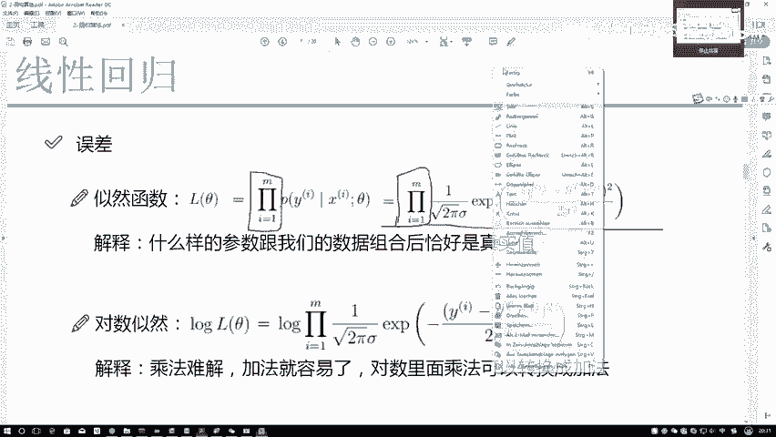
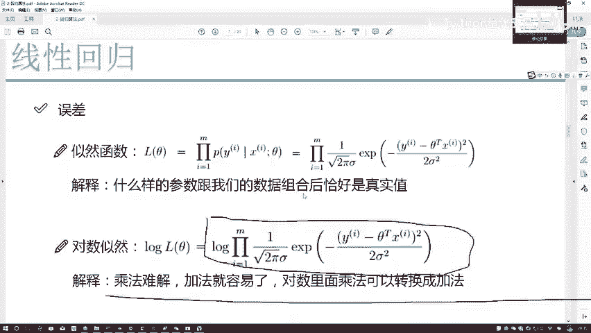
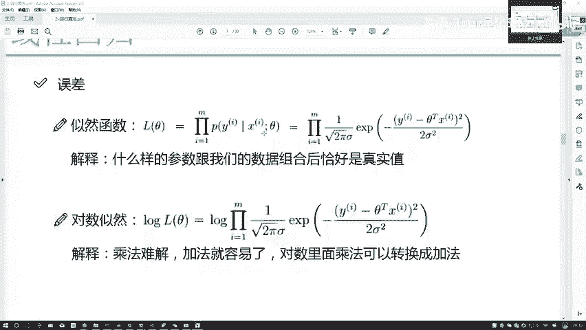
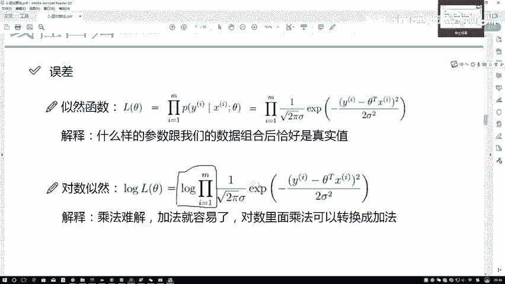
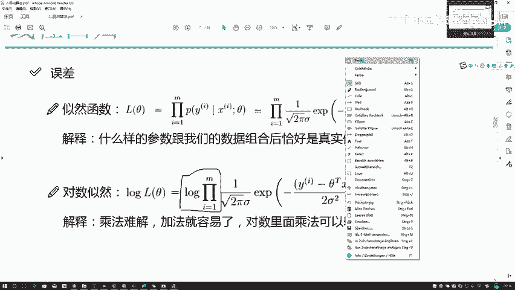

# Python金融时间序列分析与量化交易实战教程：P55：54.似然函数的作用 📈

在本节课中，我们将要学习线性回归模型中一个核心的数学概念——似然函数。我们将理解它的作用，以及如何通过它来求解模型的最佳参数。

上一节我们介绍了误差项服从高斯分布的假设，本节中我们来看看如何利用这个假设来求解模型参数θ。

## 从误差分布到参数求解

我们已知数据X和标签Y，当前的目标是求解模型的参数θ。误差项ε服从均值为0的高斯分布，其概率密度函数为：

$$
P(\epsilon) = \frac{1}{\sqrt{2\pi}\sigma} \exp\left(-\frac{\epsilon^2}{2\sigma^2}\right)
$$

这个表达式是关于误差项ε的。但我们最终关心的不是具体的误差值，而是参数θ。因此，我们需要将表达式转换为与θ相关。根据线性回归方程 $y = \theta^T x + \epsilon$，我们可以将误差项替换为 $\epsilon = y - \theta^T x$。

进行替换后，我们得到一个新的表达式。这个表达式可以通俗地解释为：**在给定参数θ和数据X的条件下，得到观测值Y的可能性**。我们希望找到一组参数θ，使得这个可能性（即θ和X组合后成为Y的概率）**越大越好**。

## 理解似然函数的作用 🤔

为了解释似然函数的作用，可以举一个例子。假设观察一个赌场，其输赢由一组固定参数控制。你观察到前五位客人都赢了。在参数不变的前提下，你观测到的所有样本（五位客人）结果都一致（赢了）。基于这些观测数据，你可能会认为控制赌场的这组参数使得“赢”的结果出现的可能性极高，因此预测自己接下来去玩也会赢。

似然函数描述的就是这样一件事：**什么样的参数θ，在与我们的数据X组合后，最有可能得到我们观测到的真实值Y**。参数θ是我们要寻找的（假设不变），数据X也是已知且固定的。

以下是关于似然函数形式的两个关键点：

1.  **为什么是累乘（∏）？**
    似然函数是每个数据点概率的乘积：$L(\theta) = \prod_{i=1}^{m} P(y^{(i)} | x^{(i)}; \theta)$。这是因为我们假设数据点之间满足“独立同分布”。在独立同分布的前提下，所有样本的联合概率密度等于各自边缘概率密度的乘积。我们希望通过大量数据（m很大）来更准确地估计最合适的参数θ。

2.  **为什么可以取对数？**
    当数据量m很大时（例如m=1000），直接计算多项连乘非常困难。数学上，对数运算可以将乘法问题转化为加法问题：$\log(a \times b) = \log a + \log b$。转换后问题会变得更容易求解。

    但我们需要思考：加上对数后，函数值改变了，求解结果还一样吗？我们最终目标是找到使似然函数最大的参数θ值，即寻找**极值点**。对原函数取对数（称为“对数似然函数”）虽然会改变函数的**极值**，但不会改变**极值点**的位置。由于我们只关心极值点（即最优参数θ），而不关心极值具体是多少，因此这个转换是等价且可行的。

## 对数似然函数的求解

通过取对数，我们将似然函数的连乘问题转化为了连加问题：

$$
\log L(\theta) = \sum_{i=1}^{m} \log P(y^{(i)} | x^{(i)}; \theta)
$$

以下是求解对数似然函数最大值的常规步骤：

1.  **写出对数似然函数表达式**：将包含θ的高斯分布概率密度公式代入，并展开对数运算。
2.  **简化表达式**：常数项（如 $-\frac{m}{2}\log(2\pi\sigma^2)$）在求极值点时可以忽略，因为它们不影响θ的取值。最终核心项通常与误差的平方和有关。
3.  **转化为最小化问题**：最大化对数似然函数等价于最小化其负值。经过推导，这最终等价于最小化所有样本误差的平方和，即**最小二乘法**的目标函数：$J(\theta) = \frac{1}{2m}\sum_{i=1}^{m} (y^{(i)} - \theta^T x^{(i)})^2$。
4.  **求解最优θ**：通过求导（如梯度下降法或正规方程）找到使目标函数 $J(\theta)$ 最小的θ值。

本节课中我们一起学习了似然函数在线性回归中的核心作用。我们从误差的高斯分布假设出发，引出了似然函数的概念，理解了它代表了“参数生成观测数据的可能性”。为了便于求解，我们将其转化为对数似然函数，并最终推导出与最小二乘法等价的目标函数。这为下一节具体求解回归参数θ奠定了坚实的理论基础。