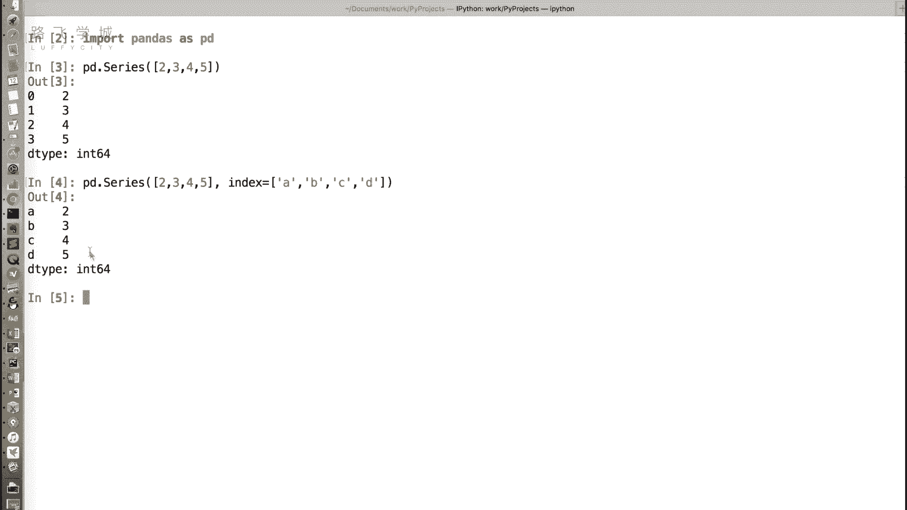
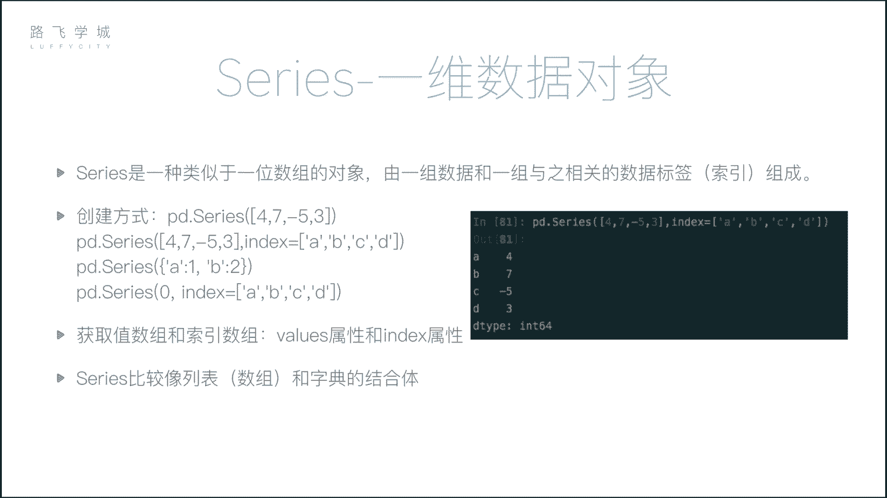
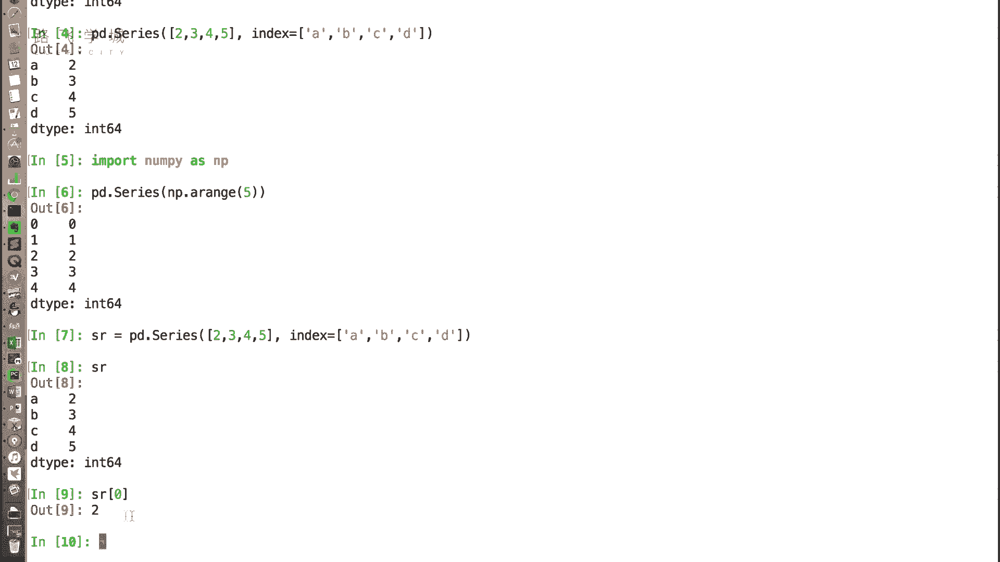
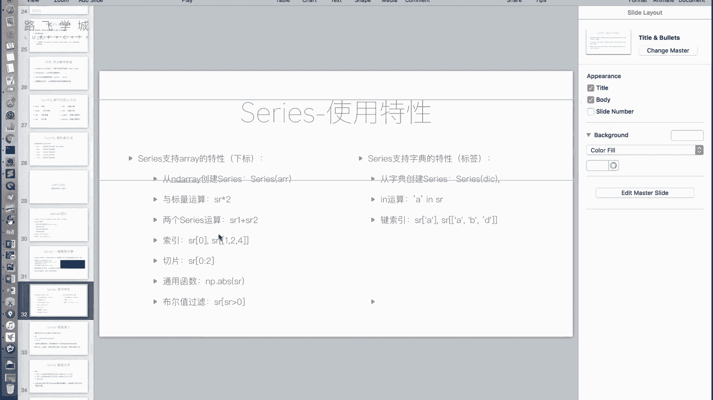

# Python金融量化+股票交易分析：P17：Series介绍 📊

## 概述
在本节课中，我们将要学习Pandas库中的第一个核心数据结构——**Series**。Series是构建Pandas数据分析能力的基础，它融合了列表（数组）和字典的特性，为处理一维数据提供了强大且灵活的工具。

---

## Series是什么？
上一节我们介绍了NumPy，本节中我们来看看Pandas。Pandas是基于NumPy构建的，在数据分析领域应用广泛。它封装层级更高，是数据分析的核心工具。


Pandas提供了两个主要的数据结构：DataFrame和Series。Series是一种类似于一维数组的对象。它非常像一个数组与字典的结合体。


### 创建Series
首先导入Pandas包，官方建议的引用方法是 `import pandas as pd`。

创建Series需要使用 `pd.Series()` 函数。

**1. 从列表创建**
```python
import pandas as pd
s = pd.Series([2, 3, 4, 5])
```
输出结果左边是默认的整数索引（0, 1, 2, 3），右边是数据值。这类似于一个列表或数组。





**2. 指定索引标签创建**
我们可以通过 `index` 参数自定义索引标签。
```python
s = pd.Series([2, 3, 4, 5], index=[‘a‘, ‘b‘, ‘c‘, ‘d‘])
```
此时，左边的索引列变成了 ‘a‘, ‘b‘, ‘c‘, ‘d‘，这类似于字典的键值对。

---

## Series的数组（列表）特性
Series继承了许多来自列表或NumPy数组的特性，使其操作非常直观。



以下是Series支持的数组类操作：



**1. 从数组创建**
Series不仅可以从列表创建，也可以直接从NumPy数组创建。
```python
import numpy as np
arr = np.array([1, 2, 3])
s = pd.Series(arr)
```

**2. 通过下标访问**
即使指定了自定义的标签索引，依然可以通过整数下标进行访问。
```python
s = pd.Series([2, 3, 4, 5], index=[‘a‘, ‘b‘, ‘c‘, ‘d‘])
print(s[0])  # 输出: 2
```
Series支持两种索引方式：**按下标索引**和**按标签索引**。

**3. 向量化运算**
Series支持与标量进行运算，也支持两个相同大小的Series之间进行运算（如加减乘除、比较）。
```python
s1 = pd.Series([1, 2, 3])
s2 = pd.Series([4, 5, 6])
print(s1 + s2)  # 输出: 0:5, 1:7, 2:9
print(s1 * 2)   # 输出: 0:2, 1:4, 2:6
```


**4. 切片操作**
和列表一样，Series支持切片操作。
```python
s = pd.Series([2, 3, 4, 5])
print(s[0:2])  # 输出索引0和1对应的值
```

**5. 通用函数与布尔索引**
Series支持NumPy的通用函数，也支持布尔索引进行条件筛选。
```python
s = pd.Series([2, 3, 4, 5])
print(s[s > 4])  # 输出大于4的值
print(np.abs(s)) # 应用绝对值函数
```

---

## Series的字典特性
除了数组特性，Series也融合了字典的一些实用功能。

以下是Series支持的字典类操作：

**1. 从字典创建**
可以直接用一个字典来创建Series，字典的键（key）会自动成为Series的索引标签。
```python
data = {‘a‘: 1, ‘b‘: 2, ‘c‘: 3}
s = pd.Series(data)
```

**2. 通过标签索引访问**
这是体现其字典特性的核心功能，可以通过标签来获取值。
```python
s = pd.Series([2, 3, 4, 5], index=[‘a‘, ‘b‘, ‘c‘, ‘d‘])
print(s[‘a‘])  # 输出: 2
```


**3. `in` 操作**
可以使用 `in` 关键字检查某个标签是否存在于Series的索引中。
```python
s = pd.Series([2, 3, 4, 5], index=[‘a‘, ‘b‘, ‘c‘, ‘d‘])
print(‘a‘ in s)  # 输出: True
print(‘e‘ in s)  # 输出: False
```
**注意**：对Series使用 `for` 循环时，遍历的是它的**值**，而不是键（索引）。这与遍历字典不同。

**4. 获取索引和值**
可以通过 `.index` 和 `.values` 属性分别获取Series的索引和值。
```python
s = pd.Series([2, 3, 4, 5], index=[‘a‘, ‘b‘, ‘c‘, ‘d‘])
print(s.index)  # 输出索引对象
print(s.values) # 输出值数组
```

**5. 花式索引与标签切片**
Series支持通过标签列表进行花式索引，也支持通过标签进行切片。
```python
s = pd.Series([2, 3, 4, 5], index=[‘a‘, ‘b‘, ‘c‘, ‘d‘])
# 花式索引
print(s[[‘a‘, ‘c‘]])  # 输出标签‘a‘和‘c‘对应的值
# 标签切片 (注意：标签切片是“前包后也包”的)
print(s[‘a‘:‘c‘])     # 输出标签‘a‘, ‘b‘, ‘c‘对应的值
```
**重要区别**：整数切片是“前包后不包”，而**标签切片是“前包后也包”**的。

---

## Series的应用场景
Series结合了有序列表和快速键值查询的优点，在实际工作中非常有用。

例如，在金融分析中，记录一支股票每日的收盘价：
*   数据本身（价格）是有序的，需要按时间序列处理（列表特性）。
*   同时，我们经常需要查询特定日期（如 ‘2023-10-01‘）的价格（字典特性）。

使用Series，你可以将日期作为索引标签，价格作为值。这样，既可以通过位置（第几天）访问，也可以通过具体的日期标签快速查询，极大地提升了数据处理的效率和便捷性。


之前，你可能需要将 `(时间戳， 值)` 的元组存入列表，查询时需要遍历。现在，Series直接为你提供了有序且支持键值查询的数据结构。

---

## 总结
本节课中我们一起学习了Pandas的核心数据结构之一——**Series**。
我们了解到Series是一个一维的、带标签的数组，它巧妙融合了列表（数组）和字典的优点。
我们掌握了如何创建Series，以及如何使用其数组特性（如下标访问、运算、切片）和字典特性（如标签索引、`in`操作）。
理解Series是后续学习更复杂的DataFrame的基础，也是进行高效数据分析的第一步。