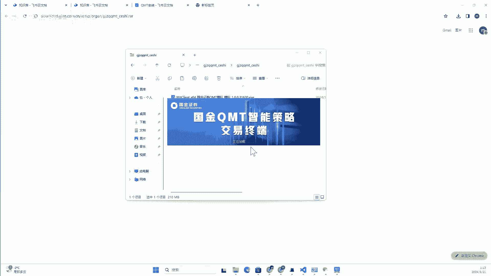
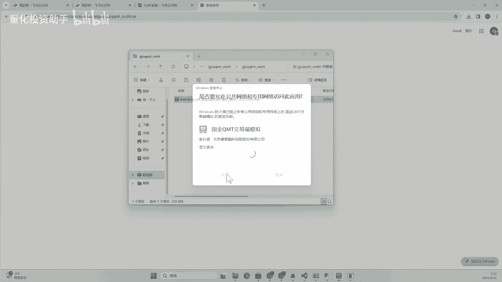
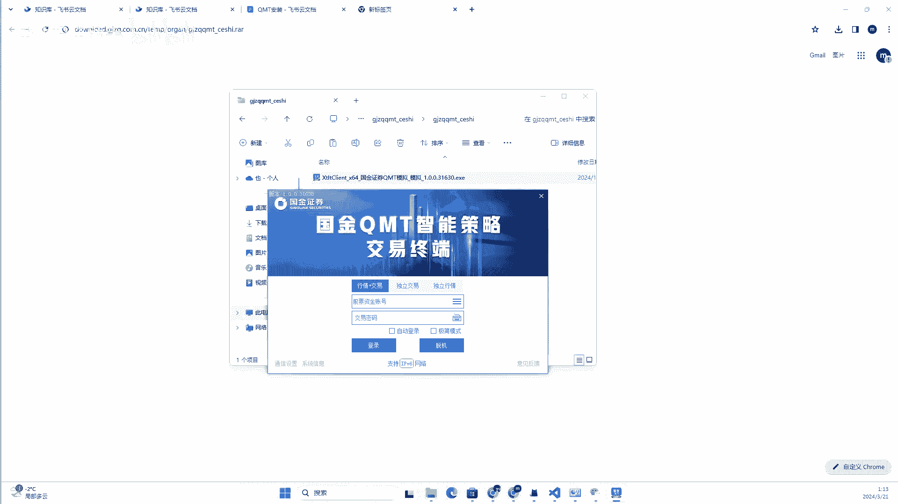
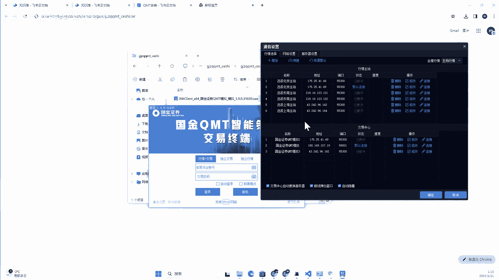
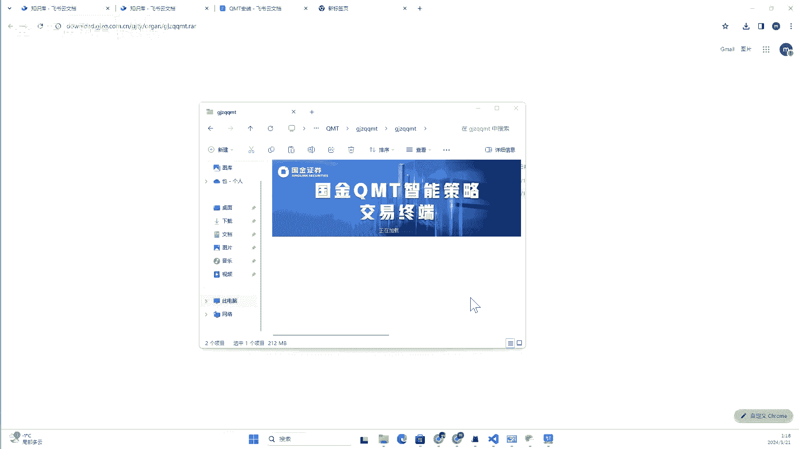
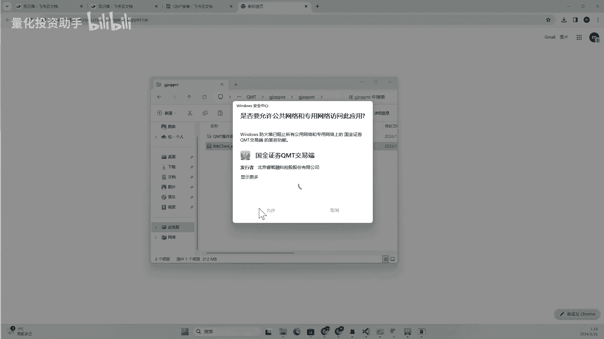
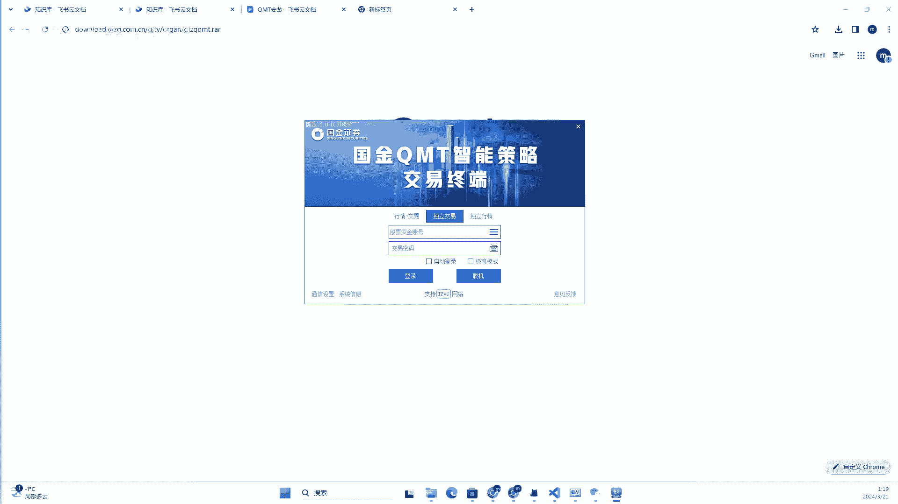

# QMT量化交易实战：1：QMT安装与配置 🚀

在本节课中，我们将学习如何安装和配置QMT量化交易软件。QMT是进行量化交易的核心工具，安装是使用它的第一步。我们将分别介绍模拟客户端和实盘客户端的获取、安装及初步启动流程。

## 客户端类型介绍

上一节我们介绍了课程目标，本节中我们来看看QMT的两种客户端类型。

开通QMT后，有两种客户端可供使用：模拟客户端和实盘客户端。模拟客户端用于策略测试和功能体验。实盘客户端用于真实的量化交易。

以下是两种客户端的核心区别：
*   **模拟客户端**：由券商提供，用于用户体验或策略测试。开户后，客户经理通常会第一时间为您申请。
*   **实盘客户端**：用于真实的资金交易。需要单独申请，申请成功后，相关信息会通过邮件发送。

## 客户端的获取与安装

了解了客户端类型后，我们来看看如何获取并安装它们。

### 模拟客户端获取与安装

模拟客户端的安装信息通常由客户经理直接提供。

以下是获取与安装模拟客户端的步骤：
1.  **获取信息**：客户经理会提供包含测试账号、密码及下载链接的信息。
2.  **下载客户端**：将下载链接粘贴到浏览器中，即可开始下载安装文件。
3.  **安装程序**：下载完成后，解压文件并运行其中的 `.exe` 安装程序。
4.  **完成安装**：按照安装向导的提示，逐步点击“下一步”即可完成安装。安装路径可自定义，例如选择 `D盘`。

### 实盘客户端获取与安装

实盘客户端的申请流程不同，安装包通过邮件发送。

以下是获取与安装实盘客户端的步骤：
1.  **查收邮件**：实盘权限申请成功后，下载链接和说明会发送到您的邮箱。
2.  **下载与安装**：从邮件中获取下载链接，其安装过程与模拟客户端完全相同。请注意，安装时系统防火墙可能会弹出提示，选择“允许运行”或暂时关闭防火墙即可顺利安装。

## 客户端的启动与登录

成功安装客户端后，下一步就是启动并熟悉登录界面。

启动安装好的QMT客户端，首先会看到登录界面。该界面提供几个关键选项：

*   **登录模式**：分为“行情+交易”、“独立行情”、“独立交易”三种。通常选择“行情+交易”以获得完整功能。
*   **账号与密码**：输入券商提供的资金账号和交易密码。
*   **极简版（MiniQMT）**：勾选此项将启动功能精简的MiniQMT界面，适用于专注策略编写的用户；不勾选则启动功能全面的主QMT界面。
*   **通讯配置**：点击后可查看和设置行情主站、交易中心的服务器地址，通常使用默认配置即可。

**注意**：模拟端与实盘端的登录界面外观一致，但登录后所能访问的行情数据和交易柜台不同。

## 安装实操演示

为了让您更清晰地理解整个过程，我们将模拟一次完整的安装流程。

以下是模拟客户端的安装实操关键节点：
1.  将客户经理提供的下载链接粘贴至浏览器，下载安装包。
2.  运行安装程序 (`QMT_国金模拟交易.exe`)，按照向导完成安装。
3.  安装完成后启动软件，看到登录界面即表示安装成功。

以下是实盘客户端的安装实操关键节点：
1.  在开通邮件中找到下载链接，下载实盘安装包（文件名通常不含“测试”或“模拟”字样）。
2.  运行安装程序，步骤与安装模拟端完全一致。
3.  启动软件，验证登录界面正常出现。

## 总结与建议

本节课中我们一起学习了QMT量化交易软件的安装与初步配置。

我们介绍了模拟端和实盘端两种客户端的区别、获取方式以及详细的安装步骤。安装过程本质上是运行一个标准的Windows安装程序 (`*.exe`)。安装成功后，您会看到一个包含多种登录选项的界面。

对于初学者，建议先使用模拟客户端熟悉软件的各项功能。当实盘权限开通后，则应主要使用实盘客户端进行交易，模拟端仅用于必要的测试。两个客户端的软件主体相同，主要区别在于连接的服务器和账户权限。

至此，QMT的安装基础工作已经完成，为后续的量化策略开发与交易打下了基础。