# QMT量化交易实战：4：xtquant使用 - P1 🚀

在本节课中，我们将学习xtquant这个Python包。它是连接本地量化交易系统与QMT极简版（Mini QMT）客户端的桥梁，使我们能够独立于QMT软件，在任意Python环境中获取行情数据和执行交易。

---

## 什么是xtquant？🤔

xtquant是一个由迅投公司编写的Python包，专为Mini QMT设计。通过使用这个包，我们可以在任何地方编写Python程序，并调用Mini QMT的功能。

在之前的QMT简介课程中，我们介绍了Mini QMT与主QMT的区别。xtquant包主要针对Mini QMT使用。这样，我们基于Python搭建的量化交易系统就可以独立于Mini QMT存在，两者只需运行在同一台机器上，而无需将程序运行在QMT软件内部。这实现了量化交易系统的完全本地化。

从技术上讲，当这个包运行起来并与Mini QMT建立链接时，我们就把Mini QMT这个极简版客户端当作一个服务。我们不再需要在其软件内部编写代码，只要我们的Python程序与其建立了链接，就可以进行量化策略的编写和交易操作。这就是xtquant包的核心优势。

---

## 如何下载xtquant？📥

xtquant包并未发布在PyPI（Python Package Index）上。PyPI是Python的第三方包仓库，我们在上节Python环境安装时介绍过它。大部分开源包都发布在这里，但迅投并未将xtquant发布于此。

我们需要前往迅投知识库官网的对应界面进行下载。下图是一个下载页面的示例，迅投会定期更新这个包，我们下载最新版本即可。


---

## xtquant的核心模块与使用前提 ⚙️

在使用xtquant之前，**必须启动Mini QMT客户端（即QMT的极简版）**。这里需要强调，必须启动具备极简版权限的客户端，启动非极简版是不行的。

xtquant主要分为两大模块：
*   **`xtdata`**：数据获取接口。
*   **`xttrader`**：交易相关接口。

顾名思义，`xtdata`用于获取数据，`xttrader`用于执行交易下单。下面我们简单介绍它们，后续课程会进行详细实操。

---

### 数据模块：xtdata 📊

`xtdata`是数据获取接口，我们可以用它实现数据的获取、下载和订阅。所有需要获取数据的接口，例如历史数据、财务数据、特色数据以及股票基础信息等，都位于这个模块下。

以下是一个获取历史数据的实例，获取的是贵州茅台（600519）的日线数据。我们稍后会进行实操。

```python
# 示例：获取历史数据
import xtdata
data = xtdata.get_market_data(field_list=[], stock_list=[‘600519.SH’], period=‘1d’, start_time=‘20230101’, end_time=‘20231231’, count=-1)
```

获取回来的数据是一个字典（`dict`），其中每个键（`key`）对应的值是一个`pandas`的`DataFrame`。因此，在使用`xtdata`之前，大家需要对`pandas`进行简单学习。

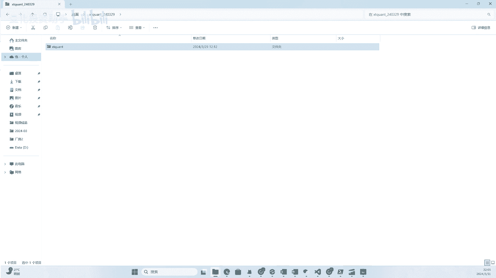

`pandas`是Python科学计算的一个包，它的`DataFrame`类代表一个数据表。我们可以在这个数据表中灵活地操作数据。对于量化交易而言，`pandas`是一个非常基础且重要的工具。如果尚未了解，建议自行寻找教程学习，其难度并不高。获取到数据后，我们就可以基于`pandas`的方法进行数据处理。

---

### 交易模块：xttrader 💹

`xttrader`是交易相关模块，我们可以用它来进行下单、撤单等操作。下面是一个简单的例子，我们稍后也会实际运行它。

```python
# 示例：交易下单
import xttrader
# 此处需要填写本地Mini QMT路径和账号信息
trader = xttrader.XtQuantTrader(‘D:/国金证券/QMT交易/userdata_mini’, 123456)
trader.start()
# 连接成功后执行下单操作
order_id = trader.order_stock(‘600000.SH’, ‘buy’, 100, ‘limit’, 10.5)
print(f‘订单号：{order_id}’)
```

---

上一节我们介绍了xtquant的基本概念和模块，本节中我们来看看如何实际操作，包括包的安装和基础功能测试。

---

## 实战：配置与运行xtquant 💻

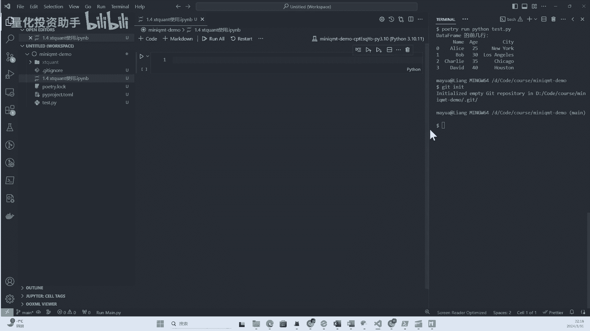

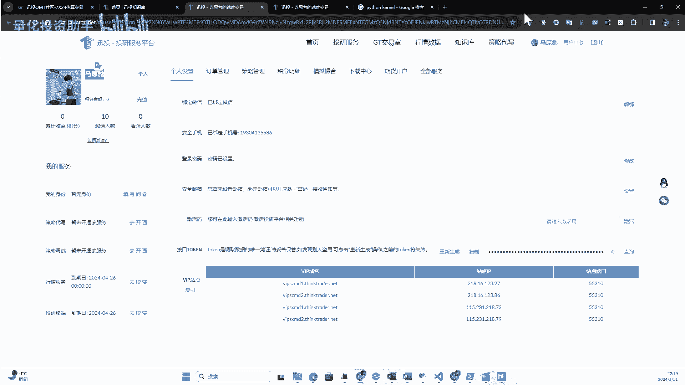

在代码实操之前，我们需要再次详细介绍迅投知识库，因为下载xtquant包必须通过它。在QMT简介课程中我们已大致介绍过，这里再强调一下。

迅投知识库可以看作是QMT软件的官方技术文档，目前其文档已比较完善。首页有很多资料，主要分为“内置Python”和“原生Python”两个分类，在API栏目下也能找到。

*   **内置Python**对应的是主QMT（非极简版）。
*   **原生Python**对应的是我们的Mini QMT。

本课程着重讲解Mini QMT，因此我们点击“原生Python”。在这个目录下可以找到xtquant的下载地址，位于页面最后。点击即可进入下载页面，这里会列出xtquant的各种版本，我们下载最新的即可。迅投会定期更新数据并修复用户反馈的问题，如果问题被修复，我们可以下载新包进行更新。

下载完成后，我们得到一个压缩包，将其解压到本地。解压后的文件夹就是xtquant的源码包。这个包实际上是开源的，其主要代码是Python脚本。但对接QMT底层接口的部分是编译过的，我们无法直接查看。不过，上层的`.py`文件是可读的，如果需要阅读源码，可以查看相应的文件。

现在包已下载到本地，但如何在程序中使用它呢？其实很简单，就是将其复制到我们的项目目录中。

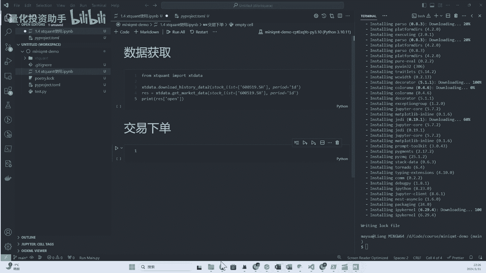

以下是操作步骤：

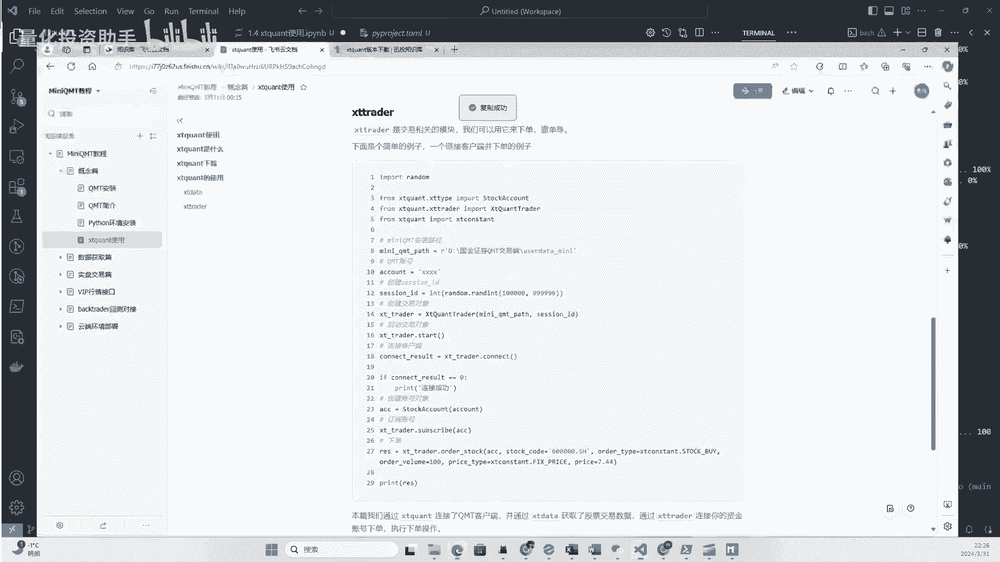

1.  找到上节课创建的项目文件夹。
2.  将解压好的`xtquant`文件夹复制到项目目录中。
3.  这样，`xtquant`就以本地包的形式存在于我们的项目系统里了，接下来可以将其当作本地Python包使用。

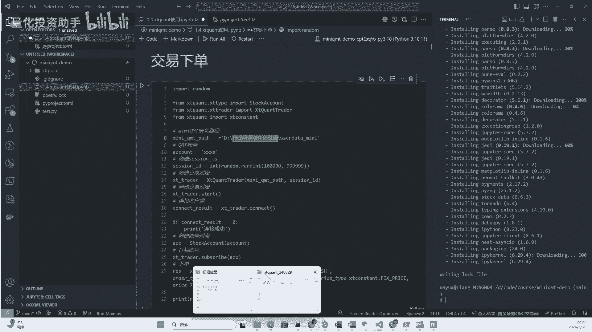

接下来，我们简单完善一下项目。由于我们安装了Git，可以初始化一个代码仓库，并创建`.gitignore`文件，将`xtquant`文件夹忽略掉，因为它是一个第三方包，通常不纳入版本控制。

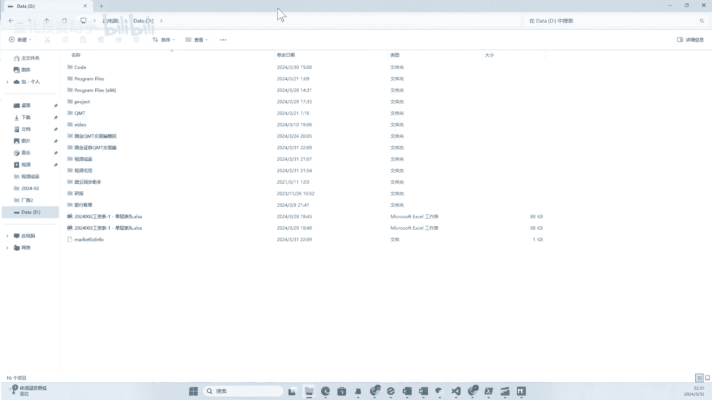

然后，我们创建一个Jupyter Notebook文件（`.ipynb`）。VS Code支持Jupyter Notebook的编写，可以通过安装相关插件（搜索Jupyter）来实现。安装后，就可以在VS Code中使用Notebook编写和测试程序了。我们调整一下命令行面板的位置，以便于操作。

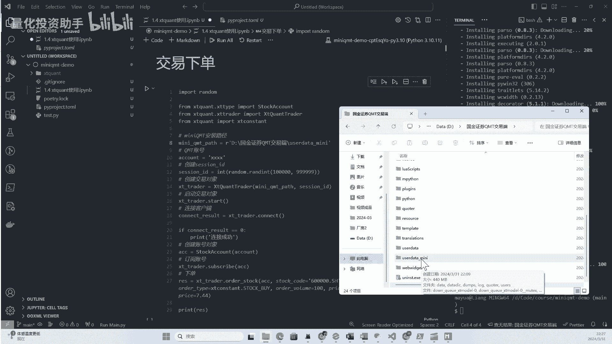

现在，我们开始运行第一个例子。首先，**必须确保你的Mini QMT客户端已经启动**（即登录QMT时勾选“极简版”并成功登录）。如果未登录，程序连接会失败。

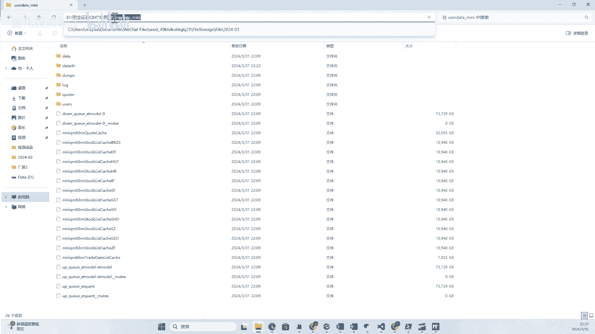

在Notebook中，我们需要选择Python内核（运行环境）。我们选择之前安装好的虚拟环境。这样，在Notebook中运行代码使用的就是我们创建好的独立环境，非常方便。如果你习惯使用PyCharm等其他编辑器，也可以进行类似配置，核心是确保Python环境配置正确。

我们将之前示例中的小程序复制到Notebook单元格中，并点击运行。首次运行可能会失败，因为缺少`xtquant`包。虽然我们将包复制到了项目里，但可能还需要安装其依赖或进行路径设置。我们可以尝试使用包管理工具`poetry`或`pip`来安装。这里我们使用`poetry add ./xtquant`（假设在项目根目录）来将本地包添加到项目依赖中。

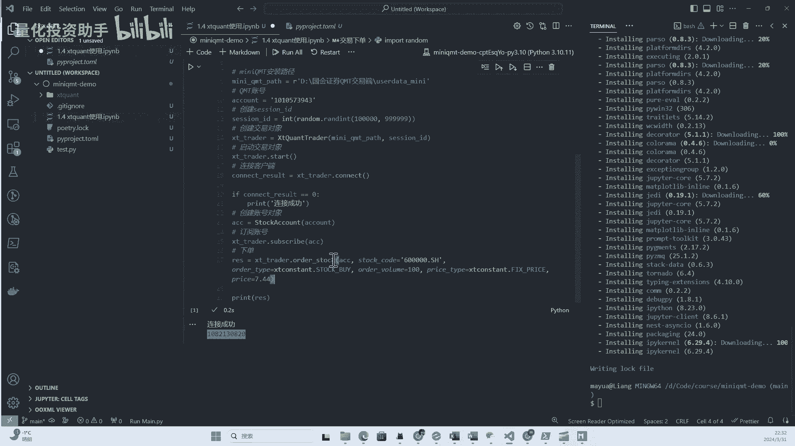

安装完成后，再次运行代码。如果成功，我们将获取到贵州茅台（600519）的日线数据。返回的结果是一个字典，它以列的形式组织数据。例如，我们可以通过`data[‘open’]`来查看开盘价序列。这只是初步体验，后续课程会详细介绍各种数据接口。

---

刚试完数据获取，我们再测试一下交易模块的例子。

我们将交易示例代码复制到新的Notebook单元格中。这里需要特别注意几个参数：
*   `mini_qmt_path`：需要填写你本地安装Mini QMT的**具体路径**，最终需定位到`userdata_mini`文件夹。你的安装路径可能和示例不同，请以本地实际情况为准。
*   `account_id`：需要替换为你自己的交易账号。

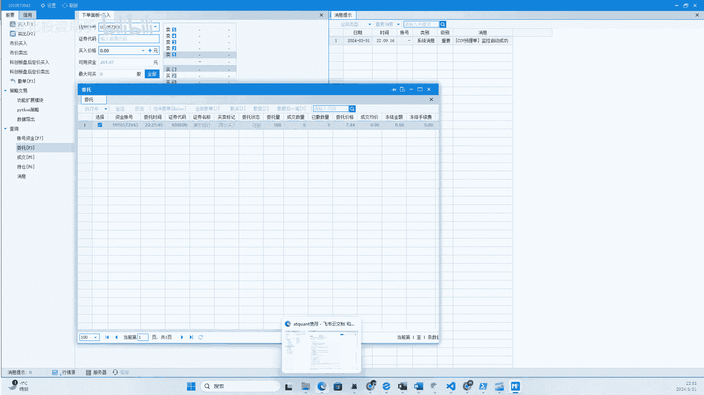

替换好参数后，运行代码。如果连接成功，程序会打印出订单号。示例中是买入一手浦发银行。如果在非交易时间运行，这会形成一个预埋单。

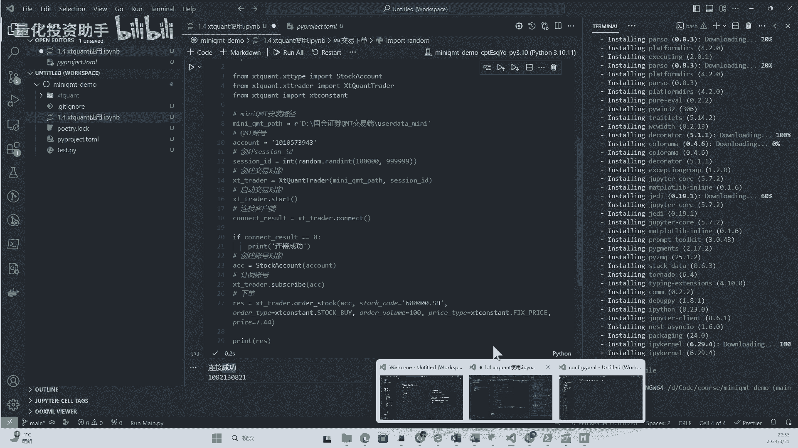

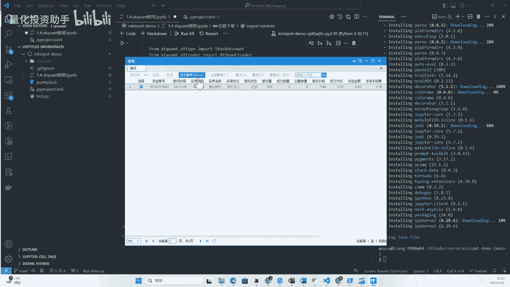

如果你的账户有足够资金，可以在QMT客户端的“委托”页面查看到这条下单记录。需要简单说明的是，关于预埋单的有效时间，根据咨询迅投得到的信息，在下午收盘后（例如15:00后）到晚上约22:00前，由于系统处于结算阶段，预埋单可能容易失败。如果想进行预埋单，建议在22:00之后或更晚时间操作，成功率会更高。

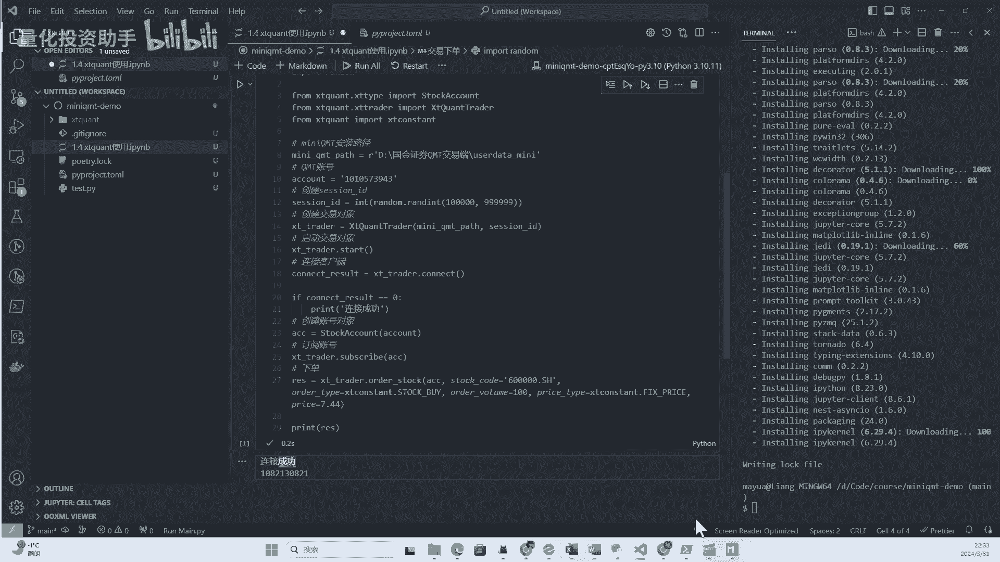

如果账户资金不足，再次执行下单代码，虽然会返回一个订单号，但委托会失败。你可以在QMT客户端的“消息提示”中看到失败原因，例如“资金不足”。因此，在程序中下单后，一定要关注下单结果。实际上，通过`xttrader`的接口，我们也可以在程序中监听到下单的成功、失败状态以及具体原因，后续课程会进行演示。

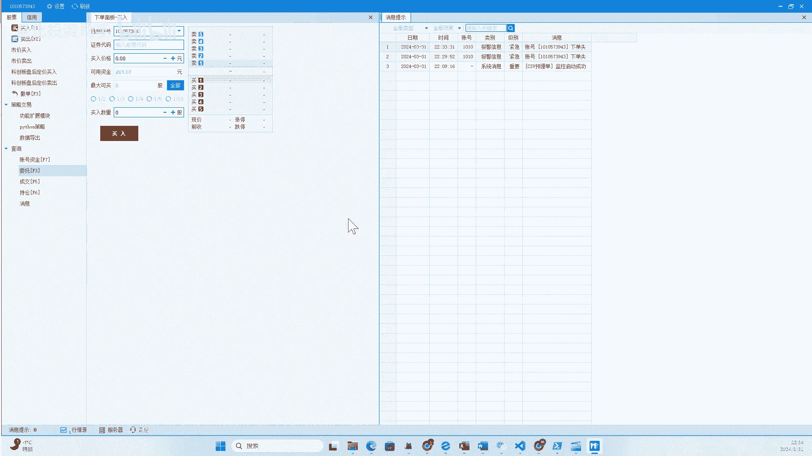

运行完这两个例子，大家应该可以看到，使用`xtquant`我们可以：第一，获取历史行情数据；第二，进行程序化下单。这构成了一个简单量化交易系统最核心的两部分功能。

---

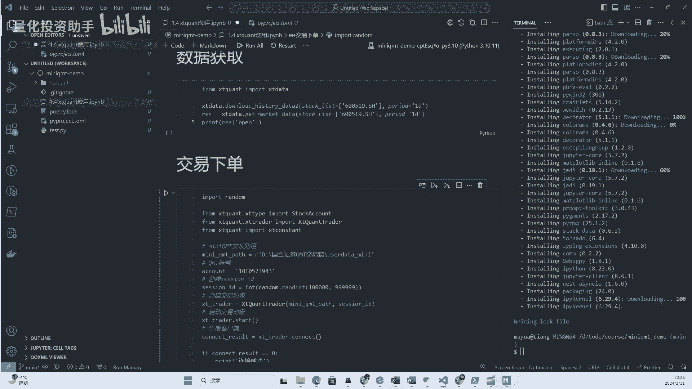

## 官方文档与资源 📚

我们再次回到迅投知识库。点击“原生Python”目录，这里详细介绍的就是`xtquant`的所有接口。每个接口的用法都有详细说明和示例。如果我们使用Mini QMT和`xtquant`，参考这份文档即可。

如果想使用主QMT（非极简版），则需参考“内置Python”部分的文档。我个人更倾向于使用原生Python（即`xtquant`+Mini QMT）模式，这样程序更加灵活，我们只是调用接口，量化交易系统可以更好地由自己定制，这是我认为的主要优势。

---

## 总结 🎯

本节课我们一起学习了`xtquant`的核心知识。我们明确了`xtquant`是一个由迅投开发的Python包，而“Mini QMT”是大家对QMT极简版的俗称。`xtquant`包用于与极简版QMT客户端进行交互，建立链接后即可获取行情和报单。

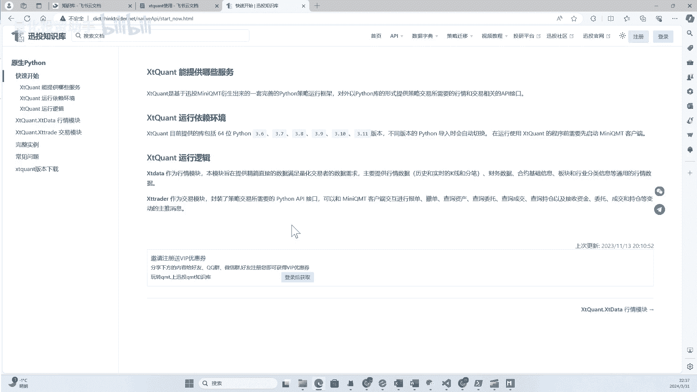

如果你使用Mini QMT，就必须熟悉`xtquant`这个包的使用。接下来的大部分课程，我们也将围绕`xtquant`的各种使用方法展开深入讲解。