# Python基础语法：P1：环境配置与基础入门 🐍

在本节课中，我们将学习Python编程的起点：如何配置开发环境，并掌握最基础的语法知识，包括输入输出、变量、数据类型和基本运算符。课程将使用同花顺金融数据终端的量化研究平台作为教学环境，无需本地安装，方便初学者快速上手。

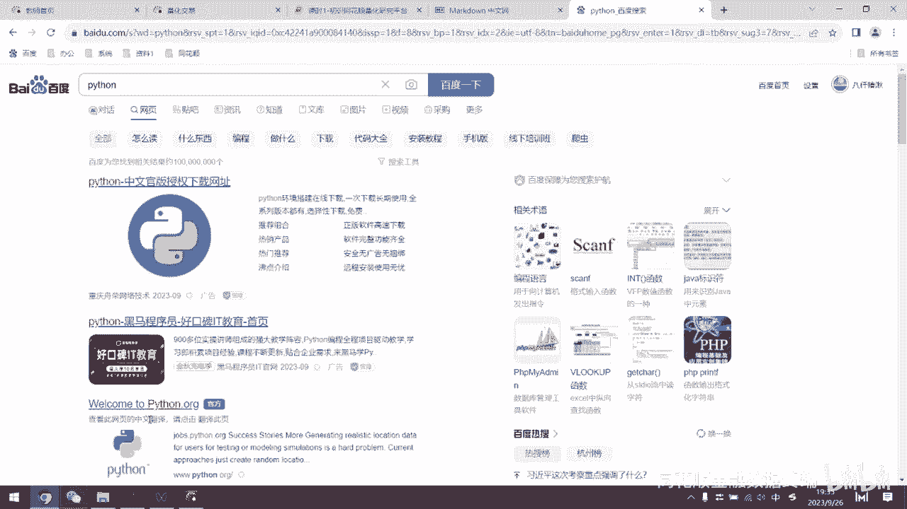

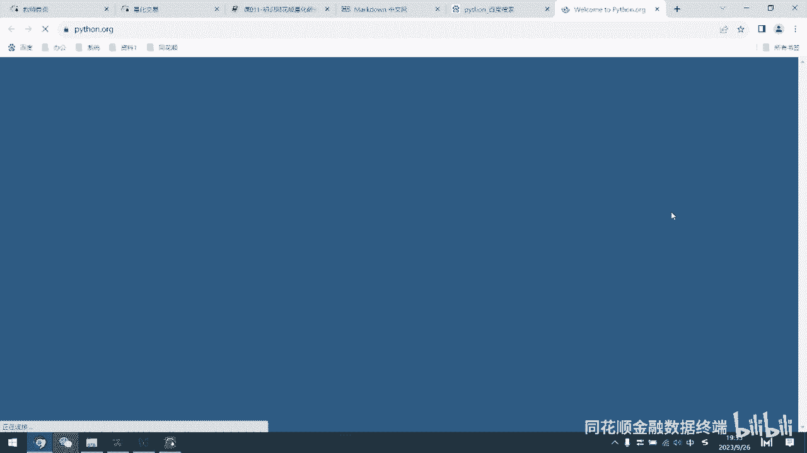

## 课程环境与工具介绍 🛠️

整个课程体系的教学和练习，都可以在同花顺金融数据终端内完成。在终端中，可以通过“工具”菜单找到“量化风控”模块，其中的“量化研究”就是我们的量化平台。所有课程内容都将在这个平台中进行讲解。

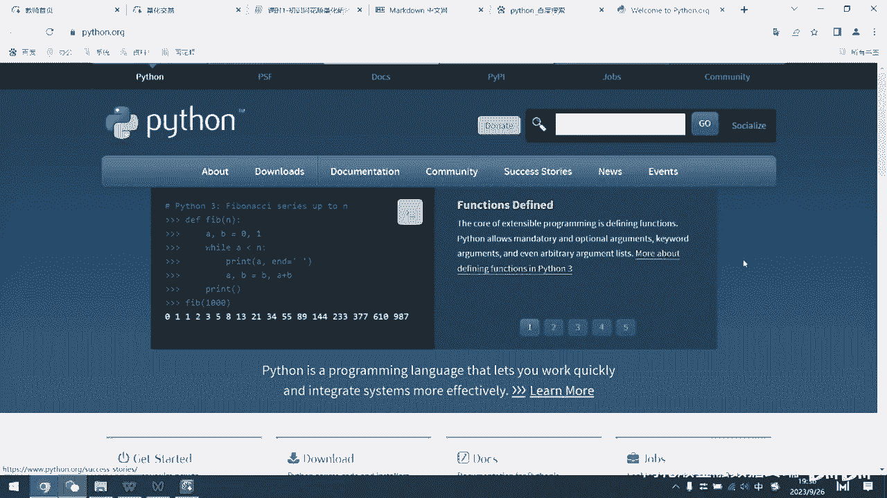

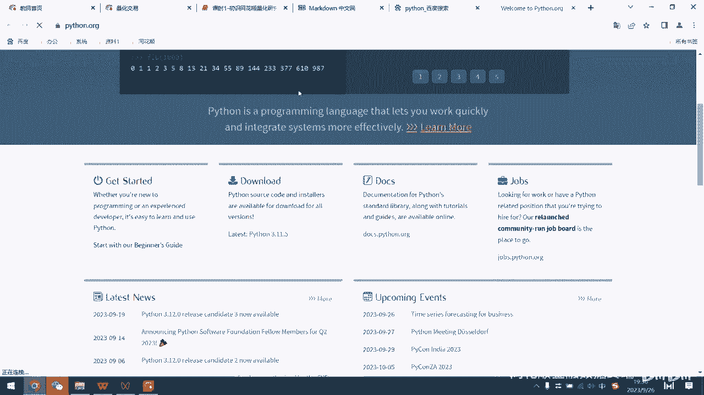

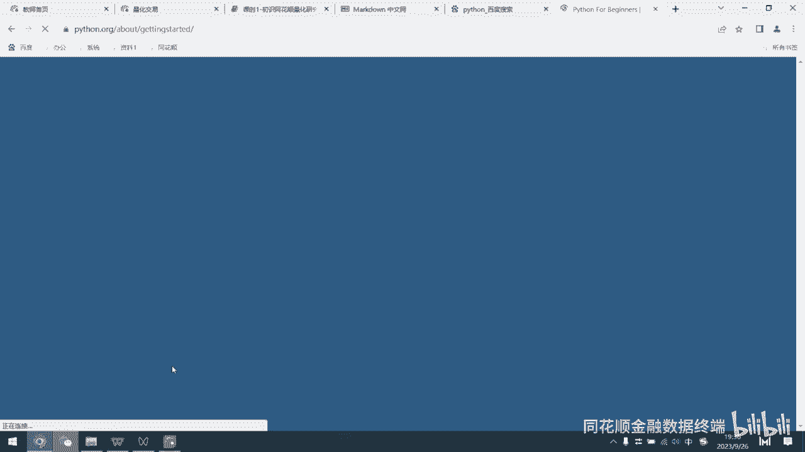

## Python的下载与安装 💻

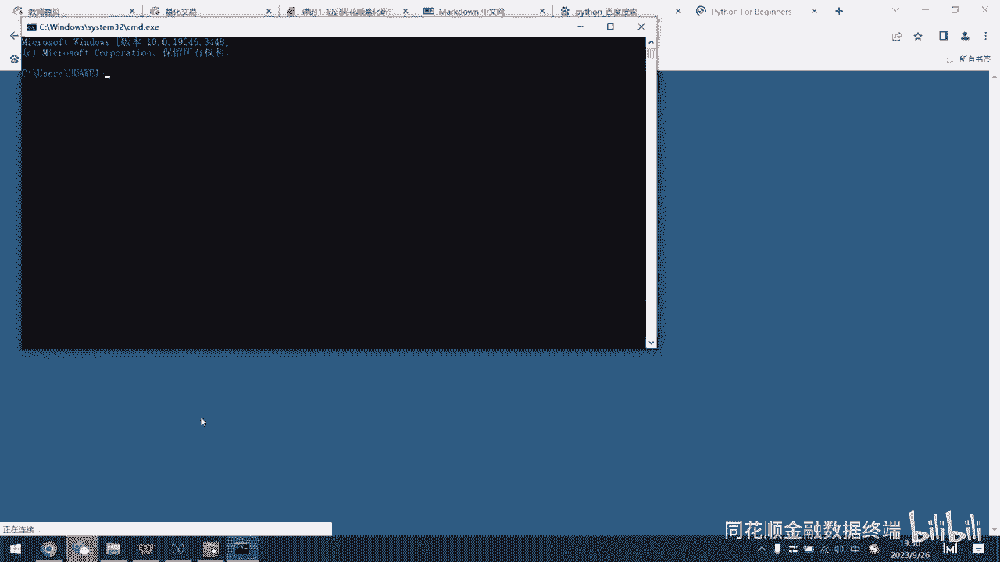

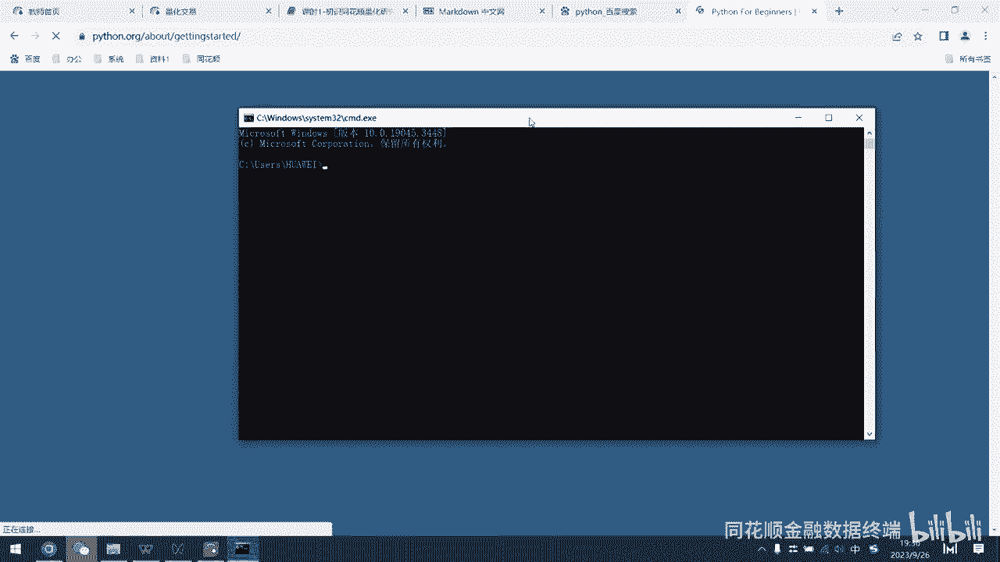

学习Python的第一步是了解它是什么以及如何使用，这涉及到下载和安装。通常，可以直接在百度搜索“Python”进入其官方网站进行下载。

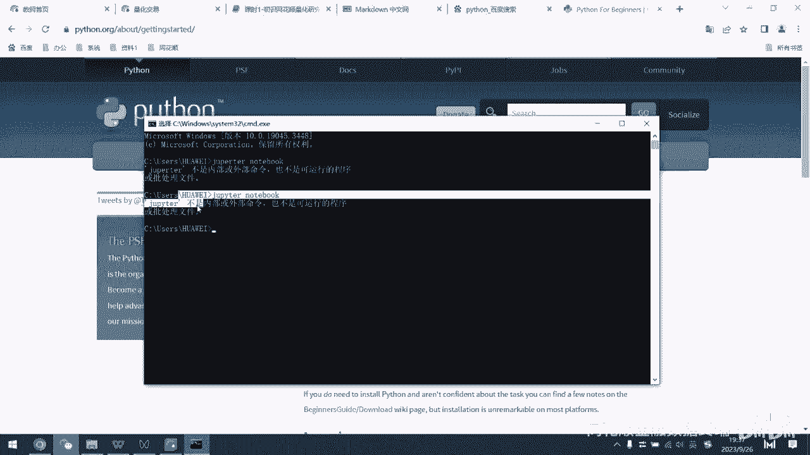


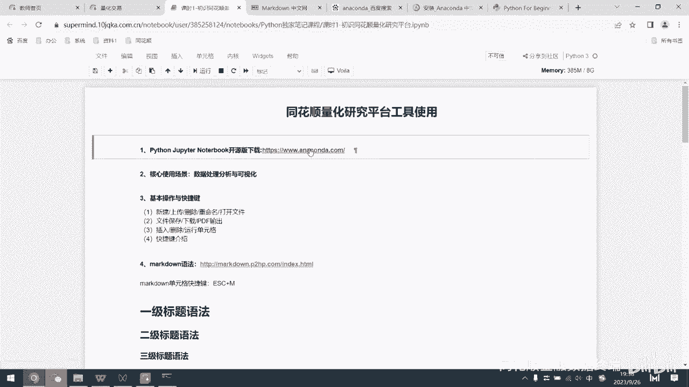

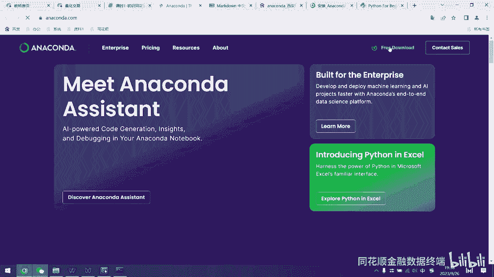

Python官网提供了各个版本的下载选项，例如Python 3.11。它支持Windows、Mac和Linux等多种平台，具有很好的跨平台性。


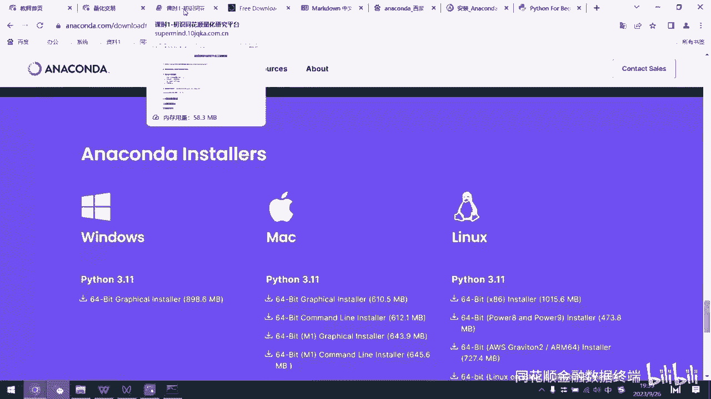

然而，从官网下载的Python自带的集成开发环境（IDE）并不直观好用，其界面是黑白的命令行样式，操作不便。

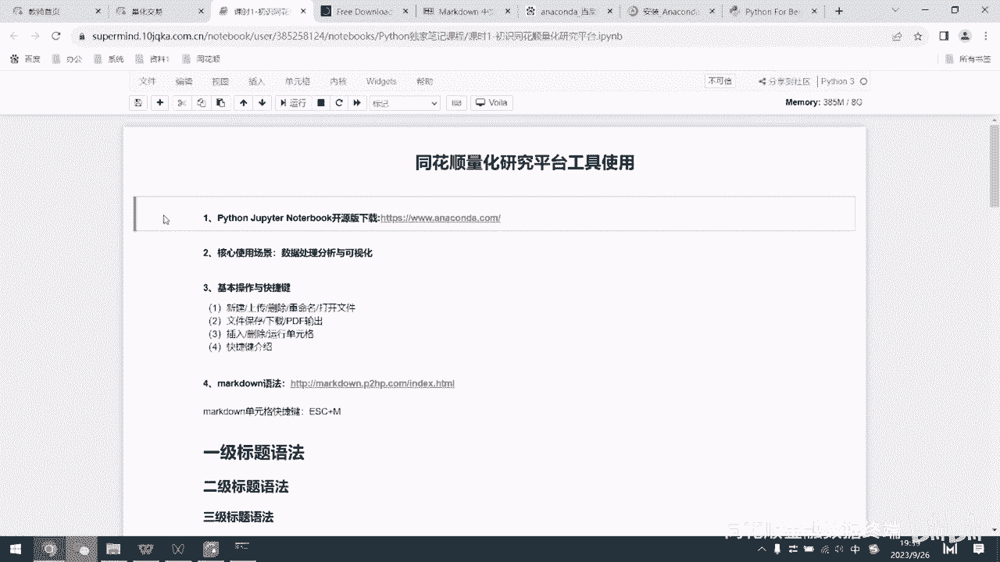


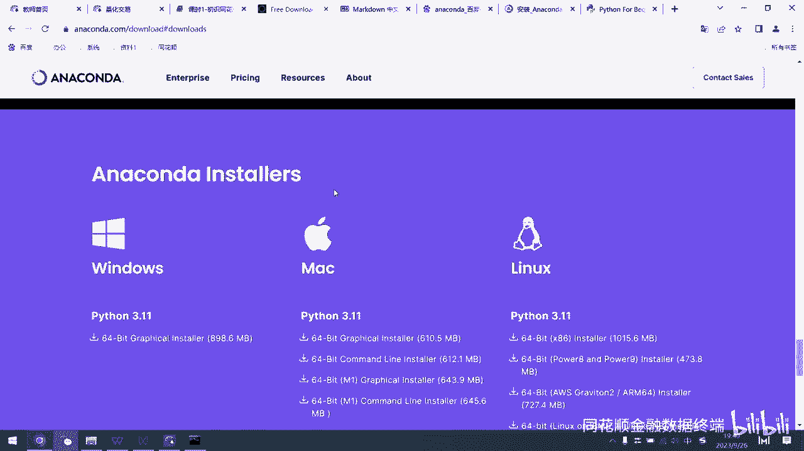

## 推荐工具：Anaconda 📦

更推荐大家下载的是Anaconda软件。它像一个软件平台，集成了Python和众多常用的数据科学工具。

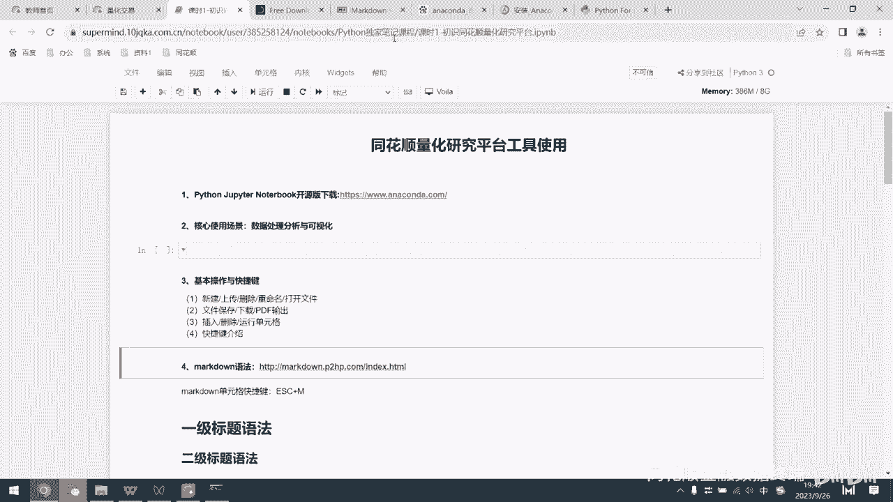


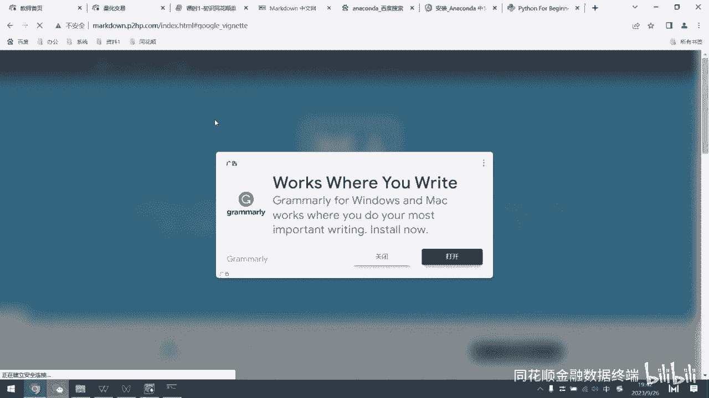

在Anaconda的官网可以根据电脑系统选择对应版本下载。安装后，最常用的工具是Jupyter Notebook。

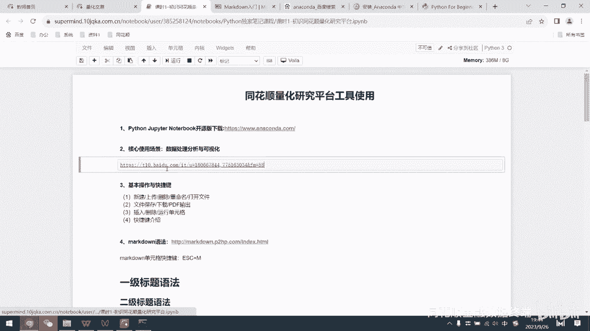

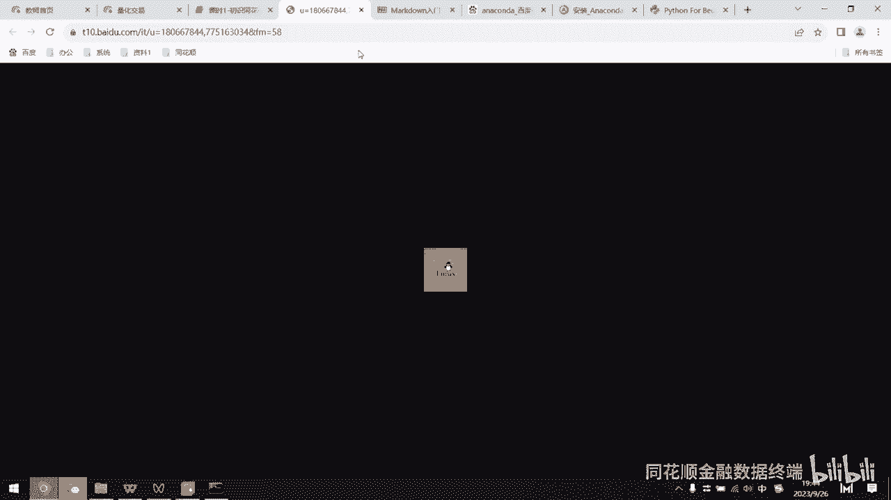


同花顺量化研究平台内置的正是Jupyter Notebook环境。用户新建一个Python3文件后，即可在此进行编辑和运行代码。


## Jupyter Notebook 基础操作 ⌨️

Jupyter Notebook采用单元格（Cell）结构，每个单元格可以独立运行，方便代码的测试和修改。单元格有两种主要模式：代码模式和标记模式。

*   **代码模式**：用于编写和运行Python代码。
*   **标记模式**：用于编写格式化的文本说明，支持Markdown语法。

使用快捷键 `Y` 可将单元格切换到代码模式，使用快捷键 `M` 可切换到标记模式。

在标记模式下，可以插入文本、网址、图片等多种内容，并利用Markdown语法进行排版，例如加粗、列表、标题等。

## 量化平台的使用说明 🌐

对于初学者，配置本地Python环境可能是个挑战。同花顺的量化研究平台提供了云端环境，预装了Numpy、Pandas等数据分析常用库，省去了配置环境的麻烦。

在平台首页，可以新建文件、上传本地文件（如.ipynb或.csv格式）。文件打开后，注意及时关闭不用的文件以释放内存。

以下是关于文件操作和单元格管理的基本功能列表：

*   **文件操作**：支持保存、另存为、重命名，并可下载为.ipynb、HTML、PDF等多种格式。
*   **单元格管理**：
    *   在单元格为蓝色选中状态时（非绿色编辑状态），按 `A` 键可在其前插入单元格，按 `B` 键可在其后插入单元格。
    *   连按两次 `D` 键可删除选中单元格。
    *   按 `Shift + Enter` 可运行当前单元格。

## Markdown 格式基础应用 📝

在标记模式下，可以利用简单的语法实现丰富的排版效果。

*   **标题**：使用 `#` 加空格创建，`#` 的数量代表标题级别。
    ```markdown
    # 一级标题
    ## 二级标题
    ```
*   **居中**：使用 `<center>` 标签。
    ```html
    <center>居中文本</center>
    ```
*   **加粗与斜体**：使用 `**` 包裹文本实现加粗，使用 `*` 包裹文本实现斜体。
    ```markdown
    **这是加粗文本**
    *这是斜体文本*
    ```
*   **列表**：使用 `-` 或 `+` 加空格创建无序列表。
    ```markdown
    - 项目一
    - 项目二
    ```
*   **字体与颜色**：可以使用HTML标签进行更细致的调整（但通常不必要）。
    ```html
    <font color=red size=5 face=“微软雅黑”>红色大字</font>
    ```
*   **目录/锚点**：创建可跳转的内部链接。
    ```markdown
    [跳转到目录一](#目录一)
    ```
    在文中需要跳转到的位置，设置一个同名锚点：
    ```markdown
    <a id=“目录一”></a>
    ## 目录一
    ```

## Python 基础语法入门 🚀

熟悉了环境操作后，我们开始学习Python的基础语法。请在量化平台中新建一个Python3文件，跟随以下步骤操作。

### 第一个程序：print 语句

`print()` 函数用于向屏幕输出信息。

```python
print(123)
```
运行上述代码，会输出数字 `123`。

```python
print(“Hello World”)
```
运行上述代码，会输出字符串 `“Hello World”`。恭喜，你已经写出了第一个Python程序。

`print()` 可以打印数字、算式结果，也可以打印字符串。**字符串必须用单引号 `‘’` 或双引号 `“”` 包裹**。不同的内容可以用逗号隔开，在同一行打印。

```python
print(“数字：”， 123, “算式结果：”， 1+1)
```

### 代码注释

注释是对代码的解释说明，不会被程序执行。使用井号 `#` 开始单行注释。

```python
# 这是一行注释，不会被执行
print(“这行代码会被执行”) # 井号后的内容也是注释
```

多行注释可以使用三个单引号 `‘‘‘` 或三个双引号 `“““` 包裹。

```python
‘‘‘
这是多行注释，
可以写很多行。
‘‘‘
```

### 输入函数：input

`input()` 函数用于在程序运行时获取用户的键盘输入。

```python
user_input = input(“请输入内容：”)
print(“你输入的是：”， user_input)
```
运行后，程序会等待用户输入，输入的内容会被存储在变量 `user_input` 中，然后打印出来。

### 变量与赋值

变量用于存储数据。使用等号 `=` 进行赋值，将等号右边的值赋予左边的变量名。

```python
name = “张三” # 将字符串“张三”赋值给变量name
price = 100.5 # 将数字100.5赋值给变量price
print(name) # 打印变量name的值，输出：张三
```

*   **变量命名规则**：可以由字母、数字、下划线组成，但不能以数字开头。区分大小写（`op` 和 `OP` 是两个变量）。
*   **保留字**：如 `and`, `or`, `not`, `if` 等是Python语言内置的保留字，不能用作变量名。
*   **同时赋值**：可以同时为多个变量赋值。
    ```python
    a = b = c = 1
    open_p, close_p, high_p, low_p = 10, 12, 15, 9
    ```
*   **删除变量**：使用 `del` 语句。
    ```python
    var1 = 1
    del var1 # 删除变量var1
    # print(var1) # 再次使用会报错，提示变量未定义
    ```

### 基本数据类型

Python有几种基本的数据类型：

1.  **字符串（String）**：由引号包裹的文本。
    ```python
    s1 = “Hello”
    s2 = ‘123’
    ```
2.  **数字（Number）**：包括整数（int）和浮点数（float）。
    ```python
    num_int = 3
    num_float = 3.14
    ```
3.  **布尔型（Boolean）**：只有 `True`（真）和 `False`（假）两个值，常用于逻辑判断。
    ```python
    is_equal = (1 == 2) # 判断1是否等于2，结果是False
    ```
4.  **列表（List）**：使用方括号 `[]` 定义，元素之间用逗号分隔，元素可以修改。
    ```python
    stock_list = [“茅台”， “腾讯”， “苹果”]
    ```
5.  **元组（Tuple）**：使用圆括号 `()` 定义，元素不可修改。
    ```python
    index_tuple = (“上证指数”， “深证成指”)
    ```
6.  **字典（Dictionary）**：使用花括号 `{}` 定义，元素是键值对 `key: value`。
    ```python
    stock_info = {“name”: “贵州茅台”， “code”: “600519”}
    ```

### 运算符

运算符用于对变量和值执行操作。

*   **算术运算符**：`+`（加）， `-`（减）， `*`（乘）， `/`（除）。
*   **赋值运算符**：`=`（赋值）， `+=`（加后赋值，如 `a += 1` 等价于 `a = a + 1`）， `-=`， `*=`， `/=`。
*   **比较运算符**：`==`（等于）， `!=`（不等于）， `>`（大于）， `<`（小于）， `>=`（大于等于）， `<=`（小于等于）。
    ```python
    print(1 == 2) # 输出 False
    print(3 > 2) # 输出 True
    ```
*   **逻辑运算符**：`and`（与）， `or`（或）， `not`（非）。
*   **成员运算符**：`in`（在序列中）， `not in`（不在序列中）。
    ```python
    name_list = [“张三”， “李四”]
    print(“张三” in name_list) # 输出 True
    print(“王五” not in name_list) # 输出 True
    ```
*   **身份运算符**：`is`（判断两个标识符是否引用同一对象）， `is not`。

### Python 缩进规则

Python使用缩进来定义代码块，通常用4个空格。这是Python语法的重要组成部分，尤其在条件判断、循环等复合语句中。

```python
if 10 > 5: # 条件语句
    print(“条件成立”) # 属于if代码块，必须缩进
    print(“继续执行”) # 同样属于if代码块
print(“无论条件是否成立都执行”) # 不属于if代码块，无需缩进
```
如果缩进错误，程序将无法正常运行或产生逻辑错误。

## 总结 📚

本节课我们一起学习了Python编程的入门知识。我们首先介绍了如何利用同花顺量化平台作为学习环境，避免了复杂的本地配置。然后，我们讲解了Jupyter Notebook的基本操作和Markdown标记语言的基础用法。

在Python语法部分，我们掌握了：
*   使用 `print()` 输出和 `input()` 输入。
*   变量的概念、命名规则和赋值方法。
*   字符串、数字、布尔值等基本数据类型。
*   算术、比较、赋值等基本运算符。
*   Python独特的代码缩进规则。

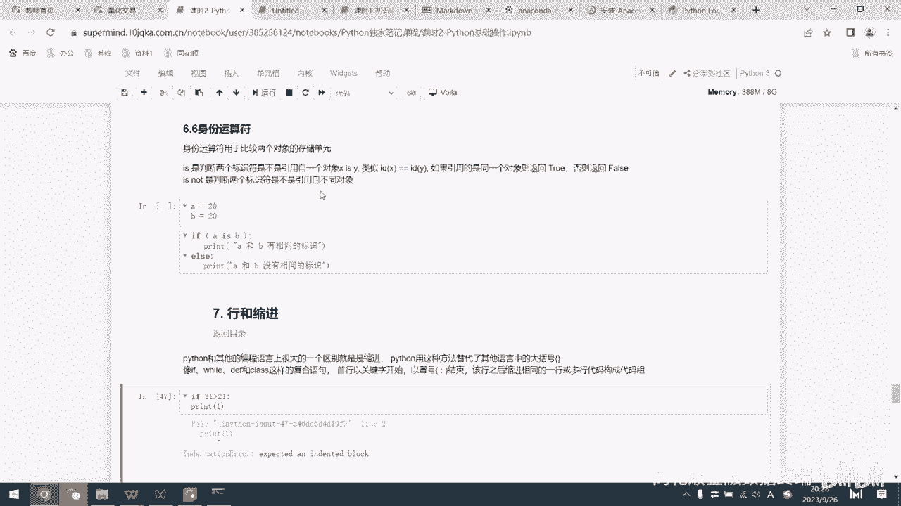

这些内容是Python编程的基石，理解它们对后续学习至关重要。