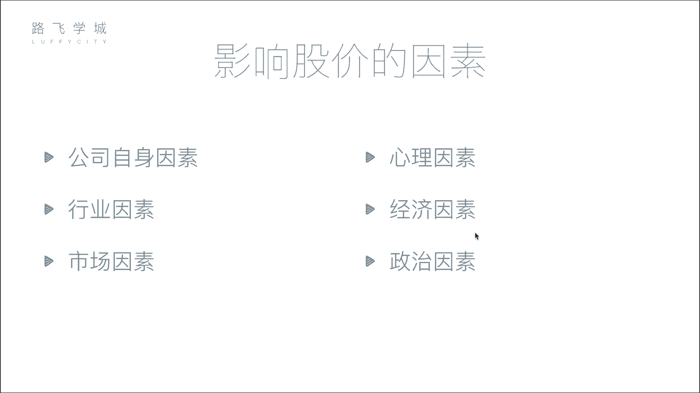
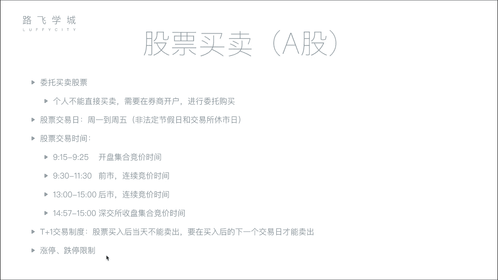

# Python量化交易：P4：04 金融量化分析-影响股价因素&股票买卖知识 📈

在本节课中，我们将要学习影响股票价格的主要因素，并了解股票买卖的基本流程与规则。理解这些基础知识是进行量化分析的第一步。

## 影响股价的六大因素

上一节我们介绍了股票的基本概念，本节中我们来看看哪些因素会影响股票价格的波动。影响股价的因素可以归纳为以下六点。

### 1. 公司自身因素
这是影响股价最根本的因素。公司的经营状况、盈利能力、发展前景等直接决定了其内在价值。如果公司发展良好，市值增长，其股价通常会上涨；反之，若公司出现重大负面事件或经营不善，股价则会下跌。

### 2. 市场因素
这是影响股价最直接的因素。股价在短期内由市场的供求关系决定。其核心逻辑是：
*   **买盘 > 卖盘**：供不应求，股价上涨。
*   **卖盘 > 买盘**：供过于求，股价下跌。

### 3. 行业因素
整个行业的发展趋势会影响行业内所有公司的股价。例如，当人工智能行业成为热点时，相关公司的股票可能普遍上涨；如果某个行业整体衰退，其公司的股价也可能随之下跌。

### 4. 心理因素
投资者的情绪和非理性行为会影响股价。例如，从众心理可能导致恐慌性抛售或盲目追涨，即使公司基本面并未发生重大变化。历史上因交易错误或恐慌情绪引发的市场暴跌（如“黑色星期一”）就是典型案例。

### 5. 经济因素
国家层面的宏观经济政策和指标会影响整体市场。例如：
*   **利率上升**：可能导致资金从股市流向银行，市场资金减少，对股价产生下行压力。
*   **货币政策、外汇汇率**等变化也会间接影响股市。

### 6. 政治因素
国际关系、地区局势、政府政策等政治事件会显著影响市场信心和资本流向。例如，地缘政治紧张局势可能引发市场恐慌，导致股市下跌；而相关领域的股票（如军工股）则可能因事件驱动而上涨。

## 股票买卖流程与规则

了解了影响股价的因素后，我们来看看在实际操作中，股票是如何买卖的，以及有哪些重要的交易规则。

### 开户与委托
个人投资者不能直接在交易所买卖股票，必须通过证券公司（券商）进行。以下是基本步骤：
1.  在券商处开设证券账户和资金账户。
2.  通过券商提供的系统（如交易软件）连接至交易所。
3.  提交买卖指令，这个过程称为“委托”。

### 交易日与交易时间
股票交易所并非全天候营业。A股市场的基本规则如下：
*   **交易日**：通常为每周一至周五（法定节假日除外）。
*   **交易时段**：每个交易日的具体时间划分如下：

以下是A股市场主要的交易时段及其作用：

| 时段 | 时间 | 名称 | 说明 |
| :--- | :--- | :--- | :--- |
| **开盘集合竞价** | 09:15 - 09:25 | 集合竞价 | 一次性撮合，产生当日**开盘价**。原则是使成交量最大化。 |
| **连续竞价** | 09:30 - 11:30, 13:00 - 14:57 | 连续竞价 | 高频连续撮合（约每2-3秒一次），是主要的交易时段。 |
| **收盘集合竞价** | 14:57 - 15:00 | 集合竞价 | 仅**深交所**有。一次性撮合，产生当日**收盘价**。 |
| **其他** | 15:00后 | 收盘 | **上交所**的收盘价为最后一笔连续竞价的成交价。 |

**核心概念解释**：
*   **集合竞价**：在规定时间内收集所有买卖申报，一次性集中撮合成交。用于确定开盘价和收盘价（深交所）。
*   **连续竞价**：对不断进入的买卖申报逐笔连续撮合。
*   **撮合**：交易所根据“价格优先、时间优先”的规则，将买方和卖方的委托进行配对成交的过程。

### 重要交易制度
此外，还有两项之前提到过的关键制度需要牢记：
*   **T+1交易制度**：当日（T日）买入的股票，需到下一个交易日（T+1日）才能卖出。
*   **涨跌停板限制**：普通股票每日价格涨跌幅限制为前一交易日收盘价的±10%（ST股为±5%），旨在抑制过度投机，防止股价剧烈波动。

本节课中我们一起学习了影响股票价格的六大因素（公司自身、市场、行业、心理、经济、政治），并掌握了股票买卖的基本流程、交易时间划分以及T+1、涨跌停板等重要规则。这些是进行金融量化分析所必需的基础知识。