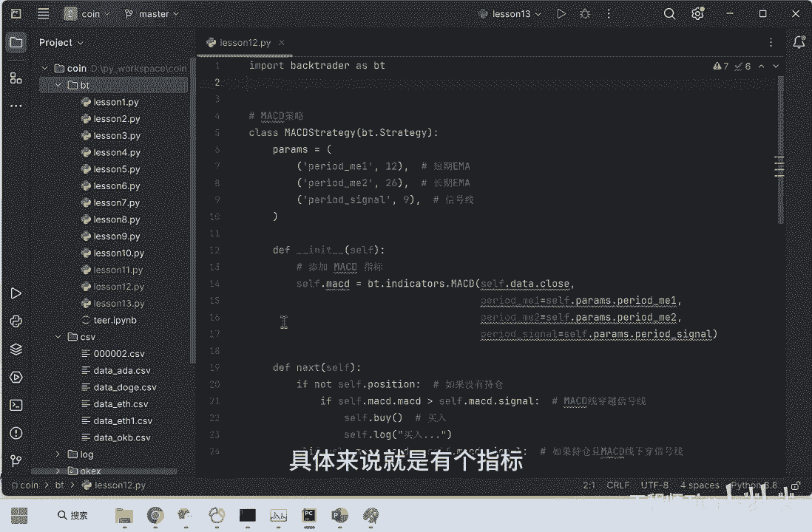
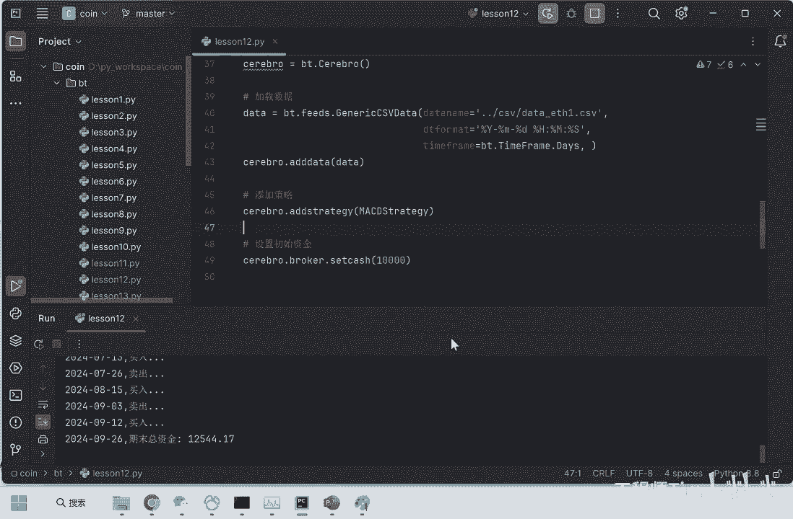
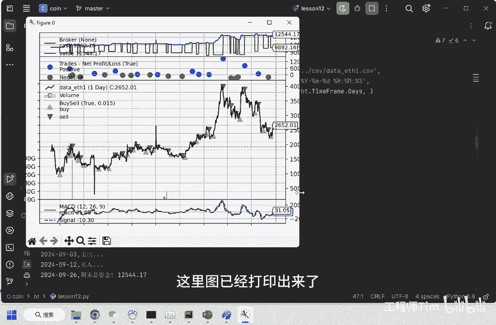
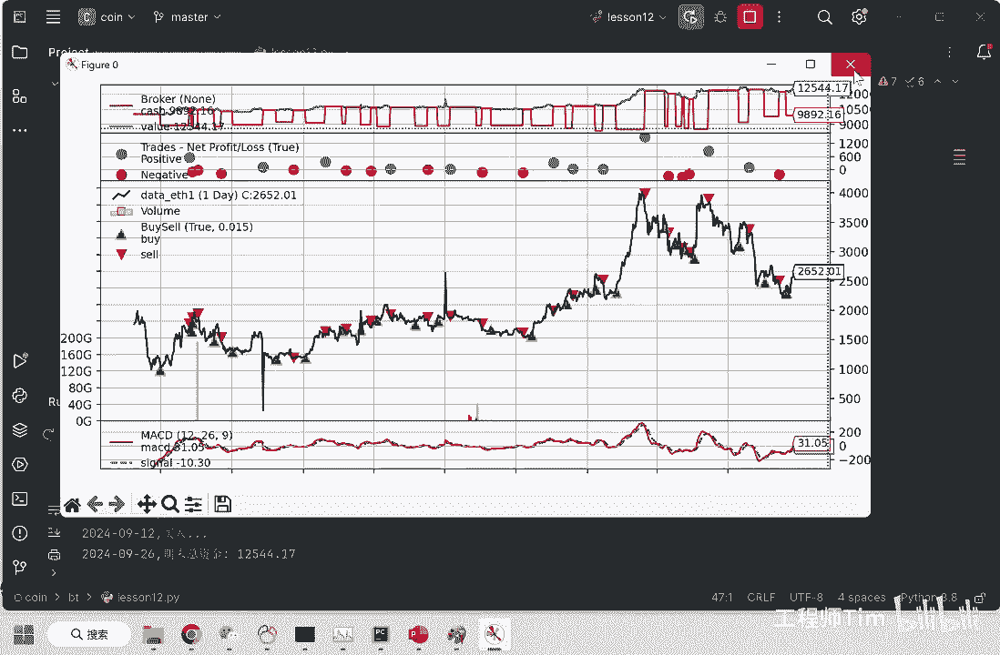
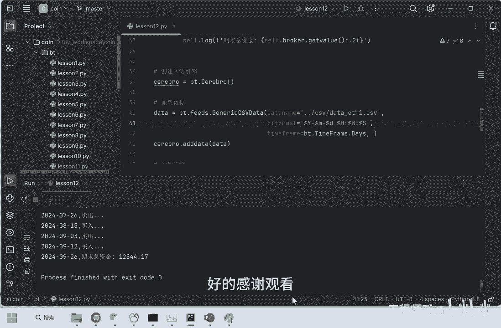

# Python量化学习：P1：MACD策略实现与虚拟币市场测试

在本节课中，我们将学习MACD策略的核心概念，并使用Python的`backtrader`库实现该策略。我们将以以太坊（ETH）的历史行情数据为例，进行策略回测，并分析其效果。



## 📊 什么是MACD策略？

MACD策略基于一个名为MACD的技术指标。该指标的计算涉及另一个名为EMA的指标。

**EMA**，即指数移动平均线，分为短期EMA和长期EMA。MACD的值就是短期EMA与长期EMA的差值。交易信号的产生与MACD值密切相关。

此外，还有一个名为**Signal**的值，它有自己的计算公式。买入和卖出信号由MACD线和Signal线的交叉产生。具体规则是：当MACD线向上突破Signal线时，产生买入信号；反之，当MACD线向下跌破Signal线时，产生卖出信号。


在接下来的代码实现部分，我们会具体看到这些规则的应用。

## 💻 MACD策略的代码实现

上一节我们介绍了MACD策略的基本原理，本节中我们来看看如何使用代码实现它。以下是实现步骤：

首先，我们需要导入必要的库并准备数据。

```python
import backtrader as bt

# 1. 初始化Cerebro引擎
cerebro = bt.Cerebro()

# 2. 填入数据
# 假设我们已经有一个包含‘时间’、‘开盘价’、‘最高价’、‘最低价’、‘收盘价’等字段的Pandas DataFrame，名为`eth_data`
data = bt.feeds.PandasData(dataname=eth_data)
cerebro.adddata(data)

# 3. 添加策略
cerebro.addstrategy(MACDStrategy)

# 4. 设置初始本金
cerebro.broker.setcash(10000.0)

# 5. 运行回测
cerebro.run()
```

接下来，我们需要定义核心的MACD策略类。这个类继承自`bt.Strategy`，并实现`__init__`和`next`方法。



```python
class MACDStrategy(bt.Strategy):
    def __init__(self):
        # 初始化MACD指标，参数为：短期周期12，长期周期26，信号周期9
        self.macd = bt.indicators.MACD(self.data,
                                       period_me1=12,
                                       period_me2=26,
                                       period_signal=9)
        # 获取MACD线和信号线
        self.macd_line = self.macd.macd
        self.signal_line = self.macd.signal

    def next(self):
        # 如果没有持仓，且MACD线上穿信号线，则买入
        if not self.position:
            if self.macd_line > self.signal_line:
                self.buy()
                print(f'{self.data.datetime.date()}: 执行买入')
        # 如果已有持仓，且MACD线下穿信号线，则卖出
        else:
            if self.macd_line < self.signal_line:
                self.sell()
                print(f'{self.data.datetime.date()}: 执行卖出')
```



在`__init__`方法中，我们使用`backtrader`内置的`MACD`指标计算器，并设置了常用参数（短期12天，长期26天，信号线9天）。在`next`方法中，我们根据MACD线与信号线的交叉关系来制定具体的买卖逻辑。

## 📈 回测结果分析

策略执行完毕后，我们可以输出结果并进行分析。

运行回测后，系统会生成图表和日志。图表中主要包含以下信息：
*   **最下方的线图**：展示了MACD线（通常为蓝色）和Signal线（通常为红色）。它们的交叉点对应交易信号。
*   **中间的K线图**：展示了ETH的价格走势。
*   **K线上的三角标记**：向上的三角代表买入点，向下的三角代表卖出点。
*   **上方的两条曲线**：蓝色曲线代表投资组合的净值，红色曲线代表账户余额。
*   **散点标记**：蓝色点代表盈利的交易，红色点代表亏损的交易。



根据回测日志和图表，我们可以得到策略的绩效总结。例如，在本次以太坊（2022年至2024年）的回测中：
*   初始本金为：10000
*   期末总资金约为：12544
*   策略在两年时间内实现了约2500的盈利。

## 🎯 课程总结

本节课中我们一起学习了MACD策略的核心概念与代码实现。我们首先了解了MACD指标来源于短期与长期EMA的差值，并通过与Signal线的交叉来产生交易信号。接着，我们使用`backtrader`框架，以以太坊历史数据为样本，完整实现了该策略的回测流程。最后，我们分析了回测结果，观察到该策略在测试周期内取得了正收益。



通过本教程，你应该已经掌握了将经典技术指标转化为可执行量化策略的基本方法。