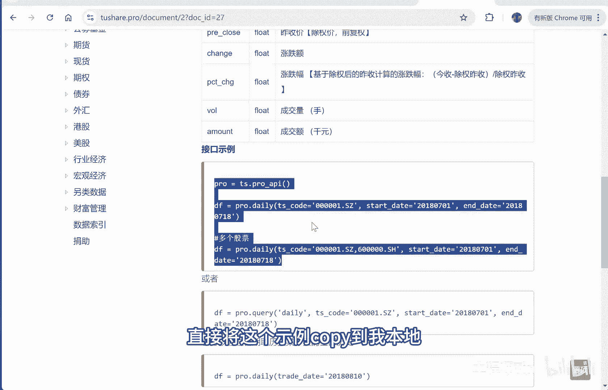
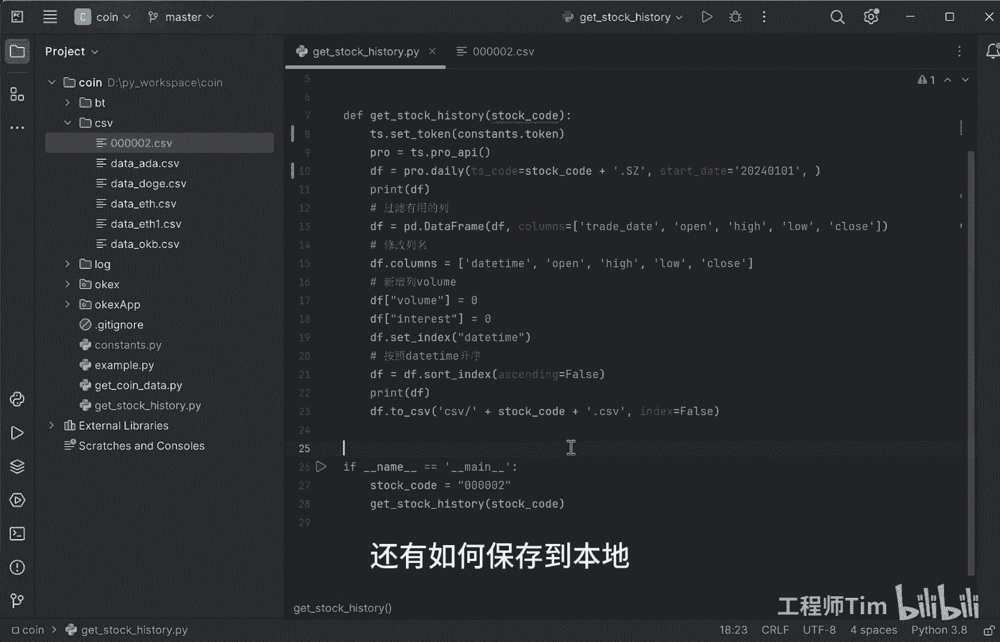

# Python量化学习：P1：获取并保存股票行情数据 📈

## 概述
在本节课中，我们将学习如何使用 `tushare` 库获取A股股票的日线行情数据，并将这些数据经过简单处理后保存到本地的CSV文件中。这将为后续的数据分析和模型训练提供便利。

## 获取数据接口
获取股票行情数据的方式有很多种。本节中，我们将采用 `tushare` 库来获取数据。`tushare` 是一个提供金融数据接口的库。

以下是访问 `tushare` 官网并找到数据接口的步骤：
*   访问 `tushare` 官网：`tushare.pro`
*   在官网中可以找到各种行情数据的调用方式。

## 调用日线数据接口
在 `tushare` 的数据接口中，“沪深股票行情数据日线”接口可用于获取A股股票的日线行情数据。该接口提供了调用示例，我们可以直接复制示例代码到本地运行。



上一节我们介绍了数据接口的来源，本节中我们来看看具体的代码实现。

```python
# 初始化tushare
import tushare as ts
pro = ts.pro_api('你的token')

# 获取股票日线数据
df = pro.daily(ts_code='000002.SZ', start_date='20240101', end_date='20240601')
print(df)
```

## 数据处理与保存
获取到原始数据后，我们通常需要对其进行处理，例如筛选有用的列、重命名列名、添加自定义列等，以便于后续使用。处理完成后，我们将数据保存到本地。

以下是数据处理和保存的具体步骤：
1.  **筛选列**：从原始数据中筛选出我们感兴趣的列，例如交易日期、开盘价、最高价、最低价、收盘价。
2.  **重命名列**：将列名改为更易读或符合个人习惯的名称，例如将 `trade_date` 改为 `datetime`。
3.  **添加自定义列**：根据需求添加新的列，例如 `volume`（成交量）和 `interest`（持仓兴趣）。
4.  **设置索引**：将日期列设置为数据框的索引，并按日期升序排列。
5.  **保存数据**：使用 `pandas` 的 `to_csv` 方法将处理后的数据保存为CSV文件。

```python
import pandas as pd

# 假设df是上一步获取到的数据
# 1. 筛选列
useful_columns = ['trade_date', 'open', 'high', 'low', 'close']
df_filtered = df[useful_columns]

# 2. 重命名列
df_filtered = df_filtered.rename(columns={'trade_date': 'datetime'})

# 3. 添加自定义列 (此处volume和interest为示例，实际数据中可能需要计算或从其他来源获取)
df_filtered['volume'] = df['vol']  # 假设原始数据中成交量列名为'vol'
df_filtered['interest'] = 0  # 此处添加一个示例列

# 4. 设置索引并排序
df_filtered['datetime'] = pd.to_datetime(df_filtered['datetime'])
df_filtered.set_index('datetime', inplace=True)
df_filtered.sort_index(inplace=True)

print(df_filtered)

# 5. 保存到本地CSV文件
df_filtered.to_csv('./data/000002.csv')
```
运行成功后，控制台会打印处理后的数据，同时数据文件 `000002.csv` 会被保存到指定的本地路径。

## 验证保存结果
我们可以打开保存的CSV文件来验证数据。文件内容应包含 `datetime`、`open`、`high`、`low`、`close`、`volume` 和 `interest` 这些列，数据已按日期排序。



这样做的好处是避免了每次分析或训练模型时都从网络重新获取数据，可以直接使用本地的 `000002.csv` 文件，提高了效率。

## 总结
本节课中我们一起学习了使用 `tushare` 库获取股票日线行情数据的完整流程。我们从查找接口开始，编写代码调用接口获取原始数据，然后对数据进行筛选、重命名、添加列和设置索引等处理，最后将处理好的数据保存到本地CSV文件中。这为后续的量化分析工作奠定了数据基础。