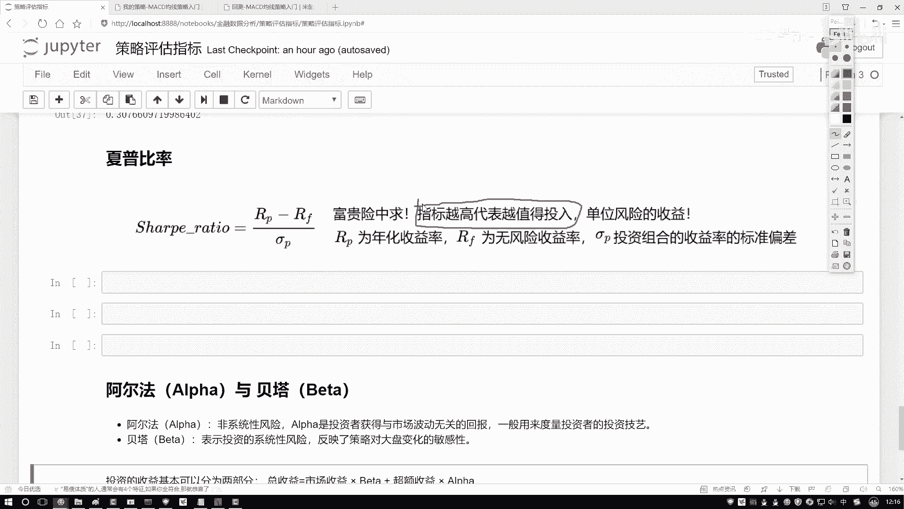
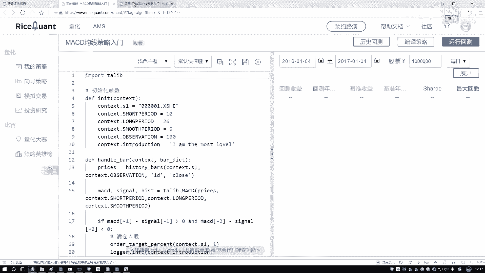
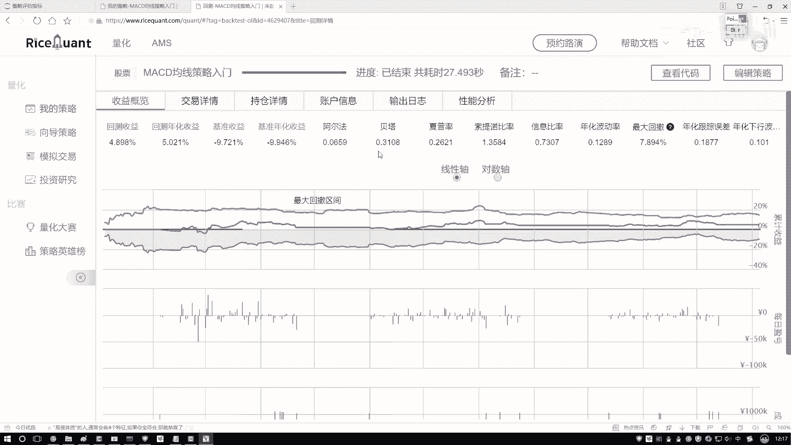
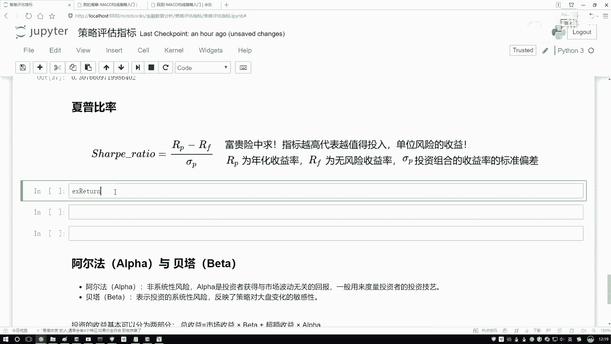
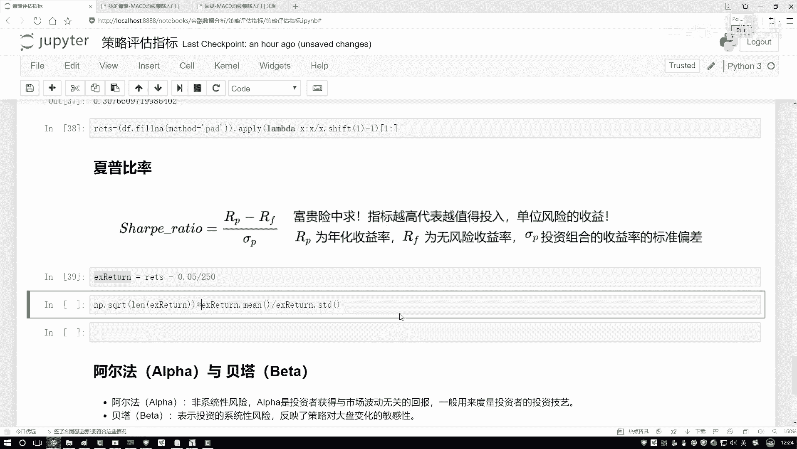
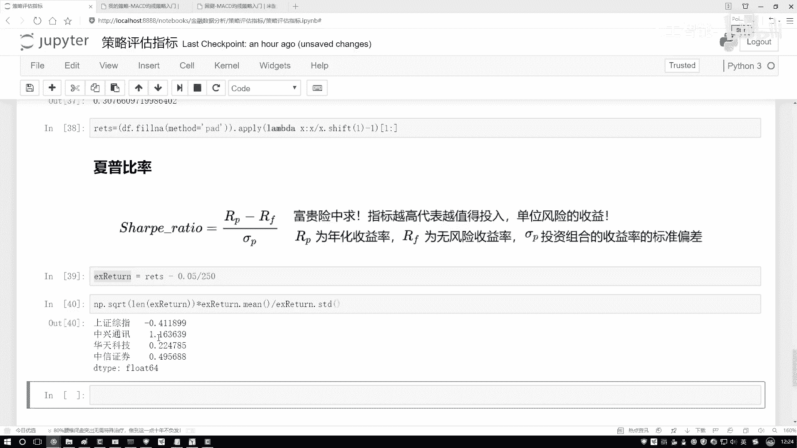
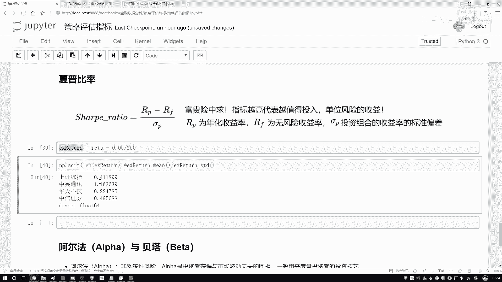
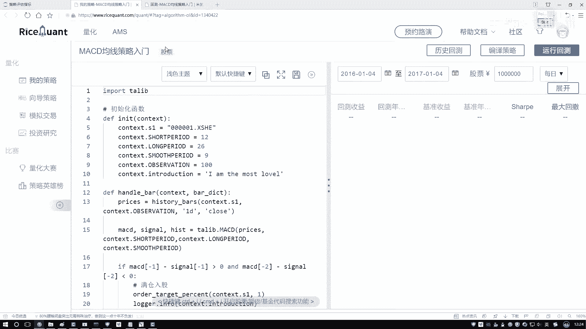
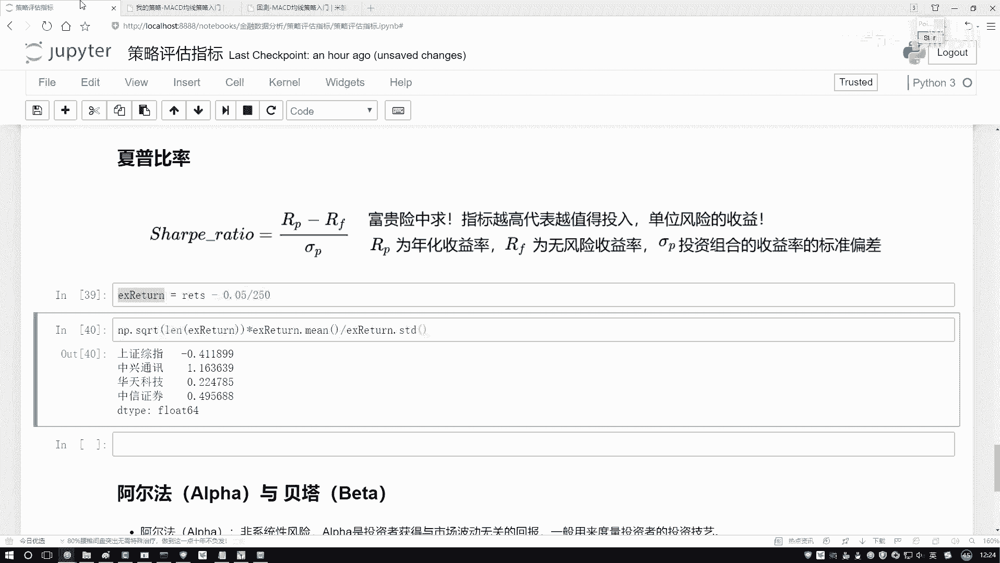

# Python金融分析与量化交易实战课程：P16：4-夏普比率的作用 📈

## 概述
在本节课中，我们将要学习一个在金融投资中至关重要的概念——夏普比率。我们将了解它的定义、作用以及如何通过Python代码进行计算，从而帮助我们评估不同投资组合的风险调整后收益。

## 什么是夏普比率？
上一节我们介绍了投资中的风险概念，本节中我们来看看如何量化风险与收益的关系。夏普比率描述的是：在承担单位风险的情况下，我们能获得多少超额收益。

举个例子，在朋友圈中可能看到过类似“叙利亚招聘雇佣兵，日薪数万”的信息。其薪酬之所以高，是因为工作风险极大。夏普比率就是用来衡量，为了获得一定的收益，我们所承担的风险是否“值得”。



**核心公式**：夏普比率 = (投资组合收益率 - 无风险收益率) / 投资组合收益率的标准差



指标越高，意味着在承担相同风险的情况下，获得的超额收益越高。在选股或选择投资组合时，在其他条件相似的情况下，我们倾向于选择夏普比率更高的选项。



## 如何计算夏普比率？
理解了夏普比率的意义后，我们来看看它的具体计算方法。计算过程涉及两个核心部分：超额收益和风险（波动率）。

首先，我们需要一个基准。在金融领域，通常将国债或银行保本理财的收益率视为“无风险收益率”（`risk_free_rate`）。例如，假设年化无风险收益率为5%。

其次，我们有自己的投资组合，它会有一个历史收益率序列。夏普比率计算的就是投资组合收益率超出无风险收益率的部分（即超额收益），再除以该投资组合收益率自身的波动率（标准差）。

以下是计算夏普比率的关键步骤：

1.  **计算日收益率**：获取投资组合每日的价格变动百分比。
2.  **计算超额收益率**：用日收益率减去日化的无风险收益率。
    *   日化无风险收益率 = 年化无风险收益率 / 年交易天数（通常按250天计）
    *   `excess_return = daily_returns - risk_free_rate / 250`
3.  **计算夏普比率**：取超额收益率的均值，除以其标准差，再乘以根号下年交易天数进行年化。
    *   `sharpe_ratio = np.mean(excess_return) / np.std(excess_return) * np.sqrt(250)`

## Python实战计算
理论部分已经清晰，现在让我们用Python代码来实现夏普比率的计算。假设我们已经有了几只股票的历史日收益率数据。

在计算前，数据预处理非常重要。如果数据中存在缺失值（例如，股票停牌），我们需要进行填充。一个常见的做法是使用前一天的收益率进行填充。

```python
import numpy as np
import pandas as pd



# 假设 df_returns 是一个DataFrame，每一列代表一只股票的日收益率序列
# 步骤1: 处理缺失值（向前填充）
df_returns_filled = df_returns.fillna(method='ffill')

# 步骤2: 设置参数
risk_free_rate = 0.05  # 年化无风险收益率，例如5%
trading_days_per_year = 250  # 年交易天数

# 步骤3: 计算日化的无风险收益率
daily_risk_free = risk_free_rate / trading_days_per_year

# 步骤4: 计算每只股票的夏普比率
sharpe_ratios = {}
for stock in df_returns_filled.columns:
    # 获取该股票的日收益率序列
    returns_series = df_returns_filled[stock]
    # 计算超额收益率
    excess_returns = returns_series - daily_risk_free
    # 计算夏普比率
    # 公式: (超额收益均值 / 超额收益标准差) * sqrt(年交易天数)
    sharpe_ratio = np.mean(excess_returns) / np.std(excess_returns) * np.sqrt(trading_days_per_year)
    sharpe_ratios[stock] = sharpe_ratio

# 将结果转换为Series便于查看
sharpe_series = pd.Series(sharpe_ratios)
print(“各股票夏普比率：”)
print(sharpe_series)
```



运行以上代码后，我们会得到每只股票对应的夏普比率。结果可能如下所示：
*   股票A: 0.85
*   股票B: 1.32
*   股票C: -0.15
*   股票D: 2.01



## 结果解读与应用
计算完成后，我们需要学会解读结果。根据输出，我们可以得出以下结论：



*   **数值越高越好**：夏普比率越高，说明该资产在承担单位风险时获得的超额回报越高。例如，股票D（2.01）的风险收益效率优于股票A（0.85）。
*   **正负的意义**：正数表示投资组合跑赢了无风险收益。负数则意味着投资组合的收益甚至低于无风险收益，从风险调整后收益的角度看，该投资可能不具备吸引力（例如股票C）。
*   **用于决策**：在构建投资组合时，我们可以优先考虑夏普比率较高的资产。例如，在上述结果中，股票D可能是更优的选择。





## 总结
本节课中我们一起学习了夏普比率。我们首先了解了它作为“风险调整后收益”指标的核心含义，即衡量单位风险所带来的超额收益。接着，我们拆解了其计算公式，明确了无风险收益率和波动率在其中的作用。最后，我们通过Python代码实战，完成了从数据预处理到计算、再到结果解读的全过程。掌握夏普比率，能帮助我们在量化交易和投资分析中，更科学地比较和选择不同的投资标的。