# Python金融分析与量化交易实战课程：P29：5-标准化处理方法 📊

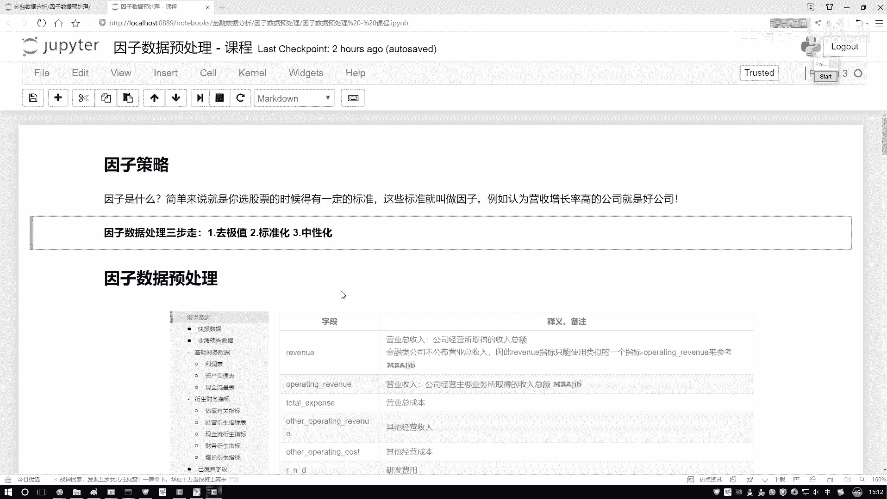

在本节课中，我们将要学习数据预处理中的一个核心步骤——标准化。标准化是数据挖掘和机器学习中非常常用的技术，其目的是消除不同特征（指标）之间由于量纲和取值范围不同带来的影响，使数据更易于分析和建模。

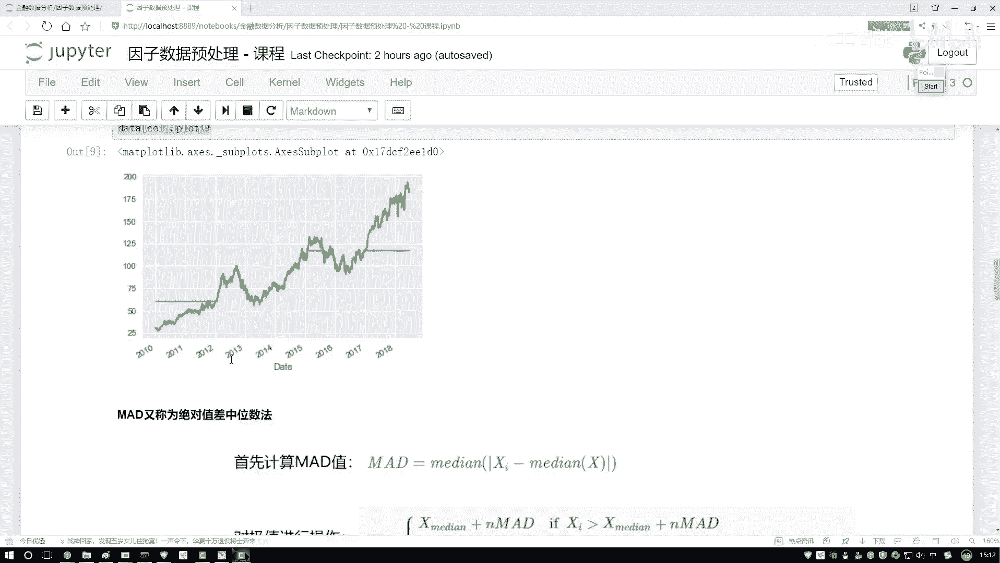

## 标准化的目的与原理

上一节我们介绍了数据预处理的重要性，本节中我们来看看标准化的具体作用。

标准化旨在解决不同数据指标取值范围差异过大的问题。例如，在分析数据时，我们可能同时有“年龄”和“年收入”两个指标。年龄的取值范围可能在0-100岁，而年收入可能从几万到上亿。这种数值量级的巨大差异，如果不加处理，会使得模型过度关注数值大的特征（如收入），而忽略数值小的特征（如年龄）的影响。

标准化的核心操作是：**将原始数据转换为均值为0、标准差为1的分布**。其公式如下：

**`X_standardized = (X - μ) / σ`**

其中：
*   **`X`** 是原始数据。
*   **`μ`** 是该特征所有数据的均值。
*   **`σ`** 是该特征所有数据的标准差。

这个公式可以分解为两个步骤来理解：

1.  **去均值**：`(X - μ)`。这一步将所有数据减去其平均值，使得新数据的分布中心移动到0点。这解决了数据不以原点为中心的问题。
2.  **除标准差**：`/ σ`。这一步将去均值后的数据除以其标准差。标准差反映了数据的离散程度。对于取值范围大（离散程度高）的数据，其标准差也大，相除后能将其“压缩”到一个较小的范围；反之，对于取值范围小的数据，其标准差也小，相除后能将其“拉伸”到一个相对标准的范围。最终目的是让所有特征的数值分布在一个近似的、较小的区间内。

通过这两个步骤，标准化后的数据具有以下特点：
*   每个特征（维度）的均值为0。
*   每个特征（维度）的标准差为1。
*   不同特征之间的数值具有可比性。

## 标准化的代码实现

理解了原理后，我们来看看如何用代码实现标准化操作。实现方式有两种：手动计算和使用现成的库。

以下是手动实现标准化的函数代码：

```python
def standardize_series(series):
    """
    对输入的pandas Series进行标准化处理。
    参数:
        series: 待标准化的数据序列。
    返回:
        标准化后的数据序列。
    """
    # 计算该序列的均值和标准差
    mean_val = series.mean()
    std_val = series.std()
    # 应用标准化公式: (X - μ) / σ
    standardized_series = (series - mean_val) / std_val
    return standardized_series
```

这个函数接收一个Pandas Series对象，计算其均值和标准差，然后应用标准化公式并返回结果。

当然，在实际项目中，我们更常使用成熟的机器学习库来高效完成此任务。例如，Scikit-learn库提供了强大的数据预处理工具。

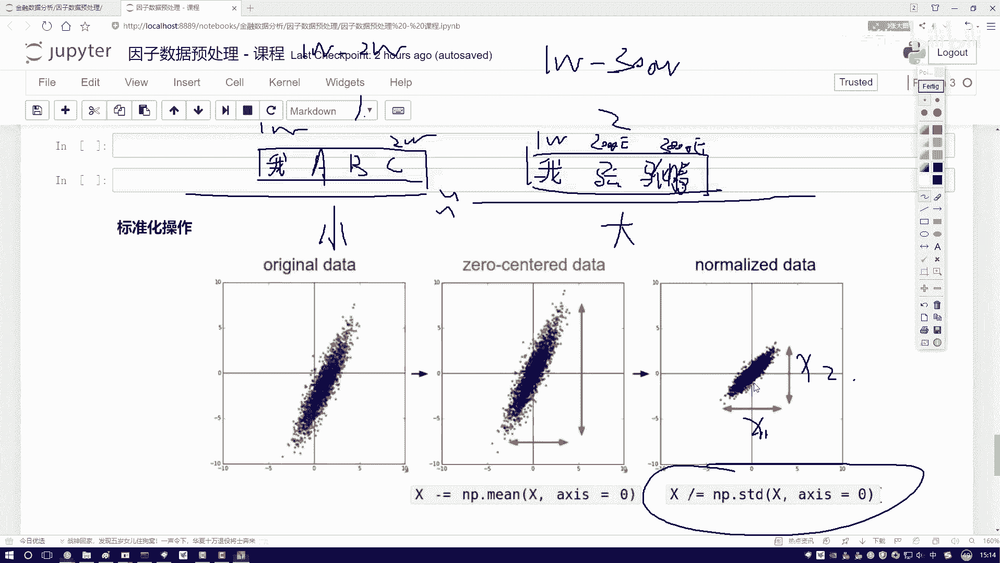

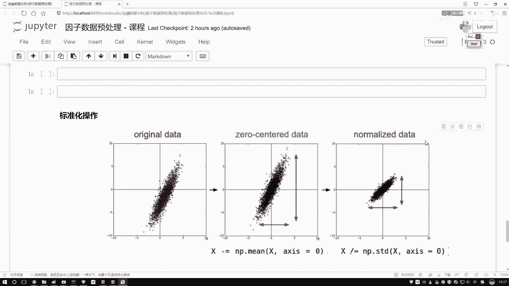

以下是使用Scikit-learn的`StandardScaler`进行标准化的代码：

```python
from sklearn.preprocessing import StandardScaler
import pandas as pd

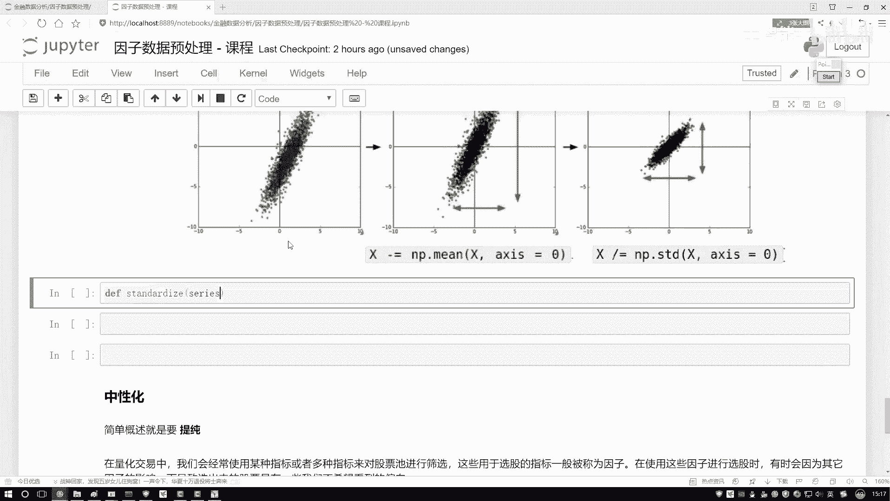

# 假设df是一个包含多列数据的DataFrame
scaler = StandardScaler()
# 拟合数据并转换
standardized_data = scaler.fit_transform(df)
# 将结果转换回DataFrame（可选）
standardized_df = pd.DataFrame(standardized_data, columns=df.columns)
```

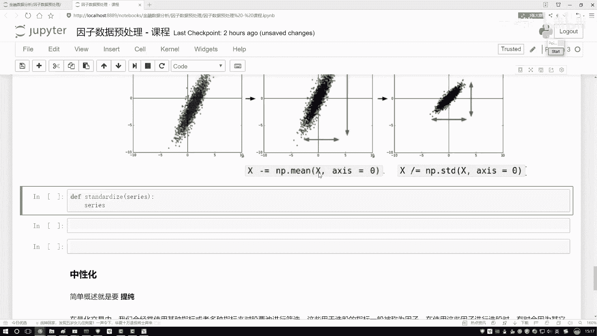

使用`StandardScaler`的好处是，它能够方便地处理整个数据集，并且可以保存拟合的参数（均值和标准差），用于后续对新数据的相同转换，保证处理的一致性。

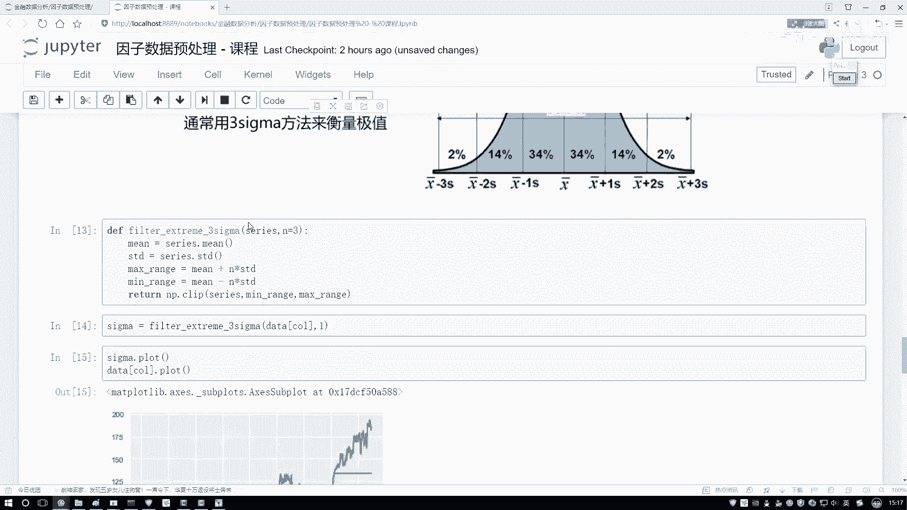

## 标准化效果演示

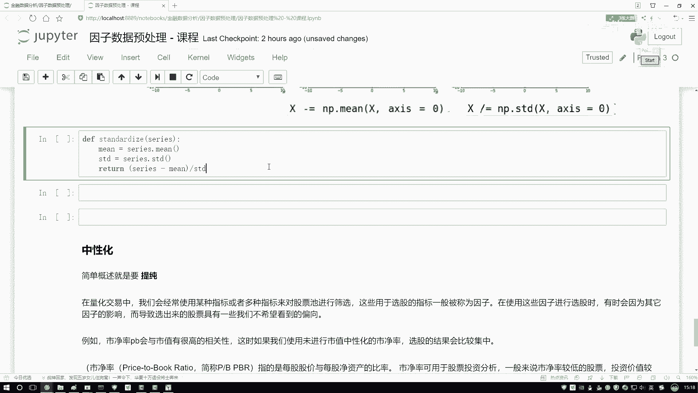

让我们通过一个简单的例子来观察标准化的效果。

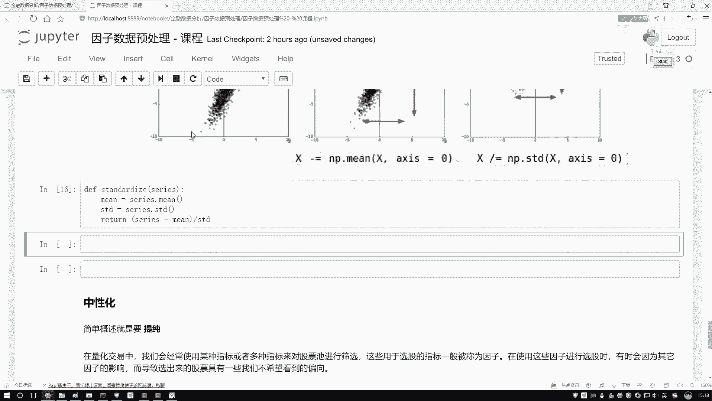

假设我们有一组原始数据，其不同特征的取值范围差异很大。

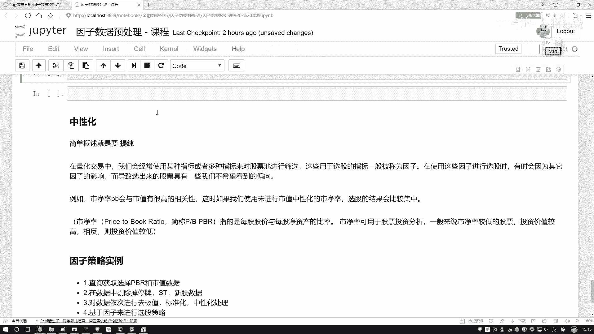

```python
import pandas as pd

# 创建示例数据
data = {
    '特征A': [10, 20, 30, 40, 50],      # 范围 10-50
    '特征B': [1000, 2000, 3000, 4000, 5000] # 范围 1000-5000
}
df = pd.DataFrame(data)
print("原始数据：")
print(df)
print("\n原始数据统计描述（均值、标准差）：")
print(df.describe())
```

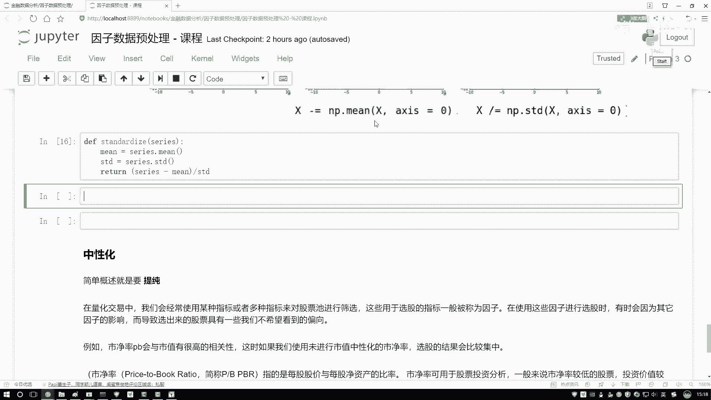

原始数据的均值和标准差会显示`特征B`的数值远大于`特征A`。

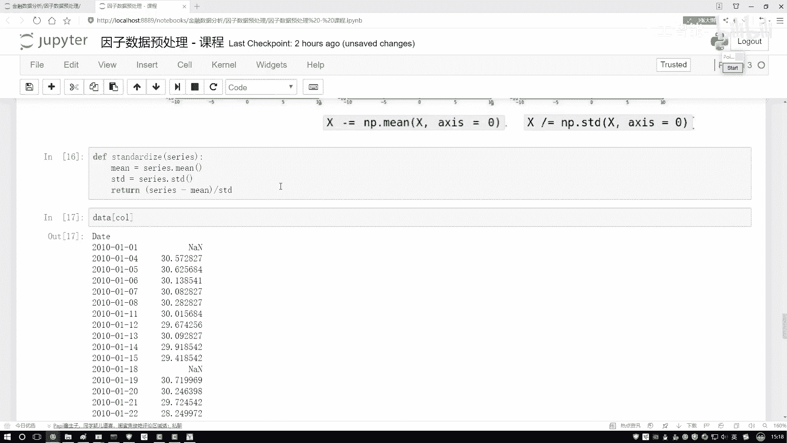

现在，我们应用标准化：

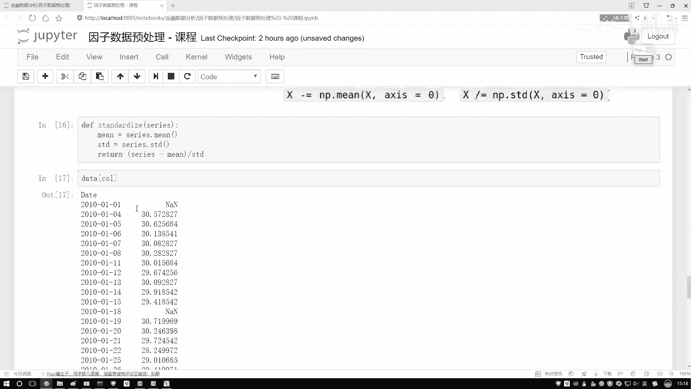

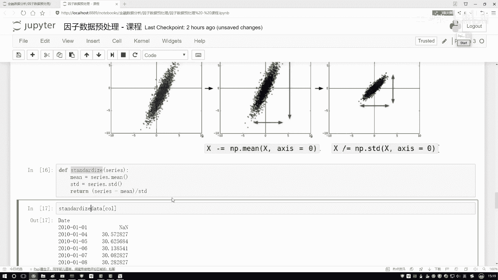

```python
# 使用上面自定义的函数或StandardScaler进行标准化
df_standardized = df.apply(standardize_series) # 使用自定义函数逐列标准化
# 或者使用 StandardScaler
# from sklearn.preprocessing import StandardScaler
# scaler = StandardScaler()
# df_standardized = pd.DataFrame(scaler.fit_transform(df), columns=df.columns)

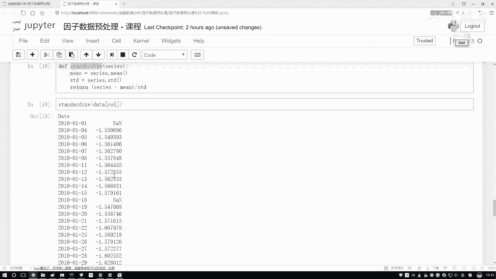

print("\n标准化后的数据：")
print(df_standardized)
print("\n标准化后数据统计描述（均值~0，标准差~1）：")
print(df_standardized.describe())
```

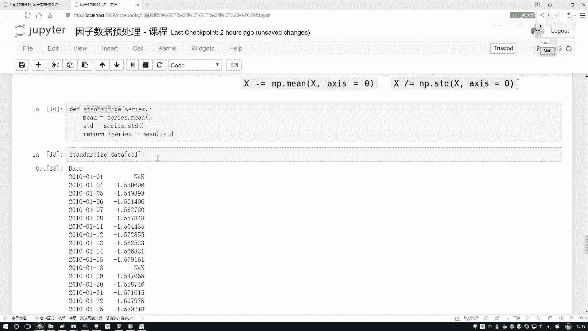

观察输出结果，你会发现：
*   标准化后，`特征A`和`特征B`的均值都接近0。
*   它们的标准差都接近1。
*   虽然原始数值大小迥异，但标准化后的数值都被转换到了相近的尺度上（例如都在-2到2之间）。这使得模型能够平等地对待每一个特征。

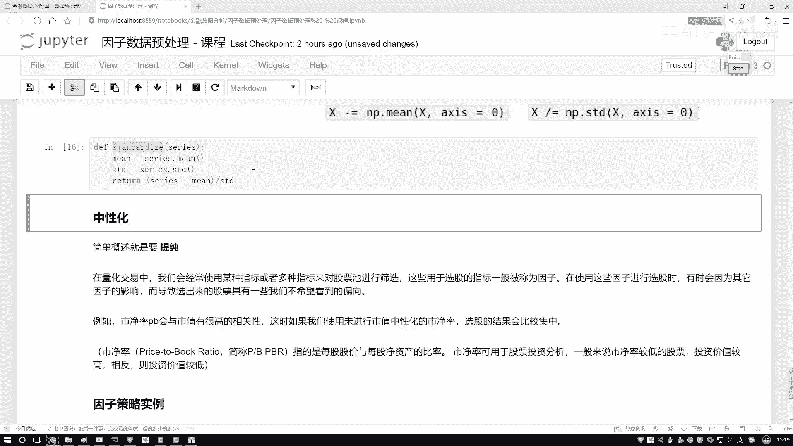

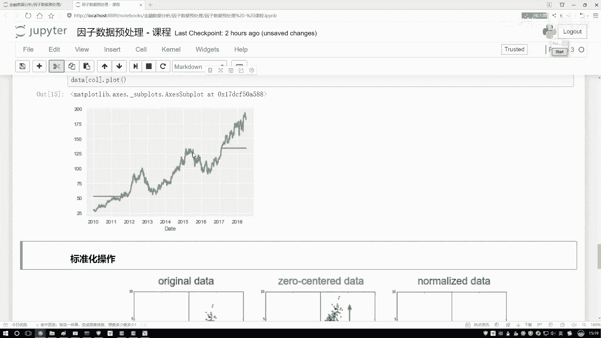

---

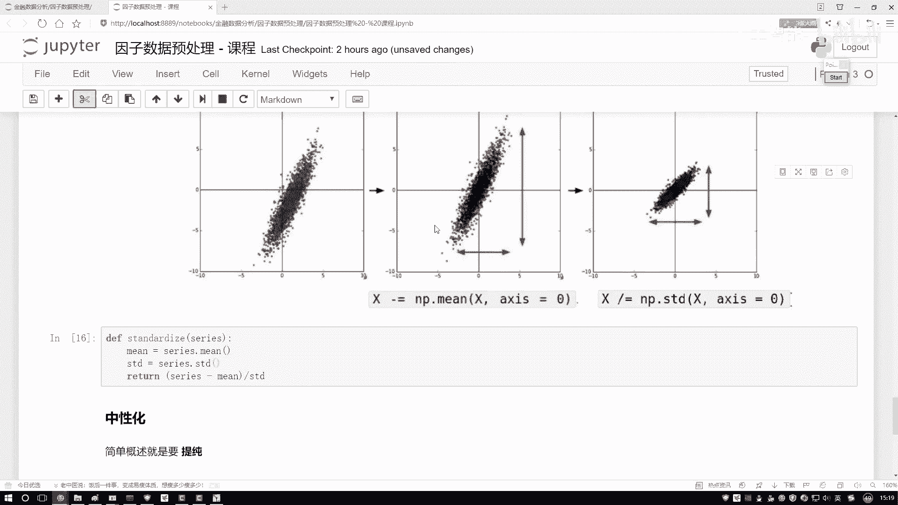

本节课中我们一起学习了数据标准化处理。我们首先明确了标准化的目的——消除不同特征间量纲和取值范围差异的影响。然后，我们深入分析了其核心公式 **`(X - μ) / σ`** 的两步含义：去中心化（使均值为0）和按标准差缩放（使标准差为1）。最后，我们掌握了两种实现标准化的方法：手动编写函数和使用Scikit-learn的`StandardScaler`工具。标准化是数据预处理中至关重要且常用的一步，能显著提升后续数据分析和机器学习模型的性能与稳定性。