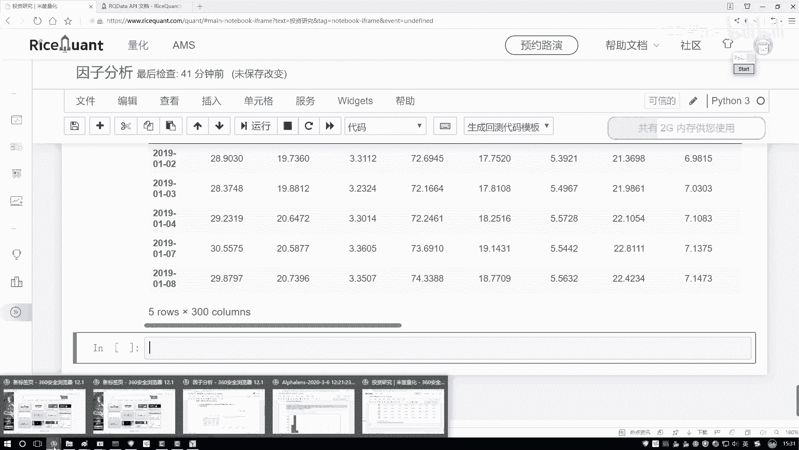
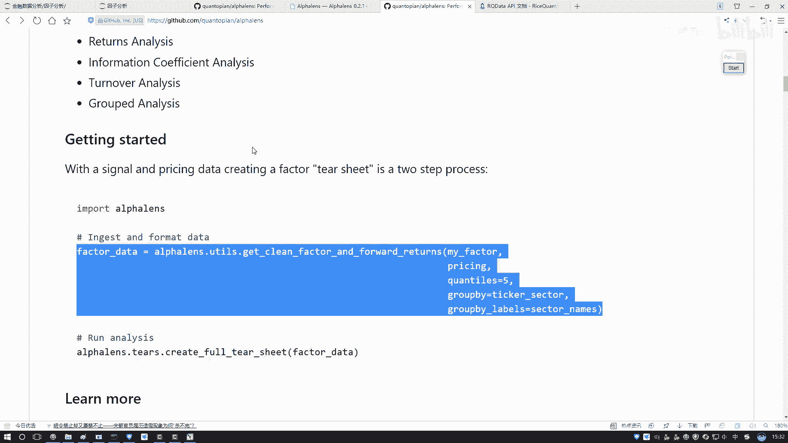
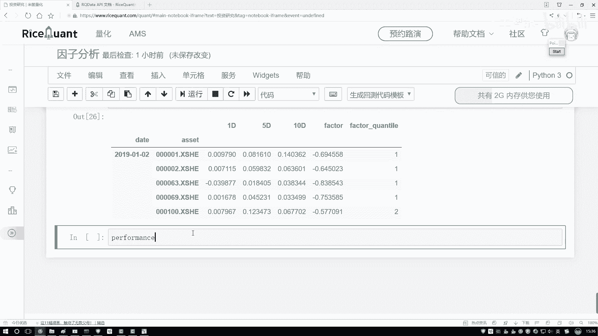
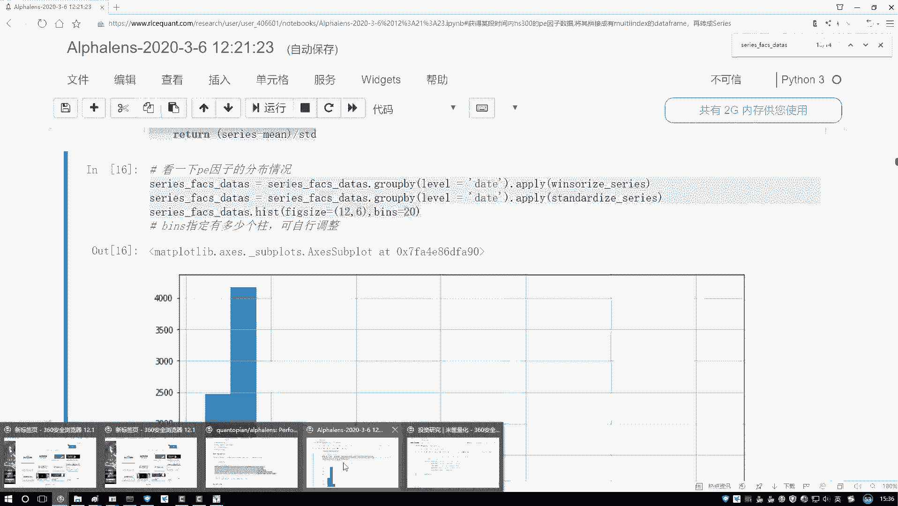
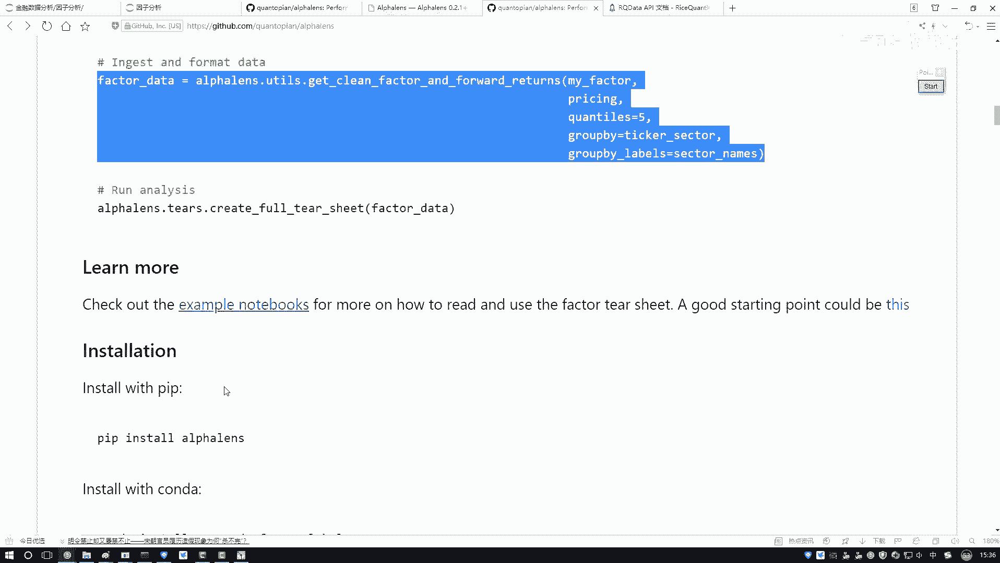
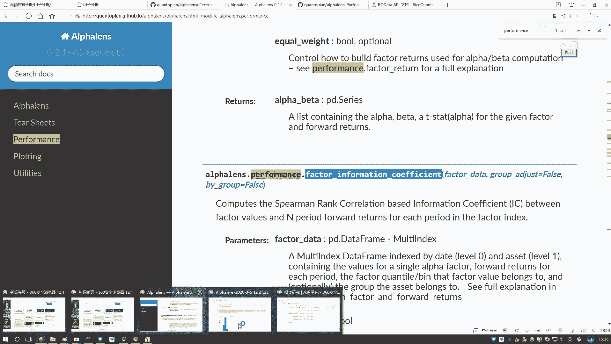
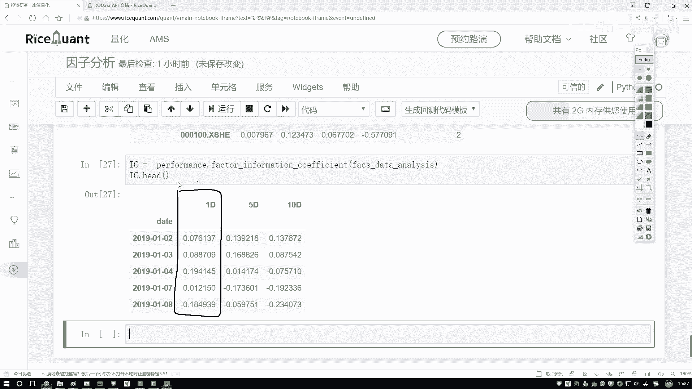

# Python金融分析与量化交易实战课程：P40：6-IC指标值计算 📊

在本节课中，我们将学习如何计算IC指标值。IC值是衡量因子（如我们之前计算的指标）与股票未来收益率之间相关性的重要指标。我们将通过获取股票价格数据、计算收益率、进行数据格式转换，最终计算出斯皮尔曼秩相关系数（IC值）。

## 获取收盘价数据

上一节我们介绍了如何计算因子值，本节中我们来看看如何获取计算IC值所需的股票价格数据。计算IC值需要将因子值与股票的实际收益率进行关联计算。因此，我们首先需要获取股票的每日收盘价。

以下是获取收盘价数据的步骤：

1.  使用 `get_price` 函数获取指定股票池在特定时间段内的价格数据。
2.  从返回的多维数据中提取出我们需要的“收盘价”数据。
3.  对提取出的数据进行整理，设置合适的索引和列名，以便后续处理。

```python
# 获取股票池的收盘价数据
price_data = get_price(
    securities=stock_pool,  # 股票池列表
    start_date='2019-01-01',  # 起始日期
    end_date='2020-01-01',  # 结束日期
    fields=['close']  # 指定获取收盘价字段
)

# 提取收盘价数据，并整理格式
close_price = price_data['close']  # 获取收盘价DataFrame
close_price.index.name = 'date'  # 设置索引名为‘date’
close_price.columns.name = 'code'  # 设置列名为‘code’
```



执行上述代码后，我们得到一个二维的 `DataFrame`，其索引是日期，列是股票代码，对应的值就是每日的收盘价。

## 数据格式转换

现在我们已经有了因子数据和价格数据。为了计算IC值，我们需要使用一个特定的工具函数将数据转换成要求的格式。这个函数通常比较长，我们可以从相关的工具库（如Github上的`utils`模块）中复制过来使用。



以下是数据格式转换的步骤：

1.  导入必要的工具函数。
2.  调用该函数，传入我们处理好的因子数据和收盘价数据。
3.  函数会返回一个结构化的数据对象，其中包含了按日期、股票代码组织的因子值、分组信息以及不同持有期（如1天、5天、10天）的收益率。

```python
# 从工具库导入数据转换函数
from utils import convert_to_analysis_format

# 进行数据格式转换
analysis_data = convert_to_analysis_format(
    factor_data=processed_factor_data,  # 之前处理好的因子数据
    price_data=close_price  # 上一步获取的收盘价数据
)

# 查看转换后的数据结构
print(analysis_data.head())
```

转换后的数据中，`factor`列是我们的因子值，`1D`、`5D`、`10D`等列分别对应持有1天、5天、10天的收益率。此外，系统会自动根据因子值的大小将股票分成5个组（例如，1代表因子值最小的20%的股票，5代表因子值最大的20%的股票），这有助于后续进行分组收益分析。

## 计算IC指标值

数据准备就绪后，我们就可以计算IC指标值了。IC值通常使用斯皮尔曼秩相关系数来计算，它衡量的是因子排名与未来收益率排名之间的单调关系。我们将使用量化分析库中`performance`模块的相关函数来完成计算。

以下是计算IC值的步骤：

1.  从`performance`模块导入计算因子IC的函数。
2.  将我们转换好的`analysis_data`传入该函数。
3.  函数会返回一个包含IC值序列的结果。





```python
# 从性能分析模块导入计算IC的函数
from performance import factor_information_coefficient



# 计算IC值
ic_result = factor_information_coefficient(analysis_data)

# 查看IC值序列
print(ic_result['ic'].head())
```



计算得到的IC值是一个时间序列，代表了在每个调仓日，因子值与下一期收益率之间的秩相关系数。IC值越接近1或-1，表示因子的预测能力越强；越接近0，则表示预测能力越弱。

## 总结



本节课中我们一起学习了IC指标值的完整计算流程。我们首先获取了股票的收盘价数据并计算了收益率，然后通过特定的工具函数将因子数据和价格数据转换成分析所需的格式，最后利用量化库中的函数计算出了斯皮尔曼秩相关系数，即IC值。IC值是量化策略中评估因子有效性的核心指标，掌握其计算方法对后续的策略构建与回测至关重要。