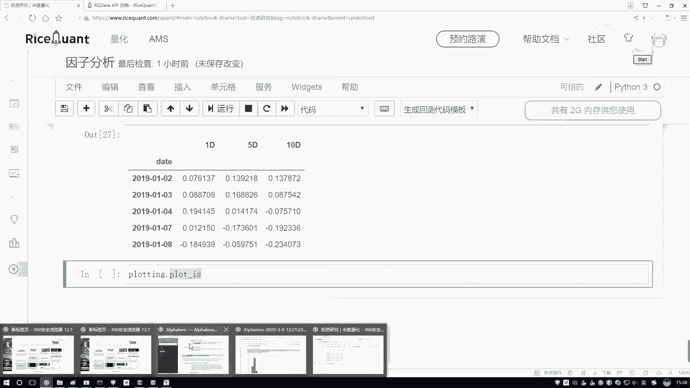
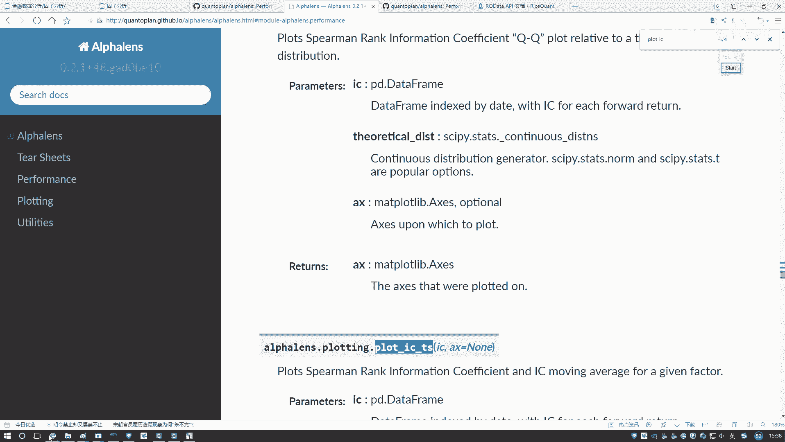
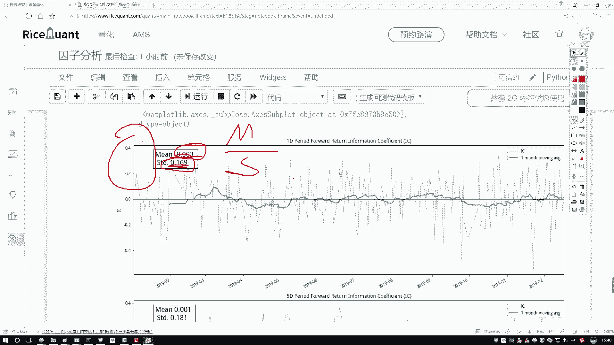
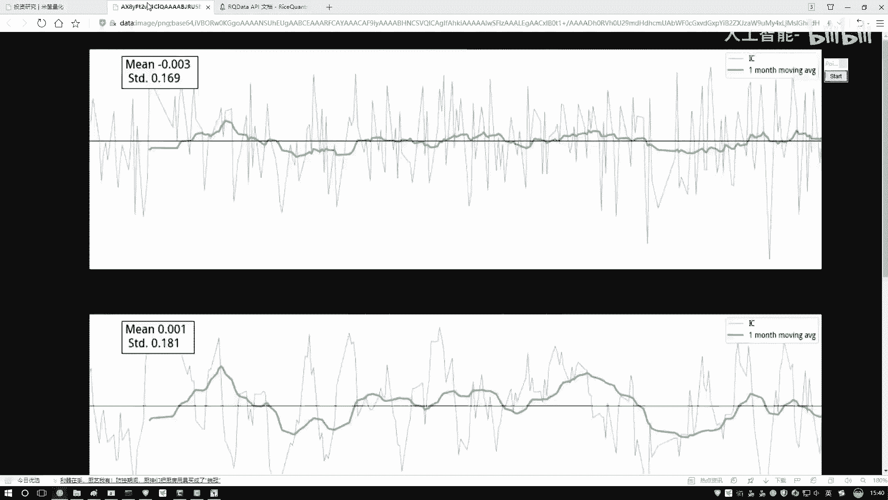
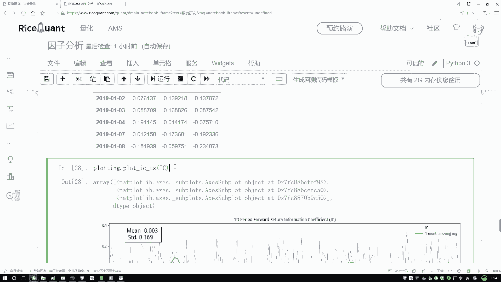
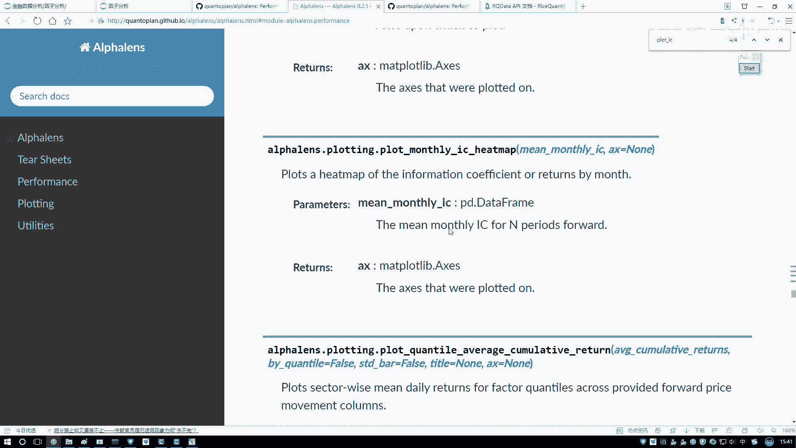
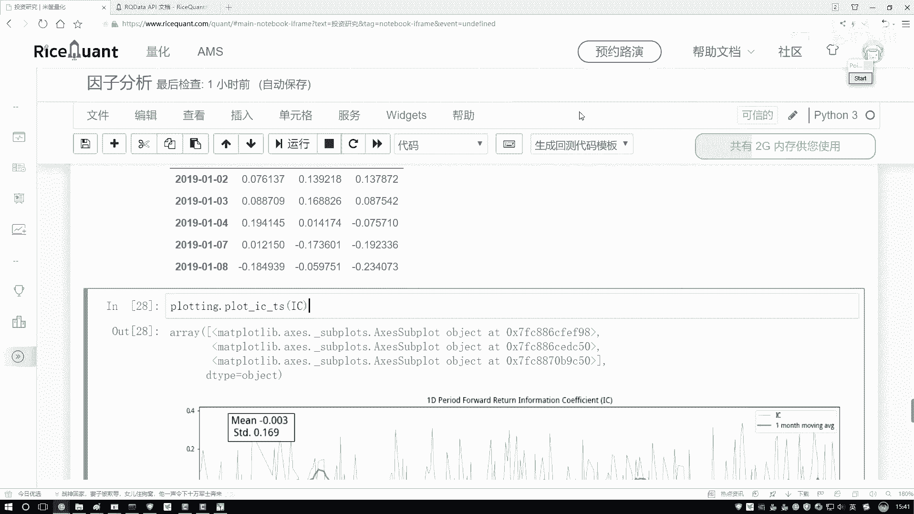

# Python金融分析与量化交易实战课程：P41：7-工具包绘图展示 📊

在本节课中，我们将学习如何使用绘图工具包对计算出的因子IC值进行可视化分析。通过图表，我们可以更直观地观察因子与收益率相关性的时间序列走势和稳定性。

上一节我们介绍了如何计算因子的IC值（信息系数），本节中我们来看看如何将这些数值结果通过图表展示出来。

## 绘制IC值时间序列图

计算出的IC值每天都会变化。为了更清晰地观察其走势，我们可以将其绘制成时间序列图。这里我们引入一个名为 `proloting` 的工具包来辅助绘图。



以下是绘图的核心代码步骤：

```python
# 假设我们已经有了包含IC值的时间序列数据 `ic_series`
# 使用绘图工具包中的函数进行绘制
proloting.plot.ic_time_series(ic_series)
```



执行上述代码后，系统会默认生成一张图表。

## 解读图表结果

生成的图表主要包含以下元素：
*   **蓝色曲线**：代表每日实际的IC值走势，波动范围通常较大。
*   **绿色曲线**：代表IC值的月度移动平均线（默认以一个月为周期计算平均值），它有助于平滑每日波动，观察长期趋势。

通过观察绿色平均线，我们可以评估因子在较长时间内的表现。如果该线平稳且值较小，可能意味着该因子与收益率的相关性不强，或缺乏有效的趋势。

此外，图表还会标注两个统计值：
*   **均值 (Mean)**：IC值在整个时间范围内的平均值。
*   **标准差 (Std)**：IC值波动的离散程度。

## 理解信息比率 (Information Ratio)

图表中还会计算并展示一个名为 **信息比率** 的指标。其计算公式为：

**信息比率 = 均值 / 标准差**



这个比率用于衡量IC值的稳定性。比值越大，说明因子的预测能力相对越稳定（均值相对较大，或标准差相对较小）。反之，则稳定性较差。理解这个指标有助于我们判断因子质量。



## 查看其他分析图表

绘图工具包的功能不仅限于绘制时间序列图。通过查阅API文档，我们还可以生成其他类型的分析图表，例如：
*   **直方图 (Histogram)**：查看IC值的分布情况。
*   **QQ图 (Q-Q Plot)**：检验IC值是否服从正态分布。
*   **热力图 (Heatmap)**：用颜色深浅直观展示不同周期或维度下的IC值。



这些图表为深入分析因子提供了丰富的可视化工具。在实际进行因子策略研究时，可以根据需要调用相应的函数进行深入分析。



---



本节课中我们一起学习了如何使用绘图工具包对因子IC值进行可视化。我们掌握了绘制并解读IC值时间序列图的方法，理解了信息比率的概念，并了解到工具包还支持直方图、QQ图等多种分析图表，这些都将帮助我们更有效地评估和筛选量化因子。