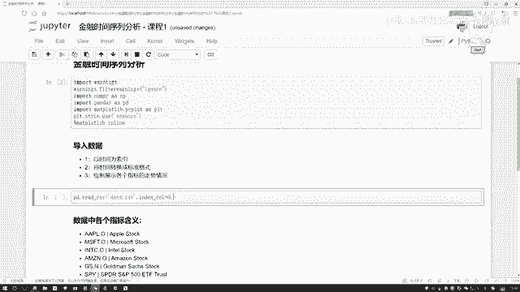

# 金融数据分析：1：Python金融时间序列分析入门 📈


在本节课中，我们将学习如何使用Python进行金融时间序列分析。我们将从导入和处理数据开始，逐步学习如何操作和分析随时间变化的金融数据，例如股票价格。课程内容将涵盖数据导入、时间索引设置、数据格式转换等基础但关键的步骤。

## 数据概览与时间序列概念

首先，我们来理解什么是时间序列数据。时间序列是指数据点按时间顺序排列的数据集。在金融领域，股票价格、汇率、交易指数等指标通常都是时间序列数据，因为它们会随着时间（如每天、每周、每月）发生变化。

以下是我们的示例数据集中的一些关键列：
*   **日期**：记录数据点的时间。
*   **股价指标**：例如苹果、微软、亚马逊等公司的股价。
*   **其他金融指标**：可能包括黄金价格、交易指数、货币汇率等。

即使你对某些金融指标的缩写不熟悉也没关系，本教程将主要使用前几列股价数据作为例子，演示Python的基本操作。

## 操作步骤规划

我们将按照以下步骤完成本次分析任务：
1.  导入必要的Python工具包。
2.  导入数据，并以时间列作为数据索引。
3.  将时间数据转换为标准格式。

现在，让我们开始第一步。

## 第一步：导入工具包

进行数据分析前，首先需要导入核心的Python库。我们将使用`numpy`进行数值计算，`pandas`进行数据处理，`matplotlib`进行数据可视化。

```python
import numpy as np
import pandas as pd
import matplotlib.pyplot as plt
```

## 第二步：导入数据并设置时间索引

上一节我们导入了必要的工具包，本节中我们来看看如何加载数据并正确设置时间索引。设置时间索引是时间序列分析的基础，它能让后续基于时间的操作（如重采样、滑动窗口计算）更加便捷。

我们使用`pandas`的`read_csv`函数来读取CSV格式的数据文件。关键点在于指定`index_col`参数，将数据中的日期列设置为数据框的索引。

```python
# 假设数据文件名为‘data.csv’，且日期在第一列
df = pd.read_csv('data.csv', index_col=0)
```

## 第三步：转换时间为标准格式

在成功导入数据并设置索引后，我们需要确保时间索引是Python能够识别的标准日期时间格式。`pandas`提供了`to_datetime`函数来完成这个转换，这对于确保时间序列函数正常工作至关重要。

```python
# 将索引转换为datetime格式
df.index = pd.to_datetime(df.index)
```

完成此步骤后，`df.index`的数据类型将变为`DatetimeIndex`，我们可以基于此进行各种复杂的时间序列分析。

## 总结



本节课中，我们一起学习了Python处理金融时间序列数据的开端步骤。我们首先理解了时间序列的概念，然后导入了必要的库，接着加载数据并将日期列设置为索引，最后将时间索引转换为标准格式。这些是构建任何时间序列分析项目的基石。在接下来的课程中，我们将基于此格式化的数据，进行可视化、统计计算和更深入的分析。